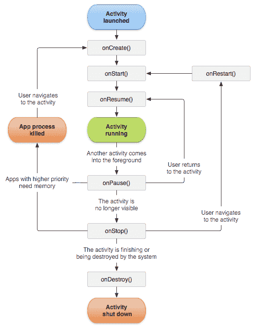
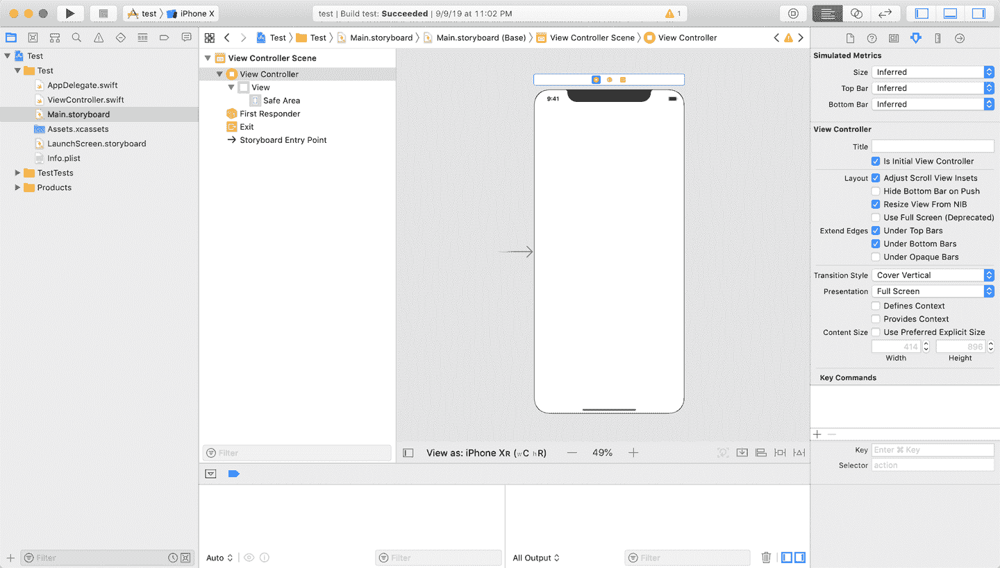

# 第一章：UI 控制器

用户界面（UI）控制器用作连接您的 UI 与控制或被该 UI 控制的应用程序中的任何业务逻辑的桥梁。

如果你的应用程序是在某个精美的老式剧院上演的莎士比亚戏剧，UI 控制器将扮演舞台经理的角色。它将引导演员走上舞台，听取导演的指令，并帮助过渡场景。

在应用中显示图像、列表或文本时，都需要一个用户界面（UI）。UI 的呈现——如何在屏幕上渲染——通常由布局指令（通常是标记语言，如 XML 或 HTML）控制；UI 控制器充当输入命令、数据库查询、IPC 请求、消息等的桥梁。从某种意义上说，它是任何应用的核心。

所有这些操控需要一个非常复杂的事件系列，一种技术建立在另一种技术之上，协同操作。幸运的是，Android 和 iOS 都提供了一些共同的工具和抽象来处理这个过程的重活。让我们了解一些对两个平台都至关重要的核心任务。

# 任务

在这一章中，你将学习：

1.  如何创建应用程序的起始 UI 控制器。

1.  如何更改活动的 UI 控制器。

1.  UI 控制器生命周期。

# Android

不到一年前，Google 宣布其推荐的导航风格是应用程序使用单个 `Activity` 实例，并在该单个 `Activity` 中使用 `Fragment` 类实例来表示操作并管理视图。Jetpack 套件中发布的新 `Navigation` 组件应用于管理片段之间的交互和显示历史记录。

注意，这与 Android 推出十多年前提供的推荐实践相悖，当时推荐任何“活动”（大致相当于“屏幕”或单个网页）使用一个 `Activity`，而间歇性地不推荐嵌套 `Fragment`。事实上，即使在今天，Android 开发文档在 `Activity` 章节中也是这样开始的：

> 活动（Activity）是用户可以执行的单一、专注的事情。

对于双方都有有效的论点，但由于 Google 是 Android 的维护者，我们认为我们需要接受其未来的建议。话虽如此，我们知道野外有许多不使用该模式的传统应用程序，并且不打算重新架构数年的工作来符合它。我们不会站在任何一边，所以我们将展示两种方法的基础知识。在疑惑时，我们将遵循普遍存在的模式——启动新的 `Activity` 实例，将数据作为 `Bundle` 实例传递给原始信息，并使用 `Fragment` 实例和 `Activity` 控制器方法管理模块化内容，而不是使用较新的 `Navigation` 架构组件及其衍生物。

## 如何创建您的应用程序的起始 UI 控制器

让我们马上开始吧。当您的应用程序启动时，它将执行一些初始化逻辑，在此期间您将看到“窗口背景”（通常只是一个纯色，具体取决于您的屏幕，但可以设置为任何有效的`Drawable`实例）。此工作发生在主线程上，不能被抢占或中断——它就会发生。请注意，如果为您的应用程序提供了自定义的`Application`类，`onCreate`方法中的任何内容都将在此时发生。再次强调，这是在主（UI）线程上进行的，因此这将阻塞其他任何操作。但是，在此时您可以在自己的后台线程上执行异步工作。

一旦应用程序初始化完成，应用程序将启动一个您在应用程序清单中定义的`Activity`类的单个实例，其类别节点具有值`android.intent.category.LAUNCHER`。此`Activity`条目还应包括一个`action`名称等于`android.intent.action.MAIN`，这应该存在于您应用程序的任何入口点（例如启动器图标、深链接、系统广播等）。

###### 提示

请记住，您只需提供类的规范名称，实例化、引用和设置将在后台自动完成（这意味着这个过程对我们开发者或用户来说完全不透明）。

```
<intent-filter>
  <action android:name="android.intent.action.MAIN" />
  <category android:name="android.intent.category.LAUNCHER" />
</intent-filter>
```

在完整的清单中，前述内容可能如下所示：

```
<?xml version="1.0" encoding="utf-8"?>
<manifest package="org.oreilly.nmd"
          xmlns:android="http://schemas.android.com/apk/res/android">

  <application
      android:allowBackup="false"
      android:icon="@mipmap/ic_launcher"
      android:label="@string/app_name"
      android:roundIcon="@mipmap/ic_launcher_round"
      android:supportsRtl="true"
      android:theme="@style/AppTheme">
    <activity android:name=".MainActivity">
      <intent-filter>
        <action android:name="android.intent.action.MAIN" />
        <action android:name="android.intent.action.VIEW" />
        <category android:name="android.intent.category.LAUNCHER" />
      </intent-filter>
    </activity>
    <activity android:name=".BrowseContentActivity" />
    <activity android:name=".BookDetailActivity" />
    <activity android:name=".SearchResultsActivity" />
  </application>

</manifest>
```

###### 注意

请注意，您打算在应用程序中使用的任何`Activity`都必须在您的*ApplicationManifest.xml*中注册为`application`节点的子节点（`manifest` → `application` → 所有活动节点）。请查看此备注后紧随其后的代码块。

```
<activity android:name=".MyActivity" />
```

当您与 Android 应用程序交互时，始终被视为在一个`Activity`中（除非涉及与`Service`一样的远程操作，例如状态栏交互，但这对于本章来说有点复杂）。您永远不会有一个可用的 UI 部分不在`Activity`内（唯一的例外是`RemoteViews`类——`View`类的一个小而简单的子集，可在通知窗口中使用）。

请注意，您不能嵌套`Activity`实例。一般来说，单个`Activity`在任何时候都占据整个屏幕（或者至少是您的应用程序分配的屏幕部分）。

如上所述，请记住我们不是创建一个`Activity`的新实例；我们只是提供我们想要启动的`Activity`类。在幕后，Android 框架将生成实例并执行基础设施任务，然后显示给用户。此外，这是一个*异步*操作，系统会决定何时启动新的`Activity`。

这也很重要，因为在您的清单文件中为`Activity`类分配了各种启动模式。特定的启动模式可能允许任意数量的特定`Activity`类在任何时候存在。例如，您可能希望允许用户在单个任务堆栈中拥有任意数量的`ComposeEmailActivity`实例。但是，您可能希望对其他类型的`Activity`类施加限制，例如仅允许一个`LoginActivity`的实例，它可能会将上次使用的`LoginActivity`带到任务堆栈的顶部，或者可能销毁当前`Activity`和上次使用的`LoginActivity`之间的所有内容，具体取决于启动模式。我们不会在这里深入研究启动模式，但如果您感兴趣，绝对可以查看开发人员文档。

那么，我们成功启动了一个`Activity`，为什么屏幕上什么都没有显示？因为`Activity`是一个控制器级别的类，本身不是一个视图。为了在屏幕上呈现元素，它至少需要一个`View`实例，可能还需要几个（作为用作`Activity`根的单个`View`的子级）。通常使用`setContentView`方法并传入 XML 布局资源来实现这一点。请参阅第二章，我们在那里讨论视图。

## 如何更改活动的 UI 控制器

一旦您的初始（“启动”）`Activity`呈现给用户，您可以通过从任何`Context`实例调用`startActivity(Intent intent)`方法来启动任何其他`Activity`（`Activity`类继承自`Context`，因此它与`Context`具有“is-a”关系——`Activity`实例*是*`Context`实例）。`Intent`还需要一个`Context`实例作为第一个参数，并引用要启动的`Activity`类：

###### 警告

非常重要的是要理解，系统将处理您向用户显示的`Activity`类的实例化、初始化和配置，它们不能使用`new`关键字实例化，也不能在启动时配置或以其他方式修改。我们向系统发送一个指示要向用户呈现哪个`Activity`的`Intent`，系统会处理剩下的事情。因此，`Activity`实例在启动时不能分配变量或直接调用方法（使用标准库方法）。

所以，如果我们不能在`Activity`实例上修改变量或直接调用`Activity`上的方法来启动它，那么我们如何向其传递信息呢？在许多 UI 框架中，您可以创建一个新的视图控制器类实例，为其分配一些数据，并允许其呈现该数据。

在 Android 框架中，您的选择要少得多。经典方法是将原始值附加到`Intent`对象，如下所示：

启动`Activity`的`Intent`实例可以通过`getIntent`方法获得：

这种方法完全适合传递小型的、原始的数据，比如标识符或 URL，但不适合大型数据（如序列化的 Java 类或甚至大型的`Strings`，如表示复杂类实例的 JSON）。这些数据包含在一个特定的系统级数据存储中，其大小限制为 1 MB，并且可以在设备上的任何进程之间共享。从`Bundle` API 的文档中可以看到：

> Binder 事务缓冲区具有固定的有限大小，当前为 1MB，该大小由进程中所有正在进行的事务共享。由于此限制是在进程级别而不是每个活动级别上，因此这些事务包括应用中的所有 Binder 事务，如 onSaveInstanceState、startActivity 以及与系统的任何交互。

要将复杂信息传递给新创建的`Activity`，要么是在启动新`Activity`之前将该信息保存到磁盘上，然后在创建该`Activity`后读取出来，要么是传递一个“全局可达”的数据结构的引用。通常这是一个类级变量（`static`），但在这种情况下使用`static`变量存在一些缺点。Android 工程师以前曾推荐在实用类的静态成员上使用`Map` of `WeakReferences`，或者您可能会发现`Application`实例（始终可以通过`Context.getApplicationContext`从任何`Context`实例访问）更清晰一些。重要的是要注意，只要您的应用程序在运行，`Application`实例就是可达的，这意味着它永远不会符合内存泄漏的传统定义。在 Kotlin 中，全局上下文处理方式略有不同，但通常仍适用于传递信息的警告。

### 片段

在 Android 框架术语中，`Fragment`可以看作是一种轻量级的`Activity`；它可以被视为视图的*控制器*，而不是视图本身，但它必须具有根视图委托（在 Android 中，“视图”模式实现者的角色来自 Model-View-Presenter [MVP]、Model-View-Controller [MVC]、Model-View-ViewModel [MVVM]等，通常由`View`类来填充，它通常是原子视觉元素，如文本片段、图像或其他`View`实例的容器；详细讨论视图的章节见第二章）。

与`Activities`相比，`Fragments`的好处在于我们可以直接使用自定义构造函数签名、配置、成员和方法访问等来实例化它们，就像在`Java`中实例化任何其他类实例一样。此外，与`Activities`不同，`Fragments`可以*嵌套*——但是，历史上在此方面有一些不可靠性，尤其是在生命周期回调周围，但这也超出了本章的范围。谷歌“android fragment controversy”即可找到大量相关资料。再次强调，本书选择在这场毫无意义的激烈争论中保持中立。

因此，您可以像创建任何其他内容一样创建`Fragment`：

理想情况下，您可以像处理任何`View`一样将`Fragment`添加到您的布局 XML 中：

```
<?xml version="1.0" encoding="utf-8"?>
<LinearLayout xmlns:android="http://schemas.android.com/apk/res/android"
    android:layout_width="match_parent"
    android:layout_height="match_parent">
    <fragment android:name=".ListFragment"
            android:layout_width="200dp"
            android:layout_height="match_parent" />
    <fragment android:name=".DetailFragment"
            android:layout_weight="1"
            android:layout_width="0dp"
            android:layout_height="match_parent" />
</LinearLayout>
```

然而，我们再次面临系统级的不透明实例化。为了以编程方式配置自定义`Fragment`类，您需要使用`new`关键字实例化它，并使用`FragmentManager`和`FragmentTransaction`将其添加到现有的视图层次结构中。

请注意，如果愿意，您可以在此处使用具有配置参数的自定义构造函数，尽管在重新构造`Fragment`时，它将丢失构造函数参数，因此 Android 建议开发人员使用无参数构造函数，并假设`Fragment`实例可以使用`Class.newInstance`方法创建。

从这一点来看，由于`Fragment`本身不是`View`，而是视图或 UI 控制器，必须指示其使用特定的`View`或`View`树进行渲染。通常使用单个空容器`ViewGroup`，如`FrameLayout`，来容纳代表`Fragment`实例的`View`实例是很常见的。

`FragmentTransaction`能够为您引用的任何`Fragment`实例执行各种更新任务。通常情况下，打开一个事务，进行您想要的所有原子更改，然后提交事务：

与`Activity`不同，`Fragment`类不继承`Context`，因此失去了许多 API 的直接访问权限；然而，`Fragment`实例既有`getContext`方法也有`getActivity`方法，因此在大多数情况下，您只需查找一次即可。

###### 警告

截至目前，虽然`Navigation`组件是稳定的，但某些相关功能（如导航编辑器 UI）并不稳定。关于包括 UI 代码生成工具作为未来 Android 工具存在一些争议。尽管如此，`Navigation`组件能够处理类似前面的`Fragment`操作，而无需传统的`FragmentTransaction`或`FragmentManager`。

## 理解 UI 控制器生命周期

由于 UI 控制器从创建到终止经历各种状态，会调用许多生命周期回调，并且可以成为挂钩应用程序事件的绝佳地点。`Activity`和`Fragment`类都具有生命周期事件（实际上，`View`实例也有生命周期事件，但这些事件相对有限，超出了本章的范围）。

有一个[著名的图表](https://oreil.ly/LW_u1)描述了 `Activity` 生命周期，有着极其详细的解释，但我们现在将重点介绍关键点。

图 1-1 将该图表作为基线呈现。

当 `Activity` 首次创建时，将调用 `onCreate` 方法。

*理解* `onCreate` *也是* 当 `Activity` *被重新创建时调用* 是 *至关重要的*。偶尔，应用程序的资源将被系统回收以供其他用途；在这种情况下，您的应用程序在幕后完全被销毁，当前状态的一些原始值保存在本地磁盘上。

当 `Activity` 首次创建时，单个方法参数——一个 `Bundle`——将为 `null`。如果它在资源被回收后重新创建（如在“配置更改”期间发生，比如旋转设备或插入新显示器），传递给 `onCreate` 方法的值将是一个非空的 `Bundle` 实例。

`onStart` 在 `Activity` 变得对用户可见时被调用，之前不可见（例如，被另一个 `Activity` 遮挡）后。`onStart` 总是在 `onCreate` 之后调用，但并非所有 `onStart` 事件都是由 `onCreate` 事件引发的。

`onResume` 在 `Activity` 重新获得焦点时被调用。如果包含应用程序被最小化，或者其他任何东西占据前台，无论是另一个应用程序、电话呼叫，甚至是覆盖 `Activity` 内容的 `Dialog`，导致 `Activity` 失去焦点，当焦点重新获得时——关闭其他应用程序、挂断电话呼叫或关闭 `Dialog`——`onResume` 将被触发。`onResume` 总是在 `onStart` 之后调用，但并非所有 `onResume` 事件都是由 `onStart` 事件引发的。



###### 图 1-1\. Activity 生命周期

现在让我们开始另一条路，走向毁灭。

`onPause` 在 `Activity` 失去焦点时被调用（参见 `onResume`）。

`onStop` 是一个棘手的事件，经常在随意对话中被错误解释。`onStop` 在 `Activity` 被销毁时有效调用，但可以重新创建——例如，如果系统回收您应用程序的资源。`onStop` 将被 `onDestroy` 事件（见下文）或 `onRestart` 事件跟随，这意味着 `Activity` 在停止后正在从保存的“提示”中重建。所有 `onStop` 事件都是由 `onPause` 引发的，但并非所有 `onPause` 事件都会被 `onStop` 跟随。如果您感兴趣，请参阅[关于此特定事件的文档](https://oreil.ly/POytI)。以下是直接从该来源中提取的相关内容：

> 当您的活动对用户不再可见时，它已进入*已停止*状态，系统会调用 `onStop()` 回调。例如，当新启动的活动覆盖整个屏幕时，可能会发生这种情况。当活动完成运行并即将终止时，系统也可能调用 `onStop()`。

`onDestroy`在`Activity`即将（优雅地）终止且无法重新创建时触发。如果您从一个`Activity`中返回，则会调用`onDestroy`。这是进行清理的绝佳时机。所有的`onDestroy`事件都在`onStop`之前发生，但并非所有的`onStop`事件都会被`onDestroy`跟随。

文档明确指出，不能指望`onDestroy`来清理大对象或异步操作。尽管如此，人们经常理解为可以依赖于`onStop`或`onPause`，这也不完全正确。想象一下，您的设备被卡车压过（或者更可能的是电池没电了）。您的应用将立即关闭，没有任何机会触发回调或执行清理操作。在`onPause`中进行这类工作并不比在`onDestroy`中更安全。尽管如此，由于`onDestroy`通常意味着`Activity`将变得不可访问并且有资格进行垃圾回收，因此通常没有关系——您不需要担心清理即将被销毁的对象。

`Fragment`的生命周期非常相似，但包括`onCreateView`的回调（这是关键的一步——此方法的返回必须返回一个`View`实例，以便`Fragment`有一个可见的 UI），以及`onDestroyView`的回调。还有一个`onActivityCreated`的回调，以及在使用`FragmentTransaction`方法将`Fragment`添加（`onAttached`）到 UI 或从 UI 移除（`onDetached`）时触发的回调。

请注意，在操作系统发布之间，`Fragment`、`FragmentManager`和`FragmentTransaction`类已经发生了变化。为了保持一致性，并确保您始终使用最新的发布版本，我们建议使用支持库中的类。对于*大多数*用途来说，它们可以互换使用——只需导入`android.support.v4.app.Fragment`而不是`android.app.Fragment`；当您调用`new Fragment();`时，您将得到支持库包中的`Fragment`。类似地，使用`android.support.v7.app.AppCompatActivity`而不是`android.app.Activity`，它将具有`getSupportFragmentManager`方法，该方法将为支持库`Fragments`提供更新的 API。

此外，AndroidX 版本的相同类（以及一些新类）也可用，但实际上即使过了一年也还不完全稳定（尽管已发布多个标记为“稳定”的版本）。Jetpack 库可以完成许多相同的功能，在新项目中 Google 鼓励尽可能使用它们，但是让我们记住，绿地开发比维护要少得多。请随时探索这些替代方案，并找出对您和您的团队最合适的解决方案；我们（作者）选择使用目前支持大多数功能的库和工具集。这种情况肯定会随着时间而改变，就像任何技术一样，跟进最佳和推荐做法几乎是全职工作。

# iOS

UIKit，几乎所有 iOS 应用程序依赖的 UI 框架，根植于 MVC 架构。在 iOS 中，这个框架的 UI 控制器部分更具体地指的是`UIViewController`。在典型的应用程序中，有许多链接在一起以管理它们控制的对象（视图）的`UIViewController`实例和子类。

## 如何创建您应用程序的起始 UI 控制器

在我们实际创建应用程序的初始 UI 控制器的详细信息之前，我们需要讨论视图、窗口、控制器及其与我们即将涵盖的功能相关的关系。

### 视图和 UI 控制器

在 iOS 中，视图和`UIViewController`紧密相连，因此讨论一个必然需要涉及另一个。现在，视图在第二章中有更深入的讲解，但在这里需要注意的是，应用程序的视图控制器层次结构的根始于专用视图的一个属性：应用程序的窗口，即`UIWindow`的一个实例。每个 iOS 应用程序都有一个`UIWindow`实例，由`UIApplication`呈现。根视图控制器所在的属性被恰当地命名为`rootViewController`。将`UIWindow`的`rootViewController`设置为定义的视图控制器可以在一行内完成：

```
window.rootViewController = viewController
```

当以这种方式设置根视图控制器时，几乎总是在应用程序启动时进行，通常是在`application(_:didFinishLaunchingWithOptions:)`中。但是，进入 Xcode 并创建一个新的 Single View Application 项目将创建一个应用程序委托，该委托在同一方法中具有以下代码：

```
func application(_ application: UIApplication,
  didFinishLaunchingWithOptions launchOptions: [UIApplication.LaunchOptionsKey: Any]?) ->
  Bool {
    // Override point for customization after application launch
    return true
}
```

注意，在该方法体中没有设置`rootViewController`属性。事实上，甚至没有提到`UIWindow`，只有一个`true`返回值。然而，应用程序启动并显示了一个在故事板中创建的视图控制器，似乎从未链接或设置过。多么神秘啊。

Xcode 并非魔术，那么这里到底发生了什么？好吧，如果你更仔细地查看一些这个示例 Xcode 项目中的其他重要文件，谜团很快就会显现出来。

### 猎手的追踪开始了

首先，让我们从项目中名为*Info.plist*的文件开始我们的侦探工作。这是在 Xcode 项目设置中设置的特殊文件。它通过已知的 XML 键为我们的应用程序提供配置值。在此文件中，有一个定义如下的属性值：

```
<key>UIMainStoryboardFile</key>
<string>Main</string>
```

该属性的`key`，`UIMainStoryboardFile`，指示应用程序在启动时应使用的故事板文件名。赋予此属性的值是`Main`，这恰好映射到此示例项目中名为*Main.storyboard*的文件。让我们继续以这个文件为线索进行寻找。

如果我们在 Xcode 的可视化编辑器中打开 *Main.storyboard*，我们会看到一个单一的场景，其中有一个大箭头指向它。故事板中的每个场景都映射到一个 `UIViewController`，在屏幕右侧的标识检查器中设置。默认情况下，这只是一个标准的 `UIViewController` 实例，但通过检查器可以将其设置为自定义子类，方法是在 `Class` 字段中输入子类的名称。我们的示例项目将其自定义类设置为 “ViewController”，这是项目中 *ViewController.swift* 中定义的子类（图 1-2）。

现在，关于视图控制器场景左侧的大箭头：这恰好是我们搜索根视图控制器的 “关键”。在 Xcode 的属性检查器中，有一个名为 “Is Initial View Controller” 的复选框，当前在我们的视图控制器场景上选中了此复选框。取消选中此框并构建并运行应用程序，你将收到一些警告和以下错误在 Xcode 的控制台中显示：

```
Failed to instantiate the default view controller
    for UIMainStoryboardFile 'Main' - perhaps the designated entry point is not
    set?
```

成功！我们找到了根视图控制器的来源。但是，如何将所有这些内容串联起来，以将根视图控制器添加到应用程序的窗口中呢？

好吧，在启动时，应用程序会在其 *Info.plist* 文件中查找 `UIMainStoryboardFile` 键。在主故事板文件中，通过我们的复选框设置为初始视图控制器的视图控制器场景被实例化为给定的子类。因为它是主故事板中的初始视图控制器，所以应用程序将此视图控制器添加到应用程序窗口的 `rootViewController` 属性中，完成！现在应用程序有了一个显示且活动的根视图控制器。



###### 图 1-2. Xcode 中的故事板编辑器

如果你愿意，你可以通过在应用程序委托中使用以下代码来实现相同的结果：

```
func application(_ application: UIApplication,
  didFinishLaunchingWithOptions launchOptions: [UIApplication.LaunchOptionsKey: Any]?) ->
  Bool {
    window = UIWindow(frame: UIScreen.main.bounds)
    window?.rootViewController = UIStoryboard(name: "Main", bundle: nil).
                                   instantiateInitialViewController()
    window?.makeKeyAndVisible()
    return true
}
```

让我们详细了解一下。

首先，我们将 `window` 变量设置为 `UIApplicationDelegate` 协议的一部分，并将其设置为与设备的主要屏幕大小相同的 `UIWindow` 实例，通常是唯一的屏幕，通过 `UIScreen.main.bounds`。接下来，在我们的窗口对象上设置根视图控制器为一个视图控制器。这可以是任何我们有的视图控制器，但在我们的示例中，我们使用了 `Main.storyboard` 文件中定义的初始视图控制器；这是通过在我们的 `UIStoryboard` 对象上调用 `instantiateInitialViewController()` 方法完成的。

最后，我们通过调用 `makeKeyAndVisible()` 方法来显示这个窗口。该方法将窗口对象作为应用程序的主窗口，替换当前显示的任何其他窗口。

###### 注意

一般来说，iOS 应用程序一次只显示一个窗口，但这并不*总是*如此。需要将视频输出到另一个屏幕的应用程序可能需要多个窗口；类似 Keynote 的应用程序就是这种情况的一个很好的例子。然而，要把这种情况视为例外而不是默认情况。

### 代码与故事板

现在，对于任何简单的应用程序，推荐的方法是坚持通过*Info.plist*和前面详细介绍的主故事板进行配置。然而，随着应用程序变得越来越复杂，直接深入代码可能会变得必要或方便。你可能也*更喜欢*代码库而不是故事板配置。设置应用程序的起始 UI 控制器并没有真正的“正确”方式；这将取决于个人偏好和项目的要求。

然而，一个只有单个 UI 控制器的应用程序将变得非常有限或非常复杂。让我们看看 UI 控制器如何切换当前显示的视图并为应用程序提供更丰富的体验。

## 如何更改活动 UI 控制器

在 iOS 中有许多不同的方法可以切换活动 UI 控制器，有些直接在代码中，有些是通过故事板编辑器中的“segues”进行无代码转换。很可能你会在同一个代码库中遇到这两种方法。让我们先从代码开始，因为这将有助于理解幕后发生的事情，并为理解 segues 的魔力提供更好的背景。

### 表演时间到！

假设我们有两个视图控制器：一个名为`primaryViewController`，另一个名为`secondaryViewController`。在这个例子中，我们当前活动的视图控制器是`primaryViewController`。要向用户呈现`secondaryViewController`，最简单的方法是在`UIViewController`上继承的一个名为`show(_:sender:)`的方法。让我们在接下来的代码中这样做：

```
// Create the view controllers
let primaryViewController = ...
let secondaryViewController = ...

// Present the secondary view controller as the active view controller
primaryViewController.show(secondaryViewController, sender: nil)
```

在这个简单的例子中，调用`show(_:sender:)`方法可能会导致`secondaryViewController`以模态方式从屏幕底部显示在`primaryViewController`的前面。然而，上述句子中的一个关键词是“可能”。没有更多的上下文，我们不能百分之百确定—`show(_:sender:)`将呈现视图控制器的过程与调用呈现的视图控制器分离。这是强大的，并且大多数情况下会导致更简单的逻辑。例如，考虑以下不使用`show(_:sender:)`的代码：

```
let primaryViewController = UIViewController(nibName: nil, bundle: nil)
let secondaryViewController = UIViewController(nibName: nil, bundle: nil)

// Add the primary view controller to a navigation controller
let _ = UINavigationController(rootViewController: primaryViewController)

...

// Check if the view controller is part of a navigation controller
if let navigationController = primaryViewController.navigationController {
    // Push the view controller onto the navigation stack
    navigationController.pushViewController(secondaryViewController, animated: true)
} else {
    // Present the view controller modally because no navigation stack exists
    primaryViewController.present(secondaryViewController, animated: true, completion: nil)
}
```

你可能注意到的第一件事是，我们引入了一个新的类：`UINavigationController`。这是 iOS 中常见的一个类，用于管理一堆视图控制器；通常在应用程序中，从右侧或左侧推入或弹出导航控制器的堆栈会展示出一个侧向过渡。这可以说是 iOS 中最常见的活动视图控制器过渡类型，可能仅次于标签栏控制器。在我们之前的示例中，`primaryViewController` 在实例化时被添加到 `UINavigationController` 的导航堆栈的根部。

如我们在没有 `show` 的示例中所示，假设我们想要将一个新的视图控制器添加到视图控制器堆栈中并使其成为活动视图控制器。首先，我们需要检查 `primaryViewController` 上的 `navigationController` 属性是否为 `nil`。如果不是，那么该视图控制器是导航控制器层次结构的一部分，因此我们可以继续通过捕获 `navigationController` 属性的值并在其上调用 `push(_:animated:completion:)` 方法来将新的视图控制器，例如本示例中的 `secondaryViewController` 推入堆栈。然而，如果进行呈现的视图控制器不在导航控制器的堆栈上，我们需要以另一种方式呈现该视图控制器。在本示例中，我们使用了一种更直接、更古老的呈现方式，通过调用 `present(_:animated:completion:)`。

在刚才展示的代码中有更多的控制，但它要复杂得多——这只是一个简单的示例！此外，`show(_:sender:)` 允许对视图控制器的呈现进行一些自定义，如下所示：

```
let primaryViewController = UIViewController(nibName: nil, bundle: nil)
let secondaryViewController = UIViewController(nibName: nil, bundle: nil)

// Change the presentation style and the transition style
secondaryViewController.modalPresentationStyle = .formSheet
secondaryViewController.modalTransitionStyle = .flipHorizontal

// Change the active UI controller
primaryViewController.show(secondaryViewController, sender: nil)
```

这里 `modalPresentationStyle` 改变了视图控制器显示的状态，而 `modalTransitionStyle` 改变了发生的过渡以使该视图控制器达到该状态。在本示例中，演示样式是 Form Sheet，这是 iPad 的一种特殊格式的显示模式，只占据屏幕的一部分。过渡样式是水平翻转，将视图翻转以展示自身。

###### 注意

在 iPhone 或其他 `.compact` 大小类中，演示样式 `.formSheet` 会被忽略，UIKit 会将样式调整为全屏视图。在较大的 iPhone 上，如 iPhone XS Max 或 iPhone 8 Plus，在横向模式下，Form Sheet 的显示方式与平板电脑上的显示方式相同，因为这些设备在横向模式下具有 `.regular` 大小类；在纵向方向上，这些设备具有 `.compact` 大小类，Form Sheet 会像在较小的手机上一样显示为全屏视图。我们指出这一点是因为总会有例外和边缘情况。在各种模拟器或设备上进行广泛测试非常重要。

我们只是浅尝辄止地通过编程方式切换活动视图控制器。在我们进一步探讨之前，我们应该讨论一种（在某种程度上）无需代码的 iOS 选项，称为 segues。

### Segues

一切在代码中展示的内容都可以在 Storyboard 中使用转场以某种形式完成。转场是两个视图控制器之间的过渡；它们用于在应用程序中呈现视图控制器。在 Xcode 的 Storyboard 编辑器中最容易创建它们。

要创建新的转场，首先必须有两个视图控制器场景之间的过渡。在 Storyboard 编辑器中，控制点击源视图控制器场景，并将鼠标拖动到目标视图控制器上。这将使整个场景变为蓝色以指示你正在目标鼠标的场景。释放鼠标将导致弹出窗口显示，允许你选择转场类型。所提供的选项与迄今为止显示的选项对应：在幕后使用`show(_:sender:)`，让 UIKit 找出最佳的转场或显式地使用模态转场，以及其他选项。

创建转场后，如果是从一个视图控制器到另一个视图控制器，你需要一种方法来通过编程方式调用转场。点击转场本身（例如，在 Storyboard 中连接场景的线，作为场景本身的一部分列出，像一个对象），打开属性检查器，添加一个唯一标识符。对于我们的示例，让我们使用名为 ExampleSegue 的名称。

###### 小贴士

用于转场的标识符需要在包含视图控制器的 Storyboard 中保持唯一。

调用转场的方法如下：

```
primaryViewController.performSegue(withIdentifier: "ExampleSegue", sender: nil)
```

`performSegue(withIdentifier:sender:)`方法接受一个字符串（之前的 ExampleSegue）和一个 sender，它可以是任何对象。如果转场是通过按钮按下触发的，通常会传递一个对按钮的引用，但在我们的示例中传递`nil`也是可以接受的。

还可以将按钮或其他控件连接起来，显式触发转场。这通过在 Storyboard 编辑器中使用相同的控制点击机制完成，但不是在整个场景上点击和拖动，而是在源视图控制器内的特定按钮上点击和拖动。这样做很容易，因为转场不需要像以前那样通过`performSegue(withIdentifier:sender:)`来以编程方式调用，以使视图控制器之间的过渡发生。

有时在视图控制器之间进行转场时需要提供额外的数据。每当执行转场时，源视图控制器和目标视图控制器之间会调用方法，允许你传递数据或状态，帮助设置目标视图控制器或执行操作。以下是一个示例，展示了如何使用之前定义的 ExampleSegue 呈现另一个视图控制器：

```
class ViewController: UIViewController {

    func buttonPressed(button: UIButton) {
        // Code to trigger the segue. This could also be done directly
        // on the button itself within the storyboard editor
        performSegue(withIdentifier: "ExampleSegue", sender: button)
    }

    override func shouldPerformSegue(withIdentifier identifier: String,
      sender: Any?) -> Bool {
        // This is an optional method that returns true by default
        // Returing false would cancel the segue
        return true
    }

    override func prepare(for segue: UIStoryboardSegue, sender: Any?) {
        // This is the destination view controller in the segue
        let destinationViewController = segue.destination

        // Let's pass some data to the destination segue
        ...
    }
}
```

在这个示例的 `UIViewController` 子类中，有一个名为 `buttonPressed(_:)` 的方法，每当按钮被按下时触发。此代码使用 `performSegue(withIdentifier:sender:)` 来触发 segue。（这也可以通过直接在故事板编辑器中链接按钮来实现，但此处展示了正在该类中发生的事情。）

现在，在 segue 开始之前，将调用方法 `shouldPerformSegue(withIdentifier:sender:)`。这是视图控制器中的一个可选方法，可以重写以在关于是否执行 segue 的决定方面提供一些定制。默认返回值为 `true`。在调用此方法之前，目标视图控制器尚未被创建。返回 `false` 将导致取消 segue，并且不会发生任何进一步的操作。通常不会使用 `shouldPerformSegue(withIdentifier:sender:)` 来取消 segues；然而，有时它是一个有用的集成点。

最后，在事件链中，`prepare(for:sender:)` 是最后发生的。此时，目标视图控制器现已被实例化，并且离被呈现仅一步之遥。这是源视图控制器在 segue 期间或之后传递一些状态或上下文信息的最后机会。

我们知道如何在应用程序中创建和设置初始视图控制器，并且知道如何在活动视图控制器之间进行过渡。让我们退一步，确保理解 iOS 中视图控制器的生命周期。

## 理解控制器生命周期

要在 iOS 中创建 UI 控制器，您可以使用多种方法，但最常见的方法是使用故事板来设计和定义应用程序的 UI 控制器。

### 从故事板创建 UI 控制器

要从故事板创建视图控制器，首先必须在故事板中创建一个视图控制器场景。您可以在 Xcode 中通过将视图控制器添加到编辑阶段来完成此操作。完成后，请确保打开“Identity inspector”并在“Class”字段中添加任何自定义子类。另外，给视图控制器指定一个特定的 Storyboard ID。此标识符用于在从故事板程序化地创建视图控制器时识别特定的视图控制器场景。通常，标识符就是类的名称，如下所示：

```
let viewController = UIStoryboard(name: "Main", bundle: nil).
                    instantiateViewController(withIdentifier: "ExampleViewController")
```

###### 提示

虽然字符串易于使用，但事情可能会迅速失控。最好将故事板标识符单独存储在常量 `struct`、`enum` 或通过其他抽象化方式中，以确保编译时安全性，并预防未来维护困难。

当视图控制器通过 Storyboard 创建时，UIKit 使用一个特殊的方法，可以在类中被重写以帮助初始化。这个方法，`init(coder:)`，是在视图加载到类中之前以及在它被放置在视图控制器层级之前执行任何设置或定制的好地方。重写这个方法的方式如下：

```
class ViewController: UIViewController {

    required init?(coder aDecoder: NSCoder) {
        super.init(coder: aDecoder)

        // Perform some customization
    }

}
```

###### 警告

虽然`init(coder:)`很容易重写，但是你不能在方法本身中使用自定义参数。通过对象的构造函数在初始化时向视图控制器注入属性比在 iOS 中使用 Storyboard 更容易。通常，通过直接设置属性或在视图控制器已经实例化后调用设置方法来完成值的注入。每种方法都有其自己的权衡，通常在项目中会同时使用这两种模式。

UI 控制器的生命周期与其控制的视图的生命周期密切相关。除了从视图和其他控制它的对象接收的初始化器之外，还有一组事件可以帮助更轻松地管理视图和其他依赖对象。让我们来谈谈其中的几个。

### viewDidLoad

这种方法在 UI 控制器的视图加载后被调用。它在视图控制器的生命周期中只被调用一次，是进行任何视图设置的地方。在 Storyboard 中设置的所有输出和操作都在这一点被连接并准备好使用。通常情况下，在这个方法中完成设置视图背景颜色、标签上的字体和其他样式操作。偶尔会在这里设置通知（见第十一章）。如果是这种情况，请确保在`deinit`或其他方法中取消订阅通知，以防止崩溃或内存泄漏。

### viewWillAppear 和 viewDidAppear

在视图呈现在形成视图层次结构的视图树之前和之后，这组方法被调用。此时，视图通常具有已知的大小（但并不总是—模态窗口直到`viewDidAppear`时才确定视图大小），这可以用于一些最后时刻的大小调整。这也是打开内存或 CPU 密集型事物（如 GPS 跟踪或加速计事件）的好地方。

### viewWillDisappear 和 viewDidDisappear

这些方法类似于`viewWillAppear`和`viewDidAppear`，但它们在视图即将从视图层次结构中移除或已经移除时被触发。这是一个很好的地方来禁用前一组方法中启用的东西。

###### 提示

用户使用的交互式滑动返回手势不会调用`viewDidDisappear`。请确保通过点击操作系统提供的返回按钮和通过滑动从屏幕上弹出视图进行测试。

### didReceiveMemoryWarning

处理 iOS 内存警告非常重要，因为移动设备上的内存有时非常有限。清理不必要的资源缓存，清理从故事板创建的输出等。如果应用程序无法从中恢复，最终将关闭并终止应用程序。

这里是一个处理所有这些方法的类的示例：

```
class ViewController: UIViewController {
    var hugeDataFile: Any?

    required init?(coder aDecoder: NSCoder) {
        super.init(coder: aDecoder)
        // Set up operations not dependent on a view
        // For example, setting up that hugeDataFile object in the background
    }

    override func viewDidLoad() {
        super.viewDidLoad()
        // The view has been loaded from the storyboard
        title = "Awesome View Controller Example"
    }

    override func viewWillAppear(_ animated: Bool) {
        super.viewWillAppear(animated)
        // The view is about to be displayed on the screen
    }

    override func viewDidAppear(_ animated: Bool) {
        super.viewDidAppear(animated)
        // The view has been displayed on the screen
    }

    override func viewWillDisappear(_ animated: Bool) {
        super.viewWillDisappear(animated)
        // The view is about to disappear from the screen
    }

    override func viewDidDisappear(_ animated: Bool) {
        super.viewDidDisappear(animated)
        // The view has disappeared from the screen
    }

    override func didReceiveMemoryWarning() {
        super.didReceiveMemoryWarning()
        // Uh-oh! Better clear out that huge data file we were holding on to
        hugeDataFile = nil
    }
}
```

注意，所有方法都是`override`方法，在方法体中调用它们的`super`等效方法。*这一点非常重要*，否则视图控制器层次结构中的后续视图控制器将不会接收任何缺失调用的调用。为什么这不是像`retain`和`release`调用那样由编译器处理的问题超出了本书的范围。只需不要忘记在您的重写中包含这些方法调用即可！

###### 警告

Android 和 iOS 都支持使用 MVC 架构。这种架构有时被贬低地称为“Massive View Controller”，因为缺乏纪律，它倾向于将所有控制逻辑倾入数千行长的类中。尽可能保持类的单一用途责任并适当使用容器视图非常重要。

### 导航控制器，选项卡栏和分割视图控制器

在 iOS 中有特殊的类，具有专门用于管理视图控制器的特殊行为。您可能会遇到的三个类是导航控制器（`UINavigationController`），选项卡控制器（`UITabBarController`）和分割视图控制器（`UISplitViewController`）。

导航控制器用于处理视图控制器的堆栈，并使它们之间的过渡一致且易于在视觉上进行空间导航和推理，而不是一系列模态视图控制器在视觉上堆叠在一起。

选项卡控制器是一种特殊的类，用于管理带有底部锚定选项卡栏的活动视图控制器。这是在应用程序中分割不同部分的常见方法（例如，购物应用程序中的搜索，结账和订单选项卡）。

分割视图控制器起源于 iPad，但已迁移到 iPhone。它们用于显示一组数据的主数据，通常以列表形式，然后在选择项目时提供该数据的详细视图。

### `showDetail(_:sender:)`

如果您使用`UISplitController`，可以使用`showDetail(_:sender:)`来代替`show(_:sender:)`来呈现详细视图控制器。当设备上没有`UISplitController`时（例如在小型 iPhone 等`.compact`尺寸类设备上），这将适应全屏模态视图。

# 我们学到了什么

在本章中，我们涵盖了关于 UI 控制器的大量信息：

+   我们讨论了 Android 和 iOS 中存在的不同架构，并展示了`Activity`如何与`UIViewController`对比。

+   演示了应用程序启动逻辑在两个平台上如何在 UI 控制器的指导下在屏幕上显示视图。在 Android 上，相比 iOS 的更加基于约定的方法，有更多的配置。

+   我们涵盖了场景过渡和更改活动视图，以及 Android 中的一些工具，比如`Fragment`对象，使得控制这些视图变得更加简单。

+   我们讨论了作为 Android 和 iOS UI 控制器一部分称为的各种方法。

+   我们介绍了 iOS 中的故事板（storyboards）及其在连接不同场景中的作用。

令人惊讶的是，即使有了这么广泛的知识基础，仍有大量信息没有涵盖。我们在第二章中更多地讨论了一些视图细节，超出了 UI 控制器的上下文。在第 II 部分，我们还介绍了构建两个平台的示例应用程序时的额外信息。

然而，如果你现在准备学习视图方面的内容，请前往下一章进行一次精彩的比较！
