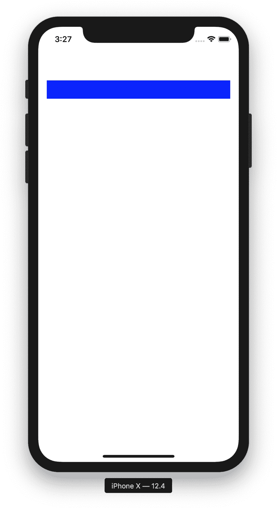
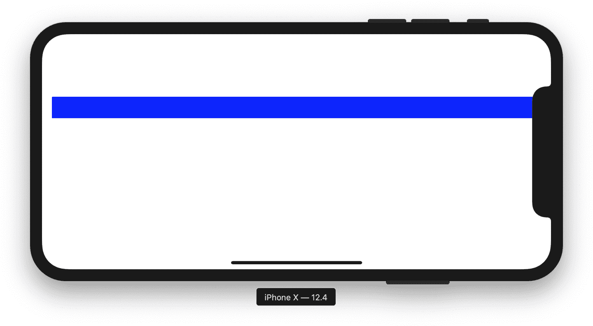

# 第二章：视图

在大多数图形用户界面（GUI）框架中，屏幕上的视觉元素通常被称为架构术语中的“视图”。在 Web 应用程序中，视图可能是 HTML 元素，但在某些 Web 框架中，视图可能是整个网页或页面片段。Java Swing 和许多其他框架使用“组件”来表示应用程序的视图部分。

在原生移动开发中，视图确实就是这样——`View`（Android）或`UIView`（iOS）子类的实例。

视图可以是原子元素，表示屏幕上的单个视觉元素，如文本片段或图像，也可以是用于布局的更复杂的视图层次结构，如一系列行或更复杂的，如具有内置复杂行为的日历小部件。

视图还必须用于接收用户输入。按钮、开关、复选框、选择框和文本输入框都是使用户能够与应用程序交互的视图的示例。

# 任务

在本章中，你将学习：

1.  创建一个新视图。

1.  嵌套视图。

1.  更新视图的状态。

# Android

在 Android 中，基类是 `View`，它*不是* `abstract`——你可以在需要时实例化一个简单的 `View`，尽管这可能不太常见。一个例子是有时简单的 `View` 实例被用作线条或形状，只需提供尺寸和背景颜色，或作为没有可视化表示的点击区域。一些实际的 Android `View` 子类的常见示例包括 `TextView`、`ImageView`、`Button` 和 `EditText`。

基本的 `View` 不能包含另一个 `View`，但 `ViewGroup` 可以（`ViewGroup` 是 `View` 的子类，因此它本身也是 `View`）。在框架库中有许多 `ViewGroup` 类专门用于布局：`LinearLayout`、`FrameLayout`、`ConstraintLayout` 等等。大多数布局需求可以通过这些预制的 `ViewGroup` 子类来实现，但由于这些类是纯 Java 的，你可以自由地继承 `ViewGroup` 并定义自己的逻辑；我经常这样做。

其他不严格用于布局的 `ViewGroup` 子类包括 `ScrollView`、`RecyclerView`、`Spinner` 和 `ViewPager`。每个组件提供了除了显示和布局内容之外的大量功能，例如，`RecyclerView` 管理一个滚动的项目列表，当它们移出屏幕时（和内存中时）被移除，并在新项目滚动到视图中时“回收”（因此得名）。在 Android 生态系统中，这些通常称为“小部件”（不要与设备主屏幕的小部件混淆）。

## 创建新视图

`View` 类可以像其他对象实例一样通过在 Java 中使用 `new` 关键字和 `View` 子类的构造函数进行构造，或者在使用 Kotlin 时仅调用类的构造函数。在大多数情况下，这将至少需要一个 `Context` 参数，可能还需要更多：

创建 `View` 和通常是整个嵌套 `View` 和 `ViewGroup` 层次结构的更常见的方法是充气 XML “布局”。 “充气” 简单地意味着解析 XML 及其指令，并将该视图树添加到现有 UI 中或简单返回它。

Android 中的 XML 布局遵循传统的 XML 规则，并有一些你应该了解的约定。

XML 声明是可选的，但建议使用：

```
<?xml version="1.0" encoding="utf-8"?>
```

之后，XML 必须有一个 *单一* 根节点。这几乎总是一个 `ViewGroup`（对于视图树）或表示布局整体内容的单个 `View`。我说“几乎”是因为还有像 `merge` 标签这样的高级机制；这在技术上不是一个 `View`，但提供一个指令来返回节点的内容。

例如，你可能会有这样的视图树：

```
<?xml version="1.0" encoding="utf-8"?>
<LinearLayout...>
  <android.support.design.widget.AppBarLayout...>
    <android.support.v7.widget.Toolbar... />
  </android.support.design.widget.AppBarLayout>
  <FrameLayout...>
  </FrameLayout>
</LinearLayout>
```

或者，你的布局可能是一个单独的 `View`，如下所示：

```
<?xml version="1.0" encoding="utf-8"?>
<TextView... />
```

布局文件存储在 *res/layout/* 文件夹中，并且必须遵循标准的 Android 资源命名方案（只能是字母数字字符和下划线）。这个文件夹在编译时处理，以使每个布局的引用成为指向数字 ID 的符号。现在不必完全理解这是如何发生的；只需知道，如果你将布局文件保存为 *res/layout/my_activity.xml*，它将作为 `R` 静态配置对象上的 `R.layout.my_activity` 可用，这是适当的，并且可以传递给任何期望资源 ID 的方法。

回到我们之前提到的约定。Android 在膨胀过程中捆绑了大量功能，但你需要使用它们的命名空间来利用这些功能。这很简单：在根节点上包含一个指向 Android 架构的命名空间属性：*http://schemas.android.com/apk/res/android*。这个命名空间可以是任何你喜欢的，但通常称之为“android”，如下所示：

```
<?xml version="1.0" encoding="utf-8"?>
<LinearLayout
  xmlns:android="http://schemas.android.com/apk/res/android"
  ...>
```

一旦建立了这个，你可以通过附加该命名空间的属性来访问 Android 框架属性，如下所示：

```
<?xml version="1.0" encoding="utf-8"?>
<LinearLayout
  xmlns:android="http://schemas.android.com/apk/res/android"
  ...>
  <TextView
    android:text="Hello world!"
    ...>
```

设置了这个命名空间后，当框架充气你的 XML 来创建一个带有 `TextView` 的 `LinearLayout` 时，`TextView` 的 `text` 属性将设置为“Hello World！”（将在系统的字体、颜色和大小下显示在屏幕上）。

请注意，你可能永远不会看到它，但使用自己的命名空间名称是完全可以接受的，只需在布局文件中指定即可：

```
<?xml version="1.0" encoding="utf-8"?>
<LinearLayout
  xmlns:bob="http://schemas.android.com/apk/res/android"
  bob:layout_width="match_parent"
  bob:layout_height="wrap_content">

  <TextView
    bob:text="Hello world!"
    bob:layout_width="wrap_content"
    bob:layout_height="wrap_content" />

</LinearLayout>
```

另一个重要的要包含的命名空间是“auto”命名空间，当使用自定义组件或特定支持组件时是必需的。这必须指向 *http://schemas.android.com/apk/res-auto*，通常命名为“app”（但同样，任何遵循 XML 命名空间名称格式的名称都是可以接受的）：

```
<?xml version="1.0" encoding="utf-8"?>
<LinearLayout
  xmlns:android="http://schemas.android.com/apk/res/android"
  xmlns:app="http://schemas.android.com/apk/res-auto"
  ...>
```

有了这两个命名空间在你的根节点上，你应该准备好处理几乎所有的 XML 布局功能。

在编写时，您可能会注意到所有 Android `Views`都需要`layout_width`和`layout_height`属性（在您的命名空间 XML 中，看起来像`android:layout_width="100dp"`）。这对于以编程方式实例化的`Views`并不需要，它们将始终使用常量`WRAP_CONTENT`标志，以指示它们应该消耗显示其内容所需的任何大小。

可接受的值是任何尺寸值（`100dp`、`100px`或`100sp`）或几个预定义的常量：`LayoutParams.WRAP_CONTENT`和`LayoutParams.MATCH_PARENT`。前者相当明显——如果您有一个`TextView`，内容为“Hello World”，并且两个尺寸设置为`WRAP_CONTENT`，那么`TextView`将占用所需的空间来呈现这些字符。`MATCH_PARENT`表示`View`将尝试填充其父级内所有可用的空间，沿着该维度。

因此，最终的可用布局文件可能如下所示：

```
<?xml version="1.0" encoding="utf-8"?>
<LinearLayout
    xmlns:android="http://schemas.android.com/apk/res/android"
    xmlns:app="http://schemas.android.com/apk/res-auto"
    android:layout_width="match_parent"
    android:layout_height="match_parent"
    android:orientation="vertical">

  <android.support.design.widget.AppBarLayout
    android:layout_width="match_parent"
    android:layout_height="wrap_content">

    <android.support.v7.widget.Toolbar
      android:layout_width="match_parent"
      android:layout_height="wrap_content"
      app:navigationIcon="?attr/homeAsUpIndicator" />

  </android.support.design.widget.AppBarLayout>

  <FrameLayout
      android:layout_width="match_parent"
      android:layout_height="0dp"
      android:layout_weight="1">
  </FrameLayout>

</LinearLayout>
```

关于此代码的一个快速说明：通常希望一个元素（在本例中是包含`Toolbar`的`AppBarLayout`）占据所需的所有空间，并且另一个元素填充其余空间（也许是`LinearLayout`或`ScrollView`）。在这种情况下，作为动态添加和删除`Views`的容器的`FrameLayout`将占用其父级中可用的任何空间。

您可能认为在`FrameLayout`上使用`MATCH_PARENT`，但父级实际上与屏幕一样高（假设这是根视图），因此`FrameLayout`将通过等于`Toolbar`高度的底部剪切。这种使用`LinearLayout`的技巧解决了这个常见问题：将变大小的`View`的尺寸设置为`WRAP_CONTENT`；然后对于应该扩展以填充父级中余下空间的`View`，将该尺寸设置为`0dp`，但添加`layout_weight`为`1`（或任何值）。布局权重告诉`LinearLayout`应该将多少可用空间分配给`View`。

我们最终在资源文件中有一个可用的布局，预编译并准备就绪。我们如何使用它？有几种方法，其中一些我们在第一章中已经涉及到 UI 控制器。现在，让我们专注于几种常见方法，并探索一些不太常见的方法。

一种策略是将布局设置为你的`Activity`的根视图。只需调用`Activity.setContentView`并传递布局的资源 ID。在这个例子中：

就是这样！当`MyActivity`启动时，您将立即看到在布局 XML 文件中描述的视图树。

另一种策略是将内容添加到现有的视图树中。如果您已经以其他方式设置了视图树，您可以使用 `ViewGroup` 方法相当容易地添加或删除 `View` 实例，例如 `ViewGroup.addView` 和 `ViewGroup.removeView`。这对于以编程方式创建的视图非常有效，但我们也可以明确地访问布局膨胀。有一个系统服务可以为我们做到这一点，有两种相同的方法可以获取对该服务的引用：

或者：

一旦您拥有一个 inflater 实例的引用，可以直接调用 `inflate` 方法。其中一种选项是将膨胀的 `Views` 追加到作为参数传递的另一个 `ViewGroup` 中：

这个签名将自动将膨胀的视图树添加到第二个参数 `someViewGroup`，并返回相同的根 (`someViewGroup`)。或者，您可以在没有根的情况下调用它：

这个版本的好处在于，膨胀的视图树直接返回，无需立即添加到现有的视图树中。

此外，在使用 `Fragment`（也在 第一章 中涵盖）时，您的 `Fragment` 实例将希望从其 `onCreateView` 回调中返回一个 `View` 实例（在 `Fragment` 创建时自动调用）。此外，像 `RecyclerView` 和 `ViewPager` 这样的视图管理器类将提供挂钩，应根据显示需求（通过滚动或分页）返回（或装饰）一个 `View`。

## 嵌套视图

任何 `ViewGroup` 可以拥有任意数量的子 `View` 实例。这些子项将显示在包含的 `ViewGroup` 内，因此如果容器被移除或隐藏，则子项也将被移除或隐藏。

子视图将根据 `ViewGroup` 的显式布局逻辑在父 `ViewGroup` 内定位。例如，`LinearLayout` 将根据每个子项的大小以垂直或水平顺序排列其子项，而 `FrameLayout` 使用绝对像素定位。

`View` 可以使用任何 `ViewGroup.addView` 方法添加到 `ViewGroup` 中。存在签名以适应插入索引和布局指令。可以使用 `ViewGroup.removeView` 方法删除 `Views`。请记住，`ViewGroup` 实例继承自 `View`，因此一个 `ViewGroup` 可以添加或删除另一个。

这在 XML 布局中已为您处理。当 `Views` 在 XML 布局文件中表示时，XML 节点的父子关系也反映在视图树中；也就是说，一个具有两个 `TextView` 子节点的 `LinearLayout` 节点将被膨胀为一个 `LinearLayout`，作为一个具有两个 `TextView` 实例的子项的 `ViewGroup` 实例。但是，在膨胀布局后仍然可以使用 `addView` 和 `removeView` 更改这些关系。

## 更新视图的状态

`View` API 提供了多种方法来修改 `View` 的可见属性。例如，`View.setLeft` 将更新 `View` 相对于其容器的位置，而 `View.setAlpha` 将调整 `View` 的透明度。非常常见的是，您会使用 `setVisibility` 来显示或隐藏 `View`。在修改位置时，通常建议使用 `setTranslationX` 或 `setTranslationY` 而不是 `setLeft`、`setTop`、`setX` 或 `setY`。基于平移的属性是一种“偏移量”，计算在适当的 `View` 正常位置之上。例如，如果您有一个包含多行缩略图和标签的 `LinearLayout`，并且在第二行调用了 `setTop`，那么整个行列表的流程可能会受到影响。另一方面，如果您想暂时向下滑动以显示其下的一些 UI，则可以安全地使用 `setTranslationY` 而不影响容器的整体布局数学计算。

`View` 子类是一个混合包，通常具有特定的 API。例如，`TextView` 具有诸如 `setText` 和 `setTextSize` 的方法，而 `ImageView` 则具有 `setImageBitmap` 来更新显示的图像。

虽然大多数 `View` 属性可以在 XML 中最初设置，但您几乎总是需要通过编程方式进行更新。Android 框架几乎完全使用 getter 和 setter 方法而不是直接属性赋值。您始终应该使用 `myView.setVisibility(View.GONE);` 而不是使用 `myView.visibility = View.GONE;`。这在特定的 Java 社区和更广泛的任何具有访问修饰符（`private` versus `public`）的技术中有着相当长的历史（以及同样长的争议）。简而言之，一群聪明的人很久以前聚在一起，基本上说，几乎不要（或至少很少）使用直接可赋值的属性；使用 getter 和 setter 方法，以便 API 的作者和使用者可以拦截这些“事件”，在读取或写入数据之前或之后添加逻辑来改变程序的状态。

话虽如此，Kotlin *确实* 允许直接属性赋值的出现：

```
myView.visibility = View.GONE
```

但在幕后，调用了 setter 方法；确实，如果您在 Kotlin 中为 setter 方法添加逻辑，然后像在前面的代码块中所示直接为属性赋值，setter 中的逻辑 *将* 被调用。

# iOS

在 iOS 中，“view” 一词通常指 `UIView` 的一个实例或其子类。视图可以是显示在屏幕上的任何东西——标签、图像、地图、内联 Web 浏览器等等！话虽如此，所有视图在其最简单的形式中都是设备屏幕上的一个简单矩形，位于一组坐标中。

所有 iOS 应用程序开始时的基础视图是`UIWindow`的一个实例。每个`UIViewController`都有一个`view`属性，其中包含一个`UIView`的实例。应用程序的窗口在其中嵌套其根视图控制器的视图。通过 segues 和调用`show(_:sender:)`来改变顶部呈现的视图控制器，在其最基本的形式中，只是在屏幕上简单地交换一个由视图控制器管理的`UIView`与另一个由另一个视图控制器管理的`UIView`。

鉴于`UIView`在 iOS 中的重要性，让我们来看看如何处理这个类。

## 创建一个新视图

您可能想要做的第一件事是创建一个新的视图。在 iOS 中，通过调用`UIView`的初始化程序并传递一个框架来完成这一点，这个视图将会显示在屏幕上，如下所示：

```
let aView = UIView(frame: CGRect(x: 10.0, y: 30.0, width: 100.0, height: 50.0))
```

上述代码创建了一个宽度为 100pt、高度为 50pt 的视图；它将放置在其包含视图的左侧 10pt 处和顶部 30pt 处。这是视图的`frame`。

有时，当创建视图时，您可能不知道应该将视图放置在屏幕上的位置。事实上，可以通过传入一个所有值均设置为`0`的`CGRect`来实例化一个没有已知框架大小的视图。这种情况非常普遍，事实上，`CGRect`有一个静态变量，输出一个零值矩形。您可以使用它来实例化一个视图，如下所示：

```
let aView = UIView(frame: .zero)
```

### 框架与边界

长时间使用`UIView`，最终会遇到`bounds`属性。这也是一个`CGRect`，与视图的`frame`非常相似，但有一个重要的区别：视图的`bounds`属性是一个表达其位置相对于其*自己*坐标系的矩形，而视图的`frame`属性是一个表达其位置相对于其包含视图（或“父视图”）的矩形。例如，我们第一个示例中的视图将为其`bounds`和`frame`输出以下内容：

```
let aView = UIView(frame: CGRect(x: 10.0, y: 30.0, width: 100.0, height: 50.0))

print(aView.bounds) // Outputs x: 0.0, y: 0.0, width: 100.0, height: 50.0

print(aView.frame) // Outputs x: 10.0, y: 30.0, width: 100.0, height: 50.0
```

请注意，在此示例中，每个属性的`width`和`height`是相同的。区别在于，`frame`包含视图在其父视图中的位置信息，而`bounds`则没有。

### Storyboards 和 XIBs

到目前为止，我们已经展示了如何仅通过编程方式初始化视图。然而，视图通常在幕后创建，之前在 Xcode 中定义在 Storyboard 或 XML 界面构建器（XIB）中。

基于 Storyboard 的视图是直接在界面构建器中的视图控制器内定义的。视图控制器的场景包含一个或多个嵌套和一起显示的视图。将视图连接到视图控制器是通过特殊的编译器标志`@IBOutlet`完成的。此标志指示类中类型为`UIView`的属性可以连接到包含在 XIB 或 Storyboard 中的视图。例如，要创建一个具有蓝色矩形子视图的视图控制器，您首先要创建一个视图控制器，并在其内部创建一个带有`IBOutlet`标志的属性，如下所示：

```
class ExampleViewController: UIViewController {
	@IBOutlet var blueRectangle: UIView!

	...
}
```

接下来，要将视图控制器与视图链接起来，您需要执行以下操作：

1.  创建一个新的视图控制器场景。

1.  通过身份检查器将视图控制器的自定义类更改为“ExampleViewController”。

1.  在主视图内的场景中添加一个视图，并通过属性检查器将其背景颜色更改为蓝色。

1.  在视图控制器上控制单击，然后从那里拖动到蓝色矩形。

1.  您应该看到一个弹出窗口，其中列出了视图控制器中的符合条件的出口。 选择`blueRectangle`，然后您在界面生成器中显示的蓝色矩形视图现在直接链接到`ExampleViewController`类中的`blueRectangle`属性。

XIB 的功能非常类似。 XIB 本质上相当于故事板中的单个视图控制器场景，尽管这是一个过度简化的说法。 实际上，它们是基于 XML 的格式（与故事板类似），用于存储关于视图的信息，以便可以通过 GUI 创建视图，而不仅仅通过代码。 它们比故事板早出现，并且越来越少见，但仍然相对常见。

从 XIB 创建视图类似于故事板； 通过界面生成器完成配置视图的工作，例如，但是 XIB 的设置和实例化方式稍有不同。 要创建基于 XIB 的视图，您需要完成以下步骤：

1.  创建一个名为“CustomView”的 `UIView` 子类。

1.  向 iOS 项目添加一个新的 XIB（*CustomView.xib*），并通过身份检查器设置其自定义类为我们刚刚创建的类：`CustomView`。

1.  在视图控制器或其他对象内实例化对象。

如何实例化对象？ 您必须引用 XIB，然后像这样使用它来实例化对象本身：

```
let nib = UINib(nibName: "CustomView", bundle: nil)
let view = nib.instantiate(withOwner: nil, options: nil).first as? CustomView
```

不幸的是，`instantiate(withOwner:options:)` 创建一个通用的 `UIView` 实例，因此您必须将其转换为预期的子类。

我们已经学会了如何创建视图，但 UI 的真正力量在于嵌套和组合视图在一起。 让我们看看如何将一个视图嵌套在另一个视图中。

## 嵌套视图

可以创建并添加到其他视图中的视图，这些视图可以容纳其他视图，这些视图可以容纳其他视图，依此类推——这确实是一种`UIView`的方式！ 让我们创建一个视图，并将其作为另一个视图的子视图添加。

以下代码块创建了一个父视图和一个子视图，然后调用 `addSubview(_:)` 将子视图添加到父视图的子视图数组中：

```
let parentView = UIView(frame: .zero)
let childView = UIView(frame: .zero)

parentView.addSubview(childView)
```

我们已经添加了一个视图，现在让我们将其删除！ 使用相同的示例，我们可以让子视图从其父视图中移除自己，如下所示：

```
childView.removeFromSuperview()
```

### 约束

最终，您会遇到一个实例，希望视图自动调整大小。 您可以通过为视图提供与另一个视图相关的一组约束来实现这一点。 假设我们有一个按钮，这是一种特殊类型的视图，可以接收事件，我们希望它距离屏幕边缘的每一侧都有 16pt，并且距离屏幕顶部有 100pt。 我们可以通过代码中的约束来实现这种布局，如下所示：

```
class ExampleViewController: UIViewController {

    // Set up the button whenever the view is loaded
    override func viewDidLoad() {
        super.viewDidLoad()
        setupButton()
    }

    // Method that does the actual button setup
    func setupButton() {
        // Create a button
        let button = UIButton(frame: .zero)
        button.translatesAutoresizingMaskIntoConstraints = false

        // Add background color to the button
        button.backgroundColor = .blue

        // Add it to the view controller's view
        view.addSubview(button)

        // Add the spacing from the top of the view
        button.topAnchor.constraint(equalTo: view.topAnchor, constant: 100.0).isActive =
        true

        // Add the spacing from the left edge of the view
        button.leadingAnchor.constraint(equalTo: view.leadingAnchor,
           constant: 16.0).isActive = true

        // Add the spacing from the right edge of the view
        button.trailingAnchor.constraint(equalTo: view.trailingAnchor,
            constant: -16.0).isActive = true
    }
}
```

让我们来看看这里发生了什么。首先，我们定义了一个视图控制器来容纳一个名为 `ExampleViewController` 的按钮；它是 `UIViewController` 的子类，并且像每个视图控制器一样，有一个它管理的子视图叫做 `view`。在这个类中，我们有一个 `setupButton()` 方法，在视图加载后调用该方法来创建按钮并在视图内部进行布局。接下来，在 `setupButton()` 内部，我们用空框架实例化一个按钮，并将 `translatesAutoresizingMaskIntoConstraints` 设置为 `false`。

看到我们设置的约束条件，你会发现我们引用了按钮的顶部锚点（即按钮的顶部），并将其设置为距包含视图的顶部锚点 100pt。我们在左侧锚点（即左侧）和右侧锚点（即右侧）也是如此，但值为 `16.0`。

运行此代码将显示一个类似于 图 2-1 的视图。



###### 图 2-1\. iPhone X 上带有约束的按钮

###### 警告

如果您以编程方式创建视图并添加约束，应将 `translatesAutoresizingMaskIntoConstraints` 设置为 `false`。此属性禁用系统创建的自动调整大小约束，并允许我们直接指定自己的约束。实际上，如果您完全通过编程方式创建视图，将其设置为 `false` 是一个好习惯。不将其设置为 `false` 往往会导致令人沮丧和神秘的视图布局问题。

约束的力量在于，该视图完全可以根据定义的约束进行调整大小。因此，如果你旋转设备，按钮将保持其相对于视图的顶部、左侧和右侧锚点的间距，就像在 图 2-2 中一样。



###### 图 2-2\. 适应 iPhone X 横向方向的约束按钮

## 接口生成器来拯救

尽管可以完全通过代码创建约束，但当视图具有多个关系和基于设备大小类的行为时，这很快变得复杂。更常见的做法是从 Interface Builder 中创建约束。为了重新创建相同的按钮，我们可能会遵循类似以下的过程：

1.  打开一个故事板并添加一个新的视图控制器场景。

1.  在“Identity inspector”中更改视图控制器的自定义类为“ExampleViewController”。

1.  向视图控制器的视图添加一个按钮。

1.  点击故事板编辑器右下角的“添加新约束”按钮。

1.  在弹出窗口中设置我们期望的边距值。在这种情况下，顶部值为 100pt，左右值为 16pt。

运行代码会创建一个看起来完全与代码中定义的相同的视图，但不包含任何代码。

### 自动布局

约束是 iOS 中称为自动布局的技术的一部分。它是一个*非常*强大且复杂的工具，如果用得当，可以减少制作复杂且响应灵活的用户界面所需的工作量。自动布局的范围对于本节来说太大了，请查阅[文档](https://oreil.ly/dYJcl)以获取更多关于如何在应用程序中有效使用它的信息。

## 更新视图的状态

创建一个视图并将其添加到父视图只能做到这一步。所有视图都有大量属性可用来使它们的显示更加动态化，并将它们样式化为超越基本白色矩形的状态。让我们看看如何更新一些常用属性。

### Alpha

可以按以下方式更新视图的 alpha 值或透明度：

```
myView.alpha = 0.5
```

这将值更改为 50%的透明度。如果想要完全隐藏视图，可以使用以下代码片段：

```
myView.alpha = 0.0
```

### 隐藏视图

将视图的`alpha`设置为`0.0`实际上并不会从屏幕上移除视图。它仍然会响应触摸事件，并且如果它覆盖在其他视图之上，会阻止其他视图。为了真正隐藏视图，请使用以下代码：

```
myView.isHidden = true // Hides the view
myView.isHidden = false // Un-hides the view
```

### 背景颜色

所有视图都有背景颜色。iOS 上视图的默认背景颜色是白色。这可以用`UIColor`对象来表达，更具体地说是`UIColor.white`。你可以像这样将背景颜色设置为蓝色：

```
myView.backgroundColor = UIColor.blue
```

或者，如果你更喜欢将其设置为自定义颜色，可以这样做：

```
myView.backgroundColor = UIColor(red: 223.0, green: 23.0, blue: 0.0, alpha: 1.0)
```

`UIColor`中的`alpha`值仅影响背景颜色。这确实使得有可能创建一个半透明的视图，而不像直接设置视图的`alpha`属性那样影响视图的内容。换句话说：

```
// Changes a view's background color to a semi-transparent color
myView.backgroundColor = UIColor(red: 223.0, green: 23.0, blue: 0.0, alpha: 0.5)

// Changes the entire view to be semi-transparent
myView.alpha = 0.5
```

在 iOS 中，一个重要的事情是，“clear”本身也是一种颜色。例如，要创建一个没有任何背景颜色的视图，你需要将视图的背景颜色设置为 clear，如下所示：

```
// Give the view a fully transparent background
myView.backgroundColor = UIColor.clear
```

## 修改位置

想要修改视图的位置吗？你有两个选项，选择基于是否使用了约束。如果没有使用约束，可以通过其`frame`与视图进行交互。例如，要通过 frame 改变视图的位置，可以像下面这样做：

```
// Create a 100x100 view at (0,0)
let view = UIView(frame: CGRect(x: 0.0, y: 0.0, width: 100.0, height: 100.0))

// Resize the view to 50x50 and move it to (130, 55)
view.frame = CGRect(x: 130.0, y: 55.0, width: 50.0, height: 50.0)
```

如果使用约束来定位视图，则需要直接更新约束。这可以通过在界面构建器中创建约束，并将其分配给在类中创建的`@IBOutlet`来以编程方式完成。例如，如果在界面构建器中定义了一个宽度约束为`100.0`，则可以在代码中将其更改为`50.0`，如下所示：

```
class ExampleViewController: UIViewController {

    @IBOutlet var widthConstraint: NSLayoutConstraint!

    ...

    func resizeWidth() {
        widthConstraint.constant = 50.0
    }
}
```

你也可以避免在代码中设置值，并直接向对象添加两个约束，在一个约束被关闭的情况下。然后，在合适的时机，你可以像这样切换约束：

```
class ExampleViewController: UIViewController {

    @IBOutlet var widthConstraint: NSLayoutConstraint!
    @IBOutlet var otherWidthConstraint: NSLayoutConstraint!

    /// ...

    func resizeWidth() {
        widthConstraint.isActive = false
        otherWidthConstraint.isActive = true
    }
}
```

这些是调整约束的最常见方式，但说实话，有许多不同的方法可以改变与对象连接的约束。这就是 Auto Layout 的力量和复杂性。

### 其他属性

这只是触及了视图中可用属性数量的表面。其他视图，如`UILabel`，有可用的字体选项。像`UIImageView`这样的视图可以分配`UIImage`。像`WKWebView`这样的视图，在 iOS 提供的内置 Web 视图中，有更复杂的状态可以启用和切换。最好查看 Apple 文档网站上特定类的文档，以全面了解可用于控制的属性。

### 核心动画

本章没有讨论的一件事是核心动画层(Core Animation layers)。这是一种完全不同且互补的方式，用于改变和修改视图的外观。像`borderRadius`和`mask`这样的东西使得创建能够进行动画的复杂用户界面成为可能。

### SwiftUI

SwiftUI 作为 UIKit 的后继者已经到来。这是一个新的库，用于在 Swift 中构建用户界面。它是一种声明性语法，对于下一代 UI 开发有很大的潜力。现在它还比较早期，并且在某些方面还有些粗糙，但考虑到 Apple 在这项技术上的投入，可以肯定它将在未来几年内变得更加重要，如果 Apple 按照其计划进行的话，可能会成为构建应用程序的主要方式。

# 我们学到了什么

Android 和 iOS 在显示视图在设备屏幕上的机制上有着非常不同的方式，但基本上它们有着相同的目标：向用户显示内容以进行交互。为了实现这一目标，我们已经涵盖了以下内容：

+   如何在两个平台上创建新视图以显示在屏幕上

+   在 Android 中使用原始 XML 创建视图和在 iOS 中使用 storyboards 创建视图的区别，最终都使用 XML 作为底层文件结构进行表示。

+   如何通过使用约束来处理 iOS 中不同设备尺寸的变化

+   视图可以轻松嵌套和更新的便利性

这些信息为我们提供了足够的基础知识，以理解接下来关于自定义视图的章节。让我们开始吧！
