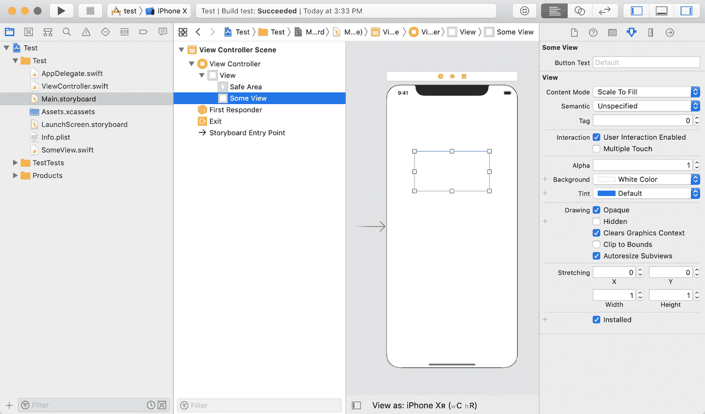

# 第三章：自定义组件

尽管 Android 和 iOS 都提供了大量开箱即用的小部件和组件，但并不总是一致，并且很可能您希望在某些时候创建自己的组件。您可能希望拥有具有自定义外观或行为的日期或颜色选择器，带有内置标签的开关或切换按钮，数据可视化组件如图表和图形，或者简单地适合您的应用程序的可配置标签和图标。

无论需求如何，您很可能可以在任何一个框架中创建它——但这个过程非常不同，并且可能会出人意料地神秘。

# 任务

在本章中，您将学习：

1.  如何创建自定义视图。

1.  如何使用自定义视图。

# Android

由于大多数 Android 应用程序中的布局是使用 XML 数据创建的，使您的自定义组件能够接受和适当地对任意属性作出反应是您可能希望提供的功能。例如，如果您要创建一个自定义颜色选择器，您可能希望提供一个默认的起始颜色，或者甚至是特定的颜色空间，如 HSL 或 RGB。

由于 XML 资源是编译的，您需要确保系统识别出您的组件上允许的额外属性以及哪些值是有效的。例如，如果您添加了一个`color`属性，您不希望接受尺寸值——您只希望接受有效的颜色，或者可能是颜色资源 ID。如果用户尝试输入无效的值格式，则程序将无法编译，Android Studio 将通知用户，正如我们所期望的那样。

## 如何创建自定义视图

自定义`View`类的基本前提可能与您期望的非常接近：子类化`View`或`ViewGroup`，或现有的子类，并根据需要提供自己的功能。自定义`View`类有些受限——它实际上只能修改其绘制的内容（文本、颜色、形状）或其报告的大小。前者可以通过`View`的`onDraw`方法实现。该方法接受一个参数，一个`Canvas`实例，该实例将始终为您填充，并具有与`View`本身相同的尺寸。查看关于`Canvas`对象的开发文档，但实际上您在这里可以做任何您想做的事情。有用于绘制文本和形状的方法。您可以使用像`Rect`或`Path`这样的几何类来绘制更复杂的结构，以及`Paint`对象来自定义颜色、填充或纹理。

例如，以下简单的`View`类将绘制一个红色的圆（或椭圆），填充`View`的框架：

正如您所见，您可以提供设置器来自定义颜色或提供一个自定义的`Paint`来平铺位图，创建阴影层或混合渐变。

同样地，您可以对`TextView`进行子类化，以便它始终沿底部边缘具有单个边框，可能用于`LinearLayout`或`RecyclerView`中：

您可能会添加一个新的方法来更改边框的颜色并重新绘制它：

另一方面，自定义的`ViewGroup`可能代表一种新的布局策略，或者涵盖一组子`View`和`ViewGroup`实例，组成类似日期选择器或媒体播放器的复杂组件。以这种方式使用`ViewGroup`通常称为创建自定义“组件”，需要更深入的了解。我们会在这里简单提及，但请务必查阅[文档](https://oreil.ly/ugTKF)以获取更详尽的介绍。

考虑的主要要点可以总结为两个方法：`onMeasure`和`onLayout`。`onMeasure`告诉父组件自定义组件需要多少空间。有时这是所有可用空间；有时只是其内容所需的空间，或者可能是两者的组合。

`onMeasure`方法传入两个`int`参数：`widthMeasureSpec`和`heightMeasureSpec`。这些值包括指示“模式”的位（如指示尺寸应与其父视图相同的标志，称为`MATCH_PARENT`），以及像素维度，可能还有其他的。

你可以使用`MeasureSpec.getMode`和`MeasureSpec.getSize`从遮罩测量规范中读取这些值。

第二个需要了解的方法是`onLayout`。各种事件会触发对视图树进行布局，比如父视图或子视图的大小改变，或者添加、删除或重新排序子视图时。此外，作为开发者，你可以使用`View.requestLayout`显式请求新的布局。

`onLayout`的默认实现什么也不做（尽管像`FrameLayout`和`LinearLayout`这样的具体`ViewGroup`子类确实定义了此方法）。你需要定义`ViewGroup`如何布局其子项。例如，纵向定向的`LinearLayout`首先测量其所有子项（在`onMeasure`中）；然后在`onLayout`中，它将第一个子项定位在顶部，第二个子项位于其下方，第三个子项位于第二个子项下方，依此类推。它报告所需的垂直空间将是这些高度的总和。`FrameLayout`是一个更简单（也更高效）的机制：所有子项都独立布局，每个子项的`LayoutParams`提供了明确的边距值，指示子项位置的顶部和左侧值。

例如，以下代码将使用`FrameLayout`作为`Activity`的内容视图，并将`TextView`定位在距离顶部和左侧一百像素处。将其他子`View`实例添加到该容器中不会影响`TextView`的位置，因为`FrameLayout`在执行其`onLayout`操作时仅检查子项的`LayoutParams`的边距值：

下面是一个`onLayout`的实现示例，它会水平按顺序定位其子项，直到没有更多的可用空间，此时会换行到下一行。有时这被称为“FlowLayout”：

除此之外，随意添加自己的方法和属性，以创建自定义组件所需的任何功能。

## 如何使用自定义视图

到目前为止，我们已经介绍了很多关于自定义`Views`和组件的信息，但大部分情况下，这些信息都是有序且合乎逻辑的。接下来的内容大多是特定于框架的机制，可能不会立即让人理解。要让应用层发挥魔力，我们需要跳过一些障碍——如果你一时无法理解（或者永远无法理解），不要感到难过；我们有时也会发现自己需要查阅这些内容。

首先，让我们做一些假设。我们有了前面示例中的`TextView`子类：`BottomBorderTextView`。它将像任何`TextView`一样在 XML 中呈现，具有`android`命名空间属性，如`android:text`和`android:textSize`。但现在我们想要添加一个属性：`borderColor`。

这个新属性不是`android`命名空间的一部分，而是您的应用程序的 XML 命名空间（`http://schemas.android.com/apk/res/com.yourapp`）的一部分。幸运的是，在前一章关于`Views`中，我们看到我们可以使用“auto”命名空间`http://schemas.android.com/apk/res/auto`，并且可以直接映射到当前应用程序的命名空间。

首先，我们必须将此自定义属性定义为已编译的`values`值。传统上，这会放在*res/values/attrs.xml*中，但实际上可以放在任何*res/values*子目录中。

属性必须位于`declare-styleable`节点内，该节点应具有与资源节点内自定义组件的简单名称相等的`name`属性。每个属性（在本例中，只有单个`borderColor`属性）都表示为具有与属性名称相等的`attr`节点，并且具有表示可接受数据类型的格式（`color`、`boolean`、`dimension`、`integer`等等）。

总的来说，我们的示例会是这样的：

```
<resources>
   <declare-styleable name="BottomBorderTextView">
       <attr name="borderColor" format="color" />
   </declare-styleable>
</resources>
```

然后，您可以在自定义组件的 XML 布局中引用自定义属性：

```
<com.myapp.BottomBorderTextView
  xmlns:android="http://schemas.android.com/apk/res/android"
  xmlns:app="http://schemas.android.com/apk/res-auto"
  android:layout_width="match_parent"
  android:layout_height="wrap_content"
  android:text="Hello world!"
  app:borderColor="#FFFF9900" />
```

接下来，您必须在`View`的构造过程中提取自定义属性的值。这需要一些非常不直观的代码。让我们让代码示例解释英语无法解释的内容：

`R.styleable.BottomBorderTextView` 是从哪里来的？`R.styleable.BottomBorderTextView_borderColor` 又是什么？答案是：魔术。系统在幕后进行了一些神奇的事情，但可以大致保证，通过先前创建的 `resource` XML，这些值已添加到全局 `R` 实例中。`declare-styleable` 节点的名称生成带有下划线附加的属性名称，然后将 `attr` 节点的名称附加到其后。`TypedArray` 本身也有些神奇，我们强烈怀疑你会在其他场景中使用 `context.getTheme().obtainStyledAttributes`。一如既往，我们鼓励您阅读开发文档，甚至查看源代码，但在这种情况下（通常在框架级编译操作中频繁发生），您可能只想相信我们。

###### 警告

你可能想要在一个 `initialize` 方法中封装自定义属性逻辑，并为你自定义视图的每个构造函数签名调用它，或者你可以使用每个构造函数调用默认或 `null` 值的便利技巧。

# iOS

在 iOS 上，你可以配置一个自定义视图，并在 Xcode 中的故事板或直接在 XIB 文件中构建场景。不幸的是，由于重用这样的视图的复杂性，这种方法很快就会变得不可持续。通常，在 iOS 中提到“自定义视图”时，指的是一个从 iOS 根视图类继承的自定义类。这些视图通常可重复使用，并且通常包含比直接将功能塞入视图控制器中更多的功能。让我们更多地了解在 iOS 和 UIKit 中创建自定义视图的一些最佳实践。

## 如何创建自定义视图

在 iOS 上，视图基本上是一个 `UIView` 实例。这可以是直接的 `UIView` 实例，也可以是 `UIView` 的子类。为了创建一个自定义视图，仅需像这样子类化 `UIView`：

```
class SomeView: UIView {
    required init?(coder aDecoder: NSCoder) {
        super.init(coder: aDecoder)
    }

    override init(frame: CGRect) {
        super.init(frame: frame)
    }

    // Customization goes here
}
```

如果你计划添加更多属性并希望对象在初始化时准备就绪，那么需要存在两个初始化器：`init(coder:)` 和 `init(frame:)`。你可以在这些方法内部添加任何必要的设置代码，以准备对象供使用。

例如，如果我们想要一个红色背景的视图，其中包含一个标有“Click Me!”的按钮，我们可以像这样设置一个对象：

```
class SomeView: UIView {
    required init?(coder aDecoder: NSCoder) {
        super.init(coder: aDecoder)
        setupView()
    }

    override init(frame: CGRect) {
        super.init(frame: frame)
        setupView()
    }

    private func setupView() {
        backgroundColor = .red

        let button = UIButton(type: .custom)
        button.titleLabel?.text = "Click Me!"

        addSubview(button)
    }
}
```

`setupView` 方法在两个初始化器之间共享，并且在创建视图时调用。这允许一个一致的设置过程发生。在 `setupView` 内部，视图的 `backgroundColor` 被设置为 `.red` 的 `UIColor` 实例，并创建一个新的按钮实例并将其添加为子视图。

还可以向我们的视图添加属性。例如，让我们使按钮内部的文本可配置，如下所示：

```
class SomeView: UIView {
    var buttonText: String = "Click Me!" {
        didSet {
            button.titleLabel?.text = self.buttonText
        }
    }
    lazy var button: UIButton = {
        let button = UIButton(type: .custom)
        addSubview(button)
        return button
    }()

    required init?(coder aDecoder: NSCoder) {
        super.init(coder: aDecoder)
        setupView()
    }

    override init(frame: CGRect) {
        super.init(frame: frame)
        setupView()
    }

    convenience init(frame: CGRect, buttonText: String) {
        self.init(frame: frame)
        self.buttonText = buttonText
    }

    private func setupView() {
        backgroundColor = .red
        button.titleLabel?.text = buttonText
    }
}

let noClicky = SomeView(frame: CGRect.zero, buttonText: "Don't click me!")
```

我们添加了一个新的属性`buttonText`，用于在变量中存储按钮的标题文本，以便我们可以使用它来填充按钮。这将允许我们初始化按钮并同时传递正确的文本。此外，我们稍微改进了我们的`setupView`方法：我们将按钮初始化从中删除，并添加到一个`lazy`属性中存储，这样我们可以稍后更改它，而不必将其作为新按钮再次添加到视图中。

让我们看看如何使用我们的新自定义视图。

## 如何使用自定义视图

可以简单到如下程度：

```
class SomeViewController: UIViewController {
    override func viewDidLoad() {
        super.viewDidLoad()
        let clickMeButton =
          SomeView(frame: CGRect(x: 0.0, y: 0.0, width: 100.0, height: 50.0),
          buttonText: "Click Me!")
        view.addSubview(clickMeButton)
    }
}
```

此代码创建一个新的自定义视图控制器，并实例化视图的一个实例。然后，将其添加到视图控制器的视图中。非常简单！

然而，我们可以使用界面生成器直接添加按钮的实例。在 Storyboard 或 XIB 文件中，从库中添加一个新的视图对象。然后，使用身份检查器将对象的自定义类设置为“SomeView”，以更改映射到视图的类。

这很好，但是我们可以通过一些与界面生成器相关的自定义标志`@IBInspectable`和`@IBDesignable`做得更好。这些标志使界面生成器尽可能地配置和显示视图，就像它将在运行的应用程序中显示的那样。

要使用它们，请在代码中像这样装饰自定义视图：

```
@IBDesignable class SomeView: UIView {
    @IBInspectable var buttonText: String = "Click Me!" {
        didSet {
            button.titleLabel?.text = self.buttonText
        }
    }
    lazy var button: UIButton = {
        let button = UIButton(type: .custom)
        addSubview(button)
        return button
    }()

    required init?(coder aDecoder: NSCoder) {
        super.init(coder: aDecoder)
        setupView()
    }

    override init(frame: CGRect) {
        super.init(frame: frame)
        setupView()
    }

    convenience init(frame: CGRect, buttonText: String) {
        self.init(frame: frame)
        self.buttonText = buttonText
    }

    private func setupView() {
        backgroundColor = .red
        button.titleLabel?.text = buttonText
    }
}
```

现在，如果你回到 Storyboard 或视图中，在视图的属性检查器中，现在有一个名为“Button Text”的新字段，你可以在这里设置按钮的文本。如果你更改它，界面生成器将更新屏幕上显示的按钮文本（见图 3-1）！

界面生成器、UIKit 和 Xcode 是强大的组合。你可以真正创建任意数量的不同视图和变体——唯一的限制是你的想象力。可用的选项是广泛的，不可能在一本书的单一章节中逐一列出。有关更多信息，请务必查阅苹果的[UIView 开发者文档](https://oreil.ly/QtOVC)。



###### 图 3-1\. 在界面生成器中具有可编辑字段的自定义视图

# 我们学到了什么

本章总结了我们对 UI 控制器（第 1 章）、视图（第 2 章）和自定义视图的涵盖。我们已经涵盖了很多内容。

+   我们展示了在 Android 和 iOS 中创建自定义视图需要一些子类化和定制。

+   在配置视图、设置和实例化它们以供使用时存在差异。

+   我们讨论了使用自定义视图来构建自定义界面的方法和方式。

+   两个平台都有强大而广泛的工具集，用于构建可以让用户喜悦和惊讶的界面。
