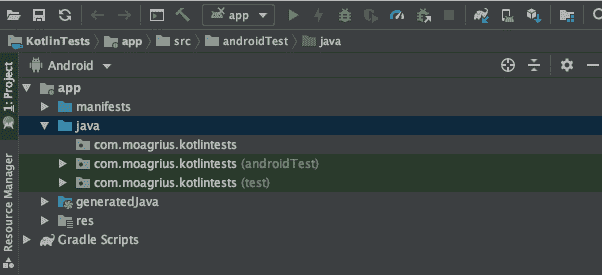

# 第十四章：测试

开发人员编写代码。通常他们会写很多代码。对象和其他服务之间的依赖关系网经常复杂且难以辨别；对象依赖于其他对象以正确运行。即使在相对简单的代码库中的一个地方进行更改，也可能导致另一个代码库的错误或崩溃。您的应用程序这座纸牌屋可能会很快倒塌。

测试在这一切中的位置在哪里？测试是为开发人员提供信心的一种方式，确保所做的更改不会无意中影响应用程序的其他部分。理想情况下，这些测试应该是自动化和确定性的，不受人类不可预测的主观影响，因为错误和判断不佳经常出现。幸运的是，大多数现代平台都内建了测试功能。Android 和 iOS 都有功能完备且非常强大的测试工具，可用于辅助开发代码。让我们看看这些工具是如何工作的。

# 任务

在本章中，您将学习：

1.  设置并运行单元测试。

1.  设置并运行集成测试。

# Android

AOSP 定义并区分了几种不同类型的测试：

单元测试

这些是高度专注的测试，运行在单个类上，通常是该类中的一个单独方法。如果一个单元测试失败，您应该清楚地知道问题出现在代码的哪个位置。它们的精度较低，因为在现实世界中，您的应用程序远不止执行一个方法或类那么简单。它们应该足够快速，以便在每次更改代码时都能运行。

集成测试

这些测试用例测试多个类之间的交互，以确保它们在一起使用时的预期行为。一种组织集成测试的方法是让它们测试单一功能，比如保存任务的能力。它们测试的代码范围比单元测试大，但仍然优化以保证快速执行而不失真实性。

端到端测试

测试多个功能组合在一起工作的能力。它们执行速度较慢，因为它们测试应用程序的大部分并且紧密模拟真实使用情况。它们具有最高的准确性，并告诉您您的应用程序实际上能正常运行。

在 Android 中进行测试可能与您之前遇到的测试有所不同。术语和分类有一些重叠，并且并不总是使用您在其他计算机科学领域可能找到的相同语义。

让我们从单元测试开始。Android 中的单元测试与您在任何其他框架或语言中遇到的单元测试非常相似。通常我们使用一个叫做 JUnit 的框架，但即使没有也没有严格的要求。单元测试应该非常专注，并且识别代码中的一个非常具体的点，因此，如果一个单元测试失败，修复起来应该很简单。例如，如果您有一个方法来计算两个数的乘积并返回结果，一个单元测试可能会用一些预先确定的数值调用这个方法，以确保输出符合预期。假设您的类看起来像这样：

你可能会从一个极其简单的测试开始，比如：

请记住，像这样的本地测试放在 IDE 生成的*src*父目录下的*test*文件夹中。仪器化测试——在实际或模拟设备上运行的测试——则放在*androidTest*子文件夹中。查看图 14-1 及其相应文本以进一步了解。

尽管这个测试看起来很简单，但如果开发人员后来对类或方法进行了重构，则这是至关重要的。然而，很明显，像这样非常基本的测试的实用性是有限的。即使是像`Maths.multiply`这样简单的方法，也要考虑可能产生有趣结果的所有可能情况。

Java 中的静态类型可以通过一个非常出色的方式减少这些异常值——由于参数的数据类型都是`int`，我们从不需要担心`null`值，或者比 32 位有符号数更大或更小的值。

使用 Android 测试指南，单元测试也被称为“小测试”，框架建议你的测试中 70% 应该是小/单元测试。

向上移动测试金字塔，我们发现中等和大型测试。中等测试通常与所谓的集成测试相关联——这些测试依赖于多个逻辑块、类或方法来生成某些预期结果。Android 测试指南建议你的测试中有 20% 应该是中等测试。例如，一个中等的集成测试可能检查登录凭据。提供的字符串是否为空？它们是否符合预期的模式，比如电子邮件格式或密码掩码？如果用户数据位于设备本地，集成测试可能会检查认证是否成功，而使用远程认证的应用程序可能仅需检查方法是否成功发出登录 HTTP 请求，并可能测试该请求的适当头部、正文、加密和目标。

一些集成测试可能是有仪器的。仪器化测试是在真实设备或模拟器上运行的测试，它接收手势事件，依赖系统时钟，并将像素绘制到屏幕上。

[Robolectric 库](http://robolectric.org)在 Android 开发者中非常受欢迎，是支持集成测试的一个很好的选择。截至 2018 年的 Google I/O，Robolectric 4 与 AndroidX 测试一同发布，取代了大部分 Robolectric 库。这对用户来说大部分是不透明的，并且不应该对你现有的测试代码造成太大的干扰。如果你想完整了解 AndroidX 与 Robolectric，它们如何共同工作，以及如何在你的特定情况下最大化使用它们，请查阅[AndroidX 文档](https://oreil.ly/Wnp8A)。

我们建议您使用 Robolectric 4，并确保您使用的文档适用于该版本。Robolectric 和 AndroidX 测试为您完成了大部分样板代码，包括对 Android 框架类的一些模拟、Activity 生命周期仿真以及其他支持功能，如`Shadows`系统，它允许您轻松地模拟任何现有类并重新分配逻辑。例如，您可以创建一个`ShadowThread`类，在调用`start`时只在主线程上运行自身，而不是启动一个新线程，或者创建一个`ShadowThreadPoolExecutor`，在调用时立即同步和串行地运行其队列，这两者都可以显著降低测试异步应用程序的难度。

使用 AndroidX 和 Robolectric 进行集成测试需要你熟悉一些额外的库。我们将提供一些示例，但是完整的测试教程超出了本章的范围。如果想深入了解 Android 测试，请确保访问[Android 开发者文档](https://oreil.ly/EpCMX)。

最后我们有大测试，也称为端到端测试。端到端测试通常是仪器化的，可能涵盖整个“活动”。例如，考虑一个具有明信片功能的应用程序，用户可以使用设备的摄像头捕捉图像；应用程序用其他图形或图形信息装饰图像，将其转换为流，并上传图像数据到服务器，用户经过身份验证后保存图像以便检索或分享。端到端测试可以启动此过程，并测试图像是否响应，并且仅可用于分享操作。

仪器化测试有时被称为“UI 测试”，但实际上，在仪器化环境之外运行的集成测试也可能符合条件。然而，当测试被仪器化时，你将需要使用另一个工具集：Espresso。Espresso 具有流畅的语法和功能式范式。Espresso UI 测试库可以模拟点击、滚动和文本输入，甚至允许你记录用户输入以运行并比较 UI 输出与你的预期。如果想了解更多关于 Espresso UI 测试的信息，请访问[文档](https://oreil.ly/ziFOJ)。

在接下来的内容中，您将了解如何编写和执行单元测试和集成测试。

创建项目后，在 Android Studio 中立即发现测试目录可用。查看和交互这些目录的最简单方法是使用项目显示下拉菜单的 Android 视图。

打开您的应用程序模块（通常只命名为“app”），然后进入“java”子目录。在其中，您会找到至少三个目录。首先看到的是您的主要源代码，它的名称与您的包名称相同（例如“my.site.appname”）。在其下会有两个目录，名称相同，但是以一个淡色标签在括号中显示，“(test)”或“(androidTest)”（图 14-1）。



###### 图 14-1\. Android Studio 测试目录

第一个文件夹将包含所有您的源代码。带有“(test)”标签的文件夹将包含您的单元和集成测试。最后带有“(androidTest)”标签的文件夹是用于 Espresso UI 测试，本章我们不会涉及。

无论您将初始项目配置设置为默认的 Java 还是 Kotlin，您都会看到相同的结构。如果稍后添加相反类型的文件（如果您的项目已设置为 Kotlin，但添加了 Java 文件，反之亦然），您将会发现这些目录被复制了一次——每种语言一个用于源代码、单元和集成测试，以及 UI 测试。

## 设置和运行单元测试

基于 JUnit 和 Robolectric 的测试都将放在标记为“(test)”的目录中，从这里开始我们将简称为“测试目录”。

如果您打开此文件夹，您会发现已经创建了一个示例测试类，通常命名为“ExampleUnitTest”。它还会导入基本的 JUnit `assert` 静态方法。它可能已经包含了一些简单的内容，例如：

这是一个单元测试的最基本实现。单元测试验证代码的一个功能单元。上面的例子并不是非常有用，因为所有语句都在测试本身中，但让我们考虑一个稍微更有用的例子：

要测试这个简单的类，我们可以像这样编写一个单元测试：

注意 `assert` 方法期望一个“实际”值（由您的逻辑生成）和一个“预期”值（该逻辑的结果应该产生什么）。这些值会进行比较，如果它们不匹配（或者不匹配特定 `assert` 方法如 `assertTrue` 或 `assertFalse` 隐含的结果），它们会简单地抛出一个 `Exception`；当命题失败时，这些 `Exception` 实例会被测试框架“捕获”，以便组织和跟踪哪些测试通过或失败。

对于过程式代码，在相同的输入总是产生相同输出的情况下，单元测试几乎总是合适且通常很有帮助。对于基于状态的环境（如 Java 和 Kotlin 中的面向对象编程），情况可能会变得有点棘手。

当你将你的代码集成到像 AOSP 这样的框架中时，你将依赖某些框架特性、类和值，并希望“集成”你的逻辑。这些测试可能会变得更加困难，特别是处理像`Activity`交互和生命周期这样的事物时，从头开始管理可能会变得极其困难。正因如此，Robolectric 库被创建出来——它提供了一种简单的方式来与像前述的框架特性交互。

注意，Robolectric 正在转变为成为整体“Android 测试”框架的一部分，而在本书出版之前的最后一次 Google I/O 活动上，关于 Robolectric 和 AndroidX 测试的发言人似乎表明，Robolectric 部分很快将被移除，以支持 Android 特定的 API，与它们合并，或者用新的 AndroidX 包中的相同 API 替换。到目前为止，使用 AndroidX 测试似乎确实有一些真正的价值。使用 Espresso 语法进行本地和仪器化 UI 测试对任何团队来说可能是一个巨大的收益，但同时，即使一年后，我们发现一些可能正在解决但阻止我们团队完全迁移的非常规问题。

当测试必须与其他代码集成，特别是像 Android 使用的用于在屏幕上绘制像素的不透明工具集时，你可能会在不仅有帮助而且可行的测试上受到严重限制。在编写测试时，请考虑投资回报率（ROI）。你经常会听到术语“覆盖率”；这通常表示你的代码被测试了多少，但实际上有多种计算覆盖率的方式——有些人使用被引用的总行数，其他人考虑语句甚至逻辑分支。如果一个团队中只有一两个人，一个需要功能性工作以成功的新产品需要 100%的覆盖率，你（和你的团队）可能需要确定针对你特定需求的测试的最佳和最现实的方法。根据你对覆盖率的定义，可能不可能达到 100%的覆盖率。在前面的`Calculator.add`测试中，我们可以假设类似示例中的一个（或几个）测试足够了，我们认为没有人会建议测试任意两个整数相加的每个可能值，*但是*你可能想测试当在系统上超出最大整数值时添加两个整数会发生什么，或者当传入负值或空值时会发生什么。正如我们所说，由你和你的团队来定义测试范围、要求、覆盖率和最佳实践，这些在组织之间甚至在组织内的团队或个人之间都可能差异巨大。

## 设置并运行集成测试

正如之前提到的，集成测试证明了你的逻辑作为逻辑流的表现如何，而不是单个单元。让我们用一个例子来介绍主要内容；这里使用了 Robolectric 的影子和注解，以及 AndroidX `ActivityScenario` 用于 `Context` 引用和生命周期：

让我们来分解这段代码：

1.  `@RunWith` 注解简单地告诉测试系统我们正在使用 JUnit4 运行器。

1.  `@Config` 注解可用于多种配置设置，但在本例中，我们指定要使用 `ShadowAsyncTask` 类。假设这个类重写了 `AsyncTask` 的默认行为，将作业提交到现有线程上而不是新线程。这意味着我们使用 `AsyncTask` 进行的任何异步操作现在都变成了同步和串行，测试行为变得更加可预测和可控。

1.  `@Before` 注解表示一个在调用任何测试方法之前触发的设置方法。在我们的设置方法中，我们初始化 AndroidX 的 `Intents` 类，以便我们可以检查或拦截待处理或接收的意图，以此来确定按钮点击是否发送了启动某个 `Activity` 的意图。

1.  `@After` 注解是 `@Before` 的相反，并在每个测试方法返回后执行。在这里，我们简单释放了 `Intents` 功能并取消了成员级别的 `Activity` 引用。

1.  每个测试方法都应该标记为 `@Test`。方法的命名可能看起来笨拙，但遵循了“给定-当-然后”的约定，因此我们可以区分可能乍一看非常相似的功能部分。在这些具体的测试中，我们使用了 Espresso API 流畅的风格来检查几个 `View` 实例是否可见，以接收和提交用户输入的凭据。

请注意，在上述例子中，我们在本地测试中使用 Espresso API，而不是仪器化测试。在 AndroidX 之前，这是不可能的，所有 Espresso 代码只能在设备或模拟设备环境中运行。

# iOS

Xcode 内置了一些很棒的工具来促进 iOS 内的测试。主要的测试分为单元测试和 UI 测试，UI 测试有点类似于自动化集成测试，具体取决于测试的运行方式和设置。话不多说，让我们开始编写一些单元测试。

## 设置并运行单元测试。

为了为 iOS 应用程序编写和运行单元测试，首先将新的目标添加到 Xcode 项目中非常重要。您可以通过在应用程序菜单栏中转到 File > New > Target 来完成此操作。从那里，您可以添加一个新的 iOS Unit Testing Bundle 以创建 Xcode 可以构建和运行的单元测试目标。按照提示（通常可以使用默认值）并单击 Finish 以将目标添加到项目中。这将创建一个新文件夹以包含单元测试本身，并且—根据项目的设置方式—左侧 Xcode 文件树中*Products*文件夹中将添加一个新的带有扩展名*.xctest*的目标。这是构建的捆绑包，其中包含所有单元测试和库；可以像您的应用程序捆绑包一样对其进行定位，这意味着可以添加特定于测试捆绑包的库，例如使编写测试更容易或具有不同功能的第三方库。

一旦添加了测试目标，您可以通过转到 File > New > File，选择 Unit Test Case Class，并为类和文件命名来向项目添加一组新的测试套件。在 Xcode 中命名文件的惯例方法是根据被测试对象命名文件和类。这不是一成不变的规则，但通常在大多数项目中都会遵循。例如，一个名为`Calculator`的类可能会有一个相应的名为`CalculatorTests`的测试套件，针对它运行不同的测试。

惯例优于配置是在 Xcode 中进行测试的关键，你会一次又一次地看到这一点，特别是在添加要运行的测试时。让我们看看这是什么样子。

在我们假设的`CalculatorTests`类中，我们可以通过打开*CalculatorTests.swift*并向该类添加一个以`test`开头的新方法来添加一个新的测试。例如：

```
func testExample() {
	...
}
```

惯例的部分是，Xcode 通过方法名称以“test”开头来识别测试用例文件中的每个测试。如果您通过转到 Product > Test 来运行测试套件，那么该测试将运行，并且在 Xcode 中它旁边将会有一个绿色的勾号，表示测试成功。

让我们来看看整个测试用例类，而不是单独的测试。例如，目前，`CalculatorTests`看起来像这样：

```
class CalculatorTests: XCTestCase {

    override func setUp() {
    }

    override func tearDown() {
    }

    func testExample() {
    }
}
```

这里有几件事情需要注意。首先，`CalculatorTests`继承自`XCTestCase`，这是所有单独测试作为测试用例方法存在的地方。我们还在文件底部有我们的`testExample`测试。这是一个将运行并需要某种断言来检查成功或失败的测试。

有许多可能的断言，例如：

+   `XCTAssert()`，接受返回布尔值的表达式

+   `XCTAssertFalse()` 和 `XCTAssertTrue()`，用于检查特定的布尔值

+   `XCTAssertEquals()` 和 `XCTAssertNotEqual()`，用于检查对象之间的相等性

+   `XCTAssertNil()`和`XCTAssertNotNil()`，用于检查`nil`条件

要使用这些断言宏，只需像这样将它们添加到方法体中：

```
func testExample() {
	let success = false
	XCTAssertTrue(success)
}
```

这将生成一个失败的测试，因为在前一行上设置了`success`为`false`。当验证有效性并且为`true`时，该测试失败。断言使用起来相当简单，你可以在一个测试中串联多个断言。

在测试用例中，还有`setUp()`和`tearDown()`方法。这些是标准方法，在此类中运行每个测试时调用，用于设置测试和测试主体，以及在测试结束后进行清理。例如，我们可以创建正在测试的`Calculator`的实例，并将其存储在一个`sut`变量下，以便我们可以轻松地引用它，并在完成后进行清理，这样我们的测试方法就不会被构造逻辑所混淆。这里有一个例子：

```
class CalculatorTests: XCTestCase {
    var sut: Calculator!

    override func setUp() {
        self.setUp()
        sut = Calculator()
    }

    override func tearDown() {
        sut = nil
        self.tearDown()
    }

    func testTwoPlusTwoEqualsFour() {
        let result = sut.enter(2).add(2)
        XCTAssertEqual(result, 4)
    }
}
```

有时需要在异步功能上运行测试。这很困难，因为测试方法将在异步代码中实际运行之前返回。这在调试和解决问题时可能非常困难。然而，通过测试框架中的测试期望，这并不太难。这里有一个例子：

```
func testAsynchronousCode() {
	let expectation = XCTestExpectation(description:
	  "Asynchronous code will return true.")

	sut.enter(2).add(2).shareToTwitter { (success) in
		if success {
			expectation.fulfill()
		} else {
			XCTFail("Sharing to Twitter did not work.")
		}
	}
	waitForExpectations(timeout: 2.0) { (error) in
		XCTFail("Test failed.")
	}
}
```

在这个例子中，我们首先创建了一个在执行的异步代码中要满足的期望。在我们假的`shareToTwitter(:)`方法中，我们传递了一个闭包，在分享我们计算器的结果到 Twitter 之后执行。我们检查`success`是否为`true`，如果是，我们调用期望的`fulfill()`方法来告诉 Xcode 测试通过，或者我们调用`XCTFail()`来指示测试失败。最后，我们调用`waitForExpectations(timeout::)`来指示我们正在等待期望以两秒的超时值完成。如果在此期间我们的期望没有完成，我们也会调用`XCTFail()`来指示测试失败。

希望您现在明白单元测试并不像您可能以前在 Xcode 和 iOS 中所想象的那么可怕。让我们来看看另一个被驯服的怪物：通过 iOS 中的 UI 测试来进行集成测试。

# 我们学到了什么

我们已经看过了 Android 和 iOS 中测试是如何作为完整系统相互配合来测试断言的，这种方式一致、快速且无痛。编写单元测试通常被忽视，但随着时间的推移，您会发现，对应用程序变更的稳定性与现有行为期望的测试初始投入会带来未来的回报。

现在我们已经介绍了 Android 和 iOS 不同技术如何相互交互，让我们做些有趣的事情。让我们构建一个应用程序。查看第二部分开始吧！
