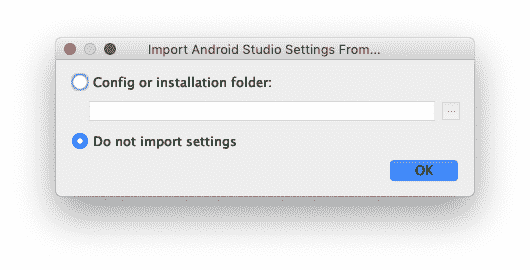
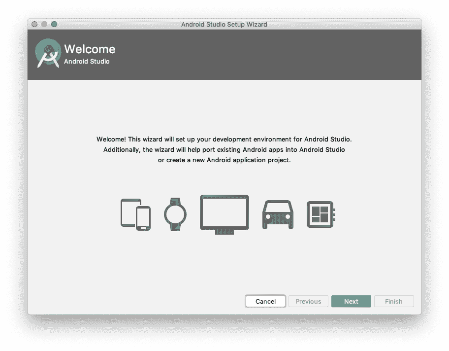
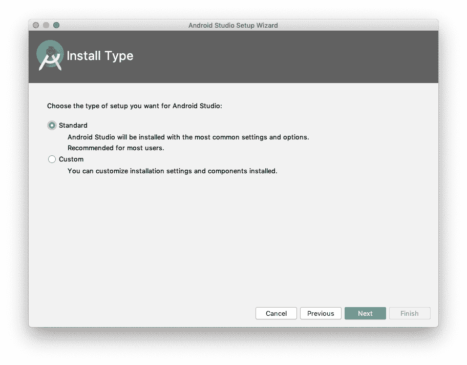
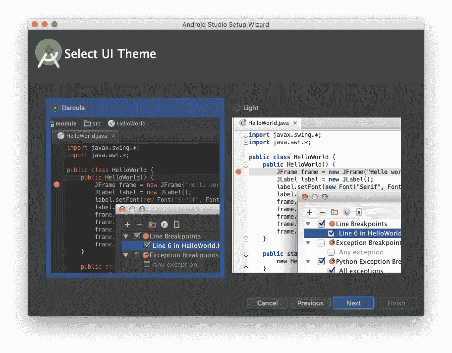
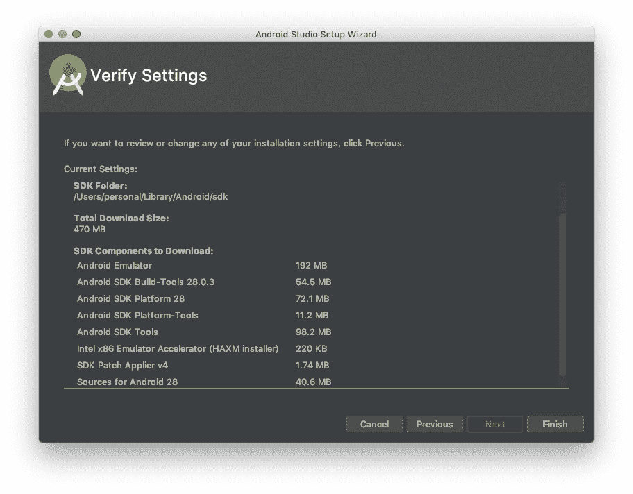
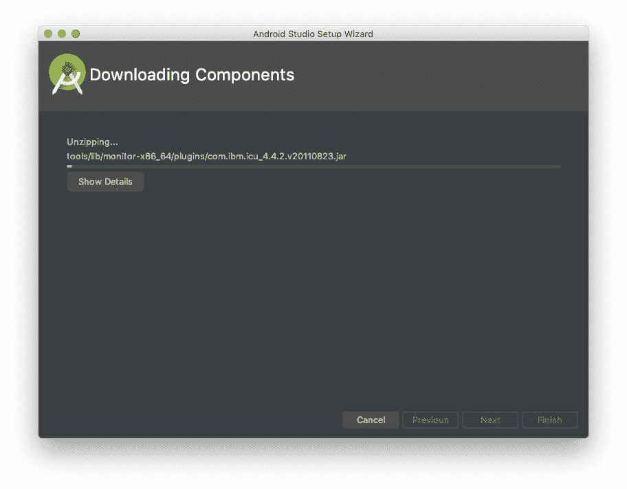

# 第十五章：欢迎和环境设置

# 比较原生开发和跨平台工具

让我们列出一些事实并得出一些初步的结论，以便清楚地理解。

当我们说“原生开发”时，我们指的是针对每个平台使用由平台维护者支持和推广的语言、框架和 IDE 进行编程。这些平台包括 Android 和 iOS。

对于 Android，维护者是 Google。我们使用“维护者”而不是“所有者”，因为它真的是开源的——事实上，亚马逊的 FireOS 是 Android OS 的一个分支。有时，我们用 AOSP 这个缩写来指代 Android 开源项目。编程语言是 Java、Kotlin 或者两者混合（Kotlin 生成 Java 字节码，在运行时没有区别）。你理论上可以用任何生成 Java 字节码的语言来创建 Android 应用——事实上，我们的一个朋友曾完全用 Scala 编写过 Android 应用。不过，在本书中我们只使用 Java 和 Kotlin。这个框架没有一个特定的名称，通常被称为“Android 框架”。

当我们说“原生开发”时，我们并不是指在*框架内部*看到的原生，这可能表明系统提供的功能，例如系统时钟（非常重要）、线程或文件系统实现等。我们也不是指 Android 原生开发工具包（也称为 Android NDK），它允许您从`Activity`或`Service`中调用用 C 或 C++编写的代码。

因此，既然我们已经明确了这一点，让我们来比较一些跨平台工具。有许多不同的产品可用于跨平台开发，但实际上只有少数几种方法。

## Web-Based

像 PhoneGap 这样的产品允许开发者使用 HTML、CSS 和 JavaScript 编写网页，这些网页在每个平台上都使用基于 Web 的视图组件进行渲染。我们发现，虽然从理论上讲这样做更简单，因为只有一个代码库，并且这些技术和语言都是众所周知和广泛支持的，但实际上很少能够仅用一个代码库解决问题——每个平台的特异性往往需要大量的条件逻辑处理。同时，跟进每个原生开发框架的更新或添加也可能会很困难。

## 其他

还有许多旨在简化跨平台开发的其他产品。Google 有一个名为 Flutter 的工具，使用 Dart 语言和其自己的内核从同一代码库创建 Android 和 iOS 应用程序，并且由于不依赖现有框架，能够以双倍于标准帧率的速度运行应用程序，从 60 帧到 120 帧每秒。在足够强大支持的设备上，滚动可以感觉几乎*物理*——就像你真的在平滑表面上拖动一张纸一样。Flutter 的缺点是几乎不可能真正拥有一个适用于两个平台的统一代码库——Android 用户期望不同的小部件、对输入的反应、过渡等等，与 iOS 用户相反。同样地，由于不利用设备上已有的 Android 或 Cocoa 安装，Flutter 应用程序所需的大小几乎总是会比本地开发的应用程序大得多。

另一种方法——这是 Facebook 率先采用的——是 React Native。React Native 使用 Facebook 的专有 JavaScript 版本从单一代码库中创建两个平台的应用程序。除了前面提到的一些缺点外，你将一个很大的部分控制权交给了一个完全不相关的第三方（Facebook）。如果 Facebook 想要开始透明地完全抓取开发者的指标，你几乎无能为力。我绝不是在暗示它这样做，或者将来会这样做；这只是跨平台工具所带来的一种可能不会立即显现的成本的一个极端例子。

有其他工具，作为作者，我们不想浪费时间，也不想浪费你的时间批评其他人做的真正了不起的工作来填补这个空白。我们只希望你理解我们为什么真诚地认为在每个平台上并行开发——使用每个平台的语言、框架和工具集等等——不仅能带来巨大的好处，而且在我们看来，并不会使成本、时间甚至关注的投入翻倍。正如我们在本书中所展示的，这两个平台之间确实有很多相似之处，使用各自的本地工具为每个平台编写单一应用程序并不需要像你可能想的那样繁琐的任务。

# 环境设置

为了与 Android 和 iOS 一起工作，我们首先需要设置好我们的环境。值得庆幸的是，没有什么能阻止在同一台机器上安装 Android Studio 和 Xcode。Android Studio 可以安装在多个平台上，但因为我们使用的是 Xcode，苹果的 iOS 开发 IDE，我们需要使用一台能够运行 macOS 的机器来使用 Xcode。让我们首先为 Android 开发设置好环境。

## Android 设置

在 Android 开发的这一阶段，我们几乎将所有过程迁移到了一个单一的集成开发环境：Android Studio。这是由 Google 支持和推荐的，Android 的维护者。从技术上讲，当然可以不使用 Android Studio，但那是一个相当高级的话题，可能只在非常特定的场景下使用，我们确实见过（这样做很混乱）。现在，让我们假设您将继续使用 Android Studio 开始工作。

看看如何开始。对于 Android，安装直接转入新项目创建，因此我们将整个过程组合为一组指令。

### 设置 Android Studio

一度，设置 Android 开发环境相当复杂且涉及多个组件。随着 Android Studio 的出现和成熟（Android 开发推荐的 IDE），这一切变得几乎是轻而易举的。它甚至自带了嵌入式 JDK（Java 开发工具包），因此只需一次下载和初始设置。

在撰写本文时，Android Studio 可以从 *[*https://developer.android.com/studio*](https://developer.android.com/studio)* 下载，但如果您是一个远在未来的读者，可以随意在网络上搜索“下载 Android Studio”，假设 URL 被机器人取代。

一旦下载了 Android Studio，立即启动它！我们将详细介绍从下载到首次运行的过程，此文撰写时为 2019 年夏季。未来这个序列可能会有所变化，但基本前提应该保持不变，并且通常提供不会直接影响开发的选项。如果您的屏幕显示与此步骤不符，请自行判断。

程序可能会要求您从先前的安装中导入设置；如果这是您首次安装，请跳过导入步骤，继续到 图 15-1。



###### 图 15-1\. 导入设置屏幕

现在应该启动 Android Studio 的初始化过程。观察加载进度条。完成后，您可能会看到欢迎屏幕，如 图 15-2 所示。



###### 图 15-2\. 欢迎屏幕

然后您可以选择安装类型，如 图 15-3 所示。



###### 图 15-3\. 安装类型

现在只需选择标准。稍后可以进行自定义设置。

可能会提示您为 IDE 选择浅色或深色主题，如 图 15-4 所示。



###### 图 15-4\. 选择主题

现在理想情况下，您只需验证之前的选择，如 图 15-5 所示。



###### 图 15-5\. 验证设置

如果满意，请点击“完成”，你将看到 Android Studio 联系各个服务器以更新其组件，如 图 15-6 所示。



###### 图 15-6\. 安装组件

要启用本书中使用的 Java 8 特性，请在你的模块级 `build.gradle` 文件中添加以下内容（Android 开发者文档中的代码块）：

```
android {
  compileOptions {
    sourceCompatibility JavaVersion.VERSION_1_8
    targetCompatibility JavaVersion.VERSION_1_8
  }
  // For Kotlin projects
  kotlinOptions {
    jvmTarget = "1.8"
  }
}
```

完成后，你将立即进入新项目流程。从这里开始，你将在创建下一个及后续项目时使用相同的流程，因此我们将在 第十六章 中深入探讨这个工作流程。

目前为止，你已经设置好了开发环境，准备好开始了！

## iOS 设置

Xcode 是由苹果创建和维护的开发环境，用于构建 iOS（和 macOS）应用程序、库和项目。它是一个非常功能齐全的应用程序，在不同形式中已经存在了很长时间。从 PowerPC 桌面到中期 Intel-based 处理器时代再到从 iPhone 发布开始的 ARM-based iOS 设备，Xcode 一直在那里；它伴随着 Objective-C 时代和 Swift 的早期阶段。它是一款令人惊叹的软件，会让你感到喜悦和沮丧。

安装 Xcode 是那些令人愉悦的时刻之一，感谢天地。

### 设置和安装 Xcode

要安装 Xcode，请打开默认安装在每台 macOS 机器上的 macOS App Store。搜索“Xcode”，一旦找到由苹果提供的正确应用程序，请点击“安装”将其安装到你的计算机上。

本书是基于 Xcode 11 和 Swift 5 编写的。Xcode 11 是在 2019 年 9 月发布的。总体而言，Xcode 在不同版本之间变化不大，所以如果你使用的是旧版或新版 Xcode，可能需要寻找一些命令的名称变化，但它们本质上仍然是相同的操作。

当你第一次打开 Xcode 时，系统会提示你安装额外的组件，这些组件会向你的环境添加命令行工具。我们强烈建议你安装这些工具，这样未来的生活会变得更加轻松。

### 苹果开发者账户

如果你愿意，你可以创建一个账户并支付 99 美元成为苹果开发者计划的一部分。不过，只有在你打算发布你的应用时才是必需的。如果你只是想练习构建应用程序，那么目前还不需要支付这笔费用。你可以连接你的开发设备到电脑上，仍然可以构建并安装你的应用。

# 我们学到了什么

在这个介绍性的章节中，我们涵盖了很多内容。我们了解到，我们相信真正的本地开发胜过跨平台应用的原因。开发共享代码所节省的时间往往会因为在解决不完整的供应商功能、为不同的用户界面行为编写分开的代码以及等待第三方库支持新平台功能的机会成本而丢失。

我们还花了一些时间设置每个环境并为开发做好准备。我们在我们的机器上安装了 Android Studio 和 Xcode。现在，看起来我们已经准备好开始构建我们的第一个应用了。但是首先，让我们先了解一下我们将在下一章中构建的内容。
