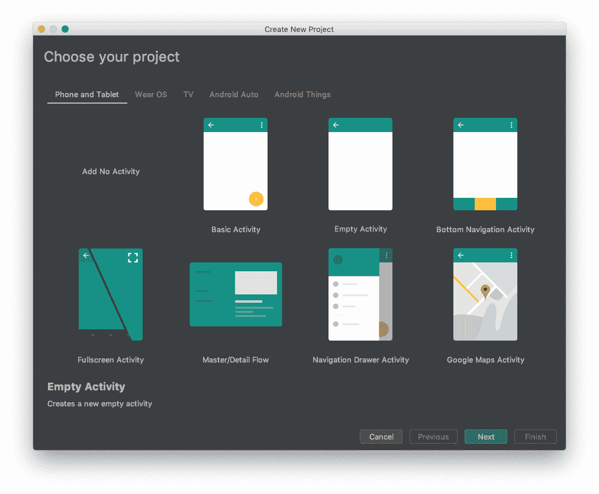
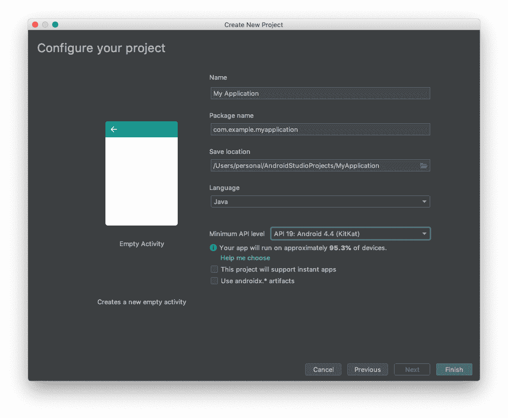
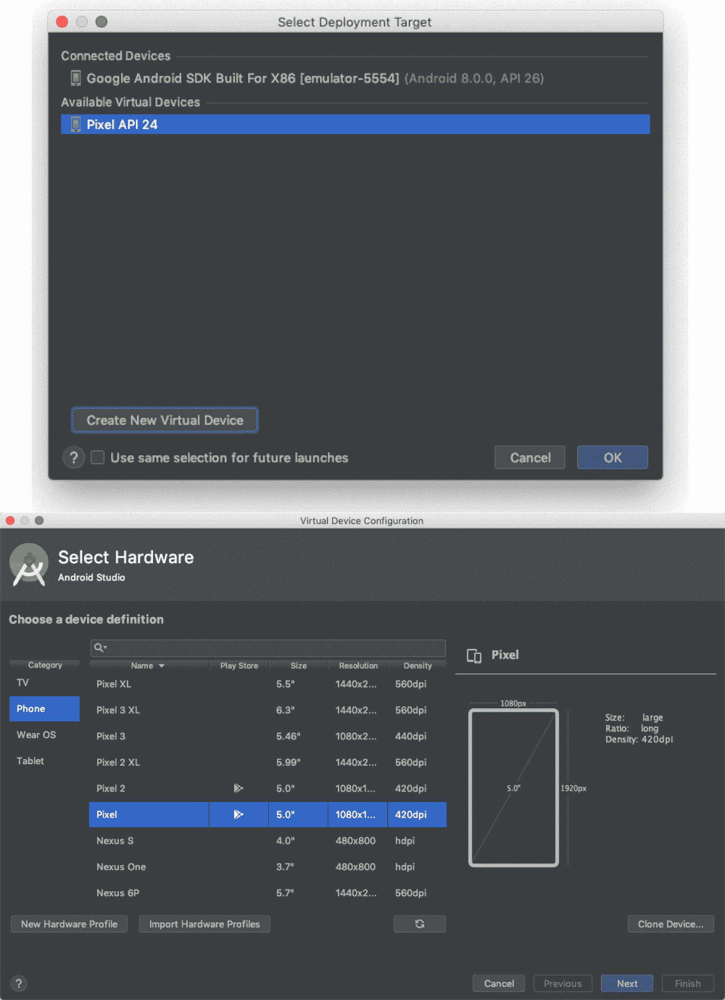
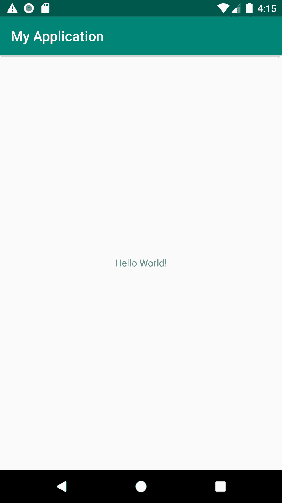
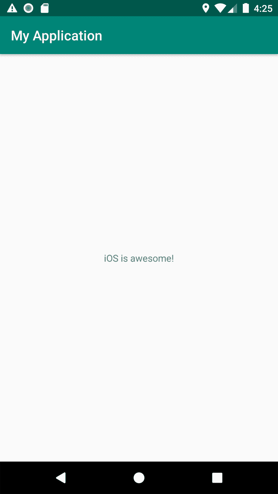
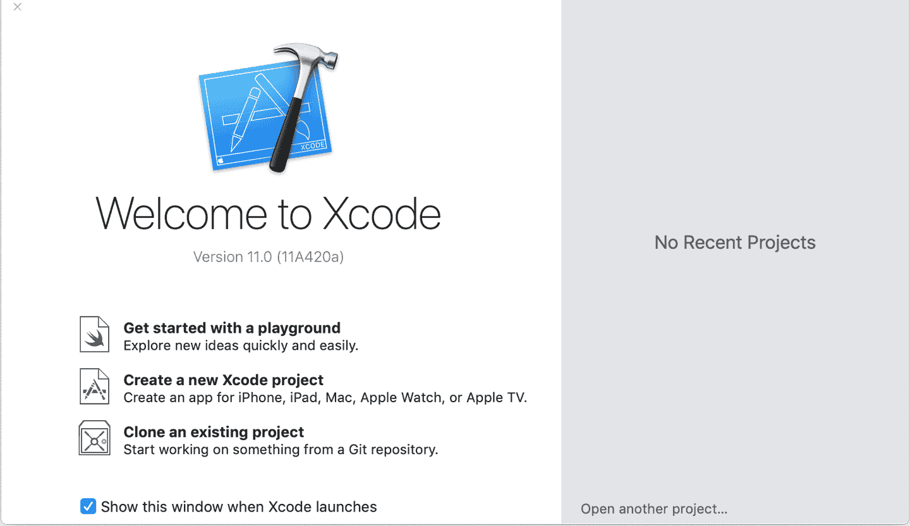
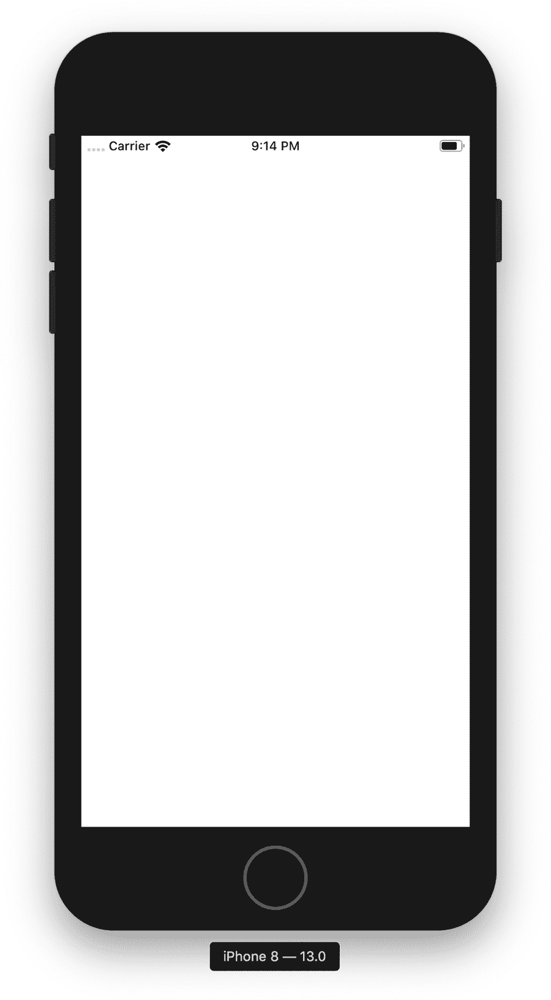
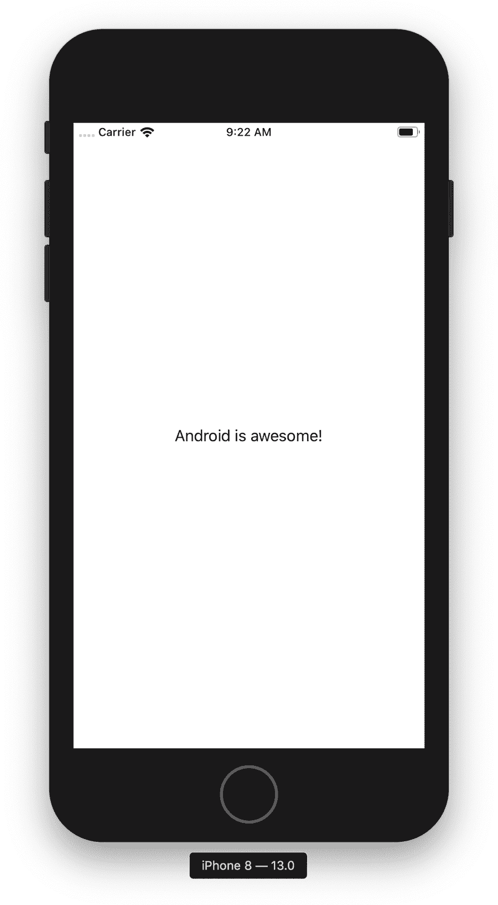
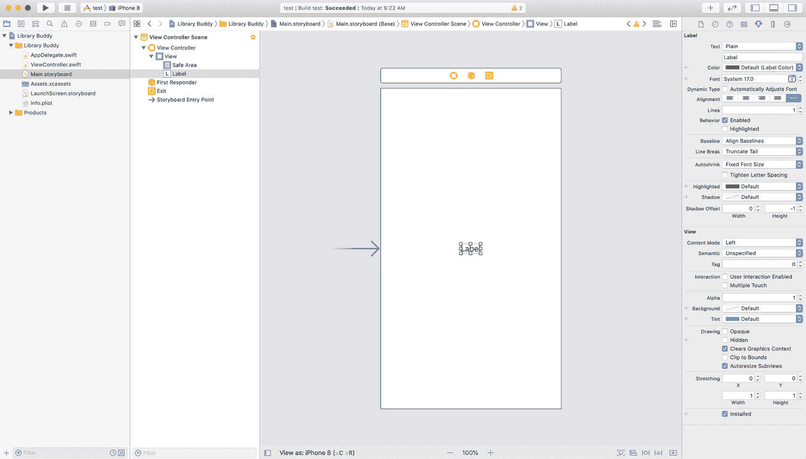

# 第十六章：构建一个应用程序

想象一下自己走进邓恩与刘易斯纪念图书馆宽阔而磨损的橡木门，以寻找知识。当你进入时，你会看到一个似乎没有尽头的木制书架大海，与亚历山大图书馆不相上下。你蹒跚地从一架架书架走向另一架书架，但不知道哪些书可供阅读，它们位于哪里。感到沮丧而孤独时，你正准备永远离开图书馆，这时一位老图书管理员示意你靠近。

图书管理员身上散发着古老书籍和红木的阴郁却熟悉的气味。你走近一些，但在你能走得更远之前，他指向墙上贴着的传单，预示着你的拯救：可以下载一个应用程序来帮助你找到所需的书籍。你漫游的日子结束了！

但是，这个应用程序在哪里？你无法下载它。你是说它还不存在？图书管理员低声喃喃道：“如果你建造它，他们将下载它”，然后消失在走廊的黑暗中。

我们将要构建这个应用程序。

现在，暂且忘记我们那位不祥和神奇的图书管理员，在第十五章中，我们向你展示了如何设置环境并创建可能的最简单、最基础的应用程序。但是，在现实中，应用程序要复杂得多。首先，它们通常不只是一个屏幕。为了真正学习一个平台，需要构建一个足够复杂的东西——超出基本的“Hello World”示例——以便你能够理解使用的技术的边界和细微差别。为了给我们提供足够复杂的东西来工作，我们将为邓恩与刘易斯纪念图书馆构建一个应用程序——是的，正是我们的图书管理员指引的同一个应用程序——帮助图书馆的读者找到他们需要的书籍。

在本章中我们将：

+   为我们的应用程序创建一个新项目。

+   给出我们正在构建的应用程序的简要概述。

+   添加一个简单的欢迎屏幕。

让我们在血月升起之前开始吧，否则我们的项目注定失败！

# 创建一个新项目

理想情况下，你已经设置好了你的环境。如果没有，请移步到第二部分的第一章，并花些时间准备好 Android 和 iOS 进行开发。一旦准备就绪，我们首先来看 Android。

## Android Studio

如果你不是直接从安装流程来到新项目流程，你可以通过选择 Android Studio 工具栏中的“文件”，然后选择“新建项目”来到这里。

Android Studio 将允许你从一些基本的项目模板中进行选择，比如基本活动或空活动，或者更高级的东西，如 Java 库（*.jar*，纯 Java）或 Android 库（*.aar*，Java 加资源和其他特定于 Android 的文件）。你可能稍后想尝试一些其他选项，但现在让我们选择空活动，如图 16-1 所示。

创建项目流程的第一步是配置您的项目。在这里，您将确定应用程序在磁盘上的位置、命名空间以及应用程序将支持的最低 API。这最后一点实际上非常重要。您可以随时查看各种[Android 版本的分布数据](https://oreil.ly/3h0X1)。



###### Figure 16-1\. 选择项目

在撰写本文时，看起来选择 OS 19，代号 KitKat，版本 4.4 是相当安全的选择。这覆盖了除了少数几个安装以外的所有情况。然而，如果您的应用程序可能面向更技术精通的用户或富裕国家，您可能想选择 OS 20，代号 Lollipop，版本 5.0。这将使您损失大约 7%的全球市场份额，但会使开发工作变得更加轻松。Android 5 在 Android 开发中迈出了重要一步，并且是许多现代 API 的分水岭。这是您的决定，但对于这个简单的项目，我们将选择 KitKat，如图 16-2 所示。



###### Figure 16-2\. 配置项目

就是这样了！从工具栏快捷方式运行您的项目（看起来像一个绿色的播放按钮）或按下 control/command + R 键或从“运行”中选择“运行应用程序”或从子菜单中选择“运行”。

首次进行此操作时，您需要连接设备或创建并启动模拟器，如图 16-3 所示。



###### Figure 16-3\. 创建模拟器并选择模拟器或设备

现在，您应该看到“Hello World！”打印到屏幕上，如图 16-4 所示。



###### Figure 16-4\. Hello World!

您还应该看到一个带有“我的应用程序”（或您在项目配置步骤中提供的应用程序）的工具栏。它是如何知道要显示“Hello World！”的？嗯，空白活动项目模板并不真正为空——如果您打开 *MainActivity.java*，您会看到对布局文件 *R.layout.activity_main* 的引用。在 *res/layout* 中找到该文件，或者在代码编辑器中直接按 control/command 键单击该行。您可能会看到一个 `ConstrainLayout`，其中包含一个 `TextView` 子元素。请注意 `TextView` 的 `android:text` 属性设置为字符串值“Hello World！”

让我们快速编辑一下。将`TextView`的文本值改为“iOS 真棒！”“iOS？！”你惊呼——是的，iOS……让我们把整个竞争无意义的事情放在一边。这两个平台都非常出色。也许您更喜欢其中一个平台的某个功能或语法转折，但让我们面对现实——两者都能出色地帮助我们表达我们的想法。

无论如何，再次运行您的应用程序。现在，您应该看到一些略有不同的东西，如图 16-5 所示。



###### Figure 16-5\. iOS 真棒！

就这样！您已经下载并安装了 Android Studio，创建了一个基本的应用程序，并更改了一些视觉值。虽然这只是一个非常基本的示例，但不用担心——在接下来的几章中，我们将带您逐步完成使用本书第一部分中所有任务创建一个功能齐全的应用程序。

## Xcode

在 Xcode 中设置 iOS 项目的过程类似于 Android Studio，但是需要遵循更多的软件向导流程。要开始，请转到“应用程序”并双击“Xcode”应用程序以启动 Xcode。当 Xcode 启动时，您将看到一个类似于 图 16-6 的屏幕。



###### 图 16-6\. Xcode 启动画面

单击“创建新的 Xcode 项目”按钮以启动您的项目。将打开一个新的 Xcode 窗口，并显示一个模板列表，为项目提供一些视图和样板代码，以便快速启动。有许多选项可用于构建应用程序和库，但我们将专注于可用的应用程序选项。我们的特定项目将具有多个屏幕，但现在我们将使用“单视图应用”作为一种快速启动和减少开销的方式。选择该选项并在模板选择器中点击“下一步”。

###### 提示

如果您未看到 Xcode 启动画面，请不要担心！转到菜单栏，选择“文件” > “新建” > “项目”来开始。

接下来，我们有多种选项可用于启动项目。这些选项中大多数都可以使用默认设置。稍后我们可以在屏幕上更改所有内容，但提前设置一些选项是有帮助的。我们应该首先填写的选项是产品名称。这是 iOS 在内部使用的应用程序名称的一部分，与组织标识符一起。默认情况下，它也是在设备启动屏幕上应用程序图标下显示给用户的名称。让我们将我们的应用程序命名为“图书馆小伙伴”。

组织标识符字段通常是公司或组织（或个人！）的反向域样式标识符。随意使用您喜欢的标识符，但出于本书的目的，我们将使用“com.oreilly”作为我们的标识符。

确保选择的语言是 Swift，并且未选中 Core Data 或单元和 UI 测试的任何复选标记。点击“下一步”继续。选择要放置项目的文件位置，并点击“创建”按钮创建项目。项目创建完成后，您将看到项目在 Xcode 窗口中打开，并且项目文件显示在左侧。

点击项目窗口左上角的“构建和运行”按钮（看起来像一个播放按钮）。这将构建项目，在 iOS 模拟器上打开并运行应用程序。当项目构建并运行时，您应该看到类似于图 16-7 在桌面上的 iOS 设备内运行的内容。

###### 警告

如果在之前描述的“构建和运行”按钮附近的下拉菜单中默认没有选择 iOS 模拟器，则需要使用它来进行选择。如果没有列出任何模拟器，请前往菜单栏，选择“窗口” > “设备与模拟器”，以打开设备组织器。在窗口顶部选择“模拟器”，然后单击屏幕左下角的“+”按钮以添加一个新的模拟器用于开发。



###### 图 16-7\. 在 Xcode 中 iOS 模拟器中运行的“单视图应用程序”

为了与我们的 Android 示例公平对待，并展示不对任何一个平台有偏见或偏好，让我们继续为我们应用程序的屏幕添加一个赞扬 Android 的标签。在文件列表中，点击 Main.storyboard，在窗口右上角点击“+”按钮，然后将一个标签对象拖动到空白的白色画布上。双击标签以更改文本为“Android 很棒！”将标签拖动到视图中心，并像之前一样构建和运行应用程序，您将看到一个类似于图 16-8 的屏幕。



###### 图 16-8\. Android 很棒！

好的，我们已经创建了我们的项目，并且（理想情况下）可以在 iOS 模拟器上构建和运行。在我们进一步之前，让我们谈谈我们要构建的内容。

# 应用架构

在不深入细节的情况下，接下来几章中我们正在构建的应用程序将具有多个独特的屏幕，显示不同类型的数据。每当应用程序启动时，我们将有一个欢迎屏幕，以及三个按钮。这三个按钮将带您进入应用程序的不同部分：所有可用书籍的列表；用户保存的所有书籍的列表；以及一个搜索屏幕，用户可以在其中搜索特定的标题或作者。

从这些屏幕中，我们还将构建一个单独的可重复使用的屏幕，每个屏幕都将使用它来列出关于特定书籍的所有信息。

Android 和 iOS 的好处之一是，您在如何构建应用程序结构方面并不被限制于特定选择。有许多可用的选项，但两个平台似乎更倾向于 MVC 或 MVVM 风格的应用程序开发。因此，我们将采用这种方法来构建我们的应用程序。

### 模型-视图-控制器

模型-视图-控制器（MVC）可以说是应用程序开发中最常见的方法。基本上，它是一种指导构成应用程序的对象代码结构的架构模式。MVC 中的“模型”是应用程序需要的数据的表示。这可以是持久化数据（例如稍后保存的书籍）或从网络请求接收到的瞬时数据。该数据与应用程序包含的视图之间存在分离；控制器是促进数据模型和视图之间通信的对象。

通常，控制器负责从数据库或网络资源获取数据，并将该数据传递给视图或视图模型以供显示。还有一些特殊的控制器负责直接显示视图。在 Android 中，这些是`Activity`对象，在 iOS 中，它们是`UIViewController`。

MVC 架构的主要目标是利用和尊重对象中的固有边界，以防止对象之间的紧耦合。这样做可以更容易进行维护，并提供了一种明确定义、直观的编码方式。

以 MVC 架构为基础，让我们看看如何创建用户打开应用时看到的第一个屏幕：欢迎屏幕。

# 构建我们的第一个屏幕

如果您还记得我们之前的示例，Android 模拟器和 iOS 模拟器中的应用程序屏幕非常基础，没有任何设计或数据。我们应该解决这个问题。

###### 注意

请注意，无论是 Android 还是 iOS 都使用“启动屏幕”的概念。这是在应用程序本身执行设置操作时显示的静态图像。请注意，除了可绘制对象外，几乎无法对其进行装饰，像交互式 UI 元素或网络请求这样的东西要么不可能，要么不建议。

## Android

在 Android 框架中，启动屏幕发生在应用初始化期间，并且仅显示 XML drawable。这意味着没有逻辑，甚至没有`Drawable`类的实例可用（尽管在 API 26 之后，允许使用自定义 XML drawable，它可以引用回`Drawable`子类）。还要注意，此过程发生得非常早，因此框架无法访问许多我们通常利用的值，如 API 版本，因此尝试为不同版本提供不同的 drawable 文件将失败。我们将在下一节详细介绍如何设置这一点。

### 启动屏幕

在 Android 框架中，应用初始化时显示的启动屏幕与主题的窗口背景完全相同。这可以是任何`Drawable`实例，这意味着它可以是一组在单个实例中分组的绘图操作。在我们的示例中，让我们使用黑色背景并居中我们的 logo，使用`layer-list` XML `Drawable`。我们将文件命名为*launch_drawable.xml*并保存在*res/drawable*中：

```
<?xml version="1.0" encoding="utf-8"?>
<layer-list xmlns:android="http://schemas.android.com/apk/res/android">
  <item>
    <color android:color="#FF000000" />
  </item>
  <item>
    <bitmap
        android:gravity="center"
        android:src="@drawable/dlml_logo"
        android:tileMode="disabled" />
  </item>
</layer-list>
```

您会注意到有一个编译的位图资源的引用。在您最喜欢的照片编辑软件中，生成应用程序名称的某些风格化版本、库名称、可能是符号表示或只是首字母缩写——无论如何，由您决定。与 Android 中的所有编译资源一样，文件名必须全部小写，单词用下划线分隔，只能是字母数字字符：a-z 和 0-9。让我们将图像文件命名为*dlml_logo.xml*并保存在我们的*res/drawable*目录中。系统将使此成为全局`R`类的常量值，格式如下：`R.{resource_tye}.{file_name_minus_ext}`，因此在这种情况下，`R.drawable.dlml_logo`将是我们标志的位图资源的整数标识符。

如果你愿意，你可以创建一个双倍大小的图像，并将其添加到*/res/drawable/xhdpi*目录中。关于特定密度图像的详细信息，请参阅前面的注释。

离开一般资源并回到我们主题实现的检查，让我们在值文件中（让我们使用 Android Studio 应该已经为您创建的*res/values/styles.xml*文件）用我们自己的简单主题替换项目默认主题：

```
<?xml version="1.0" encoding="utf-8"?>
<style name="DlmlTheme" parent="Theme.AppCompat.Light.NoActionBar">
  <item name="android:windowBackground">@drawable/launch_drawable</item>
</style>
```

显然，我们可以而且可能应该设置许多其他特定于主题的值，如颜色、操作栏和协调布局支持等，但是出于本示例的目的，我们将保持简单。

要将此主题注册到您的应用程序中，您将使用应用程序的清单文件*AndroidManifest.xml*。配置应用程序时，您将多次使用此清单文件，但我们一次只做一步。现在，让我们只是注册我们的主题：

```
<?xml version="1.0" encoding="utf-8"?>
<manifest package="com.dlml"
          xmlns:android="http://schemas.android.com/apk/res/android"
          xmlns:tools="http://schemas.android.com/tools">

  <application
      android:icon="@mipmap/ic_launcher"
      android:label="@string/app_name"
      android:roundIcon="@mipmap/ic_launcher_round"
      android:supportsRtl="true"
      android:theme="@style/DlmlTheme" />

</manifest>
```

就这样！现在，在用户可以交互之前，当你的应用启动时，他们将看到我们在*launch_drawable.xml*中提供的可绘制内容。一开始，当您的应用程序还很年轻、无辜和轻便时，这可能只会短暂闪现，或者启动可能如此快速，用户根本看不到它，但随着添加更多活动、权限、资产、资源、外部库和构建配置，初始化时间将会增加，因此让用户知道正在启动哪个应用程序并且他们不仅仅是卡住了，而是正在手工打造独特的体验通常是一个好主意。

## iOS

在您在 Android 上添加屏幕之后，您会发现在 iOS 上并不完全不同。我们将从 Xcode 的 Storyboard 编辑器开始。在屏幕左侧的项目导航器中点击我们应用程序的主 Storyboard，*Main.storyboard*。这将打开 Storyboard 编辑器。

###### 提示

还有*LaunchScreen.storyboard*。这是用于在应用程序启动时呈现设计，但在其激活之前。

故事板是一种格式，用于在 Xcode 项目中组织视图（称为“场景”）及其之间的过渡。它们可以并且应该包含多个通过转场连接的场景，以及场景本身的简单视图，如按钮、标签等。故事板甚至可以链接到其他故事板！

当我们打开*Main.storyboard*时，您应该在左侧的文档大纲中看到一个名为“View Controller Scene”的场景。这个场景是我们在之前创建的单视图应用程序的样板代码中自动创建的。我们可以重用这个场景并重新命名它，但我们将创建一个新的场景。

首先，点击库按钮，即项目窗口右上角最左边的按钮。这将打开一个浮动窗口，您可以在其中将视图和组件拖放到故事板编辑器中。向下滚动，直到在结果列表中找到“View Controller”对象，或者如下所示搜索“view controller”。

接下来，从窗口中将“View Controller”对象拖动到故事板编辑器画布上。将新的视图控制器场景放置在画布上任意位置。此外，您还可以双击“View Controller”对象，画布中将放置一个新的场景。

现在，让我们向这个视图添加一些文本。我们可以再次使用库窗口，找到标签对象。将标签拖动到我们的新视图控制器场景中。当你悬停在场景上时，它会变成蓝色高亮，表示这是标签将嵌入的场景。一旦你在正确的场景上，释放标签，它将出现在屏幕上被选中。你还会注意到它显示在编辑器左侧的新场景文档大纲中。

让我们更改标签的文本以显示其他内容。在故事板编辑器中，右侧有许多检查器可以切换。这些检查器根据所选对象改变上下文。仍然选择标签，或者点击它来选择它，点击属性检查器图标，即最左边的第四个按钮。您应该看到一个类似于图 16-9 所示的屏幕。



###### 图 16-9\. Xcode 中的属性检查器

属性检查器——以及随后的大小和连接检查器——是 Xcode 中完成视图本身大部分配置的地方。在名为“标签”的子部分中，您可以看到与我们添加到场景中的标签对象设置对应的许多选项。有一个文本字段，其值设为“标签”。更改该值将更改标签当前显示的文本。让我们将其更新为“欢迎”。如果需要，我们还可以在此检查器中更改标签的外观或字体。

一旦您对标签的外观感到满意，您可以通过点击项目窗口顶部附近的“构建和运行”按钮来构建和运行应用程序，就像我们在本章早些时候所做的那样。然而，这不会让您有多远。在应用程序的角度来看，没有任何变化，部分原因是由于指向项目模板中包含的原始视图控制器场景左侧的巨大箭头。该箭头表示这是从 Storyboard 中显示的初始视图控制器。

更改这个操作就像选中一个复选框一样简单。

选择我们的新视图控制器场景，而不是其中的个别视图，可以通过直接点击屏幕左侧的文档大纲中的场景，或者点击模拟手机屏幕上方的白色矩形来实现。如果属性检查器未激活，请在选择视图控制器场景后再次点击它。在“视图控制器”子部分下，有一个名为“是否初始视图控制器”的复选框应取消选中状态。选中此复选框后，巨大的、神奇的箭头应该会移到您的新视图控制器旁边。

让我们构建和运行应用程序，看看会发生什么。

您应该在模拟器中看到应用程序已启动并使用我们的新场景作为显示的默认场景。万岁！

不过，还不要太快庆祝。

尽管我们已经向我们的应用程序添加了一个新屏幕，但我们可能希望拥有比仅显示静态屏幕更多的功能。实际上，我们可能想要在代码中更改和引用屏幕上的一些视图，使它们变得更加动态。我们一直在使用 Storyboard 编辑器来创建我们的视图。现在让我们来看看在 iOS 中显示视图的另一面：视图控制器。

### 添加一个视图控制器

要在 Xcode 中创建一个新的视图控制器，用于控制我们的欢迎场景，我们需要添加一个新文件。为此，请在 Xcode 屏幕左下角点击“+”按钮，然后选择“新建文件…”或者在菜单栏中选择“文件” > “新建” > “文件”。点击任一选项都会弹出同一个模态窗口，以选择要添加到我们项目中的文件类型。

对于几乎任何代码文件，我们可以选择 Swift 文件作为空的 Swift 文件，但对于我们正在创建的这种特定类型的对象文件，请选择 Cocoa Touch Class，因为视图控制器是 Cocoa Touch 的一部分——这是驱动 iOS 的框架——然后点击“下一步”。

在这个屏幕中，将子类设置为 `UIViewController`，名称设置为 `WelcomeViewController`。确保“同时创建 XIB 文件”未被选中，并且语言设置为 Swift，然后点击“下一步”和“创建”按钮以使用默认位置。现在你应该能看到在项目导航器左侧屏幕上添加了一个名为 *WelcomeViewController.swift* 的新文件。

###### 提示

有一个命名约定，即将视图控制器命名为 `ViewController` 后缀。这是标准做法，并鼓励使用此方式，而不是像 `WelcomeController` 或 `WelcomeScene` 这样命名您的视图控制器以符合约定。

此文件包含一些看起来像这样的样板代码：

```
import UIKit

class WelcomeViewController: UIViewController {

    override func viewDidLoad() {
        super.viewDidLoad()

        // Do any additional setup after loading the view.
    }

    /*
 // MARK: - Navigation

 // In a storyboard-based application, you will often want to do a
 // little preparation before navigation
 override func prepare(for segue: UIStoryboardSegue, sender: Any?) {
 // Get the new view controller using segue.destination
 // Pass the selected object to the new view controller
 }
 */

}
```

此时这个文件还相当空，目前只声明了一个名为 `WelcomeViewController` 的对象，它继承自 `UIViewController`。如果你还记得本章早些时候的内容，`UIViewController` 是视图控制器继承的基类；它类似于前面 Android 部分中的 `Activity`，但不完全相同。

现在我们已经创建了我们的视图控制器，让我们将其连接到之前的视图控制器场景。

通过点击 Xcode 左侧项目导航器中的 *Main.storyboard*，返回到我们的 storyboard 编辑器。一旦你在编辑器内部，点击我们的新视图控制器场景，即我们之前设置为应用程序初始视图控制器的场景，以在编辑器中选择它。点击屏幕右侧第三个按钮，显示身份检查器。在“自定义类”子部分下，有一个名为“类”的字段，当前显示为灰色的 `UIViewController`。这是拥有此视图的对象的类或类型。将此字段设置为 `WelcomeViewController`。

你可能注意到的第一件事是，在左侧的文档大纲中，我们场景的名称已更改。之前它读作“View Controller Scene”，现在它读作“Welcome View Controller Scene”。让我们继续删除项目模板中附带的原始视图控制器场景，方法是点击文档大纲中的场景标题，然后点击删除按钮。

### 我们视图的 outlet

记住我们之前提到过，我们想要能够从视图控制器内部控制视图吗？现在我们将使用 outlet 来实现这一点。

Outlet 是将特定视图绑定到视图控制器的一种方式。然后，通过代码可以配置和传递此视图的引用。因此，最好从这里开始。返回到我们的 *WelcomeViewController.swift* 文件。让我们首先删除注释掉的样板代码，以便得到一个看起来像这样的类：

```
import UIKit

class WelcomeViewController: UIViewController {

    override func viewDidLoad() {
        super.viewDidLoad()

        // Do any additional setup after loading the view
    }
}
```

在 `class` 声明的下方，添加以下行：

```
@IBOutlet weak var headerLabel: UILabel!
```

这将在类中创建一个名为`headerLabel`的属性，其类型为`UILabel`，这恰好是我们视图控制器场景中标签的对象类型。现在，让我们让我们的欢迎视图控制器在场景加载时更改标签的颜色，方法是在我们已经存在的`viewDidLoad()`方法的末尾添加以下行：

```
headerLabel.textColor = .red
```

这将在视图加载后将标签的`textColor`属性设置为红色。整个*WelcomeViewController.swift*文件现在应该如下所示：

```
import UIKit

class WelcomeViewController: UIViewController {
    @IBOutlet weak var headerLabel: UILabel!

    override func viewDidLoad() {
        super.viewDidLoad()
        headerLabel.textColor = .red
    }
}
```

我们向我们的视图控制器类添加了一个输出，但是现在构建和运行应用程序不会改变任何东西。我们离成功如此之近！我们还需要在我们的 Storyboard 中连接欢迎标签。

### 连接一切

返回到 Storyboard 编辑器。按住 Control 键并在场景上方的浮动矩形中按住鼠标按钮或触控板按钮，覆盖黄色的“Welcome View Controller”图标。将鼠标光标拖动到我们创建的 welcome 标签上，两者之间应该出现一条连接两者的蓝线。释放鼠标按钮，会出现一个标有 Outlets 的浮动窗口；我们在`WelcomeViewController`上创建的`headerLabel`属性应该被列出。点击`headerLabel`，窗口应该消失。

在屏幕右侧的连接检查器中，您可以确认`headerLabel`现在已经连接到我们场景中的`Header Label`。

通过点击项目窗口左上角的“Build and Run”按钮来构建和运行应用程序，现在你应该可以在模拟器屏幕上看到一个显示单词“Welcome”的红色文本标签。

# 我们学到了什么

让我们谈谈你在这一章学到了什么。

首先，我们学习了如何在 Android Studio 和 Xcode 中创建一个新项目。接下来，我们简要介绍了模型-视图-控制器（MVC）架构模式。我们还讨论了我们正在构建的应用程序的概述。最后，我们步骤步骤地学习了如何向我们正在构建的图书馆应用程序添加一个新的屏幕——在我们的案例中是一个简单的欢迎屏幕。我们还学习了如何创建视图的视觉组件，并且如何在代码中连接并操作它。

哇。这是一章很长，我们刚刚开始建立一些有用的东西。让我们在下一章深入探讨我们的应用程序，并学习如何在应用程序中显示一些数据列表，并向我们的应用程序添加更多的样式！
