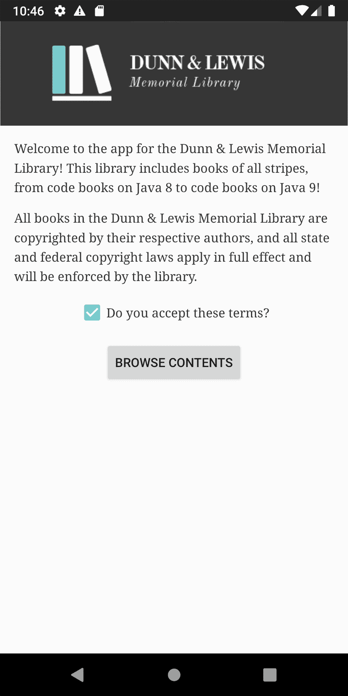
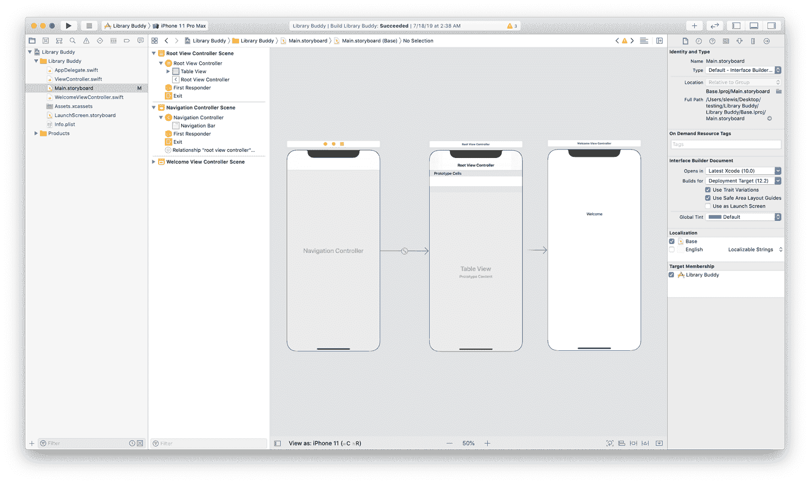
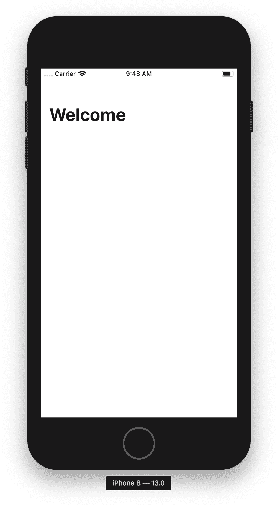
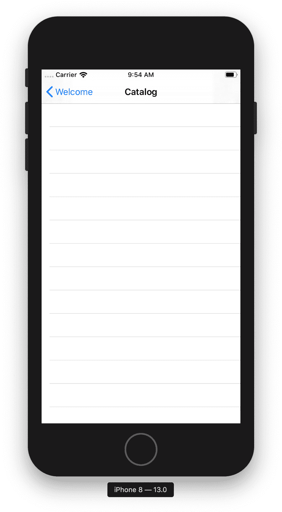

# 第十七章：在应用程序中列出数据

在上一章中，我们讲解了在 Android Studio 和 Xcode 中启动新项目的基础知识。我们还接到一个神秘图书管理员的委托，建立一个可能具有魔力的图书馆的应用程序。这只是移动应用程序开发人员生活中的一个典型日子。

在本章中，我们将为我们的应用程序添加一些更多的结构和支架。更具体地说，我们将学习：

+   如何自定义和调整视图

+   如何从按钮触发操作

+   如何显示数据列表

+   如何在两个屏幕之间进行过渡

这是一个很长的章节，让我们开始吧。我们未来的图书馆用户正在等待。

# 美化视图

如果你看看当前状态下的 Android 和 iOS 应用程序，它们都相当基本和不邀人入目。我们可以做得比一个只显示“欢迎”的基本标签在空白背景上更好。事实上，这两个平台都有一套相当强大的内置工具，用于样式化我们的应用程序，使其更具展示性和吸引力。我们不打算深入探讨这些工具——工具非常深入，你可以用它们创造的可能性几乎无限——但现在至少让我们稍微美化一下这些应用程序。

## Android

回顾第十五章，当我们选择项目类型并能够更新文本时，我们从一个简单的`Activity`开始。让我们使用相同的`Activity`和 XML 布局来更新我们的欢迎界面。对于这个简单版本，我们不会使用任何形式的登录或认证，因此我们的欢迎界面可能只有一个标志，一小段介绍库的文本，以及可能的接受条款标签和复选框。让我们还在屏幕底部包括一个按钮，用于浏览库的语料库，该按钮在勾选接受条款复选框之前将被禁用。一旦启用，点击此按钮将启动我们的一个主要 UI 控制器之一，暂时命名为`BrowseLibraryActivity`。

还要记住，我们无法确定某位用户在设备上运行我们的应用程序时屏幕的大小，无论是来自 2010 年的设备还是 2024 年的设备。我们也不能确定屏幕的方向（横向或纵向），如果我们遵循无障碍建议，甚至我们的字体大小也可能因用户或设备设置而大幅变化。总之，我们需要所有内容都可以滚动，以确保用户可以阅读我们呈现的所有信息，并选择（或不选择）我们设定的条款，并能够点击浏览按钮开始浏览我们的虚拟书库。

让我们确认一些事实。在 Android 中，像字符串和可绘制资源这样的资源通常以系统生成的整数标识的 XML 结构中保存，就像我们在创建和引用我们的标志图像时早些时候描述的那样。继续阅读获取更多细节。

### 添加字符串和可绘制资源

因此，我们需要几段复制内容：一个关于应用程序和库的介绍，用户数字同意的版权材料，以及按钮标签。您会记得，我们通过将其放置在适当的资源目录中，创建了我们的 logo 文件并注册到系统。对于字符串值，我们将需要不同的资源类型：`values`。传统格式为*/res/values/strings.xml*，每个字符串都是一个带有`name`属性的`string`节点，在编译期间用于标识它；字符串值是节点的文本内容。

对于 *strings.xml*，让我们添加一些节点来表示我们的复制：

```
<?xml version="1.0" encoding="utf-8"?>
<resources>
  <string name="app_name">DunnAndLewisMemorial</string>
  <string name="introduction">Welcome to the app for the Dunn &amp;
    Lewis Memorial Library! This library includes books of all
    stripes, from code books on Java 8 to code books on Java 9!
    </string>
  <string name="terms">All books in the Dunn &amp; Lewis Memorial
    Library are copyrighted by their respective authors, and all
    state and federal copyright laws apply in full effect
    and will be enforced by the library.</string>
  <string name="terms_accept_label">Do you accept these terms?</string>
  <string name="browse_button_label">Browser</string>
</resources>
```

好了。现在我们不仅拥有我们的 logo 位图作为已编译资源，还有我们欢迎屏幕的所有复制内容。

让我们为这个`Activity`创建一个新的布局文件：

```
<?xml version="1.0" encoding="utf-8"?>
<ScrollView
    xmlns:android="http://schemas.android.com/apk/res/android"
    android:layout_width="match_parent"
    android:layout_height="match_parent"
    android:background="@android:color/white">

  <LinearLayout
      android:layout_width="match_parent"
      android:layout_height="wrap_content"
      android:orientation="vertical">

    <ImageView
        android:id="@+id/logo"
        android:layout_width="match_parent"
        android:layout_height="wrap_content"
        android:adjustViewBounds="true"
        android:src="@drawable/dlml_logo" />

    <TextView
        android:layout_width="match_parent"
        android:layout_height="wrap_content"
        android:text="@string/introduction" />

    <TextView
        android:layout_width="match_parent"
        android:layout_height="wrap_content"
        android:text="@string/terms" />

    <CheckBox
        android:id="@+id/terms_checkbox"
        android:layout_width="wrap_content"
        android:layout_height="wrap_content"
        android:text="@string/terms_accept_label" />

    <Button
        android:id="@+id/browse_button"
        android:layout_width="wrap_content"
        android:layout_height="wrap_content"
        android:enabled="false"
        android:text="@string/browse_button_label" />

  </LinearLayout>

</ScrollView>
```

那这是怎么回事呢？

让我们一步步来看：

1.  我们布局的根节点是一个`ScrollView`，默认情况下垂直滚动内容，根据需要。在大多数屏幕上，这么少的内容可能根本不需要滚动，但在小屏幕或低密度屏幕上，在具有显著文本放大设置的设备上，甚至在标准设备的横向模式下，这可能起作用。重要的是，所有交互式 UI 元素，甚至只是为用户提供关键信息的元素，都可以以某种方式达到，传统用户体验通过滚动来实现。

1.  我们知道，所有其余的组件都将垂直堆叠，每个后续元素都位于上一个元素的正下方。这是几乎每个现代 UI 引擎中的传统流程，从传统的 HTML 网页，到 PDF 文档，到像 Pages 或 MS Word，Markdown，AsciiDoc(tor)，troff，(La)TeX 等编辑器创建的文档。框架提供的`LinearLayout`正是这样做的。请注意，`LinearLayout`的默认方向是水平的，因此每个元素都放置在前面元素的右侧；我们必须将`orientation`属性设置为`vertical`的值，以获取我们想要的堆叠界面。

1.  接下来是我们的 logo。我们希望这个图像填充页面的宽度，但在垂直方向保持纵横比；因此，我们使用以下布局属性：

    ```
    android:layout_width="match_parent"
    android:layout_height="wrap_content"
    ```

1.  一个简单的文本块，描述应用程序和库。

1.  另一个文本块，这次提供一些最小的法律术语来保护我们作者的版权。

1.  带有标签的`CheckBox`实例。当这个`CheckBox`未被选中时，我们将提供逻辑，以使其后的按钮保持禁用状态。

1.  一个简单的`Button`实例，当启用并点击时，将带用户到一个屏幕，让他们开始探索库。

就这样！由于我们的`MainActivity`已经调用了`setContentView`并传入了此布局文件的已编译标识符，因此初始欢迎屏幕现在将显示描述的 UI 元素，而不是之前简单的“Hello World!”。

由于前面的示例布局明确是裸骨的，只是为了演示您绝对需要显示 UI，让我们添加一些围绕空白和元素重力的简短说明来稍作装饰：

```
<?xml version="1.0" encoding="utf-8"?>
<ScrollView
    xmlns:android="http://schemas.android.com/apk/res/android"
    android:layout_width="match_parent"
    android:layout_height="match_parent">

  <LinearLayout
      android:layout_width="match_parent"
      android:layout_height="wrap_content"
      android:orientation="vertical">

    <ImageView
        android:id="@+id/logo"
        android:layout_width="match_parent"
        android:layout_height="wrap_content"
        android:layout_gravity="center|top"
        android:layout_marginBottom="16dp"
        android:adjustViewBounds="true"
        android:src="@drawable/dlml_logo" />

    <TextView
        android:layout_width="match_parent"
        android:layout_height="wrap_content"
        android:layout_marginBottom="16dp"
        android:layout_marginEnd="16dp"
        android:layout_marginStart="16dp"
        android:fontFamily="serif"
        android:lineSpacingMultiplier="1.3"
        android:text="@string/introduction"
        android:textColor="@color/colorPrimary"
        android:textSize="14sp" />

    <TextView
        android:layout_width="match_parent"
        android:layout_height="wrap_content"
        android:layout_marginBottom="16dp"
        android:layout_marginEnd="16dp"
        android:layout_marginStart="16dp"
        android:fontFamily="serif"
        android:lineSpacingMultiplier="1.3"
        android:text="@string/terms"
        android:textColor="@color/colorPrimary"
        android:textSize="14sp" />

    <CheckBox
        android:id="@+id/terms_checkbox"
        android:layout_width="wrap_content"
        android:layout_height="wrap_content"
        android:layout_gravity="center"
        android:layout_marginBottom="16dp"
        android:layout_marginEnd="16dp"
        android:layout_marginStart="16dp"
        android:fontFamily="serif"
        android:lineSpacingMultiplier="1.3"
        android:text="@string/terms_accept_label"
        android:textColor="@color/colorPrimary"
        android:textSize="14sp" />

    <Button
        android:id="@+id/browse_button"
        android:layout_width="wrap_content"
        android:layout_height="wrap_content"
        android:layout_gravity="center"
        android:enabled="false"
        android:text="@string/browse_button_label" />

  </LinearLayout>

</ScrollView>
```

除了添加边距、字体规格和重力之外，您还可以注意到我们向代表 logo 的`ImageView`添加了属性`adjustViewBounds`。虽然您可以看到我们目前并没有对`View`进行广泛的操作，但我觉得这个属性值得一个快速的跳转，因为它经常出现，并且即使是经验丰富的开发人员在处理时也会感到困惑，因为其行为与我们的布局或绘图框架相比非常不标准。

从[开发者文档](https://oreil.ly/qKi6P)中，我们找到了这个定义：

> 如果您希望 ImageView 根据其可绘制对象保持其纵横比调整其边界，则将其设置为 true。

简单来说，如果我们不将这个属性设置为`true`，那么`ImageView`可能会将空白区域视为其绘图区的一部分，这可能会显示为未指定的边距或填充。当不确定时，请为任何您不具有专门不同行为保留的`ImageView`设置此属性为 true。这可能看起来不起眼，但如果您需要使您的图像与屏幕或其他元素完全匹配，这是您需要了解的一个属性。我们继续前进！

运行您的应用程序，您应该看到类似于图 17-1 的内容。

由于我们的可见 UI 已经处于良好的状态，我们将希望为我们拥有的`CheckBox`和`Button`实例中的一些行为连接起来。

我们希望将提交按钮放置在屏幕底部，以启动一个允许用户浏览我们书籍的 UI；该按钮应该在用户表明接受我们条款后启用（基本上，只是提醒我们的用户，我们的图书在数字呈现时仍然具有可执行的版权）。让我们看看如何在代码中实现这一点。



###### 图 17-1\. 欢迎界面

首先，让我们打开我们的*MainActivity.java*文件，这个文件负责控制欢迎界面。你会注意到这一行`setContentView(R.layout.main)`，它会膨胀前一章的 XML 视图节点并将它们绘制在屏幕上。目前，它看起来像这样：

相当直接，对吧？那么，我们需要做更多工作才能获得刚刚描述的特殊行为。

接下来，我们知道我们需要对复选框和按钮执行操作，所以让我们使用`findViewById`方法获取对它们的引用，这个方法对`Activity`和`View`实例都可用。我们还将声明成员变量来保存这些引用。您的活动代码现在应该看起来像这样：

在 Kotlin 版本的前述代码中，你会注意到一个很棒的事情——这一切都已经为你完成了！你将可以通过`terms_checkbox`获得一个`TextView`实例，并且通过`browse_button`获得一个`Button`实例，而无需编写任何额外的代码。在 Kotlin 中，`Activity`实例以及任何实现`LayoutContainer`的类将自动将布局中带有 ID 的任何`View`读取为一个名称等于 ID 的成员变量。自己看一看：

太棒了！我们有一个可见的用户界面，并且我们有一些 UI 元素的内存引用，我们将在其上执行一些逻辑。让我们考虑一下我们之前描述的规范：

1.  浏览按钮应该启动一个新的`Activity`，以允许用户探索库的语料库。

1.  只要用户没有勾选“接受条款”`CheckBox`元素，浏览按钮应该是禁用状态。

对于第一个需求，我们需要将一个`View.OnClickListener`实例附加到按钮上。虽然有几种方法可以做到这一点，在第四章关于用户输入中有描述，我们将使用方法引用来保持代码简洁而易读。我们的`View.OnClickListener`实现只需要是一个返回`void`并接受一个`View`参数的方法。

让我们试试：

接下来我们附加了方法`browseContent`作为按钮的点击监听器。你可能会注意到 lint 可能会抱怨`BrowseContentActivity`不存在——现在我们先把它打桩出来。创建一个最小的`Activity`文件，如下所示：

不要忘记在清单中注册它！

```
<?xml version="1.0" encoding="utf-8"?>
<manifest package="com.dlml"
          xmlns:android="http://schemas.android.com/apk/res/android"
          xmlns:tools="http://schemas.android.com/tools">

  <application
      android:icon="@mipmap/ic_launcher"
      android:label="@string/app_name"
      android:roundIcon="@mipmap/ic_launcher_round"
      android:supportsRtl="true"
      android:theme="@style/DlmlTheme">

      <activity android:name=".MainActivity">
        <intent-filter>
          <action android:name="android.intent.action.MAIN" />
          <category android:name="android.intent.category.LAUNCHER" />
        </intent-filter>
      </activity>

      <activity android:name=".BrowseContentActivity" />

  </application>

</manifest>
```

接下来，我们希望确保按钮在未勾选接受条款`CheckBox`时处于禁用状态。让我们从 XML 布局中开始使用`enabled="false"`，然后随着`CheckBox`的检查状态更新它。为此，我们将需要一个`OnCheckChangedListener`，我们将再次使用方法引用。`OnCheckChangedListener`的契约要求一个返回`void`并接受两个参数的方法：一个是可以是`CheckBox`、`Switch`或类似 UI 组件的复合`Button`实例，另一个是切换的布尔状态。下面定义的`onCheckChanged`方法满足这些条件；让我们将其附加到之前获取的`CheckBox`引用上，然后我们就可以开始了：

如果你再次运行应用程序，你会注意到按钮的颜色变暗，并且它不接受点击操作。然而，如果你点击复选框（或其附加标签）以切换其状态，你会发现`Button`也会在启用和禁用之间切换状态。在它启用时，点击按钮将启动新的`BrowseContentActivity`——尽管它目前是空白的，但你可以看到用户交互和`Activity`实例在 Android 框架中构成了应用程序导航的重要部分。

现在我们已经看到了在 Android 上的实现方式，让我们在 iOS 上做类似的事情。

## iOS

为了使这个应用程序更容易使用，我们首先需要调整其结构和样式。让我们从结构开始。

### 结构

在 iOS 上我们首先要做的是为这个应用程序提供一些结构以提高其可用性。打开 Xcode 并导航到*Main.storyboard*文件。在 storyboard 编辑器中，点击项目窗口右上角按钮组中的“Library”按钮（我们在第十六章中从中拖出标签的同一个按钮）；这将呈现模态窗口，我们可以从可用的 UIKit 对象列表中选择并拖放到我们的 storyboard 中。

为了提供我们所需的结构并遵循系统范围内的外观和感觉，我们将把我们的欢迎视图包装在一个导航控制器中。在 Library 中搜索“Navigation Controller”并将其拖到我们当前的欢迎视图控制器附近，就像在图 17-2 中一样。



###### 图 17-2\. 向我们的 storyboard 添加一个导航控制器

导航控制器是 UIKit 中的内置对象，该框架在 iOS 中处理所有 UI 的重活。它们用于使应用程序导航更加简单，并处理在视图之间转换的状态，这对于稍后将会很重要。然而，此刻更重要的是，它们提供了一个持久的导航栏，帮助用户在应用程序中进行空间推理。

现在，我们的导航控制器将永远不会被看到。让我们来解决这个问题。

点击 Xcode 自动添加的“Root View Controller”。这个视图控制器是我们添加的导航控制器显示的第一个视图控制器。通过按下删除按钮来删除它。每个导航控制器实际上都是一个`UINavigationController`。这个类有一个正在应用程序中显示的子视图控制器堆栈。根视图控制器可以是任何`UIViewController`对象——它本质上只是堆栈的底部。幸运的是，我们有一个完美的候选人作为新的根视图控制器：我们的欢迎屏幕！

为了将这两个视图连接起来，我们需要像我们在第二章中连接页眉标签一样连接它们。在导航控制器上控制点击并将连接拖动到欢迎视图控制器上。在弹出的模态对话框中，选择“Relationship Segue”下的“root view controller”。

不幸的是，如果您在模拟器中运行应用程序，您会注意到没有太多变化。原因是因为我们的欢迎视图控制器仍然被设置为此 storyboard 的初始视图控制器。这意味着 iOS 只会创建一个`WelcomeViewController`的实例，并告诉它将其视图作为窗口的根视图呈现出来。

我们可以通过在故事板编辑器中点击导航控制器场景，突出显示属性检查器，并在检查器窗格中选中标记为“是初始视图控制器”的复选框来修复此问题。你会注意到大浮动箭头从欢迎视图控制器移动到导航控制器的左侧，表示切换。构建并运行应用程序，你会看到我们创建的导航控制器场景内显示的欢迎视图控制器场景。

我们已经搞清楚了结构；现在看看能否增加一些样式。

### 样式

我们可以改进欢迎屏幕的多种方式。最简单且可以说是最好的选择是去掉之前创建的标题标签，并让导航控制器为我们显示我们正在查看的屏幕名称。

首先，点击欢迎场景中的标题标签，然后通过按下删除键将其删除。你会注意到它不仅从屏幕上消失了，而且从画布左侧的文档大纲中也消失了。

接下来，让我们为导航控制器设置屏幕标题。我们可以在程序中进行此操作，但既然我们已经在故事板编辑器中，那就在这里操作吧。在左侧的文档大纲中，点击“欢迎视图控制器场景”内的“导航项”对象。在屏幕右侧打开属性检查器，并在标题字段中输入“欢迎”。

另外，如果你愿意，可以将“大标题”从`自动`设置为`始终`。这将使我们的导航控制器标题更大更易读。

###### 注意

我们也可以通过编程方式设置导航项属性。在`UIViewController`类中，有`navigationItem.title`和`navigationItem.largeTitleDisplayMode`属性，分别用于在故事板编辑器中设置的标题和大标题属性。

继续在 iOS 模拟器上运行应用程序。

哎呀。我们搞砸了。发生了什么？

### 错误，错误，还有更多错误！

首先，欢迎来到运行时错误的美妙世界！正如你所注意到的，我们的应用程序编译并运行，但在运行时崩溃了。这是由于 UIKit 的动态特性，它有着 Objective-C 历史的根基。如果你打开我们的`WelcomeViewController`类，你会看到我们有一个叫做`headerLabel`的属性仍然存在于类中。

也许你会说：“但是我记得我们几段前删除了标题标签？”你说得对。我们确实删除了。但是，我们*没有*从类中删除它。现在，有几种方法可以防止类似情况发生在未来。一种选择是将我们的类型从`UILabel!`更改为可选属性——一种可能为`nil`的类型。

你看，iOS 期望在我们在`viewDidLoad()`方法中与其交互时该对象有一个值。因为我们在 Storyboard 编辑器中删除了场景中的标签，所以我们在第二章中与这个类连接的连接从未有机会完成。编译器并不知道发生了这种情况，因为所有的连接都是在运行时而不是编译时进行的。所以考虑以下代码：

```
headerLabel.textColor = .red
```

每当应用程序调用此处的代码时，系统都不知道该怎么做，因为本应设置一个标题标签，但实际上没有设置。

如果你读取在 Xcode 中弹出的控制台右下角窗口生成的错误，就可以知道这种情况发生了。

```
Fatal error: Unexpectedly found nil while
    implicitly unwrapping an Optional value
```

`headerLabel`属性是一个不应为`nil`值的东西。

如果我们将`headerLabel`设置为`UILabel?`类型，应用程序将能够正确编译和运行。然而，我认为这通常不是正确的解决方案，因为代码仍然会存在于类中。我们仍然会尝试将`headerLabel`设置为红色，但因为`headerLabel`是`nil`和一个 Optional 类型，这会导致短路并静默失败。稍后，当我们去编辑类时，我们可能不会很快记得我们从视图中删除了标题标签，从而花费时间尝试弄清楚这行代码的作用。在我看来，最好将`@IBOutlet`留作隐式解包的可选项，并让应用程序在运行时失败，以提醒我们在删除连接的视图时删除这段代码。

现在，让我们从`WelcomeViewController`类中移除此属性。我们还将添加一个快速的代码片段，以便在此视图控制器的导航栏中显示我们在 Storyboard 编辑器中设置的大标题（默认情况下未启用）。我们的类现在应该像这样：

```
class WelcomeViewController: UIViewController {

    override func viewWillAppear(_ animated: Bool) {
        super.viewWillAppear(animated)
        navigationController?.navigationBar.prefersLargeTitles = true
    }

    override func viewWillDisappear(_ animated: Bool) {
        super.viewWillDisappear(animated)
        navigationController?.navigationBar.prefersLargeTitles = false
    }
}
```

点击项目窗口左上角“Build and Run”按钮旁边的停止按钮来停止当前正在运行的应用程序。然后，点击播放按钮来构建和运行项目。我们现在应该看到类似于图 17-3 的内容。

两个应用程序看起来不错！我们可以在欢迎界面的背景颜色和其他属性上进一步进行设置，但我们将把这留给读者作为练习。

我们在应用程序的欢迎界面花了很多时间，并为更多的互动设置了基础工作。最终，我们在本章末尾的目标是制作一个列出一些数据的应用程序，所以让我们通过简单地按下按钮来尽可能简单地实现这一目标。



###### 图 17-3。我们应用程序欢迎界面应用的第一个样式

# 添加一个按钮

不幸的是，我们并不是说你，这个了不起的应用程序的开发者，可以只需按下一个按钮就让一切发生得像魔术一样；我们的意思是让我们为我们的应用程序添加一个按钮，以便*用户*可以按下来列出一些书籍。这个特定的按钮将标记为“目录”，并在屏幕上的列表视图中显示整个图书馆目录。

我们可以回顾一下安卓是如何处理的；现在让我们看看在 iOS 上怎么做同样的事情。

## iOS

要在我们的视图中添加一个按钮，请在故事板编辑器中打开*Main.storyboard*并单击库按钮，以显示我们的 UI 对象库。接下来，搜索“按钮”并将按钮对象拖动到编辑器中的欢迎屏幕上。您应该在画布上看到一个标记为“按钮”的占位符按钮。

现在它可能在你放置按钮的画布上的任何地方，但理想情况下，我们希望这个按钮目前显示在屏幕中央。针对一个设备来说这很容易，但是如果你回想起来，有很多运行 iOS 的设备具有不同的屏幕大小和形状。幸运的是，iOS 拥有一个名为自动布局的强大框架，可以自动布局视图。

自动布局使用预定义的约束在场景中定位视图。在第二章中有一个关于自动布局的很好的描述。它描述了如何使用 Xcode 中的故事板编辑器来通过编程方式设置约束。目前，我们将使用编辑器，因为这通常更容易。

选择按钮后，在故事板编辑器画布底部的第三个“对齐”按钮，勾选“水平居中于容器”和“垂直居中于容器”复选框。点击“添加 2 个约束”以将约束添加到按钮上。

您应该看到按钮自动移动到视图的中心。在这种情况下，我们告诉 iOS 这个对象在其容器中水平和垂直居中。这一部分可能是显而易见的，但容器是什么？好吧，容器是对象所在的根视图。在这种情况下，它恰好是整个场景嵌入的根视图，这也恰好是`WelcomeViewController`的`view`属性。例如，如果此按钮嵌套在另一个视图中，则它将在该视图内居中，而不是视图控制器的根视图。

现在它已经正确放置了，让我们完成样式化按钮。单击按钮并在属性检查器中更改按钮的标题为“目录”。构建并运行应用程序，您应该在屏幕中央看到一个按钮。

最终，这个按钮将显示我们的图书馆目录。但是，在显示之前，我们必须先构建它！

# 列表，列表，还有更多列表！

移动开发中最常见的任务之一是显示数据列表。有些应用程序专门用于列出数据。书目录不就是一大堆书的列表吗？幸运的是，无论是 Android 还是 iOS 都有一些出色的核心库用于处理项目列表。在 Android 上，使用的是`RecyclerView`，它是支持库的一部分，但在撰写本文时正逐步迁移到`androidx`包；你可以选择使用哪一个。支持库版本在这一点上已经经过了充分测试，虽然我们可能期望一些性能改进或技术升级，但我认为其可用性和公共 API 主要仍然保持不变在`androidx`中。

注意，Android 在这种类型的组件周围已经经历了一些公共演变。最初，我们有`ListView`，它很好地管理了滚动和项目呈现，但用户需要手动回收视图（这有助于内存管理）。还有一个叫做`GridView`的组件，正如你可能猜到的那样，它允许将`Views`表达为水平行和垂直列，而不仅仅是`ListView`所支持的垂直堆叠。但是在这一点上，两者都应被视为已弃用，而`RecyclerView`实例使用布局管理器来提供列表或网格布局（或者你能构思到的任何其他布局）。在 iOS 上，此功能要求可以通过`UITableView`或`UICollectionView`来满足。

## 添加一个新的目录视图

我们首先会添加一个新的 UI 控制器，并在其上添加一个空列表。

在 Android 上，我们将为`BrowseContentActivity`创建一个新的布局文件，其中仅包含一个`RecyclerView`。我们称之为*res/layout/activity_browse.xml*。我们可能会添加一个工具栏用于导航和上下文菜单，或者添加一个协调布局来管理`Snackbar`动画或`FloatingActionButton`的位置，但现在让我们保持简单：

```
<?xml version="1.0" encoding="utf-8"?>
<androidx.recyclerview.widget.RecyclerView
    xmlns:android="http://schemas.android.com/apk/res/android"
    android:id="@+id/browse_content_recyclerview"
    android:layout_width="match_parent"
    android:layout_height="match_parent"
    android:background="@android:color/white" />
```

你应该将此设置为`BrowseContentActivity`类中的内容视图，在`super`被调用后的`onCreate`方法中：

之后我们需要在代码中做一些事情，以提供数据源并指定布局行为和效果，但现在这就是我们所需的所有布局。

对于 iOS，我们可以在故事板编辑器中完成这个工作。对于这个目录，我们将使用`UITableView`，因为它最初的工作起来更简单。首先，打开 Xcode 中的*Main.storyboard*文件，然后在项目窗口中单击“库”按钮，以打开我们的对象库。接下来，在画布中拖动一个新的视图控制器。然后，再次使用库，将一个表视图拖到刚创建的新视图控制器屏幕上。最后，选择表视图，在故事板编辑器画布的右下角点击“添加新约束”按钮。将所有边距设置为`0`，然后点击“添加 4 个约束”按钮；这将使表视图在所有维度周围都有`0`的边距，有效地将其扩展到屏幕的宽度和高度。

最后一步，点击我们创建的视图控制器场景。在属性检查器中，在标题字段下输入“目录”以命名我们的视图控制器。

我们在两个应用程序中创建了列表视图，但目前无法访问。让我们修复一下！

## 连接按钮

没有操作的按钮真的算是按钮吗？

暂且将这个短暂的存在危机放一放，让我们专注于欢迎屏幕上目前没有目的的目录按钮。这个按钮的目标是显示图书馆中的图书目录。但现在它什么也没做。

对于 iOS，让我们用一个 segue 连接这个按钮。Segue 在本书的第一章中有详细解释。它们简单地说，是两个视图之间的过渡。Segue 在故事板中定义，并可以通过故事板连接或以编程方式触发。对于这个例子，因为它的简单性，我们可以在故事板编辑器中把所有东西都连起来。

首先，在欢迎屏幕上的目录按钮上按住 Control 键并单击。将连接拖动到我们的新目录场景上。现在，在呈现的模态对话框中，在动作 Segue 部分选择“显示”。

就这样。每当有人点击目录按钮时，这将创建一个 Segue 触发器，显示目录视图。构建和运行应用程序，你应该在点击目录按钮时看到一个类似于图 17-4 的列表视图。



###### 图 17-4。一排排空空如也的数据，这是人生的隐喻吗？不，只是一个空的表视图。

好了，我们的按钮已经连接好了。我们有我们的列表视图。但现在它们是空的。现在终于是时候谈论我们的数据了。

# 图书

如果你在我们正在创建的应用程序的图书馆周围看看，你会注意到一些事情：这里有很多书。有非虚构书籍。有有插图的书籍。有没有插图的书籍。有小书，大书，旧书，可以在海滩上读的书，可以一边在浴缸里喝着红酒一边读的书——各种各样的书籍！

那么我们怎么知道要显示什么？

幸运的是，有一些信息是所有图书共享的。图书的一些共同属性包括：

+   标题

+   作者

+   ISBN

+   页数

+   小说还是非小说？

为了使用我们的列表视图，我们需要保持这些信息有序。我们可以直接将它作为属性传递给我们的列表视图行，并配置每一行，但更常见的做法是定义一个共享模型来保持数据的完整性和更易于维护；将一个新字段添加到单一类型要比添加到处理图书元数据的应用程序中的每个方法要容易得多。

让我们定义一个书籍对象，这样我们就可以开始使用它来填充我们的列表视图。那么，在 Java 和 Swift 中，这个对象是什么样子呢？很明显，在这些类中看起来非常相似。

在 Android 中，我们将使用标准的 Java 类定义来表示我们的书籍。有时这些被称为“模型”或“数据类”，而后者在 Kotlin 中有特殊的指定（我们稍后会提到），但实际上，在模型和其他任何类之间没有功能上的区别。一些开发者更喜欢使用“POJOs”（“Plain Old Java Objects”），这只是不扩展另一个类和不实现接口的类，但这只是一种偏好。模型类通常排除除了 getter 和 setter 之外的逻辑操作（方法），尽管这在你的团队上可能有道理甚至被强制执行，但从技术上讲，这在语言和框架的限制下是可选的。

考虑到 Android 建议我们不要使用公共成员，我们将为一些字段分配适当的 getter 和 setter，所以我们的`Book`类可能是这样的：

```
public class Book {

  String mTitle;
  String[] mAuthors;
  String mIsbn;
  int mPageCount;
  boolean mIsFiction;

  public String getTitle() {
    return mTitle;
  }

  public void setTitle(String title) {
    mTitle = title;
  }

  public String[] getAuthors() {
    return mAuthors;
  }

  public void setAuthors(String[] authors) {
    mAuthors = authors;
  }

  public String getIsbn() {
    return mIsbn;
  }

  public void setIsbn(String isbn) {
    mIsbn = isbn;
  }

  public int getPageCount() {
    return mPageCount;
  }

  public void setPageCount(int pageCount) {
    mPageCount = pageCount;
  }

  public boolean isFiction() {
    return mIsFiction;
  }

  public void setFiction(boolean fiction) {
    mIsFiction = fiction;
  }
}
```

尽管这可能看起来有点冗长，但你会发现 Android Studio 很乐意从你的属性生成 getter 和 setter 方法，并且甚至可以配置为正确处理匈牙利命名约定（所以`mName`变成`getName`和`setName`，而不是`getMname`）。

话虽如此，你可以看到 Kotlin 在这个特定的示例中表现得非常出色，`Book`实例的数据类定义要小得多：

```
data class Book (
  var title: String,
  var authors: List<String>,
  var isbn: String,
  var pageCount: Int,
  var isFiction: Boolean
)
```

我们可以包含一个构造函数，允许我们进行无参实例化：

```
data class Book (
  var title: String,
  var authors: List<String>,
  var isbn: String,
  var pageCount: Int,
  var isFiction: Boolean
) {

   constructor() : this("", mutableListOf<String>(), "", 0, false) {
     // no op
   }

}
```

这不仅包括一个接受所有字段的默认构造函数，而且将该构造函数与定义本身结合起来。此外，虽然所有字段都是`val`，因此是不可变的（在 Java 中，这将被视为`final`），但你会看到我们不必为实例化设置默认值以更新——通过在构造函数中定义这些值，我们可以确保实例化为成员提供单一、不可变的值。

现在，在 Xcode 中，添加一个名为*Book.swift*的新 Swift 文件（File > New > File）到项目中。我们可以在这里使用一个`class`，但是我们将使用一个`struct`。Swift 中的类是引用对象；换句话说，你传递的是对象在内存中的地址。而结构体是值对象，类似于像字符串这样的基本数据类型。这使得在多线程情况下复制操作更加安全和简单。你不必担心另一个对象改变对象中的数据，因为对象本身将被复制，而不仅仅是对象的地址。

这就是我们的`Book`对象类型的样子：

```
struct Book {
    let title: String
    let authors: [String]
    let isbn: String
    let pageCount: Int
    let fiction: Bool
}
```

我们已经定义了我们的数据模型，创建了我们的目录视图，并将我们的目录按钮连接起来。几乎所有的拼图都已经摆好了，可以开始显示一些数据了！让我们回到我们的新列表视图。

# 填充列表视图

我们目前没有从网络服务获取任何数据，也没有从文件系统中读取数据。（剧透！我们将在后面的章节中讨论这两者！）暂时，让我们使用类内静态数据来演示如何在 Android 和 iOS 中填充列表视图。让我们从 Android 开始。

## Android

因此，我们已经实例化了我们的 `RecyclerView` 并准备好去做一些事情，但是如果没有数据，我们将看不到太多内容。让我们来解决这个问题。暂时，我们将在我们的 `Book` 模型中硬编码一些数据作为 `static` 类变量，但是*请不要在生产环境中这样做，为了所有良好的事情，请不要这样做*。并且请放心，我们稍后会解决这个问题。

所以，*暂时*，这里是一些示例书籍——我们很快将在 iOS 中使用非常类似的结构：

所以这就是我们的数据。考虑到列表视图的数据源可能在应用的生命周期内发生变化——我们可能最初从远程服务器获取数据，但随后显示来自本地数据库的缓存版本。我们可能有一个搜索服务，该服务具有各种排序或过滤选项。因此，Android 中数据源并不直接附加到 `RecyclerView`，而是由 UI 和数据之间的桥梁管理，其语义上和规范上均称为 `Adapter`。`Adapter` 模式在 Android 中很常见，用于像 `ViewPagers`、`Spinners`、`Galleries` 等组件；`RecyclerView` 使用的具体 `Adapter` 类只是 `RecyclerView.Adapter`。

`Adapter` 有几个合同需要履行。我们将使用 `Book.SAMPLE_DATA` 数组作为数据源提供一个工作示例，然后深入探讨每个所需方法：

如果这看起来对你来说混乱或不透明，那么你是对的——它确实如此！事实上，`RecyclerView` 的概念最初仅仅是一个*约定*。我们（Android 开发者）曾经使用过现在已经弃用的 `ListView` 小部件，随着时间的推移，我们作为一个社区逐渐接受使用某些模式可以节省内存并提高性能。如果没有回收模式，一个简单的搜索可能返回几千个项，可以轻易地使用掉应用可用的更多资源，特别是在当时的设备上。

当 `RecyclerView` 首次在原始支持库中发布时（在我们现在使用的更加花哨的 `androidx` 包之前），这种约定变得正式化，但是如果没有理解这段历史或没有参与其中，这些模式和合同似乎是任意的和不直观的——主要是因为它们确实如此！

无论如何，在 Android 开发的这一点上，我们拥有一个功能丰富、经过深思熟虑和高性能的小部件，所以让我们花时间来学习它。实际上，让我们从最底层开始：静态`ViewHolder`类。超类`RecyclerView.ViewHolder`是抽象的，所以即使我们不需要任何扩展行为，您仍然必须对其进行子类化。实际上，如果超类不是抽象的，我们可以在`onBindViewHolder`方法中将`itemView`成员简单地转换为`TextView`实例，我们甚至不需要自定义子类。真是一口气！让我们放慢脚步，退一步。

在其最简单的形式中，`ViewHolder`只是`View`引用的一个袋子，表示每一行上的子`View`。例如，如果您的列表每一行都有一个`ImageView`来表示缩略图图像，一个`TextView`来指示标题，另一个用于显示连接的作者列表，那么您的`ViewHolder`可能会像这样引用这三个`View`：

你可能会想知道这些`View`实例来自哪里 — 我们将暂时离开`ViewHolder`，来谈一谈`onCreateViewHolder`方法。在我们前面的简单示例中，我们只是传递了一个`TextView`，但在我们用来解释`ViewHolder`的更复杂的 UI 中，让我们想象一下，你想要一个视图树，可能想要像你所有的布局一样来表示 — 通过 XML。每一行可能像这样：

```
<?xml version="1.0" encoding="utf-8"?>
<LinearLayout
    xmlns:android="http://schemas.android.com/apk/res/android"
    android:orientation="horizontal"
    android:layout_width="match_parent"
    android:layout_height="wrap_content">

    <ImageView
      android:id="@+id/row_thumb"
      android:layout_width="wrap_content"
      android:layout_height="wrap_content">

      <LinearLayout
        android:orientation="vertical"
        android:layout_width="0dp"
        android:layout_weight="1"
        android:layout_height="wrap_content">

        <TextView
          android:id="@+id/row_title"
          android:layout_width="wrap_content"
          android:layout_height="wrap_content" />

        <TextView
          android:id="@+id/row_authors"
          android:layout_width="wrap_content"
          android:layout_height="wrap_content" />

      </LinearLayout>

</LinearLayout>
```

注意使用`weight`属性的线性布局技巧，如第二章所述。

让我们称这个文件为*complex_book_row.xml*并保存在*res/layout*中。

所以，对于这更复杂的行，使用我们更健壮的`ViewHolder`类，我们的`onCreateViewHolder`方法可能看起来像这样：

现在你可能开始看到这是如何结合在一起的 — 如果没有，请想象一下`RecyclerView`如何进行回收利用...

当首次布局时，`RecyclerView`创建足够填充其可见区域的行，使用`onCreateViewHolder`方法以及一些内部不透明的功能。当用户向下滚动到足够远，以使第一行在可见视口之外时，整个行的视图树都被*回收* — 它从窗口中分离并添加到池中以供稍后使用，当由于滚动或调整`RecyclerView`的大小而使尚未渲染的行变为可见时，将调用`RecyclerView.Adapter`的`onBindViewHolder`方法，传入位置（通常作为针对列表样式数据源的索引位置）并填充最近退役但现在重新雇用的视图树。在我们最复杂的示例中，`onBindViewHolder`方法可能如下所示：

现在你可以看到我们的简单示例是如何工作的，通过将其与同一事物的更详尽版本进行比较。

所有剩下的就是把这一切连接起来。此外，我们需要让`RecyclerView`知道如何定位其子项。如前所述，为垂直列表、水平列表和网格视图提供了多个布局管理器，您可以使用相同的模板创建自己的`LayoutManager`子类以实现自定义行为。

在选择并实例化`LayoutManager`后，将其分配给`RecyclerView`：

最后，使用`setAdapter`将`Adapter`附加到`RecyclerView`上：

您的工作浏览`Activity`的第一个草稿可能是这样的：

如果您现在运行您的应用程序并点击`BrowseBooksActivity`，您应该能够看到每本书的标题以垂直堆栈的方式列出。如果您的字体大小足够大或屏幕足够小（随意调整`TextView`上的填充或边距以查看其效果），您会发现此列表可以滚动，并且似乎可以随时显示整个数据集——这就是`RecyclerView`的魔力所在。

在 Android 上，我们已经有一个可以工作的书籍列表。现在让我们来做 iOS 版本吧！

## iOS

如您之前所述，在 iOS 上，我们使用`UITableView`来显示目录中的数据。如果我们要进行任何特殊逻辑，首先要做的是将我们的普通`UIViewController`切换为 Storyboard 编辑器中的自定义视图控制器。在 Xcode 中创建一个名为`CatalogViewController`的新 Cocoa Touch 类（File > New > File），并将其添加到项目中。暂时保留此文件，现在点击*Main.storyboard*以在 Storyboard 编辑器中打开它。

在 Storyboard 编辑器中，点击 Catalog 场景。在 Identity 检查器中将 Class 值设置为`CatalogViewController`，这是我们刚刚创建的类的名称。

如果您查看场景内的表视图，您可能会注意到它目前是空的。如果我们尝试使用表视图，我们将无法使用，因为当前没有原型单元格。原型单元格是在 Storyboard 中定义的模板，由表视图按需创建以显示内容行。每一行可以是不同的单元格类型，但更常见的是定义并使用一些（甚至只有一个！）单元格原型。

为了添加一个原型单元格，选择场景中的表视图，在属性检查器中打开并增加 Prototype Cells 下的值。这将在 Storyboard 编辑器中显示的示例表视图中添加一个新行。然而，要能够使用此单元格类型，我们必须能够在代码中针对它进行目标化。这通过在编辑器中选择表视图单元格并将其标识符（也称为重用标识符）设置为唯一值来完成。现在，让我们将值设置为`CatalogTableViewCell`。

我们前面提到过，本章的数据是静态数据。让我们使用与 Android 部分相同的标题来填充列表视图。我们可以修改我们的 `Book` 结构，包括一个便利方法的扩展来列出我们的书籍列表，如下所示：

```
struct Book {
    let title: String
    let authors: [String]
    let isbn: String
    let pageCount: Int
    let fiction: Bool
}

extension Book {
    static let sampleData: [Book] = [
        Book(title: "Fight Club", authors: ["Chuck Palahniuk"], isbn: "978-0393039764",
          pageCount: 208, fiction: true),
        Book(title: "2001: A Space Odyssey", authors: ["Arthur C. Clarke"],
          isbn: "978-0451457998", pageCount: 296, fiction: true),
        Book(title: "Ulysses", authors: ["James Joyce"], isbn: "978-1420953961",
          pageCount: 682, fiction: true),
        Book(title: "Catch-22", authors: ["Joseph Heller"], isbn: "978-1451626650",
          pageCount: 544, fiction: true),
        Book(title: "The Stand", authors: ["Stephen King"], isbn: "978-0307947307",
          pageCount: 1200, fiction: true),
        Book(title: "On The Road", authors: ["Jack Kerouac"], isbn: "978-0143105466",
          pageCount: 416, fiction: true),
        Book(title: "Heart of Darkness", authors: ["Joseph Conrad"], isbn:
          "978-1503275928", pageCount: 78, fiction: true),
        Book(title: "A Brief History of Time", authors: ["Stephen Hawking"],
          isbn: "978-0553380163", pageCount: 212, fiction: false),
        Book(title: "Dispatches", authors: ["Michael Herr"], isbn: "978-0679735250",
          pageCount: 272, fiction: false),
        Book(title: "Harry Potter and Prisoner of Azkaban", authors: ["J.K. Rowling"],
          isbn: "978-0439136365", pageCount: 448, fiction: true),
        Book(title: "Dragons Love Tacos", authors: ["Adam Rubin", "Daniel Salmieri"],
          isbn: "978-0803736801", pageCount: 40, fiction: true),
    ]
}
```

现在可能看起来相反，但我们不会立即将所有这些数据传递给我们的表视图。`UITableView` 和 `UICollectionView` 的一个令人惊奇的地方是它们能够在大量数据的情况下保持性能。它们通过仅与数据的子集交互来实现这一点，这与 Android 的 `RecyclerView` 非常类似。

为了填充表视图，我们需要为表视图创建一个数据源。这是通过将一个符合表视图对象本身的 `UITableViewDataSource` 协议的对象分配给它来完成的。在这个例子中，为了简单起见，我们将让 `CatalogViewController` 自己符合这个协议，而不是创建一个单独的对象。

###### 警告

`UIViewController` 自己实现数据源（和代理）协议以供表视图使用是一种相当普遍的做法。对于简单的应用程序来说这没问题，但它确实违反了更严格的 MVC 架构所提供的分离性。这也会导致视图控制器的膨胀，这是一个常见的问题。开发者要小心！

添加一个扩展到 `CatalogViewController` 以符合 `UITableViewDataSource` 如下所示：

```
class CatalogViewController: UIViewController {
    ...
}
extension CatalogViewController: UITableViewDataSource {

}
```

现在，您可以符合数据源协议的许多可选方法，但您必须实现两个必需的方法来填充表视图：`tableView(_:numberOfRowsInSection:)` 和 `tableView(_:cellForRowAt:)`。让我们先看看第一个方法。

在 `tableView(_:numberOfRowsInSection:)` 中，我们告诉表视图每个数据 section 中有多少行。我们的表视图只有一个 section，所以我们可以直接返回我们之前定义的静态数据项的数量，如下所示：

```
func tableView(_ tableView: UITableView,
    numberOfRowsInSection section: Int) -> Int {
	return Book.sampleData.count
}
```

###### 注意

表视图的默认 section 数量是 `1`。为了在表视图中定义多个带有 section 头的 section，请实现方法 `numberOfSections(in:)`。

我们已经告诉表视图将有多少行。现在让我们实现我们的下一个方法 `tableView(_:cellForRowAt:)`，为如何填充单元格提供逻辑。

此方法的主体需要做两件事情：实例化一个表视图单元格并用正确的书籍填充该表视图单元格。我们可以使用以下代码来完成这个操作：

```
    func tableView(_ tableView: UITableView,
        cellForRowAt indexPath: IndexPath) -> UITableViewCell {
	// Dequeue a table view cell
	let cell =
    tableView.dequeueReusableCell(withIdentifier: "CatalogTableViewCell", for: indexPath)

	// Find the correct book based on the row being populated
	let book = Book.sampleData[indexPath.row]

	// Populate the table view cell title label with the book title
	cell.textLabel?.text = book.title

	return cell
}
```

首先，我们通过使用我们在创建原型表格单元时分配的标识符（`CatalogTableViewCell`）来获取表视图单元的可重用实例。接下来，根据`indexPath.row`属性获取当前行的书籍。这种方法用于显示每个单元格，因此如果我们获取第三行，此属性的值将为`2`，因此我们可以从数组中获取第三个项目（即，它是基于零的行计数以便使用）。然后，我们将该单元格的文本标签设置为书籍的标题。最后，我们返回单元格，以便表视图可以在屏幕上显示它。

我们还有一步就能将所有内容连接起来：我们必须告诉表视图，它可以将此视图控制器作为其数据源使用。

跳回到*Main.storyboard*在 Storyboard 编辑器中。在画布左侧的文档大纲中，从目录场景中的表视图上控制点击并拖动到`Catalog`对象本身。在弹出的对话框中，选择`dataSource`作为 Outlets 以将表视图连接到视图控制器作为其数据源。

点击“构建并运行”，然后您应该能够点击我们的目录按钮，查看我们用于填充列表的示例数据列表。

# 我们学到了什么

让我们回顾一下本章我们学到了什么。

首先，我们学会了如何为我们的屏幕添加一些结构和样式。接下来，我们学会了如何通过按钮触发的过渡来连接视图。我们讨论了数据模型，并展示了它们在不同平台之间的相似之处。我们还创建了一个用于图书的基本模型对象，我们将在后续章节中使用和改进。最后，我们将这些数据显示在图书馆书目的列表视图中。

我们做到了！我们成功让我们的应用程序显示一些书名，尽管只使用了静态示例数据。在视图和控制器层面度过的所有时间都很有趣，但下一章我们将更多时间处理我们的模型。让我们来看看吧！
