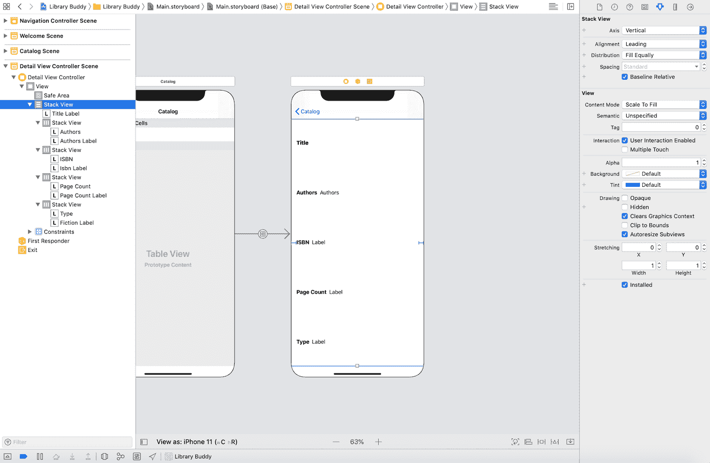
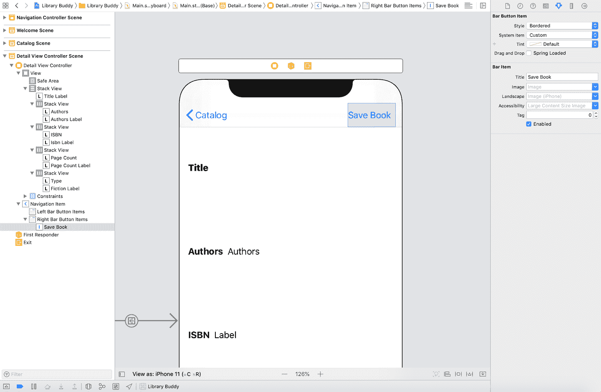

# 第十九章：然而，我们坚持下去

如果我们对我们的应用程序目前的进展进行盘点，可以说进展非常顺利。我们拥有了一些可靠的功能。数据是通过可移植的格式支持的，具体来说是 JSON，而且它在功能上是完好的。这是我们进一步开发应用程序的一个很好的起点。

# 详述我们的书籍

首先，我们应该添加一个新的屏幕来显示关于一本书的更多信息。目前，除了标题之外，我们实际上没有办法查看关于我们的书籍的任何重要信息。你猜怎么着？书籍包含大量关于它们的信息。从标题、作者、ISBN 等等，不胜枚举！实际上，关于一本书的一些最有用的信息都包含在这些信息中。

我们知道我们将显示一本书。具体来说，我们当前的书籍模型对象`Book`中的信息如下：

+   `title`

+   `authors`

+   `isbn`

+   `pageCount`

+   `fiction`

虽然这不是大量的数据，但已经足够了。此外，我们稍后将在 Android 和 iOS 上扩展此屏幕，但现在让我们快速添加一些内容。

## Android

如果你回想一下第二章和第十五章，接下来的内容应该非常熟悉。

首先，让我们使用 XML 定义我们的布局。我们知道我们想要以垂直方式显示每个`Book`实例的属性，所以让我们列出它们，稍后我们会通过编程方式装饰它们。同样，我们希望确保我们的`LinearLayout`被包裹在`ScrollView`中，这样无论屏幕大小、设备密度还是大字体渲染等可访问设置，我们都可以显示所有的信息。

```
<?xml version="1.0" encoding="utf-8"?>
<ScrollView
    xmlns:android="http://schemas.android.com/apk/res/android"
    android:layout_width="match_parent"
    android:layout_height="match_parent"
    android:background="@android:color/white">

  <LinearLayout
      android:layout_width="match_parent"
      android:layout_height="wrap_content"
      android:orientation="vertical">

    <TextView
        android:id="@+id/textview_title"
        android:layout_width="match_parent"
        android:layout_height="wrap_content" />

    <TextView
        android:id="@+id/textview_authors"
        android:layout_width="match_parent"
        android:layout_height="wrap_content" />

    <TextView
        android:id="@+id/textview_isbn"
        android:layout_width="match_parent"
        android:layout_height="wrap_content" />

    <TextView
        android:id="@+id/textview_pagecount"
        android:layout_width="match_parent"
        android:layout_height="wrap_content" />

    <TextView
        android:id="@+id/textview_isfiction"
        android:layout_width="match_parent"
        android:layout_height="wrap_content" />

  </LinearLayout>

</ScrollView>
```

让我们将前面的代码保存为*res/layout/activity_detail.xml*。

因为我们希望这些`TextViews`显示完整的标签，所以我们将在*strings.xml*文件中引入占位符`Strings`的概念。占位符字符串只接受特殊的格式化字符，并允许用变量替换它们。详细了解 Java 的`String.format`方法以获取详细信息。

在*strings.xml*中，让我们添加一些占位符：

```
<string name="detail_title">Book Title: %s</string>
<string name="detail_authors">Book Authors: %s</string>
<string name="detail_isbn">Book ISBN: %s</string>
<string name="detail_pagecount">Book Page Count: %d</string>
<string name="detail_isfiction">Book : %b</string>
```

接下来，我们需要一个 UI 控制器来显示、控制和修改布局，以及提供行为指令。在我们的情况下，是一个`Activity`。

我们希望向 UI 控制器传递关于`Book`的一些信息，在 Android 中，这就是事情可能会变得争议的地方。一个`Activity`是以编程方式和不透明方式创建的，但正如在第一章中描述的那样，我们可以通过使用`Intent`启动控制器并通过`Bundle`实例传递一些基本数据。

对于这样的例子，你会发现有两种思路。有时候，一种思路比另一种更合理，但大多数情况下，这取决于你和你的团队。此外，除了这些细节，你可以随意尝试其他方法——事实上，我们当前的团队使用了一种非常不同、非常定制的方法来解决这个问题，这超出了本章的范围。

因此，第一种方法：您可以将整个对象序列化并作为`String`（或`byte[]`）传递，并在新的控制器中反序列化它。这使得事情变得非常简单，但请记住，`Bundle`的大小限制为 1 MB，并且在任意数量的操作之间共享，可能还包括您没有知识的操作。

第二种方法是传递某种唯一标识符，比如一个 ID 号或者 URI，然后从另一个来源（比如本地数据库、JSON 存储或者远程服务器）完整地检索信息。

对于这个例子来说，为了简单起见，目前我们将使用第一种方法。这个`Activity`将期望在其`Intent`对象的“extra”中传递一个表示序列化`Book`对象的 JSON `String`——让我们称这个`String`额外信息为“BOOK_JSON”并将其保存在一个常量中。我们将在`onCreate`回调期间对其进行反序列化，并用这些属性装饰我们的视图。

当然，我们不要忘记在我们的清单中注册这个新的`Activity`：

```
<activity android:name=".BookDetailActivity" />
```

太棒了！我们有一个带有 UI 的`Activity`，将显示我们对`Book`实例的所有详细信息。让我们从第十七章跳回到列表视图，并连接一个点击事件，以传递选定的`Book`实例给我们的新`BookDetailActivity`。首先，我们需要确保我们的行（目前只是一个`TextView`）有一个`View.OnClickListener`来捆绑其关联的`Book`实例并启动`BookDetailActivity`。我们可以在创建阶段（`onCreateViewHolder`方法）完成这一操作。由于这些`Views`是可回收的，我们只需要确保我们更新与适当书籍相关联的关系，这可以在绑定和更新周期中完成，由`onBindViewHolder`方法表示。

你的新的`BrowseBooksAdapter`应该是这样的：

如果现在运行该应用程序，每当您点击列表视图中的一行时，您应该会看到一个书籍详细信息屏幕显示出我们对该书籍的所有详细信息。恭喜您，您刚刚掌握了 Android 特定和 UI 编程通用使用的一种广泛使用的模式！请花一点时间给自己一个鼓励。

## iOS

让我们从打开*Main.storyboard*开始。从库中拖动一个新的 View Controller 对象到画布上，就像我们添加其他屏幕一样。这个屏幕当前与应用程序的其余部分隔离开来，所以让我们通过一个 segue 连接它，以便稍后可以过渡到它。

这是 storyboards 擅长的地方。如果您在 Storyboard 编辑器的文档大纲中单击目录场景内的表视图单元格——我们在第四章，*用户输入*中创建的表视图单元格——您可以同时按住 Control 拖动，然后您将能够直接连接到表视图单元格本身的 segue。

在呈现的模态内部，选择`Show`作为过渡类型。如果构建并运行应用程序，您将看到在目录中点击书籍会将一个新的视图控制器（目前是空白的）推送到视图堆栈上。然而，目前存在一些 UI 上的怪异需要修复。如果返回目录视图，您会注意到我们的表视图单元格仍然处于选中状态。另外，我们的视图目前非常基础——只是一个白色屏幕。让我们来修复它吧！

### 添加一些详细信息到您的详细信息，以便您可以详细说明

要修复这两个问题，我们需要为新场景创建一个自定义视图控制器。在项目中添加一个名为`DetailViewController`的新文件。它应该像这样继承自`UIViewController`：

```
import UIKit

class DetailViewController: UIViewController {

}
```

记住我们之前的清单和我们的 Android 应用程序当前拥有的内容，我们可以回想起我们将要向我们的视图控制器中添加一些视图。这些都将是标签，所以让我们现在添加一些视图输出；我们可以稍后在 Storyboard 编辑器中将它们连接起来。

添加视图输出后，您的视图控制器现在应该如下所示：

```
import UIKit

class DetailViewController: UIViewController {
    @IBOutlet var titleLabel: UILabel!
    @IBOutlet var authorsLabel: UILabel!
    @IBOutlet var isbnLabel: UILabel!
    @IBOutlet var pageCountLabel: UILabel!
    @IBOutlet var fictionLabel: UILabel!
}
```

然而，我们确实有一个问题。我们如何填充这些属性？

我们知道它们将来自一本书。因此，让我们创建一个名为`populate(from:)`的方法，它接受一个`Book`参数，我们可以用它来设置标签的文本。我们将在我们的目录视图控制器中使用这个方法在过渡时传递一个`Book`对象。最终带有这个方法的类应该如下所示：

```
import UIKit

class DetailViewController: UIViewController {
    @IBOutlet var titleLabel: UILabel!
    @IBOutlet var authorsLabel: UILabel!
    @IBOutlet var isbnLabel: UILabel!
    @IBOutlet var pageCountLabel: UILabel!
    @IBOutlet var fictionLabel: UILabel!

    func populate(from book: Book) {
        titleLabel.text = book.title

        // Flatten our authors array to a string separated by commas
        authorsLabel.text = book.authors.joined(separator: ", ")

        isbnLabel.text = book.isbn
        pageCountLabel.text = book.pageCount.description

        // Use our Bool value to display what kind of book it is
        fictionLabel.text = book.fiction ? "Fiction" : "Nonfiction"
    }
}
```

让我们返回到`CatalogViewController`并连接这个连接。如果您回忆起来，我们的过渡是自动触发的，因为我们将它连接到了表视图单元格本身。过渡的准备工作发生在触发过渡的视图控制器中。我们可以重写一个特殊的方法来添加我们的自定义准备代码：`prepare(for:sender:)`。它将`UISegue`对象作为第一个参数；这个对象包含目标视图控制器，它恰好是我们之前的`DetailViewController`。

不过，在使用这种方法之前，我们需要从数据源中获取被点击的单元格所对应的书籍实例。为此，我们需要在`ListDataSource`上添加一个名为`book(for:)`的新方法，该方法将接受来自表视图的索引路径。将以下方法添加到`ListDataSource`中：

```
func book(for indexPath: IndexPath) -> Book {
	return data[indexPath.row]
}
```

返回到`CatalogViewController`并重写`prepare(for:sender:)`以在我们的过渡期间填充我们的目标视图控制器，像这样：

```
override func prepare(for segue: UIStoryboardSegue, sender: Any?) {
	if let detailViewController = segue.destination as? DetailViewController,
	   let indexPath = tableView.indexPathForSelectedRow {
		detailViewController.populate(from: dataSource.book(for: indexPath))
	}
}
```

这种方法并不复杂，但理解其中的过程非常重要。首先，我们检查目标视图控制器类型是否为`DetailViewController`。如果是，我们继续进行`if`条件检查，并确保当前在表视图中有选定的行。这两个检查非常重要，因为此方法会针对从该视图控制器触发的*每个*转场调用。如果两个条件都为真，则我们获取`DetailViewController`实例，并调用我们之前创建的方法来填充书籍实例。

现在，在我们离开此文件并返回到我们的故事板编辑器以将事物连接起来之前，让我们添加一个修复：让我们清除表行选择。这不会自动发生，因为我们使用的是标准的`UIViewController`作为我们的基类，而不是`UITableViewController`。我们希望这在视图出现时发生，这将为我们的用户提供一个漂亮的淡出动画，以提供他们所选择的行的上下文信息。因此，我们将在`viewDidAppear(_:)`方法中执行此操作，这是我们视图控制器生命周期的一部分。

我们最终的`CatalogViewController`类应该如下所示：

```
import UIKit

class CatalogViewController: UIViewController {

    @IBOutlet weak var tableView: UITableView!
    lazy var dataSource: ListDataSource = {
        return ListDataSource()
    }()

    override func viewDidLoad() {
        super.viewDidLoad()
        tableView.dataSource = dataSource
    }

    override func viewDidAppear(_ animated: Bool) {
        super.viewDidAppear(animated)
        if let indexPath = tableView.indexPathForSelectedRow {
            tableView.deselectRow(at: indexPath, animated: true)
        }
    }

    override func prepare(for segue: UIStoryboardSegue, sender: Any?) {
        if let detailViewController = segue.destination as? DetailViewController,
           let indexPath = tableView.indexPathForSelectedRow {
            detailViewController.populate(from: dataSource.book(for: indexPath))
        }
    }
}
```

添加此视图的最后部分非常简单，类似于我们过去所做的事情。我们需要在`DetailViewController`中为新的输出添加标签到场景中。请随意安排它们的位置。发挥创意！如果您想查看我们 GitHub 存储库中提供的示例项目，可以查看。在其中，我们使用堆栈视图（从我们的库选择器中）创建了一个视图，它根据屏幕的大小自动扩展和收缩。但是，只需将标签拖放到视图中，并添加一些自动布局约束即可。您可能最终会得到类似如下的东西，看起来像图 19-1。



###### 图 19-1。您可能会注意到视图之间的一些拉伸（这是完全正常的！）

让我们通过点击以显示编辑器右侧的 Identity 检查器，并从`UIViewController`切换到`DetailViewController`来将此场景切换为使用我们的自定义类`DetailViewController`。现在，从文档大纲中的视图控制器对象控件上进行 Control-drag，并选择我们之前编码的相应视图输出。

如果您构建并运行项目，您将看到在目录中点击项目后，该项目将填充书籍详细信息屏幕。太棒了！

# 保存书籍以便以后阅读

现在我们可以看到关于我们的书籍更多信息了，如果我们找到一本特别有趣的书想稍后保存，会发生什么呢？当然，我们可以将其保存在应用程序内存中，但这不会在应用程序重新启动之间保持。我们*可以*使用 JSON 将其保存到文件系统中，但如果我们要保存大量书籍，你会发现这很快会变得麻烦且性能不佳。别忘了：我们这个示例应用使用的数据集很小，但我们要为这个应用程序构建的图书馆拥有大量的书籍可供选择。

另一个重要的考虑因素是操作这些信息；像排序、过滤和分页这样的事情在大多数持久化引擎（如 Core Data，或任何 flavor 的 SQL，或者 Realm 或 Room 等）中很容易实现。但对于一个存储 JSON 对象的平面文件存储来说就不同了。同样地，当每个文件必须重新建立结构、顺序和键名时，你会注意到大小开始成为一个问题。对于小型或一次性数据对象，偶尔使用一个 JSON 文件可能不仅可以，甚至更可取，但对于我们希望用户浏览和策展的书籍库来说，我们需要更稳健一点的东西：一个数据库。

当我们在考虑最佳可用方法时（提示：本章节是关于本地持久化），让我们继续添加一个按钮以切换书籍为用户喜爱，我们稍后会在本章节中进行相关设置。

## Android

由于我们的示例应用中未使用 `ActionBar`，因此我们会稍微偏离 iOS 的做法，将我们的保存按钮放在信息性 `TextViews` 相同的 UI 中。只需在 `LinearLayout` 的末尾添加一个 XML `Button`，并给它一个 ID 为 `button_save`。如果你想在视觉上进行区分，可以使用 `android:layout_gravity="center"`，如下所示：

```
<Button
  android:id="@+id/button_save"
  android:layout_width="wrap_content"
  android:layout_height="wrap_content"
  android:layout_gravity="center"
  android:text="Mark as Favorite" />
```

新的详细布局应该如下所示：

```
<?xml version="1.0" encoding="utf-8"?>
<ScrollView
    xmlns:android="http://schemas.android.com/apk/res/android"
    android:layout_width="match_parent"
    android:layout_height="match_parent">

  <LinearLayout
      android:layout_width="match_parent"
      android:layout_height="wrap_content"
      android:orientation="vertical">

    <TextView
        android:id="@+id/textview_title"
        android:layout_width="match_parent"
        android:layout_height="wrap_content" />

    <TextView
        android:id="@+id/textview_authors"
        android:layout_width="match_parent"
        android:layout_height="wrap_content" />

    <TextView
        android:id="@+id/textview_isbn"
        android:layout_width="match_parent"
        android:layout_height="wrap_content" />

    <TextView
        android:id="@+id/textview_pagecount"
        android:layout_width="match_parent"
        android:layout_height="wrap_content" />

    <TextView
        android:id="@+id/textview_isfiction"
        android:layout_width="match_parent"
        android:layout_height="wrap_content" />

    <Button
        android:id="@+id/button_save"
        android:layout_width="wrap_content"
        android:layout_height="wrap_content"
        android:layout_gravity="center"
        android:text="Mark as Favorite" />

  </LinearLayout>

</ScrollView>
```

我们稍后会在建立持久化层之后处理保存详细信息的点击行为。请保持关注。

这样就很简单了。现在让我们在 iOS 上做同样的事情，尽管稍微有些痛苦。

## iOS

让我们将按钮添加到导航栏中。这是放置此类操作的常见地方。如果你还没有进入详细场景，请打开 *Main.storyboard*，然后转到详细场景。在库中搜索“Navigation Item”，将其拖动到场景中。这将创建一个与视图控制器导航栏关联的导航项，我们可以在 storyboard 编辑器中编辑它。在编辑器的文档大纲中点击导航项（标记为“Title”）。显示属性检查器并清除标题字段中的值，以使其为空白。这将导致对象在文档大纲中更改为导航项。

###### 注

如果你选择`Push`作为 segue 类型，这将由 Xcode 自动为你添加，因为`Push`是导航控制器的 segue 类型。然而，该 segue 类型已被弃用，这要求我们在创建场景时提供更多手动上下文，以保持事物在故事板编辑器内部。然而，我们也可以在代码中完成所有这些操作，但在故事板编辑器中进行操作可能更容易。至少，它帮助我们将 UI 设置集中在一个地方，而不是在代码文件和故事板中不必要地分散。

现在，在“库”中搜索“Bar Button Item”，并将该项拖放到场景中导航栏的右侧。在该项目的属性检查器中，将标题字段从“Item”更改为“保存书籍”。你的场景应该看起来像图 19-2。



###### 图 19-2\. “保存书籍”按钮添加到导航栏

让我们为这个新按钮创建一个操作。

打开助理编辑器，它会将代码和界面并排显示。在新按钮上进行控件拖拽，并将操作放置在我们`populate(for:)`方法声明的视图控制器下面的最底部。这将在`DetailViewController`内创建一个新的方法，看起来像这样：

```
@IBAction func saveBook(_ sender: Any) {
}
```

如果你构建并运行项目，你会在书籍详细信息屏幕的右上角看到按钮，但是目前点击它不会有任何反应。现在让我们解决这个问题。

# 为以后存储书籍

正如前面提到的，我们需要为以后存储我们的书籍。由于我们的图书馆规模很大，我们需要一些高性能的东西，这些东西可以在启动之间持久存在，并且可以让我们读取和写入数据。这开始听起来像是一个数据持久化层。

哇！

如果你正在构建跨平台的应用程序集合，就像我们在这本书中所做的那样，你会发现这是一个原生组件分歧的主要领域。我们可以使用像 Realm 这样的跨平台解决方案，但为了保持对每个平台的忠实，我们将使用 Android 和 iOS 中最常见和支持的选项。

首先，在我们分别讨论 Android 和 iOS 之前，让我们谈谈我们与数据持久化层的共同目标。我们有一些要求。期望的功能如下：

+   点击“保存书籍”将会保存一本书的标识符到某种存储器中。

+   这个数据存储将能够显示我们保存的返回标识符列表中的书籍。

+   详细屏幕将指示书籍是否已保存。

+   我们将能够从我们保存的列表中删除书籍。

Android 和 iOS 在这个列表中的前两个项目是它们最不同的方法。然而，由于我们使用的是 MVC 架构，很多代码差异将被限制在 Model 层。View 和 Controller 层（即需求列表中的最后两个项目）在架构上仍然有类似的代码。

因此，没有更多拖延，让我们构建一个持久化层。

## Android

如前面几次提到的那样，使用 Android 框架持久化数据有多种方式，在撰写本文时，Google 建议我们使用 Room 库。然而，出于几个原因，我们将使用 SQLite，其中最重要的原因是 SQL 是非常成熟、经过充分验证，并被数据库社区公认为黄金标准。我们只能访问 SQLite 进行本地设备持久化，但所有主要 SQL 数据库（如 PostgreSql、MySql 和 MSSql）都适用相同的基本语法、规则和操作。当然，您可以尝试其他方法，比如 Room。Realm 是另一个流行的选择，另一个优势是它跨平台。

无论如何，让我们看看如何使用 SQLite 构建持久化层。首先，与所有关系型数据库管理系统一样，我们至少需要一张表。在我们的示例中，我们将使用三张表：一张用于 `Book` 实例，一张用于作者（表示为 `Strings`），以及一张表来关联这两者。关系表有时被称为 through 表、bridge 表、pivot 表或 join 表，但这是一个非常常见的范例，我们认为这是一个使用 SQL 的很好但简单的示例。

我们将使用 SQL 标准的“create table”语法。关键字的具体细节，请参阅开发文档，但我们会呈现足够多的内容让您立即上手。

```
CREATE TABLE IF NOT EXISTS BOOKS (
 ID INTEGER PRIMARY KEY AUTOINCREMENT,
 TITLE TEXT,
 ISBN TEXT,
 PAGECOUNT INTEGER,
 IS_FICTION INTEGER);
```

```
CREATE TABLE IF NOT EXISTS AUTHORS (
 ID INTEGER PRIMARY KEY AUTOINCREMENT,
 NAME TEXT);
```

```
CREATE TABLE IF NOT EXISTS BOOK_AUTHORS (
 BOOK_ID INTEGER REFERENCES BOOKS(ID),
 AUTHOR_ID INTEGER REFERENCES AUTHORS(ID))
```

您希望在应用程序首次启动时创建每张表，以便立即访问它们。如果您回忆起第七章中关于 `SqliteOpenHelper` 的细节，您可能记得可以通过重写的 `onCreate` 方法来实现这一点。请记住，这只会在第一次使用子类获取数据库实例时触发，使用 `getReadableDatabase` 或 `getWritableDatabase` 之一。对于我们的示例，我们总是更喜欢后者，这样我们可以更新我们的数据存储。

这是它可能看起来的样子：

现在，我们拥有了一个漂亮、闪亮的新数据库，但它是空的——我们所有的数据仍然在 *catalog.json* 中。让我们来解决这个问题。首先，我们知道我们需要方法来读取和写入 `Book` 实例到数据库中，所以让我们设置一下。也许像这样：

现在我们已经有了用于读写`Book`数据的帮助程序，让我们更新我们的`DbHelper`类，在单个`onCreate`调用期间读取*catalog.json*并将这些条目写入数据库！

现在，当你从你的`DbHelper`类获取一个`SqliteDatabase`实例时，`onCreate`将会运行，并且你将从*assets*特殊目录中安装的*catalog.json*文件中填充你的数据库！不错！

我们花了很多时间来构建我们的持久层。我们现在准备显示我们保存的书籍，但在继续之前，让我们先看看 iOS 上的情况。

## iOS

对于 Android，我们使用了一个带有原始 SQL 调用的数据库来获取我们的数据。在 iOS 上，我们有另一种选项，允许我们直接在 Swift 中工作，而不必处理原始 SQL：Core Data。

### Core Data

让我们先搞清楚一件事：Core Data 不是数据库。Core Data 是一个*对象图*，只是偶尔使用数据库作为其后备存储。它是为 iOS（以及其他 Apple 平台）提供的一个框架，旨在使与数据模型层及其持久性的工作无缝（而且相对）容易。

它可能非常复杂，但对于 90%的使用情况来说，这是应用程序的一个很好的选择。它非常适合我们的应用。为什么不将它添加到我们的项目中呢？

要将 Core Data 支持添加到现有项目中，你需要做一些事情：

1.  数据模型文件和定义的任何实体

1.  处理设置 Core Data 堆栈的数据控制器

1.  在你应用程序的启动逻辑中进行初始化逻辑

### 开始使用模型文件

列表上的第一项，数据模型文件，是最容易完成的。在 Xcode 中，转到 文件 > 新建 > 文件，然后向下滚动到 Core Data 部分。在那里，选择数据模型然后点击下一步。让我们简单地命名我们的模型为“LibraryModel”，以保持事情简单，但实际上你可以按照自己的意愿命名这个模型。你应该在项目文件中看到一个名为*LibraryModel.xcdatamodel*的文件。

Core Data 使用具有关联属性的实体作为后备对象。如果你点击*LibraryModel.xcdatamodel*，你将看到一个空的实体列表。

我们在这里处于一个转折点。

我们可以继续使用我们已经在使用的现有*Book.swift*结构，并创建一个单独的实体，专门用于保存书籍，其中仅包含某种标识符（例如唯一字符串）。这样做的好处是保持我们的 Core Data 堆栈轻量级。然而，这种做法将 Core Data 视为数据库，限制了它在管理我们模型层整体时的真正潜力。

相反，我们将继续使用我们现有的*catalog.json*文件作为我们图书馆数据的来源，但只在应用程序首次启动时。这使我们能够将 Core Data 用作一种缓存，这样我们就不必在每次查看图书馆目录时将整个文件读入内存。

要向 Core Data 添加实体，请单击屏幕底部的“添加实体”按钮。您将看到一个名为“Entity”的实体在实体列表中创建。单击以显示屏幕右侧的实体检查器。将实体名称从“Entity”更改为“Book”，并在类下更改名称为`BookManagedObject`，以将我们的托管对象的实际文件名与实体名称分开。这样做的原因是在处理`BookManagedObject`类型的对象时可以识别我们正在处理的是 Core Data 管理的对象。

*Book.swift*文件中现有的属性需要作为`Book`实体内的属性重新创建。通过单击属性下的加号符号并为我们预先存在的`Book`结构中的每个属性和其关联类型（例如`String`、`Int`、`Bool`等）添加。 

###### 警告

对于`authors`属性，您需要将类型指定为“Transformable”。然后，在数据模型检查器中选择该属性，在生成的文件中设置自定义类类型为`[String]`，以指示它是一个`String`数组。

现在我们已经定义了`Book`实体，让我们让 Xcode 为我们生成文件。在编辑器中选择书籍实体。显示数据模型检查器，在代码生成下拉菜单中将其从类定义更改为类别/扩展。单击菜单栏中的编辑器 > 创建 NSManagedObject 子类，然后按几次“下一步”使用默认值。

一旦生成完成，您会注意到创建了两个新文件：*BookManagedObject+CoreDataClass.swift* 和 *BookManagedObject+CoreDataProperties.swift*。第一个文件从技术上讲是不必要的，所以请将其拖到垃圾箱中。第二个文件包含了我们添加的所有 Core Data 属性，这些属性被装饰为带有`@NSManaged`的 Swift 属性。这是一些语法糖，让编译器知道 Core Data 正在管理这个特定的属性。

我们最终将使用这个扩展来为我们的模型添加一些功能。但是现在，让我们继续完成 Core Data 堆栈的其余设置。

### 初始化我们的堆栈

Core Data 堆栈有三个部分：

1.  刚刚创建的数据模型文件，用于保存我们的实体描述。

1.  持久存储容器，它为我们的应用程序和持久存储提供链接。在这种情况下，它将由 SQLite 数据库支持，但也可以是 XML 或内存存储。

1.  托管对象上下文，这是我们所有`BookManagedObject`实例活动时所在的“草稿本”；这实际上是持久存储到数据库的内容。

我们已经处理了 (1) *LibraryModel.xcdatamodel* 是我们的数据模型文件。但是，我们仍然需要设置 (2) 和 (3)。通常，我们的 Core Data 堆栈在应用启动时初始化。我们将所有内容封装在一个`DataController`对象中，以便稍后更轻松地处理事务。

在 Xcode 中，创建一个名为 `DataController` 的新 Swift 文件，并将其添加到您的项目中。`DataController` 应该如下所示：

```
import Foundation
import CoreData

class DataController {
    var persistentContainer: NSPersistentContainer

    init(completion: @escaping () -> ()) {
        persistentContainer = NSPersistentContainer(name: "LibraryModel")
        persistentContainer.loadPersistentStores { (description, error) in
            if let error = error {
                fatalError("Core Data stack could not be loaded. \(error)")
            }

            // Called once initialization of Core Data stack is complete
            DispatchQueue.main.async {
                completion()
            }
        }
    }
}
```

让我们来看看这里发生了什么。首先，我们在 `init(completion:)` 方法中使用完成处理程序初始化我们的 `DataController`。此完成处理程序将在所有设置完成后调用，允许应用程序启动继续。

###### 注意

存储将在调用它的任何线程上串行加载。我们可以通过在引导时添加一个新的描述来异步添加存储，该描述在启动时设置了属性 `shouldAddStoreAsynchronously` 为 `true`。然而，为了简化 Core Data 栈的加载，本例中我们没有使用此属性。

在初始化器内部，我们首先将对象的实例变量 `persistentContainer` 分配给一个新的 `NSPersistentContainer` 实例。这个容器做了很多工作，将数据模型文件和持久性存储协调器链接在一起。它是这两个对象之间的“粘合剂”。为了创建它，我们传入我们的数据模型文件的名称，去掉扩展名。一旦创建完成，我们获取持久化容器对象，并在其上调用 `loadPersistentStores(_:)` 方法，并传入一个带有一些错误检查的闭包。如果无法连接到数据库，无法读取模型文件或任何错误，我们调用 `fatalError` 杀死应用程序。最后，如果存储正确加载，我们调用 `completion()`，这是在 `DataController` 初始化期间传入的原始闭包。

我们已经设置好了我们的持久化存储，并且通过持久化容器设置了我们的托管对象上下文作为属性。稍后我们将深入讨论如何使用它。现在，让我们完成设置我们的栈，并使用刚刚创建的 `DataController` 对象。

打开 *AppDelegate.swift*。添加一个名为 `dataController` 类型为 `DataController!` 的新属性。在 `application(_:didFinishLaunchingWithOptions:)` 方法中，在底部的 `return true` 语句上面插入以下行：

```
// Initialize the Core Data stack
dataController = DataController() {
	// Override point to update user interface that initialization has completed
}
```

你的 `AppDelegate` 应该大致如下所示：

```
class AppDelegate: UIResponder, UIApplicationDelegate {

    var window: UIWindow?
    var dataController: DataController!

    func application(_ application: UIApplication,
        didFinishLaunchingWithOptions launchOptions: [UIApplication.LaunchOptionsKey:
        Any]?) -> Bool {

        // Initialize the Core Data stack
        dataController = DataController() {
            print("Core Data stack has been initialized.")
        }

        return true
    }

    ...

}
```

如果您构建并运行应用程序，您将在 Xcode 控制台中看到以下文本：`Core Data stack has been initialized.`

是的！我们的 Core Data 栈已经运行起来了，但是现在实际上还没有任何内容是由 Core Data 驱动的。它仍然由 *catalog.json* 驱动。让我们从在我们的 `ListDataSource` 中使用原始 JSON 文件切换到直接使用 Core Data。

### 从 JSON 切换到 Core Data

我们可以通过首先在 `BookManagedObject` 上创建一个新的扩展来完成这个。您可以在一个新文件中完成这个操作。Swift 扩展的常规做法是将文件命名为类似 *BookManagedObject+Extensions.swift*。在这个文件中，我们将创建一个新的 fetched results controller，它本质上是一个控制 Core Data 获取结果的对象。以下是我们的扩展应包含的内容：

```
import Foundation
import CoreData

extension BookManagedObject {
    class func newCatalogResultsController(with dataController: DataController,
      delegate: NSFetchedResultsControllerDelegate?) ->
      NSFetchedResultsController<BookManagedObject> {
        let request = NSFetchRequest<BookManagedObject>(entityName: "Book")

        // Add a sort by title description to the fetch request
        let titleSort = NSSortDescriptor(key: "title", ascending: true)
        request.sortDescriptors = [titleSort]

        let context = dataController.persistentContainer.viewContext
        let fetchedResultsController =
          NSFetchedResultsController(fetchRequest: request, managedObjectContext: context,
          sectionNameKeyPath: nil, cacheName: "catalog.cache")

        // Assign the delegate to handle updates
        fetchedResultsController.delegate = delegate

        do {
            try fetchedResultsController.performFetch()
        } catch {
            fatalError("Catalog fetch could not be completed. \(error)")
        }

        return fetchedResultsController
    }
}
```

这里发生了很多事情，但真正重要的只有几件事情。首先，我们正在创建一个新的获取请求。获取请求是我们查询 Core Data 模型对象的方法。我们通过 `title` 对请求进行排序，这似乎是对书籍列表进行排序的最合适方式。接下来，我们获取 `viewContext` 作为我们将在此获取操作中操作的托管对象上下文。`viewContext` 是在主线程上操作的上下文。在主线程上查看托管对象是完全可以接受的，也是推荐的。然而，如果我们正在编写对象，我们将在后台线程上执行我们的操作。

在获取我们的上下文之后，我们创建了一个类型为 `NSFetchedResultsController` 的获取结果控制器对象。这是一个专为 Core Data 设计的对象，用于为类似于表视图数据源或集合视图数据源的数据源提供获取对象并将其供应给它们。最终，我们将让 `ListDataSource` 遵循我们在此处分配的代理协议 `NSFetchedResultsControllerDelegate`，以便它可以接收更新并填充表视图，但目前，我们只是将属性设置为传入的 `fetchedResultsController`。

最后，在 Core Data 中使用 `performFetch()` 方法执行实际的获取操作。这个方法可能会 `throw` 异常，所以它被包裹在 `try` 块中以捕获任何错误。对于示例应用程序，我们只是调用 `fatalError`，但在生产应用程序中，捕获错误并适当处理或向用户显示消息是非常重要的。

让我们使用这个扩展并连接我们的数据源。

转到 `ListDataSource`。我们将对此文件进行一些更新。首先要更新的是删除我们一直在使用的用于延迟加载 JSON 文件的 `data` 属性。用一个新的 `fetchedResultsController` 属性来替换它，如下所示：

```
var fetchedResultsController: NSFetchedResultsController<BookManagedObject>?
```

接下来，我们需要向 `ListDataSource` 添加一个名为 `fetchCatalogResults` 的新方法，该方法创建我们刚刚创建的目录获取结果控制器。我们将这个存储在我们的新属性中：

```
func fetchCatalogResults(with dataController: DataController) {
	fetchedResultsController =
    BookManagedObject.newCatalogResultsController(with: dataController, delegate: nil)
}
```

接下来，我们需要向 `ListDataSource` 添加一个名为 `fetchCatalogResults` 的新方法，该方法初始化我们之前创建的获取结果控制器的实例。然后，我们将该实例存储在我们的新属性中，如下所示：

```
import UIKit
import CoreData

class ListDataSource: NSObject {
    var fetchedResultsController: NSFetchedResultsController<BookManagedObject>?

    func fetchCatalogResults(with dataController: DataController,
      delegate: NSFetchedResultsControllerDelegate?) {
        fetchedResultsController =
          BookManagedObject.newCatalogResultsController(with: dataController, delegate:
          delegate)
    }

    func book(for indexPath: IndexPath) -> Book? {
        return fetchedResultsController?.object(at: indexPath).book
    }
}
extension ListDataSource: UITableViewDataSource {
    func tableView(_ tableView: UITableView, numberOfRowsInSection section: Int) -> Int {
        return fetchedResultsController?.sections?[section].numberOfObjects ?? 0
    }

    func tableView(_ tableView: UITableView,
        cellForRowAt indexPath: IndexPath) -> UITableViewCell {
        // Dequeue a table view cell
        let cell =
          tableView.dequeueReusableCell(withIdentifier: "CatalogTableViewCell", for:
          indexPath)

        // Find the correct book based on the row being populated
        guard let book = fetchedResultsController?.object(at: indexPath) else {
            fatalError("Could not retrieve book instance.")
        }

        // Populate the table view cell title label with the book title
        cell.textLabel?.text = book.title

        return cell
    }
}
```

我们已经使用 `fetchedResultsController` 来尽可能地提供结果。需要注意的唯一一点是，在方法 `book(for:)` 中，我们获取了一个 `BookManagedObject`，然后使用我们早些时候创建的扩展方法将其转换为 `Book` 实例。在应用程序的视图控制器和视图层中，我们将继续使用 `Book` 实例而不是直接传递托管对象实例。

唯一缺少的部分是将 `CatalogViewController` 切换到使用新的数据源方法。我们通过在懒加载属性 `dataSource` 中调用 `dataSource.fetchCatalogResults(with:delegate:)` 来实现这一点，如下所示：

```
lazy var dataSource: ListDataSource = {
	let listDataSource = ListDataSource()
	let dataController = (UIApplication.shared.delegate as?
	AppDelegate)!.dataController!
	listDataSource.fetchCatalogResults(with: dataController, delegate: nil)
	return listDataSource
}()
```

构建并运行应用程序，你会看到……在目录结果中什么也没有。

如果你还记得，我们创建了 Core Data 对象，但是*没有*填充它们的数据。iOS 应用程序的常见方法是将预先填充的数据库或某种数据捆绑到应用程序中，通过 Web 或应用程序包内的方式启动应用程序。在这种情况下，我们将使用我们的*catalog.json*来预填充数据库（如果在创建之前不存在）。

### 种子数据库

打开我们之前创建的`DataController`。将以下代码添加到`init(with:)`方法的顶部，同时添加一个名为`shouldSeedDatabase`的新变量：

```
var shouldSeedDatabase: Bool = false

init(completion: @escaping () -> ()) {
	// Check if the database exists
	do {
		let databaseUrl =
      try FileManager.default.url(for: .applicationSupportDirectory, in: .userDomainMask,
      appropriateFor: nil, create: false).appendingPathComponent("LibraryModel.sqlite")
		shouldSeedDatabase = !FileManager.default.fileExists(atPath:
	databaseUrl.path)
	} catch {
		shouldSeedDatabase = true
	}

	...
}
```

首先，我们获取预期数据库路径。然后，如果数据库尚不存在，我们将变量`shouldSeedDatabase`设置为`true`。这是一个简单的逻辑，但非常有用。现在，让我们创建实际种子数据库的方法。我们将称之为`seedData()`：

```
private func seedData() {
	do {
		guard let rawCatalogData =
      try? Data(contentsOf:
      Bundle.main.bundleURL.appendingPathComponent("catalog.json")) else {
			return
		}
		let books = try JSONDecoder().decode([Book].self, from: rawCatalogData)

		persistentContainer.performBackgroundTask { (managedObjectContext) in
			// Loop through the books in the JSON and add to the database
			books.forEach { (book) in
				let bookManagedObject =
          BookManagedObject(context: managedObjectContext)
				bookManagedObject.title = book.title
				bookManagedObject.authors = book.authors
				bookManagedObject.isbn = book.isbn
				bookManagedObject.pageCount = Int16(book.pageCount)
				bookManagedObject.fiction = book.fiction
			}
			do {
				try managedObjectContext.save()
			} catch {
				print("Could not save managed object context. \(error)")
			}
		}

	} catch {
		print("Catalog.json was not found or is not decodable.")
	}
}
```

让我们详细了解一下这段代码的功能。

你可能会认出这行。首先，我们获取应用程序包中存在的*catalog.json*文件。接下来，我们将其从 JSON 解码为一个数组，其中包含`Book`对象。下一行代码，从`persistentContainer.performBackgroundTask`开始，使用我们在初始化 Core Data 堆栈时创建的`NSPersistentContainer`在后台队列中执行任务。这很重要，因为这是一个写入持久存储的任务，最终会阻塞主线程直到完成。我们通过调用此方法获得一个`NSManagedObjectContext`，其反过来用于在遍历 JSON 中的`books`数组时创建一个新的`BookManagedObject`。

每个`BookManagedObject`都是在后台管理对象上下文中创建的。重要的是要注意，实际上它只存在于内存中。直到我们在管理对象上下文上实际调用`save()`方法，对象和更改才会通过持久存储协调器持久化，并传递到数据库（如果需要的话）。

但是，运行应用程序不会填充数据库。这是因为数据库已经存在，并且此代码在填充数据库之前检查确保它不存在。解决方案是：从 iOS 模拟器中删除应用程序，然后再次构建和运行应用程序。如果一切顺利，你将在我们的目录视图中看到与之前相同的书籍列表，按`title`排序。

哦，终于完成了。松了口气。我们就像在我们的 Android 应用程序中一样使用数据库。但是，我们进一步利用了 Core Data 的全部优势，而不仅仅是直接使用 SQLite 数据库。但是，我们还没有完成！我们需要将这个数据库用于我们最初的目的：保存书籍以便以后使用。让我们回到项目的这一部分吧！

# 保存书籍

因此，我们的持久化层保存了我们的书籍。如果以后我们提供了一个远程服务，可以从图书馆更新更多书籍到我们的数据库中，我们已经准备好了基础设施和管道来完成这项工作。那还剩下什么呢？还记得我们之前添加的按钮吗，用于将`Book`实例标记为当前用户的收藏书籍？现在让我们来连接它。

## Android

正如我们多次提到的，有几种方法可以实现这一点，可以合理假设有人可能希望向数据库的`BOOKS`表中添加一列，并将一个`INTEGER`值设置为 0（false）或 1（true），以便在切换开关时进行操作（与大多数 SQL RDBMS 不同，SQLite 没有布尔数据类型，通常在模式中使用整数）。事实上，在长期来看，这可能是我会做的方式。然而，对于本例子，我们将使用另一种方法，首先是为了简单起见，同时也为了展示 Android 框架中内置的另一个常见且便利的特性，在第一部分，*任务和操作*，在第十一章中有所讨论。

如前所述，`SharedPreferences`接受`Set`类型的`Strings`。这似乎是这种工作的理想数据结构——我们希望通过它可以轻松地识别书籍的唯一、无序集合（通过书籍的 ISBN 号码），从而确定书籍是否是用户的收藏。如果切换为“打开”，我们将 ISBN 添加到`Set`中；如果切换为“关闭”，我们则移除它。简单！在某些时候，您可能想要添加一个自定义 UI，例如一个从金色变灰色的星星，或者在列表中进行特殊样式设置，但目前我们只会更新按钮的文本来标识当前状态。

那么首先，让我们创建一个方法来在`SharedPreferences`中切换`Set<String>`中的`Book`。假设我们将在`BookDetailActivity`类中定义此功能，并因此可以本地访问`Context`对象（即活动本身）及其所有访问器：

我们可以在点击监听器中为按钮添加该方法，如下所示：

就这样！运行应用程序，从列表中选择一本书，在详细页面中切换收藏设置。由于此值存储在持久结构中，因此该值将在应用程序启动和电源循环之间保持不变。

# 我们学到了什么

恭喜！我们的应用程序拥有多样化但基本的功能集。该应用程序在 Android 和 iOS 之间的使用方式是一致的。在本章中，我们学习了数据持久化以及它在两个平台上的不同之处。Android 有一种更加可接近的数据库方法来存储和访问数据，而 iOS 采用了一种更抽象的方法，但提供了更多的免费功能，尽管增加了相当多的复杂性。

在我们的应用程序的日落之前，我们还需要再看一个方面：网络连接。让我们在下一章中详细介绍如何向此应用程序添加一些轻量级的连接，以及其中的陷阱和最佳实践。
