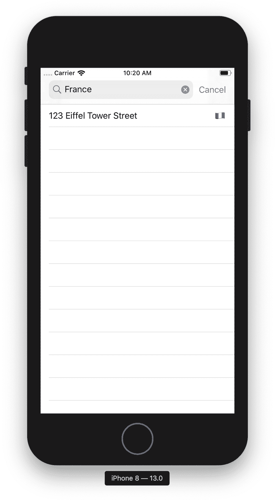

# 第二十章：网络和我们的应用

哇。我们的应用已经走了很长一段路了。上一章处理数据库，确实让人费了一番周折。现在我们有了一个很棒的应用来浏览我们的图书目录。我们甚至可以将一些书籍标记为喜爱，以便稍后再查看。太棒了！也许现在是时候把这个应用搁置一下，开始着手另一个项目了。

但等等！之前那位图书馆员，我们的八旬导游和灵感来源，从你正在工作的地方的阴影中走了出来，告诉你一个让你毛骨悚然的秘密：这不是唯一的这种类型的图书馆。在全球各地不同的国家散布着多个位置，它们都必须在这个应用程序中显示，以帮助像你这样的读者解锁其中蕴含的知识。

看起来我们还没有完成这个项目。

现在，我们如何支持这个新功能呢？我们可能可以像之前处理我们的目录一样：将位置列表与应用捆绑在一起。然而，这种方法似乎有点静态和不变。如果一个地方关闭了，一个疲惫的旅行者徒劳地搜索人类的知识，那该怎么办呢？也许最好的方法是，利用这个机会终于打破这个应用周围的障碍，让它通过互联网与外界通信！这将使我们的数据像周围的世界一样动态和变化。

所以准备好了。让我们调整设置，开始搜索吧！

# 探索世界

从根本上讲，与搜索端点的交互在 Android 和 iOS 上都是相同的。它包括以下步骤：

1.  一个按钮或搜索栏来启动搜索。

1.  一串文本，传递到某个网络服务的地方。

1.  一个包含我们查询结果的响应。

1.  显示我们结果的屏幕——很可能是一个列表或表视图。

我们首先需要一种在 UI 中启动搜索的方法。在 Android 上，因为我们再次省略了`ActionBar`，我们将在`BrowseContentActivity`的顶部添加一个名为`SearchView`的 AOSP 提供的组件。当输入字符串并且可操作（按钮按下、Enter 键、IME 动作）时，我们将把该值传递给一个 Web 服务，在成功返回时将结果显示在一个新的`Activity`中。

现在，让我们修改*res/layout/activity_browse.xml*的布局，以包含一个`SearchView`：

```
<?xml version="1.0" encoding="utf-8"?>
<LinearLayout
    xmlns:android="http://schemas.android.com/apk/res/android"
    android:layout_width="match_parent"
    android:layout_height="match_parent"
    android:orientation="vertical">

  <SearchView
      android:id="@+id/search_locations"
      android:layout_width="match_parent"
      android:layout_height="wrap_content"
      android:background="#FFFFFFFF" />

  <androidx.recyclerview.widget.RecyclerView
      android:id="@+id/browse_content_recyclerview"
      android:layout_width="match_parent"
      android:layout_height="match_parent"
      android:background="#FFFFFFFF" />

</LinearLayout>
```

现在，让我们在现有的`Activity`中连接一些基本功能：

1.  在清单中添加新的搜索活动。

1.  显示搜索活动和布局。

1.  更新此日志语句，以调用本地项目中的搜索方法。

1.  修复表情符号。

与此同时，在 iOS 上，我们将在目录屏幕顶部添加一个搜索按钮。这将显示一个`UISearchController`，其中包含一个`UISearchBar`，我们将用它来捕获搜索用户正在搜索的文本；我们将用它来请求我们的搜索端点。

让我们从 UI 开始吧！

## Android

让我们准备一个简单的布局和`Activity`来显示我们的搜索结果：

```
<?xml version="1.0" encoding="utf-8"?>
<FrameLayout
    xmlns:android="http://schemas.android.com/apk/res/android"
    android:layout_width="match_parent"
    android:layout_height="match_parent"
    android:background="#FFFFFFFF">

  <androidx.recyclerview.widget.RecyclerView
      android:id="@+id/search_results_recyclerview"
      android:layout_width="match_parent"
      android:layout_height="match_parent"
      android:visibility="gone"
      android:background="#FFFFFFFF" />

  <ProgressBar
      android:id="@+id/search_progress"
      android:indeterminate="true"
      android:layout_width="wrap_content"
      android:layout_height="wrap_content"
      android:layout_gravity="center" />

</FrameLayout>
```

这将提供一个旋转器，向用户显示正在发生的事情，同时等待来自服务器的结果。

我们的`Activity`应该期望从`SearchView`传递一个`String`额外参数作为查询，我们将使用它来执行从 Web 服务获取数据并根据需要操作 UI。

让我们在这里做一些假设。假设我们的 URL 是*magic://my.app/search*（我们将使用方案“magic://”，以便不会忘记缺失的部分——大多数 Java HTTP 客户端将拒绝具有友好描述错误的此方案），并接受名为`query`的`GET`查询参数。它将返回一个 JSON 响应，其中包含一个`Location`对象数组，如果没有匹配项则返回一个空数组。

假设 JSON 看起来像这样：

```
[
    {
        "street_address": "123 Eiffel Tower Street",
        "city": "Paris",
        "country": "France",
        "emoji": "",
        "hours": "8am–7pm"
    },
    {
        "street_address": "86 Libery Boulevard",
        "city": "New York",
        "country": "America",
        "emoji": "",
        "hours": "6am–10pm"
    }
]

```

我们的数据结构将看起来像这样：

我们已经有了布局、模型和一般策略，剩下的是实际实现我们的逻辑。我们将在下一节深入探讨。

## iOS

我们在 iOS 上的方法非常相似，但略有不同。在 iOS 上，通常在导航栏中有一个按钮来启动搜索过程。首先，打开*Main.storyboard*并转到欢迎场景。从库中拖动一个条形按钮项目到导航栏的右侧。应该会出现一个轮廓，您可以在其中放置条形按钮项目。使用属性检查器，将系统项的值设置为“搜索”。注意，这将从标有“项目”的普通按钮更改为带有放大镜图标的按钮。

现在，欢迎屏幕将作为我们的起点。我们将 segue 到另一个视图控制器来处理显示搜索栏和搜索结果。为了执行此操作，在画布的欢迎场景附近从库中拖动一个新的表视图控制器对象。然后，在表视图场景中，展开表视图并选择文档大纲中的表视图单元对象。在屏幕右侧的属性检查器中，将重用标识符的值设置为`LocationCell`。然后，如果您愿意，在身份检查器中将标题值设置为“位置”，以便每当显示时，屏幕上会显示此标题。

最后，回到欢迎屏幕，控制点击并从我们之前放置的搜索按钮拖动到新的位置场景，设置类型为“显示”。这将连接一个 segue，每当我们点击欢迎屏幕上的放大镜按钮时，将呈现表视图场景。

构建并运行应用程序，您将看到屏幕右上方的新搜索按钮。点击图标，应该会呈现一个空白的表视图，不显示任何结果。

不幸的是，当涉及到搜索时，我们在 storyboard 编辑器中的旅程就到此为止了。我们还有一个步骤，那就是为结果视图控制器创建一个自定义类，以便我们能够初始化搜索。通过在菜单栏中选择 File > New > File，添加一个名为 `LocationsTableViewController` 的新 Cocoa Touch 类，它继承自 `UITableViewController`。要将我们的表视图控制器切换到这个类，选择 Locations 场景，在 Identity inspector 中将 Custom Class 的值设置为 `LocationsTableViewController`。

### 控制我们的搜索

在 iOS 中有一个方便的类叫做 `UISearchController`，可以很简单地更新 UI 来进行搜索。然而，在 storyboard 编辑器或 Interface Builder 中无法使用这个类。我们必须手动重新创建它。

打开 *LocationsTableViewController.swift*。我们要做的第一件事是删除从 `UITableViewController` 继承时 Xcode 给出的所有样板代码。删除你看到的一些现有方法，以便最终得到一个看起来像这样的视图控制器：

```
import UIKit

class LocationsTableViewController: UITableViewController {

    override func viewDidLoad() {
        super.viewDidLoad()
    }

    // MARK: - Table view data source

    override func numberOfSections(in tableView: UITableView) ->
    Int {
        // #warning Incomplete implementation, return the number of sections
        return 0
    }

    override func tableView(_ tableView: UITableView, numberOfRowsInSection section:
    Int) -> Int {
        // #warning Incomplete implementation, return the number of rows
        return 0
    }
}
```

我们要做的第一件事是在我们的初始视图控制器 `LocationsTableViewController` 加载其视图时实例化并保存我们的搜索控制器以供使用。如果你还记得我们在 第二章 中讨论过的视图控制器的生命周期，这是通过在视图控制器上覆盖 `viewDidLoad` 方法来完成的。在这个示例中，我们将 `UITableViewController` 作为父类使用；然而，`UITableViewController` 继承自 `UIViewController`，因此它遵循相同的一组方法。

在 `viewDidLoad` 方法的方法体中添加以下代码：

```
override func viewDidLoad() {
	super.viewDidLoad()

	let searchController = UISearchController(searchResultsController: nil)
	searchController.searchBar.delegate = self
	searchController.searchBar.placeholder = "Search Locations by Country"
	searchController.obscuresBackgroundDuringPresentation = false
	definesPresentationContext = true

	navigationItem.searchController = searchController
	navigationItem.hidesSearchBarWhenScrolling = false
}
```

这段代码创建了一个新的 `UISearchController` 对象，并将其赋给变量 `searchController`。然后，我们设置了搜索栏的 `delegate`，以便在用户输入搜索内容后进行响应。我们马上就会遵循这个协议，所以让我们继续——当然，现在先忽略编译器错误。接下来，我们为创建的搜索栏设置了一些占位文本。在这个示例中，它只是“Search Locations by Country”，但实际上可以是任何我们希望为用户提供搜索指导的文本。

下面两行对于显示搜索结果非常重要。`UISearchController`用于在 iOS 中提供一致的搜索体验。有一些预定义的行为，我们希望配置以使搜索体验尽可能好。第一个属性，`obscuresBackgroundDuringPresentation`，防止搜索控制器将当前视图控制器调暗以显示搜索结果。这一点很重要，因为当我们初始化搜索控制器时，我们并没有直接提供一个新的`searchResultsViewController`，所以我们的搜索结果将显示在这个视图控制器中。如果这个视图控制器变暗，用户体验可能会有些不对劲。

因此，我们还需要确保将`definesPresentationContext`设置为`true`，这样当`UISearchController`显示其结果视图时，我们所在的视图控制器就是提供结果显示和搜索栏显示上下文的视图控制器。基本上意味着该视图控制器将防止搜索栏在导航到另一个视图时仍然保留在屏幕上。

我们做的最后一件事是将刚刚创建的`searchController`设置为导航项的搜索控制器。这允许控制此视图的父导航控制器在其导航栏中显示搜索栏（以及其他内容）。我们还设置了一个名为`hidesSearchBarWhenScrolling`的属性，以确保搜索栏始终可见。

现在，我们需要让我们的视图控制器遵循`UISearchBarDelegate`。这是更新显示搜索结果的表视图所需的协议。每当键盘上的搜索按钮被点击（或者按下 Return 键），就会调用此方法。这个方法的一个简单但临时不完整的版本可以作为一个扩展添加到`LocationsTableViewController`上，像这样：

```
extension LocationsTableViewController: UISearchBarDelegate {
    func searchBarTextDidEndEditing(_ searchBar: UISearchBar) {
        // TODO: Update the table view from the search results
    }
}
```

如果你构建并运行项目，每当你点击放大镜查看位置搜索屏幕时，你会看到类似于这样的内容。

我们离填充这个表视图非常近了。现在是开始与网络通信的时候了！

# 构建搜索端点

现在，你可能已经注意到，这并不是一本关于网络服务的书籍。这让我们陷入了一些困境，因为为了与网络服务通信，我们需要有……一个网络服务。有几种方法可以解决这个问题。如果你愿意，你可以只是在代码中跟着进行，而不实际访问网络服务。幸运的是，应用程序应该仍然可以正常运行，只是没有任何结果。接下来，我们将看一下我们的应用程序将要消耗的库位置 JSON 文件是什么样子，这样你可以将其放在本地某个地方，并让应用程序消耗该文件。

###### 警告

如果您在本地添加文件，您需要确保您指定内容的 `Content-Type` 为 `application/json`。一些服务（如 Google Drive）支持这一点，但这超出了本书的范围。

完全可行的一个选项是编写一个非常快速和简单的 node.js 服务来处理提供内容。实际上，作者已经写了这样一个服务。它使用 Express 让事情变得简单。如果你对 Node 有所了解，那么在本地工作时非常容易处理服务。

## 安装 Node 和 Express

下面是最快的“快速启动和运行”网络服务的方法。如果您已经熟悉 Node，您可能可以跳过这部分。或者，如果您不想安装和使用 Node，您也可以安全地跳过这部分。这些说明大部分来源于 Node 和 Express 的官方网站。让我们开始吧！

1.  转到 [*https://nodejs.org*](https://nodejs.org) 并安装最新版本的 Node。

1.  打开终端并创建一个名为 *library-node-service* 的目录来存放你的项目。

    ```
    $ mkdir library-node-service
    $ cd library-node-service
    ```

1.  通过在提示符号处调用 `npm init` 来初始化一个新的 Node 项目。会有一些选项，你可以安全地按 Enter 键跳过所有选项并使用默认值。

1.  运行命令 `npm install express --save` 来将 Express 安装到项目中。Express 是一个轻量级框架，非常适合快速编写 Node 服务。非常适合我们的使用场景。

1.  如果 *index.js* 文件不存在，请创建一个名为 *index.js* 的文件，并将以下代码放入该文件中：

    ```
    const express = require('express')
    const PORT = process.env.PORT || 3000

    express()
      .get('/catalog', (req, res) => res.json(catalog(req)))
      .get('/locations', (req, res) => res.json(locations(req)))
      .listen(PORT, () => console.log(`Listening on ${ PORT }`))

    catalog = (req) => {
    	var fs = require('fs');
    	var json = JSON.parse(fs.readFileSync('catalog.json', 'utf8'));
    	const query = (req.query.q || "").toLowerCase()
    	return json.filter(book => book.title.toLowerCase().startsWith(query))
    }

    locations = (req) => {
    	var fs = require('fs');
    	var json = JSON.parse(fs.readFileSync('locations.json', 'utf8'));
    	const query = (req.query.country || "").toLowerCase()
    	return json.filter(loc => loc.country.toLowerCase().startsWith(query))
    }
    ```

1.  从 Xcode 或者 Android Studio 项目中复制 *catalog.json* 的版本，并将其放在与 *index.js* 相同的目录中。（当我们马上创建 *locations.json* 时，也是同样的操作。）

1.  要在本地运行应用程序，请在命令提示符中输入 `node index.js`。你的应用现在应该可以通过 *[*http://localhost:3000*](http://localhost:3000)* 访问。你可以通过访问 *[*http://localhost:3000/catalog*](http://localhost:3000/catalog)* 来检查，你应该能看到我们 *catalog.json* 文件中所有书籍的列表。

## 位置 JSON 文件

我们将再次使用 JSON 作为从网络服务接收到的数据的传输结构。以下是我们的 `locations.json` 文件应该如何看起来的示例：

```
[
    {
        "street_address": "123 Eiffel Tower Street",
        "city": "Paris",
        "country": "France",
        "emoji": "",
        "hours": "8am–7pm"
    },
    {
        "street_address": "86 Libery Boulevard",
        "city": "New York",
        "country": "America",
        "emoji": "",
        "hours": "6am–10pm"
    },
    {
        "street_address": "49 Lombard Street",
        "city": "San Francisco",
        "country": "America",
        "emoji": "",
        "hours": "8am–8pm"
    },
    {
        "street_address": "1901 Aussie Way",
        "city": "Melbourne",
        "country": "Australia",
        "emoji": "",
        "hours": "7am–8pm"
    },
    {
        "street_address": "302 Deutsch Avenue",
        "city": "Berlin",
        "country": "Germany",
        "emoji": "",
        "hours": "9am–6pm"
    }
]

```

你可能已经注意到，这里包含一些位置信息。这些只是示例位置（实际并不存在），用来展示我们数据的结构。随意添加更多位置，以您认为合适的方式。这是一个发挥创造力的机会！

# 调用我们的服务

为了向我们的服务发送请求，在 Android 和 iOS 中，将一个对象建立为处理通信的责任对象，而不是直接在我们的视图层中处理 API 调用，这是一个良好的做法。我们将创建的对象称为 `LocationsController`，它将作为我们搜索用户界面和网络服务之间的中介。一旦创建了对象，我们将一切连接起来。

首先，让我们看看在 Android 上如何完成这个。

## Android

所以，虽然有很多服务可以帮助与 RESTful 网络服务交互，但我们将再次依赖标准库（大部分时间）来发起网络请求，如第九章所示。因为我们假设结果将作为 JSON 字符串返回，我们将再次依赖在第十二章讨论过的 Gson 库。由于我们在应用程序的发展中已经看到了这么多，比如解析 JSON，使用`RecyclerView`和`Adapter`机制，以及通过`Intents`传递数据，让我们直接开始吧。接下来是一个单独的`Activity`，其中包含所有相关的搜索和 UI 代码封装。如果这个应用程序要变得更大或需要更多功能的灵活性，你可能会想要立即将逻辑块分离到适当的类和接口中，但既然我们已经看到了几乎所有的内容，让我们快速地生成一个功能齐全的文件并交给我们的客户（他们以对代码的优雅和耐心而闻名）：

（记得将这个`Activity`添加到你的*AndroidManifest.xml*中！）

非常长！那么里面发生了什么？以前，我们逐行分解操作并精确解释每个语句或表达式的目的。随着我们作为开发人员的成熟，让我们离开这一点一点——我们将尽力像对经验丰富的同事解释这里发生的事情，可能是要审查代码或运行一些 QA，甚至只是了解可能扩展的功能。

显然，我们有一个`Activity`，一个专门的屏幕信息。`Activity`期望立即传递一个`String`，代表搜索查询，它从`BrowseContentActivity`中的`SearchView`获取。

`Activity`的布局最初显示一个在屏幕中心旋转的`ProgressBar`，以显示我们正在后台工作。直到我们成功获取内容之前，`RecyclerView`不会被渲染。

在创建周期中，我们将获取该搜索词并将其附加到我们搜索 web 服务的已知 URL 上。我们将使用像`URL`和`HttpConnection`这样的标准库类来获取服务器的响应作为字节并将其读入`String`中。

让我们确保在后台`Thread`中执行此操作，以免在网络请求发生时阻塞 UI；我们都看到即使简单的响应有时也需要几秒钟（或更多）才能解析——如果我们的 UI 在整个时间内都被冻结那就不好了。

既然我们知道我们正在处理传统的 RESTful JSON 响应，我们将使用 Gson 将其解析为我们期望的内容：一组`Location`对象。假设这是成功的，让我们隐藏`ProgressBar`，显示`RecyclerView`，然后将这些`Location`实例传递给自定义的`Adapter`并附加它。如果网络调用失败或反序列化操作失败，我们只是记录失败—在一个生产就绪的应用程序中，你可能希望向用户显示某种 UI 来报告错误，或者甚至重试操作。

现在我们的`RecyclerView`具有准备好并填充好的`Adapter`后，我们应该看到从我们搜索中返回的所有`Location`对象列表，呈现为表示图书馆物理位置的任意`String`。

即使设计不佳、代码行数众多，只要我们知道如何使用给定的工具，也可以变得非常简单。

让我们看看我们的 iOS 朋友是如何处理这个的…

## iOS

在 Xcode 中，向项目中添加一个名为`LocationsController`的新 Swift 文件。如果你还记得，我们的 UI 的主要目的是从给定国家获取额外图书馆位置的列表。我们构建的服务有一个端点专门用于此目的。如果你访问 *http://localhost:3000/locations?country=`<country name>`*，你将看到针对给定国家的过滤位置列表。因此，我们有一个名为`country`的参数，可以传递我们的国家名称。

在代码中，我们可以将`LocationsController`视为具有一个方法来获取给定国家的位置信息。我们可以用以下方法表达：

```
func fetchLocations(for country: String) -> [Location] {

}
```

我们还需要定义`Location`。我们知道我们将使用 JSON，因此我们可以利用类似我们之前在 *catalog.json* 文件中为`Book`所做的方式，创建一个结构和`Codable`。参考我们的 *locations.json* 文件，我们得到一个看起来像这样的`Location`对象：

```
struct Location: Codable {
    let streetAddress: String
    let city: String
    let country: String
    let emoji: String
    let hours: String

    private enum CodingKeys: String, CodingKey {
        case streetAddress = "the_address"
        case city
        case country
        case emoji
        case hours
    }
}
```

###### 注意

注意`streetAddress`属性。在我们的 JSON 中，该属性被命名为`the_address`。由于这些不匹配，已创建了一个名为`CodingKeys`的私有枚举，它提供了 JSON 值和结构值之间的映射。不幸的是，当一个属性不匹配时，你必须指定在 JSON 中被编码和解码的所有值，因此这使得`Codable`有些手动化，但仍然大多自动化。

话虽如此，`JSONDecoder`在某些情况下可以帮助你，比如将 JSON 中的蛇形命名转换为属性中的驼峰命名，如下所示：

```
let decoder = JSONDecoder()
decoder.keyDecodingStrategy = .convertFromSnakeCase
...
```

现在，如果我们使用刚刚声明的`fetchLocations(for:)`方法，在快速连接上将很好地工作，但存在一个可能阻碍其性能的主要问题，即它是同步的，而且可能全部在主线程上运行。这意味着如果我们从主线程调用它，我们需要等待这个过程完成，然后才能继续其他操作；我们的应用将会无响应，并且看起来会冻结。

这并不是一个很好的体验。

幸运的是，使用闭包修复问题非常容易。网络操作的常见 Swift 模式是提供一个完成处理程序，该处理程序在操作完成时执行。记住这一点，我们将调整方法签名，以便返回的 `[Location]` 数组在完成处理程序中返回。我们还将使用错误处理程序，以提供一个闭包来执行操作失败时的代码。最终看起来是这样的：

```
func fetchLocations(for country: String,
  completionHandler: @escaping ([Location]) -> (), errorHandler: @escaping (Error?) -> ()) {

}
```

如果我们包括我们的 `Location` 结构体，我们将得到一个看起来像这样的文件：

```
import Foundation

class LocationsController {
    func fetchLocations(for country: String,
      completionHandler: @escaping ([Location]) -> (), errorHandler: @escaping (Error?) ->
      ()) {

    }
}

struct Location: Codable {
    let streetAddress: String
    let city: String
    let country: String
    let emoji: String
    let hours: String

    private enum CodingKeys: String, CodingKey {
        case streetAddress = "street_address"
        case city
        case country
        case emoji
        case hours
    }
}
```

### URLSession 及其相关

让我们来看看我们的 `fetchLocations(for:completionHandler:errorHandler:)` 方法，定义它所提供的功能。为此，我们将深入研究 `URLSession` 库，具体使用 `URLSessionTask` 的一种特定类型——即 `URLSessionDataTask`。

与 web 互动的方式有很多种，但 `URLSession` 将这些交互分解为三种类型，每种类型都有三种不同的 `URLSessionTask` 实现——基本上是一个网络请求——以使事情变得更容易使用：这些任务类型是 `URLSessionDataTask`、`URLSessionDownloadTask` 和 `URLSessionUploadTask`。

每个都是专为特定目的而构建的，提供了独特于该目的的功能。数据任务或 `URLSessionDataTask`，我们将使用它来从 URL 中检索数据，换句话说，我们的使用案例。要更深入地了解这些对象，请查看 第九章。

让我们看看如何在我们的代码中使用 `URLSessionDataTask`：

```
let url = URL(string: "http://localhost:3000/locations?country=\(country)")!
let task = URLSession.shared.dataTask(with: url) { (data, response, error) in

}
task.resume()
```

我们要做的第一件事是创建一个 URL，指向我们的位置搜索服务所在的位置。如果你跟随本章节的 Node 部分，它目前位于 *[*http://localhost:3000/locations*](http://localhost:3000/locations)*，但如果没有，你需要使用适当的 URL。`URL(string:)` 初始化器生成一个可空的 `URL` 类型，因此我们还使用了 `!` 进行强制解包，因为在这种情况下，我们知道它不会是 `nil`。（如果是，我们可能希望通过应用程序崩溃来知道！）

接下来，我们使用 `URLSession` 的 `shared` 类属性来获取共享会话。会话本身通过 `dataTask(with:completionHandler:)` 方法生成我们的 `URLSessionDataTask`；我们从未直接创建和实例化 `URLSessionDataTask`。这个任务保存在 `task` 变量中。

传递的完成处理程序有三个参数：`data`、`response` 和 `error`。`data` 参数是一个 `Any?` 类型的对象，包含响应检索的数据。`response` 参数包含接收到的原始 `URLResponse`，`error` 属性是一个 `Error?` 对象，用于验证响应的成功或失败。

现在，将这段代码添加到我们的`fetchLocations(for:completionHandler:errorHandler)`方法中会调用我们的服务，但由于传入的完成闭包体为空，所以什么也不会发生。让我们修复这个问题。这是我们方法整体应该看起来的样子：

```
func fetchLocations(for country: String, completionHandler: @escaping ([Location]) -> (),
  errorHandler: @escaping (Error?) -> ()) {
	let url = URL(string: "http://localhost:3000/locations?country=\(country)")!
	let task = URLSession.shared.dataTask(with: url) { (data, response, error) in
		if let error = error {
			// Server error encountered
			errorHandler(error)
			return
		}

		guard let response = response as? HTTPURLResponse,
      response.statusCode < 300 else {
			// Client error encountered
			errorHandler(nil)
			return
		}

		guard let data = data else {
			// No valid data
			errorHandler(nil)
			return
		}

		// Take our data and convert it to a [Location] object
	}
	task.resume()
}
```

在`dataTask(with:completionHandler:)`的主体内，我们传入一个尾随闭包，执行以下操作：

1.  它通过传入方法的`error`参数检查服务器错误。如果发生错误，我们调用传入的`errorHandler`闭包然后`return`。

1.  如果服务器端一切正常（即`error`为`nil`），然后我们继续检查确保我们的响应是有效的 HTTP 状态码，即任何小于`300`的情况。如果响应无效，我们也调用`errorHandler`，但没有服务器错误传递，所以我们只传递`nil`。

1.  如果服务器端和客户端没有错误，我们检查返回的数据。`data`对象不应该为空，并且我们期望一个`Data`对象，稍后我们将使用它来解码。如果数据为空，我们再次调用`errorHandler`，并且传递一个`nil`错误，以便我们可以执行我们的错误处理代码。

让我们通过将我们的`data`对象解码为一个`Location`数组来结束这个对象。添加完成后，我们在*LocationsController.swift*文件中的代码如下：

```
import Foundation

class LocationsController {
    func fetchLocations(for country: String, completionHandler: @escaping ([Location]) ->
    (),
      errorHandler: @escaping (Error?) -> ()) {
        let url = URL(string: "http://localhost:3000/locations?country=\(country)")!
        let task = URLSession.shared.dataTask(with: url) { (data, response, error) in
            if let error = error {
                errorHandler(error)
                return
            }

            guard let response = response as? HTTPURLResponse, response.statusCode <
            300 else {
                errorHandler(nil)
                return
            }

            guard let data = data, let locations =
            try? JSONDecoder().decode([Location].self,
              from: data) else {
                errorHandler(nil)
                return
            }

            // Call our completion handler with our locations
            completionHandler(locations)
        }
        task.resume()
    }
}

struct Location: Codable {
    let streetAddress: String
    let city: String
    let country: String
    let emoji: String
    let hours: String
}
```

好了。我们有一个可以用来搜索位置的工作网络客户端。我们*几乎*完成了，但这个的最后一个缺失的部分是我们需要将其添加到我们创建的原始 UI 中。让我们回到`LocationsTableViewController`，并将以下内容添加到我们的`UISearchBarDelegate`方法`searchBarTextDidEndEditing(_:)`中：

```
func searchBarTextDidEndEditing(_ searchBar: UISearchBar) {
	let country = searchBar.text ?? ""
	locationsController.fetchLocations(for: country, completionHandler:
	{ (locations) in
		DispatchQueue.main.async {
			self.locations = locations
			self.tableView.reloadData()
		}
	}) { (error) in
		DispatchQueue.main.async {
			self.locations = []
			self.tableView.reloadData()
		}
	}
}
```

让我们来分析这段代码。

首先，我们从搜索栏的`text`属性中获取我们正在搜索的`country`。这是一个`String`类型，所以它可能为`nil`；我们使用`??`操作符修复这个问题，意思是“如果前面的东西是`nil`，就使用该操作符后面的东西作为值”。在我们的情况下，我们将其设置为空字符串。之后，我们调用我们刚刚创建的`LocationsController`类中的新属性上的`fetchLocations`。我们传入一个`completionHandler`和一个`errorHandler`闭包，设置一个包含返回的位置并重新加载包含在这个视图中的表视图的本地属性。

注意，我们为了从我们的闭包中更新表视图而分派到主线程。我们不知道这个调用来自哪个线程，任何 UI 更新*必须*在主线程上完成。

在我们测试之前，我们需要在这个类中调整的另一件事是，我们需要让我们的表视图从我们现在存储在类中的`locations`数组中获取数据。幸运的是，如果你还记得，这个类是表视图的`dataSource`，所以更新`UITableViewDataSource`协议方法定义如下就很容易了：

```
override func tableView(_ tableView: UITableView, numberOfRowsInSection section: Int) ->
Int {
	return locations.count
}

override func tableView(_ tableView: UITableView,
    cellForRowAt indexPath: IndexPath) -> UITableViewCell {
	// Dequeue a table view cell
	let cell = tableView.dequeueReusableCell(withIdentifier: "LocationCell", for:
	indexPath)

	// Find the correct location based on the row being populated
	let location = locations[indexPath.row]

	// Style the cell
	cell.textLabel?.text = location.emoji
	cell.detailTextLabel?.text =
    "\(location.streetAddress)\n\(location.city),
    \(location.country)\nHours: \(location.hours)"

	return cell
}
```

现在完整的`LocationsViewController`类看起来是这样的：

```
import UIKit

class LocationsTableViewController: UITableViewController {

    let locationsController = LocationsController()
    var locations: [Location] = []

    override func viewDidLoad() {
        super.viewDidLoad()

        let searchController = UISearchController(searchResultsController: nil)
        searchController.searchBar.delegate = self
        searchController.searchBar.placeholder = "Search Locations by Country"
        searchController.obscuresBackgroundDuringPresentation = false
        definesPresentationContext = true

        navigationItem.searchController = searchController
        navigationItem.hidesSearchBarWhenScrolling = false
    }

    // MARK: - Table view data source
    override func tableView(_ tableView: UITableView,
        numberOfRowsInSection section: Int) -> Int {
        return locations.count
    }

    override func tableView(_ tableView: UITableView,
        cellForRowAt indexPath: IndexPath) -> UITableViewCell {
        // Dequeue a table view cell
        let cell = tableView.dequeueReusableCell(withIdentifier: "LocationCell", for:
        indexPath)

        // Find the correct location based on the row being populated
        let location = locations[indexPath.row]

        // Style the cell
        cell.textLabel?.text =
          "\(location.streetAddress)\n\(location.city), \(location.country)\nHours:
          \(location.hours)"
        cell.detailTextLabel?.text = location.emoji

        return cell
    }
}

extension LocationsTableViewController: UISearchBarDelegate {
    func searchBarTextDidEndEditing(_ searchBar: UISearchBar) {
        let country = searchBar.text ?? ""
        guard country != "" else {
            self.locations = []
            self.tableView.reloadData()
            return
        }
        locationsController.fetchLocations(for: country, completionHandler:
        { (locations) in
            DispatchQueue.main.async {
                self.locations = locations
                self.tableView.reloadData()
            }
        }) { (error) in
            DispatchQueue.main.async {
                self.locations = []
                self.tableView.reloadData()
            }
        }
    }

    func searchBarCancelButtonClicked(_ searchBar: UISearchBar) {
        self.locations = []
        self.tableView.reloadData()
    }
}
```

构建并运行应用程序，点击放大镜，搜索一个国家，你会得到……什么也没有。为什么？

嗯，如果你查看控制台，你会注意到以下错误：

```
App Transport Security((("App Transport Security"))) has blocked a cleartext HTTP (http://)
    resource load since it is insecure. Temporary exceptions can be configured via your
    app's((("Info.plist file"))) Info.plist file.
```

这是因为苹果的安全实践要求使用*https://* URL，而我们正在使用*http://* URL。这个问题的修复很容易，并且实际上在错误消息中已经提到了。你需要在你的应用程序的*Info.plist*文件中添加一个例外。这个文件是用来存放应用程序级可配置值的地方。

要在您的域中添加例外情况，请转到*Info.plist*并在显示的最后一行数据中点击“+”按钮以添加一个新属性。从下拉菜单中选择“App Transport Security Settings”。然后，添加一个名为 Allow Arbitrary Loads 的新子属性，并将其值从 NO 设置为 YES。这样，应用程序可以使用任何非安全 URL。如果你现在构建并运行应用程序，并搜索“France”，你应该在模拟器中看到图 20-1。



###### 图 20-1\. Vive lé Simulator!

###### 警告

注意！通过允许任意加载，你使你的应用程序不够安全。出于这个例子的目的，我们使用了这种技术。实际上，你应该使用一个 HTTPS URL 来与你的服务通信。除非你知道自己在做什么，否则不要在生产环境中启用此选项。另一个可用的选项是在你的应用程序的*Info.plist*中设置`NSAllowsLocalNetworking`为`YES`，这允许本地文件加载。

如果你提交了一个启用了允许任意加载的应用程序，请做好准备：你将需要在应用审核过程中为这个决定辩护！

还有一件事我们可以做来显示网络调用正在发生。我们可以在我们的`LocationsController`中创建`URLSessionDataTask`之前调用`UIApplication.shared.isNetworkActivityIndicatorVisible`来激活和停用状态栏中的网络活动指示器。就像这样：

```
func fetchLocations(for country: String, completionHandler: @escaping ([Location]) -> (),
  errorHandler: @escaping (Error?) -> ()) {

	...

	DispatchQueue.main.async {
		UIApplication.shared.isNetworkActivityIndicatorVisible = true
	}
	task.resume()
}
```

然后，在完成处理程序中，我们可以将`UIApplication.shared.isNetworkActivityIndicatorVisible`设置为`false`，每当它完成时。

现在我们暂时只讨论 iOS 的网络问题到这里。

# 我们学到了什么

我们已经看到了如何在 Android 和 iOS 中与互联网通信。虽然有相似之处，但每个操作系统处理与 Web 服务通信的方式也各不相同。有很多复杂的部分，但我们已经看到了如何：

1.  添加一个处理搜索的新屏幕

1.  创建一个网络客户端来与 API 通信

1.  使用网络客户端连接搜索界面

Android 和 iOS 中包含了更多的功能，我们只是触及了表面。查看第九章以获取有关如何将网络功能添加到您的应用程序的更多详细信息和示例。
