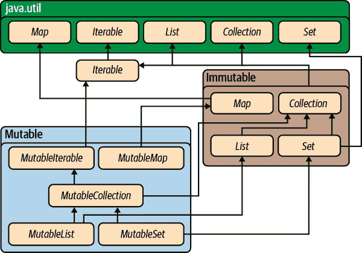
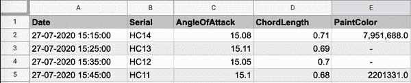
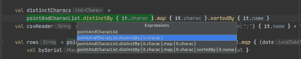
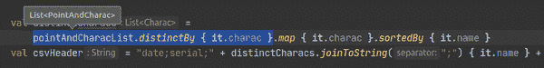

# 第二章：Kotlin 集合框架

在前一章中，我们提供了 Kotlin 语言语法的概述。与任何语言一样，语法是基础，但真正重要的是实际工作时它只是个基础。要完成工作，单靠语法是不够的。为此，你需要一些易于组装成有用代码的表达式和习惯用语，并且其他开发者也能容易理解和修改它们。

几乎每种现代语言的一个重要方面就是它的 *集合框架*：即对象的分组方式，以及操作它们的函数库。

在引入时，Java 的集合框架是当时的最先进技术。如今，超过 20 年后，新语言提供的基本数据结构并没有太大改变。我们熟悉的所有容器（来自 Java 框架，甚至是最早版本的 C++ `stdlib`）仍然存在：`Iterable`、`Collection`、`List`、`Set` 和 `Map`（使用它们的 Java 名称）。然而，面对广泛接受的函数式编程风格，现代语言的集合框架如 Swift 和 Scala 通常提供了一组通用的高阶函数来操作集合：`filter`、`map`、`flatmap`、`zip` 等等。事实上，你会在 Kotlin 标准库的集合框架中找到这些函数。

在本章中，我们首先会介绍集合本身以及 Kotlin 语言赋予的一些有趣扩展。之后，我们会深入探讨一些在集合上运行的强大高阶函数。

# 集合基础知识

Kotlin 的集合框架将 Java 集合框架的数据结构作为一个子集嵌入其中。它用一些新特性包装了基本的 Java 类，并添加了对它们进行的功能性转换。

让我们从对数据结构本身的扩展快速深入到这个集合库。

## Java 互操作性

由于与 Java 的无缝互操作性是 Kotlin 语言的一个核心目标，Kotlin 的集合数据类型基于其 Java 对应物。图表 2-1 说明了它们的关系。



###### 图表 2-1\. Kotlin 集合类型层次结构及其与 Java 的关系。

Kotlin 将其集合类型作为 Java 类型的子类型，以保留 Java 集合框架的所有功能。大多数情况下，Kotlin 是在扩展 Java 框架，而非改变它。它只是添加了一些新的功能性方法。

有一个显著的例外：可变性。

## 可变性

或许，一种将可变性嵌入语法的语言也会将可变性嵌入到其集合系统中，这是合乎逻辑的。

Kotlin 在其集合框架中定义了两个不同的类型层次结构，一个用于可变集合，一个用于不可变集合。这可以在例子 2-1 中看到。

##### 例 2-1\. 可变和不可变列表

```
val mutableList = mutableListOf(1, 2, 4, 5)
val immutableList = listOf(1, 2, 4, 5)
mutableList.add(4)    // compiles

// doesn't compile: ImmutableList has no `add` method.
immutableList.add(2)
```

###### 注意

*可变*是*不可变*的相反。可变对象可以更改，而不可变对象则不能。在尝试优化代码时，这种区别非常关键。由于不可变对象无法更改，可以在多个线程之间安全共享它们。然而，如果要共享可变对象，则必须显式地保证线程安全性。线程安全性需要锁定或复制，这可能很昂贵。

不幸的是，Kotlin 无法保证其不可变集合的不可变性。不可变集合简单地没有修改器函数（`add`、`remove`、`put`等）。特别是当将 Kotlin 集合传递给 Java 代码时——在那里，Kotlin 的不可变性约束不受类型系统强制——无法保证集合的内容不会发生变化。

注意，集合的可变性与集合包含的对象的可变性无关。作为一个非常简单的例子，考虑以下代码：

```
val deeplist = listOf(mutableListOf(1, 2), mutableListOf(3, 4))

// Does not compile: "Unresolved reference: add"
deeplist.add(listOf(3))

deeplist[1][1] = 5      // works
deeplist[1].add(6)      // works
```

变量`deeplist`是一个`List<MutableList<Int>>`。它始终是两个列表的列表。然而，`deeplist`包含的列表的内容可以增长、缩小和更改。

Kotlin 的创建者正在积极研究所有不可变事物。原型`kotlinx.collections.immutable`库旨在成为一组真正的不可变集合。要在您自己的 Android/Kotlin 项目中使用它们，请将以下依赖项添加到您的`build.gradle`文件中：

```
implementation \
'org.jetbrains.kotlinx:kotlinx-collections-immutable:$IC_VERSION'
```

虽然*Kotlinx 不可变集合库*使用先进的算法并对其进行优化，以使其比其他 JVM 不可变集合实现快得多，但这些真正的不可变集合仍然比其可变模拟慢一个数量级。目前还没有解决办法。然而，许多现代开发者愿意为不可变性带来的安全性牺牲一些性能，特别是在并发环境下。^(1)

## 过载运算符

Kotlin 支持有纪律的能力来重载特定中缀运算符的含义，特别是`+`和`-`。Kotlin 的集合框架充分利用了这种能力。为了演示，让我们看一个将`List<Int>`转换为`List<Double>`的函数的天真实现：

```
fun naiveConversion(intList: List<Int>): List<Double> {
    var ints = intList
    var doubles = listOf<Double>()
    while (!ints.isEmpty()) {
        val item = ints[0]
        ints = ints - item
        doubles = doubles + item.toDouble()
    }
    return doubles
}
```

不要这样做。这个例子唯一高效的地方是演示两个中缀运算符`+`和`-`的使用。前者向列表添加元素，而后者从中删除元素。

`+` 或 `-` 运算符左侧的操作数可以定义该运算符的行为。当容器出现在 `+` 或 `-` 的左侧时，定义了这两个运算符的两种实现：一种是右操作数是另一个容器时的实现，另一种是右操作数不是容器时的实现。

将非容器对象添加到容器中会创建一个新的容器，其中包含左操作数（容器）的所有元素以及添加的新元素（右操作数）。将两个容器相加会创建一个新的容器，其中包含两者的所有元素。

类似地，从容器中减去一个对象会创建一个新的容器，其中除了左操作数的第一次出现外，其他所有左操作数的元素都包含在内。从另一个容器中减去一个容器会创建一个新的容器，其中包含左操作数的元素，并移除右操作数中所有元素的所有出现。

###### 注意

`+` 和 `-` 运算符在基础容器有序时保留顺序。例如：

```
(listOf(1, 2) + 3)
    .equals(listOf(1, 2, 3))    // true
(listOf(1, 2) + listOf(3, 4))
    .equals(listOf(1, 2, 3, 4)) // true
```

## 创建容器

Kotlin 没有一种方式可以表示容器字面值。例如，没有一种语法方式可以创建包含数字 8、9 和 54 的 `List`，也没有一种方式可以创建包含字符串 "Dudley" 和 "Mather" 的 `Set`。相反，有方便的方法可以创建几乎同样优雅的容器。示例 2-1 中的代码展示了创建列表的两个简单示例。还有用于创建可变和不可变列表、集合和映射的 `...Of` 方法。

创建文字映射需要了解一个巧妙的技巧。`mapOf` 函数以 `Pairs` 列表作为其参数。每对提供一个键（对的第一个值）和一个值（对的第二个值）。回想一下，Kotlin 支持一组扩展的中缀运算符。其中之一是 `to`，它创建一个新的 `Pair`，其左操作数作为第一个元素，右操作数作为第二个元素。结合这两个特性，您可以方便地构建这样的 `Map`：

```
val map = mapOf(1 to 2, 4 to 5)
```

容器的内容类型使用类似于 Java 的泛型语法表示。例如，前面代码中变量 `map` 的类型是 `Map<Int, Int>`，这是一个将 `Int` 键映射到其 `Int` 值的容器。

Kotlin 编译器在推断使用其工厂方法创建的容器内容类型时非常聪明。显然，在此示例中：

```
val map = mutableMapOf("Earth" to 3, "Venus" to 4)
```

`map` 的类型是 `MutableMap<String, Int>`。但是这又如何？

```
val list = listOf(1L, 3.14)
```

Kotlin 将选择类型层次树中最接近的类型作为容器元素的所有元素的祖先（此类型称为*上界类型*）。在这种情况下，它将选择 `Number`，即 `Long` 和 `Double` 的最近祖先。变量 `list` 具有推断类型 `List<Number>`。

我们可以添加 `String`，如下所示：

```
val list = mutablelistOf(1L, 3.14, "e")
```

所有元素的祖先唯一类型是 `Long`、`Double` 和 `String` 的根，即 Kotlin 类型层次结构的 `Any`。变量 `list` 的类型是 `MutableList<Any>`。

再次强调，不过，请从 第一章 回忆，类型 `Any` 与类型 `Any?` 并不相同。以下内容将不会编译（假设前面示例的定义）：

```
list.add(null)  // Error: Null cannot be a value of a non-null type Any
```

为了允许列表包含`null`，我们必须明确指定其类型：

```
val list: MutableList<Any?> = mutablelistOf(1L, 3.14, "e")
```

我们现在可以创建集合了。那么，我们应该如何处理它们呢？

# 函数式编程

我们对它们进行操作！我们将在这里讨论的几乎所有操作都基于函数式编程的范式。为了理解它们的背景和动机，让我们回顾一下这种范式。

*面向对象编程*（OOP）和 *函数式编程*（FP）都是软件设计的范式。软件架构师们在函数式编程刚刚发明后很快就理解了它的潜力。早期的函数式程序往往速度较慢，但直到最近，函数式风格才能够挑战更为实用的命令式模型以获取更好的性能。随着程序变得更加复杂和难以理解，随着并发变得不可避免，以及编译器优化的改善，函数式编程正在从一种可爱的学术玩具变成每个开发人员都应该掌握的有用工具。

函数式编程鼓励*不可变性*。与代码中的函数不同，数学函数不会改变事物。它们不会“返回”任何东西。它们只有一个值。就像“4”和“2 + 2”是同一个数字的名称一样，给定参数评估的给定函数只是其值的名称（也许是冗长的名称！）。因为数学函数不会改变，所以它们不受时间的影响。在并发环境中工作时，这非常有用。

尽管不同，FP 和 OOP 范式可以共存。Java 显然是作为面向对象语言设计的，而完全可互操作的 Kotlin 几乎可以逐字复制 Java 算法。正如我们在前一章中所宣称的，然而，Kotlin 的真正力量在于其可扩展的函数式编程能力。从事“用 Kotlin 编写 Java”并非罕见。随着他们变得更加舒适，他们倾向于更具代表性的 Kotlin，其中很大一部分涉及应用 FP 的能力。

## 函数式与过程式：一个简单的例子

以下代码展示了处理集合的过程式方式：

```
fun forAll() {
    for (x in collection) { doSomething(x) }
}
```

在示例中，`for` 循环遍历列表。它从 `collection` 中选择一个元素，并将其分配给变量 `x`。然后调用元素的 `doSomething` 方法。它会为列表中的每个元素执行此操作。

集合的唯一约束是必须有一种方法能确保每个元素只被获取一次。这种能力正是由类型 `Iterable<T>` 封装的。

功能性编程范式肯定更简单：没有额外的变量和特殊的语法。只需一个单一的方法调用：

```
fun forAll() = collection.forEach(::doSomething)
```

`forEach` 方法将一个函数作为其参数。在本例中，该参数 `doSomething` 是一个接受 `collection` 中包含的类型的单个参数的函数。换句话说，如果 `collection` 是一个 `String` 列表，`doSomething` 必须是 `doSomething(s: String)`。如果 `collection` 是 `Set<Freeptootsie>`，那么 `doSomething` 必须是 `doSomething(ft: Freeptootsie)`。`forEach` 方法调用其参数 (`doSomething`)，并将集合中的每个元素作为其参数。

这似乎是一个微不足道的区别。它并不是。`forEach` 方法在关注点分离方面要好得多。

`Iterable<T>` 是有状态的，有序的，并且时间相关的。任何曾经遇到过 `ConcurrentModificationException` 的人都知道，迭代器的状态可能与其正在迭代的集合的状态不匹配。尽管 Kotlin 的 `forEach` 操作符并非完全免疫于 `ConcurrentModificationException`，但这些异常发生在实际并发的代码中。

更重要的是，集合用于将传递的函数应用于其每个元素的机制完全是集合自身的事务。特别是，关于函数在集合元素上评估的顺序没有固有的约定。

例如，一个集合可以将其元素分成组。它可以将每个这些组分配给一个单独的处理器，然后重新组合结果。在处理器内核数量迅速增加的时代，这种方法特别有趣。`Iterator<T>` 协议无法支持这种并行执行。

## 功能性安卓

安卓在功能性编程方面有一个古怪的历史。因为其虚拟机与 Java 没有关系，所以 Java 语言的改进并不一定对安卓开发者可用。Java 中一些最重要的变化，包括 lambda 表达式和方法引用，出现在 Java 8 后，在一段时间内并未得到安卓的支持。

尽管 Java 可以编译这些新特性，并且 DEX（安卓的字节码）甚至可以表示它们（尽管可能不是高效地），但是安卓工具链不能将这些特性的表示形式——编译后的 Java 字节码——转换为可以在安卓系统上运行的 DEX 代码。

填补这一空白的第一次尝试是一个名为 *RetroLambda* 的包。随后出现了其他附加库解决方案，有时带有令人困惑的规则（例如，使用 Android Gradle 插件 [AGP] 3.0+，如果想使用 Java Streams API，至少必须定位到 Android API 24）。

现在，使用 Kotlin 在 Android 上已经没有这些限制了。AGP 的最新版本将支持功能编程，即使在较旧版本的 Android 上也是如此。您现在可以在任何支持的平台上使用完整的 Kotlin 集合包。

# Kotlin 转换函数

在本节中，您将看到 Kotlin 如何为集合带来函数式能力，以提供优雅且安全的方式来操作它们。就像在前一章中我们没有访问 Kotlin 的所有语法一样，在本章中我们也不会尝试访问 Kotlin 的所有库函数。并不需要记住它们所有。然而，要想用 Kotlin 来写出符合习惯且高效的代码，掌握几个关键的转换并理解它们的工作方式是必要的。

## 布尔函数

一组方便的集合函数返回一个 `Boolean` 来指示集合是否具有或不具有给定的属性。例如，函数 `any()` 在集合包含至少一个元素时将返回 `true`。如果与谓词一起使用，如 `any { predicate(it) }`，`any` 将在集合中任何元素的谓词评估为 true 时返回 `true`：

```
val nums = listOf(10, 20, 100, 5)
val isAny = nums.any()                 // true
val isAnyOdd = nums.any { it % 1 > 0 } // true
val isAnyBig = nums.any { it > 1000}   // false
```

###### 注意

当 lambda 只接受单个参数且 Kotlin 编译器可以使用类型推断来确定它（通常情况下可以），您可以省略参数声明并使用隐式参数 `it`。在 `any` 方法的谓词定义中，上述示例两次使用了这个快捷方式。

另一个布尔函数 `all { predicate }` 仅在列表中的每个元素都与谓词匹配时返回 `true`：

```
val nums = listOf(10, 20, 100, 5)
val isAny = nums.all { it % 1 > 0 } // false
```

`any` 的相反函数是 `none`。没有谓词时，`none()` 仅在集合中没有元素时返回 `true`。有谓词时，`none { predicate }` 仅在谓词对集合中的任何元素都不成立时返回 `true`。例如：

```
val nums = listOf(10, 20, 100, 5)
val isAny = nums.none()              // false
val isAny4 = nums.none { it == 4 }   // true
```

## 过滤函数

基本的 `filter` 函数将返回一个包含原始集合中与给定谓词匹配的元素的新集合。例如，在这个示例中，变量 `numbers` 将包含一个只有单个值 `100` 的列表：

```
val nums = listOf(10, 20, 100, 5)
val numbers = nums.filter { it > 20 }
```

`filterNot` 函数则是相反的。它返回不匹配谓词的元素。例如，在这个示例中，变量 `numbers` 将包含三个元素 10、20 和 5：即 `nums` 中不大于 20 的元素：

```
val nums = listOf(10, 20, 100, 5)
val numbers = nums.filterNot { it > 20 }
```

`filterNot` 的一个极其方便的特例是函数 `filterNotNull`。它从集合中删除所有的 `null`：

```
val nums = listOf(null, 20, null, 5)
val numbers = nums.filterNotNull() // { 20, 5 }
```

在这个示例中，变量 `numbers` 将是一个包含两个元素 20 和 5 的列表。

## Map

`map` 函数将其参数应用于集合中的每个元素，并返回结果值的集合。请注意，它不会改变所应用的集合；它返回一个新的结果集合。

这里是 `map` 函数在 `Array` 类型上的定义：

```
inline fun <T, R> Array<out T>.map(transform: (T) -> R): List<R>
```

让我们来理解这一点。

从左边开始，`map` 是一个内联函数。现在，“fun”部分应该很清楚了。但是“inline”呢。

关键字 `inline` 告诉 Kotlin 编译器，在每次调用该方法时直接将函数的字节码复制到二进制文件中，而不是生成一个传输到单个编译版本的转移。当调用函数所需的指令数量占总运行所需指令数量的大部分时，使用 `inline` 函数作为空间换时间的权衡是有意义的。有时候，它还可以消除一些 lambda 表达式需要的额外对象分配的开销。

接下来是 `<T, R>`，这是函数定义中使用的两个自由类型变量。我们稍后会回到它们。

接下来是接收者的描述，`Array<out T>`。这个 `map` 函数是 `Array` 类型的扩展函数：它是一个作用在类型为 `T` 的数组上的函数（或者 `T` 的超类，比如 `Any`）。

接下来是 `map` 的参数。该参数是一个名为 *transform* 的函数。Transform 是一个函数 `transform: (T) -> R`：它以 `T` 类型的参数作为其参数，并返回 `R` 类型的结果。哦！这很有趣！函数将应用于数组中的元素，这些元素的类型是 `T`！

最后，`map` 的返回值是 `List<R>`，一个元素类型为 `R` 的列表。如果将 `transform` 应用于数组元素（一个 `T`），则会得到 `R`。

一切都很顺利。在数组上调用 `map` 函数，该函数可以应用于数组的元素，将返回一个包含应用函数结果的新 `List`。

这里有一个示例，返回的是员工记录开始日期的列表，这些开始日期存储为字符串：

```
data class Hire(
    val name: String,
    val position: String,
    val startDate: String
)

fun List<Hire>.getStartDates(): List<Date> {
    val formatter
        = SimpleDateFormat("yyyy-MM-d", Locale.getDefault())
    return map {
        try {
            formatter.parse(it.startDate)
        } catch (e: Exception) {
            Log.d(
                "getStartDates",
                "Unable to format first date. $e")
            Date()
        }
    }
}
```

或许你正在想：“如果转换函数不返回值会发生什么？” 啊！但 Kotlin 函数*总是*有一个值！

例如：

```
val doubles: List<Double?> = listOf(1.0, 2.0, 3.0, null, 5.0)
val squares: List<Double?> = doubles.map { it?.pow(2) }
```

在这个例子中，变量 `squares` 将是列表 [1.0, 4.0, 9.0, null, 25.0]。由于转换函数中的条件运算符 `?.`，如果参数不为空，则函数的值为其参数的平方。然而，如果参数为空，则函数的值为 `null`。

Kotlin 库中 `map` 函数有几种变体。其中一种是 `mapNotNull`，解决了这样的情况：

```
val doubles: List<Double?> = listOf(1.0, 2.0, 3.0, null, 5.0)
val squares: List<Double?> = doubles.mapNotNull { it?.pow(2) }
```

此示例中变量 `squares` 的值是 [1.0, 4.0, 9.0, 25.0]。

`map` 的另一个变体是 `mapIndexed`。`mapIndexed` 也接受一个函数作为其参数。不过，不同于 `map`，`mapIndexed` 的函数参数将集合的元素作为其第二个参数（而不是其第一个唯一参数，如 `map` 的参数所做）。`mapIndexed` 的函数参数以 `Int` 作为其第一个参数。这个 `Int` 是序数，表示集合中元素的位置：第一个元素为 0，第二个为 1，依此类推。

对于大多数类似集合的对象，都有映射函数。甚至对于 `Map`（虽然它们不是 `Collection` 的子类型），也有类似的函数：函数 `Map::mapKeys` 和 `Map::mapValues`。

## flatMap

使 `flatMap` 函数难以理解的是，它可能看起来抽象而且并不特别有用。但事实证明，尽管它抽象，它非常有用。

让我们用一个类比来开始。假设你决定联系你旧高中辩论队的成员。你不知道如何再联系他们了。但你记得，你有所有四年的年鉴，每年鉴上都有辩论队的照片。

你决定将联系成员的过程分为两步。首先，你将检查团队每张照片，并尝试识别出每个人。你将制作一个你识别到的人的名单。然后，你将这四个列表合并成一个辩论队所有成员的单一列表。

这就是 flatmapping！它与容器有关。让我们概括一下。

假设你有某种容器的容器。它是 `CON<T>`。在年鉴示例中，`CON<T>` 是四张照片，一个 `Set<Photo>`。接下来你有一个函数，将 `T -> KON<R>` 映射。也就是说，它接受 `CON` 的一个元素并将其转换为新类型的容器 `KON`，其元素类型为 `R`。在例子中，这是你识别每张照片中的每个人，并生成一个人名列表。`KON` 是一张名单，`R` 是一个人的名字。

`flatMap` 函数在示例中的结果是名字的汇总列表。

对 `CON<T>` 的 flatmap 是这个函数：

```
fun <T, R> CON<T>.flatMap(transform: (T) -> KON<R>): KON<R>
```

注意，为了比较，`flatMap` 如何与 `map` 不同。对于容器 `CON`，使用相同的转换函数，`map` 函数的签名如下：

```
fun <T, R> CON<T>.map(transform: (T) -> KON<R>): CON<KON<R>>
```

`flatMap` 函数将一个容器“展平”。

当我们谈论这个主题时，让我们来看一个非常常见的使用 `flatMap` 的例子：

```
val list: List<List<Int>> = listOf(listOf(1, 2, 3, 4), listOf(5, 6))
val flatList: List<Int> = list.flatMap { it }
```

变量 `flatList` 将具有值 [1, 2, 3, 4, 5, 6]。

这个例子可能会让人困惑。不同于前面的例子，它将一组照片转换为名单，并将这些名单汇总在一起，在这个常见的例子中，两种容器类型 `CON` 和 `KON` 是相同的：它们都是 `List<Int>`。这可能会让你难以理解实际发生了什么。

为了证明它确实有效，让我们通过将这个有些令人困惑的例子中的数量绑定到函数描述中的类型来进行练习。该函数应用于`List<List<Int>>`，因此`T`必须是`List<Int>`。转换函数是恒等函数。换句话说，它是`(List<Int>) -> List<Int>`：它返回其参数。这意味着`KON<R>`也必须是`List<Int>`，而`R`必须是`Int`。然后，`flatMap`函数将返回一个`KON<R>`，即`List<Int>`。

它有效。

## 分组

除了过滤外，Kotlin 标准库还提供了另一组小型转换扩展函数，用于对集合的元素进行分组。例如，`groupBy`函数的签名如下：

```
inline fun <T, K> Array<out T>
    .groupBy(keySelector: (T) -> K): Map<K, List<T>>
```

通常情况下，你可以通过查看类型信息直觉地理解这个函数的行为。`groupBy`是一个函数，它接受一个`Array`（在本例中是`Array`：其他容器类型有对应的函数）。对于每个元素，它应用`keySelector`方法。那个方法以某种方式用类型`K`的值标记这个元素。`groupBy`方法的返回值是一个映射，将每个标签映射到`keySelector`为其分配的元素列表。

一个例子将有所帮助：

```
val numbers = listOf(1, 20, 18, 37, 2)
val groupedNumbers = numbers.groupBy {
    when {
        it < 20 -> "less than 20"
        else -> "greater than or equal to 20"
    }
}
```

变量`groupedNumbers`现在包含一个`Map<String, List<Int>>`。该映射有两个键，“小于 20”和“大于或等于 20”。第一个键的值是列表`[1, 18, 2]`。第二个键的值是`[20, 37]`。

从分组函数生成的映射将保留原始集合中元素的顺序，即输出映射键的值列表。

## 迭代器与序列

假设你要给你的书桌涂漆。你决定如果它是一种漂亮的棕色而不是那种普通的浅棕色，它看起来会更好。你去油漆店，发现大约有 57 种颜色可能正合你心意。

接下来你做什么？你买每一种颜色的样本回家吗？几乎可以肯定不是！相反，你买两三种看起来有希望的颜色并尝试它们。如果它们不是你心中所想，你就回到商店再买三种。你不是买所有候选颜色的样本并对它们进行迭代，而是创建一个过程，让你能够获取下一个候选颜色，考虑到你已经尝试过的颜色。

序列与迭代器的区别类似。迭代器是从现有集合中精确获取每个元素的一种方式。集合已经存在。迭代器只需要对其进行排序。

另一方面，序列并不一定由集合支持。序列由 *生成器* 支持。生成器是一个函数，将提供序列中的下一个项。在这个例子中，如果你需要更多的油漆样本，你有办法得到它们：你回到商店买更多。你不必买下它们并迭代所有。你只需购买几个，因为你知道如何获得更多。你可以在找到正确的颜色之前停下来，带来好运的话，这可能发生在你支付所有可能颜色样本之前。

在 Kotlin 中，你可能会这样表达对桌子油漆的搜索：

```
val deskColor = generateSequence("burnt umber") {
    buyAnotherPaintSample(it)
}.first { looksGreat(it) }

println("Start painting with ${deskColor}!")
```

这个算法很有效。平均而言，使用它的桌子油漆工只会购买 28 个油漆样本，而不是 57 个。

因为序列是惰性的——只在需要时生成下一个元素——所以它们在优化操作中非常有用，甚至在固定内容的集合上也是如此。例如，假设你有一个 URL 列表，想知道哪个是指向包含猫图片页面的链接。你可以这样做：

```
val catPage = listOf(
    "http://ragdollies.com",
    "http://dogs.com",
    "http://moredogs.com")
    .map { fetchPage(it) }
    .first { hasCat(it) }
```

那个算法将下载所有页面。如果你用序列做同样的事情：

```
val catPage = sequenceOf(
    "http://ragdollies.com",
    "http://dogs.com",
    "http://moredogs.com")
    .map { fetchPage(it) }
    .first { hasCat(it) }
```

只会下载第一页。顺序将提供第一个网址，`map` 函数将获取它，并且`first` 函数会被满足。不会下载其他页面。

但要小心！不要请求无限集合的所有元素！例如，这段代码最终会产生 `OutOfMemory` 错误：

```
val nums = generateSequence(1) { it + 1 }
    .map { it * 7 }                 // that's fine
    .filter { it mod 10000 = 0 }    // still ok
    .asList()                       // FAIL!
```

# 一个例子

让我们通过一个例子来具体化这一切。

我们刚刚接触了 Kotlin 标准库提供的几个方便的函数，用于操作集合。使用这些函数，你可以创建复杂逻辑的健壮实现。为了说明这一点，我们将以飞机发动机工厂中使用的真实应用为例。

## 问题

Bandalorium 公司制造飞机发动机。每个发动机部件由其序列号唯一标识。每个零件都要经过严格的质量控制过程，记录其几个关键属性的数值测量。

引擎部件的属性是任何可测量的特征。例如，一根管子的外径可能是一个属性。某些电线的电阻可能是另一个。第三个可能是零件反射特定颜色光的能力。唯一的要求是测量属性必须产生单一的数值。

Bandalorium 想要跟踪的其中一件事是其生产过程的精度。它需要追踪其生产的零件的测量值以及它们是否随时间变化。

挑战在于：

给定某个时间段（比如三个月）内生产的零件属性测量列表，创建类似于 图 2-2 中所示的 CSV（逗号分隔值）报告。如图所示，报告应按测量时间排序。



###### 图 2-2\. CSV 输出示例。

如果我们可以提出一个建议——现在是将这本书放一边一会儿，考虑一下你如何解决这个问题的好时机。也许只需勾勒出足够高级的代码来确信你能够解决它。

## 实现

在 Kotlin 中，我们可能像这样表示一个属性：

```
data class Attr(val name: String, val tolerance: Tolerance)

enum class Tolerance {
    CRITICAL,
    IMPORTANT,
    REGULAR
}
```

名称是属性的唯一标识符。属性的公差表示属性对最终产品质量的重要性：关键、重要或普通。

每个属性可能还有许多其他相关信息。毫无疑问，还有一个测量单位（厘米、焦耳等）、其可接受值的描述，以及可能用于测量的程序。在此示例中，我们将忽略这些特性。

特定引擎零件的属性测量包括以下内容：

+   零件的序列号

+   时间戳显示测量时间

+   测量值

例如，一个测量可以在 Kotlin 中建模如下：

```
data class Point(
    val serial: String,
    val date: LocalDateTime,
    val value: Double)
```

最后，我们需要一种方法将测量与其所测量的属性关联起来。我们像这样建模这种关系：

```
data class TimeSeries(val points: List<Point>, val attr: Attr)
```

`TimeSeries` 将一系列测量与它们所测量的 `Attr` 相关联。

首先，我们构建 CSV 文件的头部：第一行的列标题（参见 示例 2-2）。前两列名为 `date` 和 `serial`。数据集中的其他列名是属性的不同名称。

##### 示例 2-2\. 制作标题

```
fun createCsv(timeSeries: List<TimeSeries>): String {
    val distinctAttrs = timeSeries
        .distinctBy { it.attr } 
        .map { it.attr }        
        .sortedBy { it.name }   

    val csvHeader = "date;serial;" +
        distinctAttrs.joinToString(";") { it.name } +
        "\n"

    /* Code removed for brevity */
}
```


使用 `distinctBy` 函数获取具有不同 `attr` 属性值的 `TimeSeries` 实例列表。


我们有了上一步的不同 `TimeSeries` 的列表，现在只需要 `attr`，因此我们使用 `map` 函数。


最后，我们使用 `sortedBy` 进行字母排序。虽然这不是必需的，但为什么不呢？

现在我们有了不同特性的列表，使用 `joinToString` 函数进行头部格式化非常简单。该函数通过指定字符串分隔符将列表转换为字符串。如果需要，甚至可以指定前缀和/或后缀。

###### 注意

在收集转换函数的返回类型中找到类型是很有用的。例如，在 示例 2-2 中，如果激活了类型提示，你将只得到整个链条的推断类型（变量 `distinctAttrs` 的类型）。这是一个很好的 IntelliJ/Android Studio 功能，可以帮助你！

1.  在源代码中点击 `distinctCharacs`。

1.  按 Ctrl + Shift + P 键。会看到一个下拉窗口出现。

    

1.  选择你想要的步骤，类型会在你眼前出现！

    

构建标题后，我们构建 CSV 文件的内容。这是最技术性和最有趣的部分。

我们试图重现的 CSV 文件的其余部分按日期对数据进行排序。对于每个给定的日期，它会提供一个零件的序列号，然后是该零件在每个感兴趣属性上的测量值。这需要一些思考，因为在我们创建的模型中，这些东西并不直接相关。一个`TimeSeries`仅包含单个属性的数据，而我们需要多个属性的数据。

在这种情况下的常见方法是将输入数据合并和展平为更方便的数据结构，如示例 2-3 所示。

##### 示例 2-3\. 合并和展平数据

```
fun createCsv(timeSeries: List<TimeSeries>): String {
    /* Code removed for brevity */

    data class PointWithAttr(val point: Point, val attr: Attr)

    // First merge and flatten so we can work with a list of PointWithAttr
    val pointsWithAttrs = timeSeries.flatMap { ts ->
        ts.points.map { point -> PointWithAttr(point, ts.attr) }

   /* Code removed for brevity */
}
```

在此步骤中，我们将每个`Point`与其对应的`Attr`关联到一个单独的`PointAndAttr`对象中。这类似于在 SQL 中连接两个表。

`flatMap`函数将转换`TimeSeries`对象列表。在内部，`flatMap`应用的函数使用`map`函数，`series.points.map { ... }`，为每个`TimeSeries`中的点创建一个`PointAndAttr`列表。如果我们使用`map`而不是`flatMap`，我们将产生一个`List<List<PointAndAttr>>`。不过，请记住，`flatMap`会展平容器的顶层，因此这里的结果是一个`List<PointAndAttr>`。

现在我们已经将属性信息“传播”到每个`Point`中，创建 CSV 文件就变得非常简单了。

我们将按日期将`pointWithAttrs`列表分组，以创建一个`Map<LocalDate, List<PointWithAttr>>`。这个映射将包含每个日期的`pointWithAttrs`列表。由于示例似乎有二次排序（按零件序列号），我们将在先前分组的`Map`中的每个列表按序列号分组。剩下的就是字符串格式化，如示例 2-4 所示。

##### 示例 2-4\. 创建数据行

```
fun createCsv(timeSeries: List<TimeSeries>): String {
    /* Code removed for brevity */

    val rows = importantPointsWithAttrs.groupBy { it.point.date }  
    .toSortedMap()                                     
    .map { (date, ptsWithAttrs1) ->
        ptsWithAttrs1
            .groupBy { it.point.serial }             
            .map { (serial, ptsWithAttrs2) ->
                listOf(                                        
                    date.format(DateTimeFormatter.ISO_LOCAL_DATE),
                    serial
                ) + distinctAttrs.map { attr ->
                    val value = ptsWithAttrs2.firstOrNull { it.attr == attr }
                    value?.point?.value?.toString() ?: ""
                }
            }.joinToString(separator = "") {        
                it.joinToString(separator = ";", postfix = "\n")
            }
    }.joinToString(separator = "")

    return csvHeader + rows                               
}
```


按日期分组，使用`groupBy`函数。


对映射（按日期）进行排序。这不是强制性的，但排序的 CSV 更易于阅读。


按序列号分组。


构建每行的值列表。


使用`joinToString`函数格式化每一行并组装所有这些行。


最后，将标题和行作为单个`String`返回。

现在，假设您收到额外的请求，只报告`CRITICAL`或`IMPORTANT`的属性。您只需使用`filter`函数，如示例 2-5 所示。

##### 示例 2-5\. 过滤关键和重要样本

```
fun createCsv(timeSeries: List<TimeSeries>): String {
    /* Code removed for brevity */

    val pointsWithAttrs2 = timeSeries.filter {
        it.attr.tolerance == Tolerance.CRITICAL
                || it.attr.tolerance == Tolerance.IMPORTANT
    }.map { series ->
        series.points.map { point ->
            PointWithAttr(point, series.attr)
        }
    }.flatten()

    /* Code removed for brevity */

    return csvHeader + rows
}
```

就这样！

要测试那段代码，我们可以使用预定义的输入并检查输出是否符合你的期望。我们这里不会展示完整的单元测试集合，只是展示了 CSV 输出的示例，如示例 2-6 所示。

##### 示例 2-6\. 展示应用程序

```
fun main() {
    val dates = listOf<LocalDateTime>(
        LocalDateTime.parse("2020-07-27T15:15:00"),
        LocalDateTime.parse("2020-07-27T15:25:00"),
        LocalDateTime.parse("2020-07-27T15:35:00"),
        LocalDateTime.parse("2020-07-27T15:45:00")
    )
    val seriesExample = listOf(
        TimeSeries(
            points = listOf(
                Point("HC11", dates[3], 15.1),
                Point("HC12", dates[2], 15.05),
                Point("HC13", dates[1], 15.11),
                Point("HC14", dates[0], 15.08)
            ),
            attr = Attr("AngleOfAttack", Tolerance.CRITICAL)
        ),
        TimeSeries(
            points = listOf(
                Point("HC11", dates[3], 0.68),
                Point("HC12", dates[2], 0.7),
                Point("HC13", dates[1], 0.69),
                Point("HC14", dates[0], 0.71)
            ),
            attr = Attr("ChordLength", Tolerance.IMPORTANT)
        ),
        TimeSeries(
            points = listOf(
                Point("HC11", dates[3], 0x2196F3.toDouble()),
                Point("HC14", dates[0], 0x795548.toDouble())
            ),
            attr = Attr("PaintColor", Tolerance.REGULAR)
        )
    )
    val csv = createCsv(seriesExample)
    println(csv)
}
```

如果你将`csv`字符串作为一个带有“.csv”扩展名的文件的内容，你可以使用你喜爱的电子表格工具打开它。图 2-3 展示了我们使用 FreeOffice 得到的内容。


###### 图 2-3\. 最终输出。

使用函数式编程转换数据，就像这个例子中一样，特别强大。为什么？通过结合 Kotlin 的空安全性和标准库的函数，你可以生成几乎没有或没有副作用的代码。添加任何你可以想象的`PointWithAttr`列表。如果有一个`Point`实例有一个`null`值，代码甚至不会编译。每当转换的结果返回一个可能为空的结果时，语言都会强制你考虑到这种情况。在这里，我们在第 4 步中使用了`firstOrNull`函数。

当你的代码在第一次尝试时编译并确切地执行你的期望时，总是让人兴奋。利用 Kotlin 的空安全性和函数式编程，这种情况经常发生。

# 摘要

作为一种函数式语言，Kotlin 采用了诸如映射、合并和其他函数式转换的伟大思想。它甚至允许你利用高阶函数和 Lambda 创建自己的数据转换：

+   Kotlin 集合包括整个 Java 集合 API。此外，该库还提供了所有常见的函数式转换，如映射、过滤、分组等。

+   Kotlin 支持内联函数以实现更高性能的数据转换。

+   Kotlin 集合库支持序列，这是一种通过意图而不是扩展定义的处理集合的方式。当获取下一个元素非常昂贵，甚至在大小不受限制的集合上时，序列是合适的选择。

如果你曾经使用过像 Ruby、Scala 或 Python 这样的语言，也许这些内容对你来说并不陌生。应该是的！Kotlin 的设计基于驱动这些语言开发的许多相同原则。

以更加函数式的方式编写你的 Android 代码就像使用 Kotlin 标准库提供的数据转换操作一样简单。现在你已经熟悉了 Kotlin 语法和 Kotlin 中函数式编程的精神，接下来的章节将专注于 Android 操作系统和其他编程基础知识。Android 开发在 2017 年转向 Kotlin 作为官方语言，因此 Kotlin 在近年来已经对 Android 的发展产生了重大影响，未来也将继续如此。

^(1) Roman Elizarov；关于 Kotlin Collections Immutable Library 的电子邮件访谈。2020 年 10 月 8 日。
