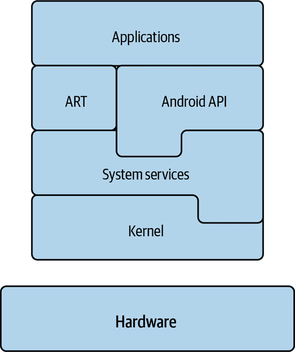
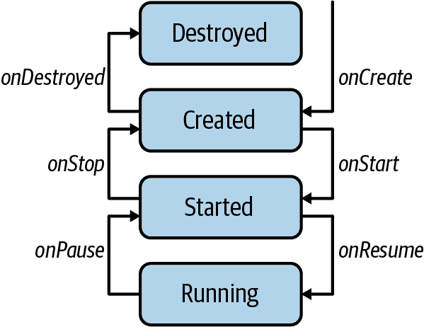
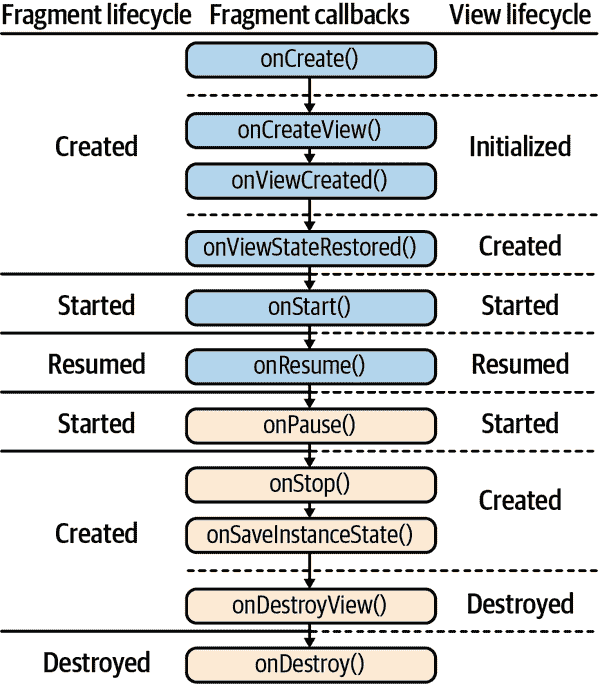
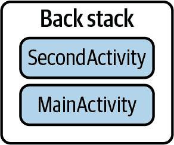
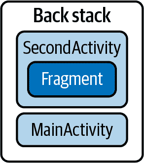
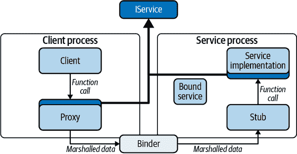

# 第三章：Android 基础知识

本书的前两章是对 Kotlin 语言的快速回顾。本章将审视我们将使用 Kotlin 的环境：Android。

Android 是一个像 Windows 和 MacOS 一样的操作系统。但与这两个系统不同的是，Android 是基于 Linux 的操作系统，就像 Ubuntu 和 Red Hat 一样。不过，与 Ubuntu 和 Red Hat 不同的是，Android 已经针对移动设备进行了非常大量的优化，特别是针对使用电池供电的移动设备。

这些优化中最重要的一项是什么意味着成为一个应用程序。特别是正如我们将看到的那样，Android 应用程序与传统的桌面应用程序相比，与 Web 应用程序有更多的共同点。

但我们稍后会详细讨论这个问题。首先，让我们更详细地看一下 Android 环境。我们将操作系统视为一个堆栈——一种层层叠加的结构。

# Android 堆栈

图 3-1 展示了看待 Android 的一种方式：作为一堆组件的堆栈。堆栈中的每一层都有特定的任务并提供特定的服务；每一层都利用了其下层的功能。

从底部向上走，层次是：

+   硬件

+   内核

+   系统服务

+   Android 运行时环境

+   应用程序



###### 图 3-1. Android 堆栈。

## 硬件

当然，在 Android 堆栈下面是硬件：一块温暖的硅片。虽然硬件不是 Android 堆栈的一部分，但重要的是要认识到 Android 设计的硬件对系统施加了一些相当严格的限制。其中最重要的限制是电力。大多数常见的操作系统假定有无限的电源供应，而 Android 系统不能这样假定。

## 内核

Android 操作系统依赖于 Linux 内核。内核负责提供开发人员所期望的基本服务：文件系统、线程和进程、网络访问、与硬件设备的接口等。Linux 是自由开源的，因此是硬件和设备制造商的热门选择。

由于它基于 Linux，Android 与常见的 Linux 发行版（如 Debian、Centos 等）有些相似。然而，在内核以上的层次，相似性减弱了。尽管大多数常见的 Linux 发行版都严重依赖 GNU 家族的系统软件（并且应该适当地称为 GNU/Linux），但 Android 的系统软件却有很大不同。一般来说，不可能直接在 Android 系统上运行常见的 Linux 应用程序。

## 系统服务

系统服务层非常庞大且复杂。它包括各种实用程序，从作为内核的一部分运行的代码（驱动程序或内核模块），到长时间运行的管理各种日常任务的应用程序（守护程序），再到实现标准功能如加密和媒体呈现的库。

这一层包括几个 Android 特有的系统服务。其中包括 Binder，Android 的基本进程间通信系统；ART，作为 Android 的 Java 虚拟机的类比已取代 Dalvik；以及 Zygote，Android 的应用程序容器。

## Android 运行时环境

系统服务上面的一层是 *Android 运行时环境* 的实现。Android 运行时环境是你通过 `import` 语句包含在应用程序中的库集合：*android.view*、*android.os* 等等。它们是底层提供的服务，供应用程序使用。这些库的有趣之处在于它们通常是用两种语言实现的：Java 和 C 或 C++。

您的应用程序导入的实现部分可能是用 Java 编写的。然而，Java 代码使用 *Java Native Interface* (JNI) 调用本地代码，通常是用 C 或 C++ 编写的。实际上是本地代码与系统服务进行交互。

## 应用程序

最后，在堆栈顶部是 Android 应用程序。在 Android 世界中，应用程序实际上是堆栈的一部分。它们由各个可寻址的组件组成，其他应用程序可以“调用”这些组件。拨号器、相机和联系人程序都是其他应用程序使用的 Android 应用程序示例。

这是 Android 应用程序执行的环境。让我们重新审视应用程序本身的解剖。

# Android 应用环境

Android 应用程序是从源语言（Java 或 Kotlin）翻译成可传输的中间语言 DEX 的程序。当应用程序运行时，DEX 代码安装在设备上，并由 ART 虚拟机解释。

几乎每个开发者都熟悉标准的应用程序环境。操作系统创建一个“进程”——一种虚拟计算机，似乎完全属于该应用程序。系统在进程中运行应用程序代码，它看起来拥有自己的内存、处理器等等，完全独立于可能在同一设备上运行的其他应用程序。应用程序运行，直到它自己决定停止。

Android 并不是按照应用程序的概念工作的。例如，Android 应用程序没有类似于 Java 的 `public static void main` 方法，用于启动典型的 Java 应用程序。相反，Android 应用程序是组件的库。Zygote 运行时管理进程、生命周期等等。只有在需要时，它才调用应用程序的组件。这使得 Android 应用程序非常类似于 Web 应用程序：它们是部署到容器中的组件的集合。

生命周期的另一端，即终止应用程序，可能更加有趣。在其他操作系统上，突然停止应用程序（`kill -9`或“强制退出”）很少发生，只有在应用程序行为不当时才会发生。在 Android 上，这是终止应用程序的最常见方式。几乎每个正在运行的应用程序最终都会突然终止。

与大多数 Web 应用程序框架一样，组件实现为模板基类的子类。组件子类覆盖了框架调用的方法，以提供特定于应用程序的行为。通常情况下，当这些模板方法之一被调用时，超类有重要的工作要做。在这些情况下，子类中覆盖的方法必须调用其覆盖的超类方法。

Android 支持四种类型的组件：

+   活动

+   服务

+   广播接收器

+   内容提供者

就像在 Web 应用程序中一样，这些组件的实现必须在清单中注册：一个 XML 文件。Android 的清单文件通常称为*AndroidManifest.xml*。Android 容器在加载应用程序时解析此文件。应用程序组件（而不是某个总体的应用程序）是 Android 应用程序的基本单元。它们是可单独寻址的，并且可以单独发布以供其他应用程序使用。

那么，应用程序如何定位 Android 组件的目标？通过一个`Intent`。

## 意图和意图过滤器

在 Android 中，组件是通过`Intent`启动的。`Intent`是一个小包，命名了它所针对的组件。它有一些额外的空间，可以指示接收组件执行的特定操作以及请求的一些参数。可以将意图视为函数调用：类的名称、类内的特定函数名称以及调用的参数。系统将意图传递给目标组件。由组件来执行请求的服务。

值得注意的是，与其组件导向的架构一致，Android 实际上没有任何启动应用程序的方式。相反，客户端启动一个组件，可能是用户刚在启动器页面上点击其图标的应用程序的主`Activity`。如果拥有该活动的应用程序尚未运行，则会作为副作用启动它。

一个意图可以显式地命名其目标，如此处所示：

```
context.startActivity(
  Intent(context, MembersListActivity::class.java)))
```

此代码向`Activity` `MembersListActivity`发出一个`Intent`。请注意，这里的调用`startActivity`必须与被启动的组件的类型相匹配：在这种情况下是一个`Activity`。还有其他类似的方法用于向其他类型的组件发送意图（例如`startService`用于`Service`等）。

此代码行触发的`Intent`称为*显式意图*，因为它指定了一个特定的、唯一的类，在一个唯一的应用程序中（由稍后讨论的`Context`标识），该`Intent`将被传递到该类。

由于它们标识了一个独特、具体的目标，显式意图比隐式意图更快速且更安全。出于安全原因，Android 系统的某些地方要求使用显式意图。即使不是必需的，尽可能也应优先选择显式意图。

在应用程序内部，可以始终使用显式意图访问组件。对于公开可见的来自其他应用程序的组件，也可以始终显式访问。那么，为什么还要使用隐式意图呢？因为隐式意图允许动态解析请求。

想象一下，您多年来在手机上使用的电子邮件应用程序允许使用外部编辑器编辑消息。我们现在可以猜测它是通过触发类似以下内容的意图来实现的：

```
val intent = Intent(Intent.ACTION_EDIT))
intent.setDataAndType(textToEditUri, textMimeType);
startActivityForResult(intent, reqId);
```

此意图中指定的目标*并非*显式。`Intent`既未指定`Context`，也未指定上下文内的组件的完全限定名。此意图是*隐式*的，Android 允许任何组件注册以处理它。

组件通过`IntentFilter`注册隐式意图。事实上，您刚刚安装的“出色代码编辑器”在其清单中包含如下`IntentFilter`，完全匹配了前述代码中显示的意图：

```
<manifest ...>
  <application
    android:label="@string/awesome_code_editor">
    ...>
    <activity
      android:name=".EditorActivity"
      android:label="@string/editor">
      <intent-filter>
        <action
          android:name="android.intent.action.EDIT" />
        <category
          android:name="android.intent.category.TEXT" />
      </intent-filter>
    </activity>
  </application>
</manifest>
```

如您所见，意图过滤器与电子邮件应用程序触发的意图匹配。

当 Android 安装出色的代码编辑器应用程序时，它解析应用程序清单并注意到`EditorActivity`声称能够处理类别为`android.intent.category.TEXT`的`EDIT`操作（在[Android 开发者文档](https://oreil.ly/oJNkY)中有更多信息）。它会记住这一事实。

下次您的电子邮件程序请求编辑器时，Android 将在提供的编辑器列表中包含出色的代码编辑器供您使用。您只需安装另一个应用程序，就简单地升级了您的电子邮件程序。这可真是太棒了！

###### 注意

Android 在最近的几个版本中逐渐增加了对隐式意图使用的限制。尽管它们非常强大，但由于可以被任意安装的应用拦截，隐式意图并不安全。从 v30 版本开始，Android 强加了对其使用的严格新限制。特别是，现在不可能在清单中注册许多隐式意图。

## 上下文

因为 Android 组件只是在更大容器中运行的子系统，它们需要一种方式来引用容器，以便从中请求服务。从组件内部来看，容器显示为`Context`。`Context`有几种不同的类型：组件和应用程序。让我们分别看看它们。

### 组件上下文

我们已经看到了像这样的调用：

```
context.startActivity(
  Intent(context, MembersListActivity::class.java)))
```

此调用两次使用了`Context`。首先，启动`Activity`是组件从框架请求的一个功能，即`Context`。在这种情况下，它调用了`Context`方法`startActivity`。接下来，为了使意图明确，组件必须确定包含其想要启动的组件的唯一包。`Intent`的构造函数使用传递的`context`作为其第一个参数来获取`context`所属应用程序的唯一名称：此调用启动了属于此应用程序的`Activity`。

`Context`是一个抽象类，提供对各种资源的访问，包括：

+   启动其他组件

+   访问系统服务

+   访问`SharedPreferences`、资源和文件

Android 的两个组件`Activity`和`Service`本身就是`Context`。除了是`Context`之外，它们还是 Android 容器期望管理的组件。这可能导致问题，所有这些问题都是在示例 3-1 中显示的代码变体。

##### 示例 3-1\. 千万别这样做！

```
class MainActivity : AppCompatActivity() {
  companion object {
    var context: Context? = null;
  }

  override fun onCreate() {
    if (context == null) {
      context = this  // NO!
    }
  }
  // ...
}
```

我们的开发人员已经决定，在他们的应用程序中随时说出像`MainActivity.context.startActivity(...)`这样的事情会非常方便。为了做到这一点，他们在全局变量中存储了对`Activity`的引用，在应用程序的整个生命周期中都可以访问它。会出什么问题呢？

有两件事可能会出错，一件是糟糕的，另一件是可怕的。糟糕的是当 Android 框架知道不再需要`Activity`并希望释放其内存以进行垃圾回收时，但由于伴随对象中的引用，它无法这样做。这个伴随对象中的引用将阻止`Activity`的释放，整个应用程序的生命周期内都是如此。`Activity`已经泄漏了。`Activity`是大对象，泄露其内存绝非小事。

第二件（更糟糕）可能出错的事情是对缓存的`Activity`调用方法可能会导致灾难性失败。很快我们将解释，一旦框架决定不再使用`Activity`，它就会丢弃它。它已经完成了并且将永远不会再次使用它。因此，对象可能会处于不一致的状态。调用其上的方法可能导致难以诊断和重现的失败。

虽然这段代码中的问题很容易看出来，但还有一些更微妙的变体。以下代码可能存在类似的问题：

```
override fun onCreate(savedInstanceState: Bundle?) {
  super.onCreate(savedInstanceState)
  // ...
  NetController.refresh(this::update)
}
```

更难看出的是，回调`this::update`是对`Activity`中包含此`onCreate`方法的`this`方法的引用。一旦`onCreate`完成，`NetController`会保留对此`Activity`的引用，不遵守其生命周期，并可能引起前面描述的任何问题。

### 应用程序上下文

还有另一种上下文类型。 当 Android 启动应用程序时，通常会创建`Application`类的单例实例。 该实例是一个`Context`，虽然它有一个生命周期，但该生命周期基本上与应用程序的生命周期一致。 由于它的寿命很长，因此在其他长期存在的位置中保存对它的引用是非常安全的。 这段代码与之前显示的危险代码类似，因为它存储引用的`context`是`ApplicationContext`：

```
class SafeApp : Application() {
  companion object {
    var context: Context? = null;
  }

  override fun onCreate() {
    if (context == null) {
      context = this
    }
  }
  // ...
}
```

请务必记住，为了 Android 系统使用自定义的`Application`子类而不是其默认值，必须像这样在清单中注册`SafeApp`类：

```
<manifest ...>
  <application
    android:name=".SafeApp"
    ...>
    ...
  </application>
</manifest>
```

现在，当框架创建`ApplicationContext`时，它将是`SafeApp`的一个实例，而不是它本来会使用的`Application`的实例。

还有另一种获取`ApplicationContext`的方法。 在任何上下文中调用方法`Context.getApplicationContext()`，包括`ApplicationContext`本身，在任何情况下都将返回长期存在的应用程序上下文。 但是，这里有个坏消息：`ApplicationContext`并非万能药。 `ApplicationContext`不是`Activity`。 它的`Context`方法的实现与`Activity`的不同。 例如，可能最令人讨厌的是，您无法从`ApplicationContext`启动`Activity`。 `ApplicationContext`上有一个`startActivity`方法，但在除了非常有限的情况下，它只会生成错误消息。

# Android 应用程序组件：构建模块

最后，我们可以把焦点放在组件本身上，这是应用程序的本质。

Android 应用程序组件的生命周期由 Android 框架管理，根据其需要创建和销毁它们。 请注意，这绝对包括实例化！ 应用程序代码绝对不应创建组件的新实例。

请记住，有四种类型的组件：

+   活动

+   服务

+   广播接收器

+   内容提供者

还要记住，以下描述仅仅是简要概述，可能会引起注意潜在陷阱或有趣的特性。 [Android 开发者文档](https://oreil.ly/PJABc)是全面、完整且权威的。

## 活动及其友好

`Activity`组件管理应用程序 UI 的单个页面。 它是 Android 中的 Web 应用程序 servlet 的类比。 它使用 Android 丰富的“小部件”库来绘制单个交互页面。 小部件（按钮、文本框等）是基本的 UI 元素，它们将屏幕表示与提供小部件行为的输入组合在一起。 我们将很快详细讨论它们。

如前所述，理解`Activity`不是一个应用程序非常重要！`Activity`是短暂存在的，仅在它管理的页面可见时才保证存在。当页面变得不可见时，无论是因为应用程序显示了不同的页面，还是因为用户例如接听电话，都不能保证 Android 会保留`Activity`实例或其代表的任何状态。

图 3-2 显示了控制`Activity`生命周期的状态机。这些方法显示为状态转换，成对出现，是`Activity`可能处于的四种状态的书封：*destroyed*，*created*，*started*和*running*。方法严格按顺序调用。例如，在调用`onStart`之后，Android 仅会执行两种可能的调用之一：`onResume`，以进入下一个状态，或`onStop`，以返回到上一个状态。



###### 图 3-2\. `Activity`生命周期。

第一对书封是`onCreate`和`onDestroy`。在它们之间，`Activity`被称为*created*。当 Android 实例化一个新的`Activity`时，几乎立即调用其`onCreate`方法。在此之前，`Activity`处于不一致状态，并且其大多数功能将不起作用。特别要注意的是，大部分`Activity`的功能不便地在其构造函数中是不可用的。

`onCreate`方法是执行`Activity`只需一次初始化的理想位置。这几乎总是包括设置视图层次结构（通常通过膨胀 XML 布局），安装视图控制器或呈现器，并连接文本和触摸监听器。

`Activity`s，同样，在调用它们的`onDestroy`方法后不应再使用。再次强调，`Activity`处于不一致状态，并且 Android 框架将不再使用它。（例如，不会调用`onCreate`来重新启动它。）但要注意：`onDestroy`方法未必是执行重要的最终处理的最佳位置！Android 仅在尽力的基础上调用`onDestroy`。完全可能在所有`Activity`的`onDestroy`方法完成之前，应用程序就会被终止。

`Activity`可以通过调用其`finish()`方法从其自身程序中销毁。

下一对方法是`onStart`和`onStop`。前者`onStart`仅在`Activity`处于已创建状态时才会调用。它将`Activity`移动到其待命状态，称为*started*。处于 started 状态的`Activity`可能部分可见，位于对话框或其他未完全填充屏幕的应用后面。在 started 状态下，`Activity`应该已完全绘制，但不应期望用户输入。良好编写的`Activity`在处于 started 状态时不会运行动画或其他占用资源的任务。

`onStop` 方法仅在已启动的 `Activity` 上调用。它将其返回到已创建状态。

最后一对方法是 `onResume` 和 `onPause`。它们之间，`Activity` 的页面处于设备上的焦点，并接收用户输入。它被称为 *running*。同样，这些方法只会在已启动或运行状态的 `Activity` 上调用。

与 `onCreate` 一起，`onResume` 和 `onPause` 是 `Activity` 生命周期中最重要的部分。它们是页面开始运行、数据更新、动画等使 UI 反应灵敏的关键部分。

###### 提示

尊重这些方法的配对是一个好习惯：在一对中的开始方法中启动某些操作，在相同一对的结束方法中停止它们。例如，在 `onResume` 中尝试启动网络轮询，在 `onStop` 中停止，这样做可能导致难以调试的错误。

### Fragments

`Fragment` 只是 Android 版本 3（蜂巢，2011 年）中稳定组件功能的一个事后补充。它们可能会感觉有些“附加”。它们被引入是为了使得可以跨屏幕共享 UI 实现，这些屏幕的形状和大小差异如此之大，以至于影响了导航，尤其是手机和平板电脑。

`Fragment` 不是 `Context`。虽然它们在大部分生命周期中持有对底层 `Activity` 的引用，但 `Fragment` 并未在清单中注册。它们是在应用程序代码中实例化的，不能使用 `Intent` 启动。它们也非常复杂。比较 `Fragment` 的状态图表（参见 图 3-3）与 `Activity` 的区别！

详细讨论如何（或者说是否）使用 `Fragment` 是本书讨论的范围之外。简单来说，可以将 `Fragment` 想象成网页中的 *iframe*：几乎是嵌入在 `Activity` 中的 `Activity`。它们是完整的、逻辑上的 UI 单元，可以以不同的方式组合成页面。

如图所示，`Fragment` 的生命周期与 `Activity` 类似（尽管更复杂）。然而，`Fragment` 只有在附加到 `Activity` 时才有用。这就是 `Fragment` 生命周期更复杂的主要原因：它的状态可能会受到所附加的 `Activity` 状态变化的影响。

正如 `Activity` 在其 `onCreate` 方法调用之前以不一致的状态可编程访问一样，`Fragment` 在其附加到 `Activity` 之前也可以通过编程访问。在 `onAttach` 和 `onCreateView` 方法调用之前，必须非常小心地使用 `Fragment`。



###### 图 3-3\. `Fragment` 生命周期。

### 返回栈

Android 支持一种称为*卡片堆栈*导航的导航范式。导航到新页面将该页面堆叠在前一个页面之上。当用户按下返回按钮时，当前页面从堆栈中弹出，以显示之前占据屏幕的页面。这种范式对大多数人类用户来说相当直观：推送新卡片到顶部；弹出卡片以返回到之前的页面。

在 Figure 3-4 中，当前的`Activity`是一个名为 SecondActivity 的活动。按下返回按钮将导致名为 MainActivity 的`Activity`占据屏幕。

注意，与 Web 浏览器不同，Android 不支持*前进*导航。一旦用户按下返回按钮，就没有简单的导航设备让他们返回到弹出的页面。Android 利用这一点推断，如果需要资源，可以销毁 SecondActivity（在这种情况下）。



###### Figure 3-4\. 返回栈以后进先出（LIFO）顺序存储`Activity`的页面。

`Fragment`也可以作为片段事务的一部分放入返回栈中，如 Figure 3-5 所示。



###### Figure 3-5\. 一个`Fragment`事务，在返回栈中，将在包含它的`Activity`被弹出之前被还原。

将一个 Fragment 添加到返回栈中在与标记结合时可能特别有用，如下面的代码所示：

```
// Add the new tab fragment
supportFragmentManager.beginTransaction()
    .replace(
        R.id.fragment_container,
        SomeFragment.newInstance())
    .addToBackStack(FRAGMENT_TAG)
    .commit()
```

此代码创建`SomeFragment`的一个新实例，并将其添加到返回栈中，并用标识符`FRAGMENT_TAG`（一个字符串常量）标记。如下面的代码所示，您可以使用`supportFragmentManager`弹出*所有*返回栈的内容，直到标记：

```
manager.popBackStack(
    FRAGMENT_TAG,
    FragmentManager.POP_BACK_STACK_INCLUSIVE)
```

当返回栈为空时，按下返回按钮将用户返回到启动器。

## 服务

一个`Service`是一个几乎完全没有 UI 的 Android 组件，几乎与`Activity`一样。这听起来有点奇怪，因为`Activity`的唯一存在理由是它管理 UI！

Android 设计时硬件与现在通常不同得多。第一部 Android 手机，HTC Dream，于 2008 年 9 月宣布发布。它的物理内存非常少（192 MB），根本不支持虚拟内存。它最多只能同时运行几个应用程序。Android 的设计者需要一种方式来知道应用程序何时不执行有用工作，以便可以回收其内存用于其他用途。

很容易判断一个`Activity`何时不执行有用工作。它只有一个任务：管理一个可见页面。如果应用程序仅由`Activity`组成，则很容易判断何时不再需要其中一个并且可以终止它。当应用程序的所有`Activity`都不可见时，应用程序不执行任何有用工作并且可以被回收。就是这么简单。

当应用需要执行长时间运行的任务，而这些任务与任何 UI 都没有关联时就会出现问题：比如监控位置、在网络上同步数据集等等。尽管 Android 明确偏向于“如果用户看不到它，为什么要做它？”的态度，但它也不情愿地承认长时间运行的任务的存在，并发明了 `Service` 来处理它们。

虽然 `Service` 仍然有它们的用处，但是它们被设计用来做的大部分工作，早期版本的 Android 上因其硬件限制而现在可以通过其他技术完成。Android 的 `WorkManager` 是管理重复任务的绝佳方式。还有其他更简单、更可维护的方法在后台运行任务，比如在工作线程上运行。一个简单的单例类可能已经足够了。

Service 组件仍然存在，并且仍然扮演着重要角色。

实际上有两种不同类型的 `Service`：*bound* 和 *started*。尽管 `Service` 基类混淆地是两者的模板，但这两种类型完全正交。一个单一的 `Service` 可以是两者之一或两者兼而有之。

两种类型的 `Service` 都有 `onCreate` 和 `onDestroy` 方法，它们的行为与 `Activity` 中的完全相同。由于 `Service` 没有 UI，它不需要 `Activity` 的其他模板方法。

尽管 `Service` 还有其他的模板方法。一个具体的 `Service` 实现哪些方法取决于它是 started 还是 bound。

### Started Services

*Started* `Service` 是通过发送 `Intent` 启动的。虽然可以创建一个返回值的 started service，但这样做可能会显得不够优雅复杂，并且可能表明设计可以改进。大部分情况下，started services 是一次性的：比如“把这个放到数据库里”或者“发送到网络上去”。

要启动一个服务，发送一个意图。意图必须指明服务的名称，可能需要明确传递当前上下文和服务类。如果服务提供多个功能，则意图还可以指示打算调用的功能。它可能还会提供适合调用的参数。

服务将意图作为 Android 框架调用的参数接收，传递给 `Service.onStart` 方法。请注意，这不是在“后台”完成的！`onStart` 方法在主/UI 线程上运行。`onStart` 方法解析 `Intent` 内容，并适当地处理其中的请求。

一个行为良好的启动 `Service` 在完成工作后会调用 `Service.stopSelf()`。这个调用类似于 `Activity.finish()`：它告诉框架 `Service` 实例不再执行有用的工作，可以被回收。现代版本的 Android 实际上很少关注服务是否已经停止自己。`Service` 可能会被暂停甚至终止，使用的标准不那么自愿（参见 [Android 开发者文档](https://oreil.ly/yGloh)）。

### 绑定服务

*绑定* `Service` 是 Android 的 IPC 机制。绑定服务提供了一个客户端和服务器之间的通信通道，是进程不可知的：两端可能属于同一个应用程序，也可能不是。绑定服务，至少是它们提供的通信通道，是 Android 的核心所在。它们是应用程序将任务发送到系统服务的机制。

一个绑定的服务本身实际上并没有做太多事情。它只是 `Binder` 的工厂，一个半双工 IPC 通道。虽然本书不详细描述 Binder IPC 通道及其使用，但其结构对于使用任何其他常见 IPC 机制的用户来说都很熟悉。图 3-6 展示了这个系统。

通常，服务提供一个 *代理*，看起来像一个简单的函数调用。代理 *打包* 请求服务的标识符（本质上是函数名）及其参数，将它们转换为可以通过连接传输的数据：通常是整数和字符串等非常简单的数据类型的聚合体。打包的数据通过 Binder 内核模块传输到绑定服务提供的 *存根*，这是连接目标。



###### 图 3-6\. Binder IPC。

存根 *解组* 数据，将其转换回到对服务实现的函数调用。请注意，代理函数和服务实现函数具有相同的签名：它们实现了相同的接口（如 图 3-6 所示的 IService）。

Android 在实现系统服务时 *广泛* 使用了这种机制。实际上是远程进程调用的函数是 Android 的一个基本部分。

`ServiceConnection` 类的一个实例表示到绑定服务的连接。以下代码演示了它的使用：

```
abstract class BoundService<T : Service> : ServiceConnection {
    abstract class LocalBinder<out T : Service> : Binder() {
        abstract val service: T?
    }

    private var service: T? = null

    protected abstract val intent: Intent?

    fun bind(ctxt: Context) {
        ctxt.bindService(intent, this, Context.BIND_AUTO_CREATE)
    }

    fun unbind(ctxt: Context) {
        service = null
        ctxt.unbindService(this)
    }

    override fun onServiceConnected(name: ComponentName, binder: IBinder) {
        service = (binder as? LocalBinder<T>)?.service
        Log.d("BS", "bound: ${service}")
    }

    override fun onServiceDisconnected(name: ComponentName) {
        service = null
    }
}
```

`BoundService` 的子类提供了将要绑定的服务的类型，以及一个定位到它的 `Intent`。

客户端通过`bind`调用发起连接。作为响应，框架会启动到远程绑定服务对象的连接。远程框架调用绑定服务的`onBind`方法，并带有意图。绑定服务创建并返回一个`IBinder`的实现，同时也是客户端请求的接口的实现。请注意，这通常是对绑定服务本身的引用。换句话说，`Service`通常不仅是工厂，还是实现。

服务端使用绑定服务提供的实现来创建远程侧存根。然后通知客户端，表明准备就绪。客户端框架创建代理，然后最终调用`ServiceConnection`的`onServiceConnected`方法。客户端现在持有与远程服务的活动连接。利润！

正如从`onServiceDisconnected`方法的存在可以猜到的那样，客户端随时可能会丢失与绑定服务的连接。尽管通知通常是即时的，但客户端在收到断开连接通知之前调用服务的调用可能会失败。

与启动服务类似，绑定服务代码不会在后台运行。除非明确要求，否则绑定服务代码将在应用程序的主线程上运行。这可能会令人困惑，因为绑定服务可能会在*不同*应用程序的主线程上运行。

如果服务实现中的代码必须在后台线程上运行，则服务实现负责安排。尽管绑定服务的客户端调用是异步的，但不能控制服务本身运行的线程。

与其他所有组件一样，服务必须在应用程序清单中注册：

```
<manifest xmlns:android="http://schemas.android.com/apk/res/android">
  <application...>
    <service android:name=".PollService"/>
  </application>
</manifest>
```

## 内容提供者

`ContentProvider`是应用程序中保存数据的类似 REST 的接口。因为它是一个 API，而不仅仅是对数据的直接访问，所以`ContentProvider`可以对其发布的内容及发布对象行使非常精细的控制。外部应用程序通过 Binder IPC 接口访问`ContentProvider`，通过该接口`ContentProvider`可以获取关于查询过程、其所持有的权限以及请求的访问类型的信息。

早期的 Android 应用程序通常通过将数据放入可公开访问的文件中来共享数据。即便如此，Android 也鼓励使用`ContentProvider`代替。在安全性方面，更近期的 Android 版本已经使直接共享文件变得困难，从而使`ContentProvider`变得更加相关。

###### 注意

虽然`ContentProvider`提供了对存储数据的访问，但您必须拥有某种数据存储以读取和写入数据。Android Jetpack 提供了 Room 持久化库作为选择。正如其官方文档所述，Room 提供了“一个抽象层，允许更强大的访问，并充分利用 SQLite 的全部功能。”

想了解如何使用 Room 在本地数据库中保存数据的更多信息，请查看[Android 开发者文档](https://oreil.ly/9OwGH)。

一个特别有趣的`ContentProvider`的能力是可以将一个打开的文件传递给另一个程序。请求的程序不需要使用文件路径直接访问文件。`ContentProvider`可以以任何方式构造它传递的文件。通过传递一个打开的文件，`ContentProvider`移出了自身的循环。它直接给请求的程序访问数据的权限。在客户端和数据之间，既没有`ContentProvider`也没有其他 IPC 机制。客户端就像打开了文件一样简单地读取文件。

应用程序像往常一样通过在应用程序清单中声明来发布`ContentProvider`：

```
<application...>
  <provider
   android:name="com.oreilly.kotlin.example.MemberProvider"
   android:authorities="com.oreilly.kotlin.example.members"
   android:readPermission="com.oreilly.kotlin.example.members.READ"/>
 </application>
```

这个 XML 元素表示应用程序包含名为`com.oreilly.kotlin.example.MemberProvider`的类，它必须是`android.content.ContentProvider`的子类。该元素声明`MemberProvider`是 URL *content://com.oreilly.kotlin​​.exam⁠⁠ple.members* 的数据请求的权限。最后，声明要求请求的应用程序必须持有权限“com.oreilly.kotlin.example.members.READ”，以获取任何访问权限，即使如此，它们也仅能获取读取权限。

`ContentProvider`确实具有 REST 接口应有的 API：

`query()`

从特定表中获取数据。

`insert()`

在内容提供者中插入新行并返回内容 URI。

`update()`

这更新现有行的字段并返回更新的行数。

`delete()`

这删除现有行并返回删除的行数。

`getType()`

这返回给定 Content URI 的 MIME 数据类型。

`MemberProvider`的`ContentProvider`可能只实现这些方法中的第一个，因为它是只读的。

## 广播接收器

最初`BroadcastReceiver`的概念是作为一种数据总线。监听器可以订阅以获取感兴趣的事件通知。然而，随着系统的发展，`BroadcastReceiver`已被证明过于昂贵和容易遭受安全问题，无法广泛使用。它们仍然主要是系统用来向应用程序发出重要事件信号的工具。

`BroadcastReceiver`最常见的用途也许是作为启动应用程序的一种方式，即使没有用户的请求。

`Intent` `android.intent.action.BOOT_COMPLETED` 是在 Android 系统稳定后，系统重新启动后由 Android 系统广播的。应用程序可以注册以接收此广播，例如：

```
<receiver android:name=".StartupReceiver">
    <intent-filter>
        <action android:name="android.intent.action.BOOT_COMPLETED"/>
    </intent-filter>
</receiver>
```

如果一个应用这样做，它的`StartupReceiver`将会启动，以接收操作系统重新启动时的`BOOT_COMPLETED` `Intent`广播。正如前面所述，启动`StartupReceiver`的副作用是启动包含接收器的应用程序。

应用程序利用这种方式创建*守护程序*，即始终运行的应用程序。尽管这种方法不成熟且易碎（即使在早期的 Android 中，行为也随版本变化而变化），但这个技巧足够好，以至于许多应用程序都在使用它。即使 Android 26 版本在后台进程管理方面引入了一些非常激进的变化（`BroadcastReceiver`不能在其清单中为隐式广播注册；必须使用`Context.registerReceiver`动态注册它们），开发者仍在继续寻找使用它的方法。

###### 注意

Android 26 的隐式 Intent 规则有例外。接收短信、更改语言环境、检测 USB 设备和其他一些 Intent 是*允许*的，应用程序可以在其清单中注册它们。`ACTION_USB_ACCESSORY_ATTACHED`、`ACTION_CONNECTION_STATE_CHANGED`和我们亲爱的旧朋友`ACTION_BOOT_COMPLETED`都属于允许的 Intent 之列。有关更多信息，请查看[Android 开发者文档](https://oreil.ly/PMNhM)。

`Activity`、`Service`、`ContentProvider`和`BroadcastReceiver`是构成 Android 应用程序的四个基本构件。随着 Android 的发展和改进，它引入了新的抽象化，使这些基本机制变得模糊。现代 Android 应用程序可能只直接使用其中一两个构件，许多开发者将永远不会编写`ContentProvider`或`BroadcastReceiver`。

这里的基本教训是值得重复的，即 Android 应用程序不是传统意义上的“应用程序”。它更像是一个 Web 应用程序：一组在请求时为框架提供服务的组件。

# Android 应用架构

到目前为止，在本章中我们已经讨论了 Android 系统架构。虽然理解该架构对于任何严肃的 Android 开发者来说都是必不可少的，但这并不足以理解如何编写健壮、无 bug 的 Android 程序。作为证据，只需看看多年来 Android 存在的许多尝试和放弃的工具和抽象化。然而，时间和经验磨练了 Android 的游戏规则，并使得编写一个稳健、易于维护的应用程序的路径变得更加容易。

## MVC：基础

对于具有用户界面的应用程序的原始模式称为模型-视图-控制器（MVC）。该模式引入的创新是保证视图——即屏幕上呈现的内容——始终保持一致。它通过坚持数据流的单向循环来实现这一点。

一切都始于用户。他们在屏幕上看到某些东西（*视图*：我告诉过你这是一个循环！），作为对所看到的反应，采取一些行动。他们触摸屏幕，输入文字，说话，或者其他。他们做一些改变应用程序状态的事情。

他们的输入由*控制器*处理。控制器有两个责任。首先，它命令用户的输入。对于任何给定的用户事件，比如点击“停止”按钮，所有其他用户事件要么在该点击之前发生，要么在之后发生。从不会同时处理两个事件。

###### 注意

控制器是单线程的暗示是原始 MVC 模式中最重要的一个方面之一。先前的多线程策略（包括 Java 的抽象窗口工具包[AWT]）通常会产生死锁的噩梦，因为来自用户和发送给用户的消息会试图以不同的顺序获取相同的锁。

控制器的第二个责任是将用户输入转化为对*模型*的操作。

模型是应用程序的业务逻辑。它可能将某种持久数据存储与可能的网络连接结合起来，同时还有从控制器接收和解释输入的规则。在理想的 MVC 架构中，它是唯一保存应用程序当前状态的组件。

模型再次理想地只允许向视图发送一条消息：“事情已经改变了”。当视图收到这样的消息时，它完成了自己的工作。它从模型请求应用程序状态，解释它，并在屏幕上呈现它。它呈现的始终是模型的一致快照。在这一点上，用户可以看到新状态并采取新的响应动作。这个循环继续。

尽管当 MVC 模式被引入时相当革命性，但仍有改进的空间。

## 小部件

正如我们之前在`Activity`组件的上下文中提到的，小部件是一个将视图组件和控制器组件结合在一起的单一类。在前面讨论了 MVC 模式及其强调分离这两者之后，发现像`Button`、`TextBox`和`RadioButton`这样明显将两者结合起来的类可能会感到奇怪。

小部件不会破坏 MVC 架构。在每个小部件中仍然有明确的视图和控制器代码。小部件的控制器部分从不直接与视图交谈，视图也不会接收来自控制器的事件。这些部分是独立的；它们只是捆绑在一个方便的容器中。

将这两个功能结合起来似乎显而易见。如果一个按钮的图像可以放置在屏幕的任何地方，而不响应点击，那有什么用呢？对于 UI 组件的渲染器以及处理其输入的机制，成为同一组件的一部分就是有意义的。

## 本地模型

随着 Web、浏览器的出现以及整个 MVC 循环所需的长时间延迟，开发人员开始意识到需要将屏幕状态作为单独的 UI-Local Model。随着时间的推移，开发人员根据设计模式的其他特性，给这个组件起了几个名字。为了避免混淆，在本章的其余部分，我们将称其为*Local Model*。

使用 Local Model 引出了一个新的模式，可以说是一个两层 MVC——甚至被称为“八字模式”。当用户执行操作时，Controller 更新 Local Model 而不是 Model，因为 Model 更新可能需要进行网络连接。Local Model 并不是业务逻辑。它尽可能简单地表示 View 的状态：哪些按钮是开启的，哪些是关闭的，哪个框中有什么文本，以及图表中的颜色和长度。

Local Model 在响应操作时有两个作用。首先，它通知 View 事物已经改变，以便 View 可以从新的 Local Model 状态重新渲染屏幕。此外，类似于简单 MVC 的 Controller，Local Model 通过代码将状态变化转发给 Model。作为回应，Model 最终会通知——这次是 Local Model——已经有更新，Local Model 应该同步自己。这可能导致第二个请求，要求 View 更新自己。

# Android 模式

在 Android 中，不论采用何种模式，Activity 对象——或者可能是其近亲 Fragment——扮演 View 的角色。这基本上是由于 Activity 对象的结构：它拥有屏幕并且可以访问组成视图的部件。然而，随着时间的推移，正如适用于基于 MVC 的 UI，Activity 对象变得越来越简单。在现代 Android 应用程序中，一个 Activity 可能只会做很少的事情：填充视图、将用户的入站事件委托给 Local Model，并观察感兴趣的 Local Model 状态，以响应更新重新绘制自身。

## Model–View–Intent

Android 社区采用的最古老版本的 MVC 之一被称为 Model–View–Intent。该模式通过使用 Intent 和它们的载荷，将 Activity 与 Model 解耦。虽然这种结构能够产生出色的组件隔离，但可能会相当慢，而且构建 Intents 的代码相当庞大。尽管它仍然成功使用，但较新的模式已大部分取代了它。

## Model–View–Presenter

所有基于 MVC 的模式的目标都是减少三个组件之间的耦合，并使信息流单向传递。然而，在一个简单的实现中，视图和本地模型各自持有对另一个的引用。也许视图从某种工厂获取本地模型的实例，然后注册它。尽管微妙——并且不管信息流的明显方向如何——持有对特定类型对象的引用都是耦合的表现。

在过去几年中，有几次对 MVC 模式进行了改进，试图减少耦合。虽然这些改进通常会导致更好的代码，但它们之间的区别，以及用来标识它们的名称，并不总是清晰明了。

最早的一种改进方法是，用接口代替视图和本地模型相互引用。该模式通常称为 Model–View–Presenter（MVP）。在这种模式的实现中，本地模型持有的不是视图`Activity`的引用，而仅仅是某个接口的实现。这个接口描述了本地模型可以从其对等体期望的最小操作集。它基本上并不知道视图是一个视图：它只看到用于更新信息的操作。

视图代理用户输入事件给其 Presenter。正如前面所述，Presenter 响应事件，根据需要更新本地模型和模型状态。然后通知视图需要重新绘制自己。因为 Presenter 准确知道发生了哪些变化，它可以请求视图仅更新受影响的部分，而不是强制整个屏幕重绘。

这种架构的最重要特性是，Presenter（本架构称为本地模型）可以进行单元测试。测试只需模拟视图提供给 Presenter 的接口，就可以完全隔离它与视图的联系。极其简洁的视图和可测试的 Presenter 可以极大增强应用的健壮性。

但我们可能会比这做得更好。本地模型可能根本不持有对视图的引用！

## Model–View–ViewModel

谷歌通过引入 Jetpack，支持了一种称为 Model–View–ViewModel（MVVM）的架构。因为它在现代 Android 框架内部得到支持，所以它是现代 Android 应用程序中最常见和最讨论的模式。

在 MVVM 模式中，通常使用`Activity`或`Fragment`充当视图。视图代码尽可能简单，通常完全包含在`Activity`或`Fragment`子类中。也许一些复杂的视图需要单独的类来进行图像渲染或`RecyclerView`。尽管如此，这些视图也会由`Activity`或`Fragment`直接实例化和安装。

ViewModel 负责将更新视图和后端模型的命令连接在一起。这种模式的新特性是使用单一接口`Observable`传输本地模型状态的更改到视图。

MVVM 模式中，ViewModel 代表可视化数据作为一组`Observable`，而不是 MVP 模式中使用的多个 Presenter 接口。视图只需将自己注册为这些可观察对象的观察者，并对其中数据变化的通知做出反应。

Jetpack 库将这些`Observable`称为`LiveData`。`LiveData`对象是一个可观察的数据持有者类，具有单个泛型接口，用于通知订阅者数据底层的更改。

与 MVP 类似，MVVM 让模拟和单元测试变得容易。MVVM 引入的重要新特性是生命周期感知。

注意的读者会发现，在之前描述的 MVP 模式版本中，确实*完全*做了我们在 示例 3-1 中警告的事情：它在一个长期存在的对象中存储了对`Activity`的引用，而`Activity`是一个具有由 Android 控制的生命周期的对象！应用程序必须自行确保引用不会超出目标对象的生命周期。

Jetpack 支持的 MVVM 模式实现大大减少了这个问题。在其实现中，对视图的唯一引用是对`LiveData`可观察对象的订阅。`LiveData`对象在它们的生命周期结束时自动识别`Fragment`和`Activity`的观察者，并注销它们。

使用 JetPack 实现的 MVVM 模式构建的应用程序可以非常优雅。对于各种应用程序，视图将包含一个简单的声明性方法来绘制屏幕。它将将这个方法注册为观察者以观察 ViewModel 的可观察对象。ViewModel 将用户输入转换为对后端模型的调用，并根据模型通知更新其可观察对象。就是这么简单。

# 摘要

祝贺你，在这一小节里，你成功地涵盖了大量信息！

记住，这些材料中的大部分都是基础知识。重要的不是你掌握这里呈现的所有信息。事实上，你可能永远都不会接触到像`ContentProvider`或`BroadcastReceiver`这样的东西。只使用对你有实际意义的内容，并在它们变得有用时逐步掌握它们。

这里有一些要记住的关键点：

+   Android 应用程序不是传统意义上的“应用程序”。它更像是一个 Web 应用程序：一组组件，它们在请求时为框架提供服务。

+   Android 操作系统是一个非常专业化的 Linux 发行版。每个应用程序都被视为一个单独的“用户”，并拥有自己的私有文件存储空间。

+   Android 有四种组件。它们是：`Activity`（活动），`Service`（服务），`ContentProvider`（内容提供者）和`BroadcastReceiver`（广播接收器）。`Activity`、`Service`和`ContentProvider`必须在 Android 清单文件中注册，并可能需要权限：

    +   `Activity`是 Android 应用程序的用户界面。它们在`onCreate`时开始其生命周期，在`onResume`后可以与用户进行交互，并且可能随时被中断（`onPause`）。

    +   `Fragment`是具有独立生命周期的复杂实体。它们可用于在 UI 页面中组织独立的 UI 容器。

    +   `Service`可以是启动服务和/或绑定服务。从 API 26 开始，服务的后台使用引入了限制，因此通常规则是，如果用户以任何方式与任务进行交互，则应将服务转换为前台服务。

    +   除非`BroadcastReceiver`使用了系统明确允许的隐式意图和操作，否则可能需要从应用程序代码动态注册广播接收器。

+   谨慎使用`Activity Context`。活动具有不受您应用程序控制的生命周期。对`Activity`的引用*必须*遵守活动的实际生命周期。

+   Android 中的一般软件架构，如 MVI、MVP 和 MVVM，旨在使`Fragment`和`Activity`保持简洁，并鼓励更好地分离关注点和测试，同时具备“生命周期感知”。

现在我们已经复习了基本规则并探索了领域，我们正式开始在 Kotlin 中实现结构化协程的旅程。在接下来的章节中，我们将开始将此基础应用于研究 Android 中的内存和线程。了解 Android 的组织细节将揭示即将解决的问题。
