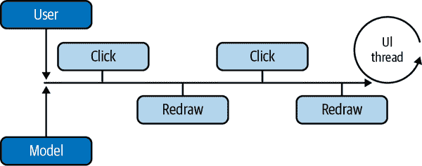
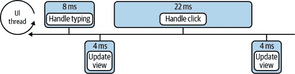
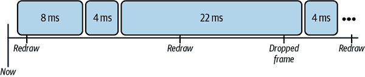
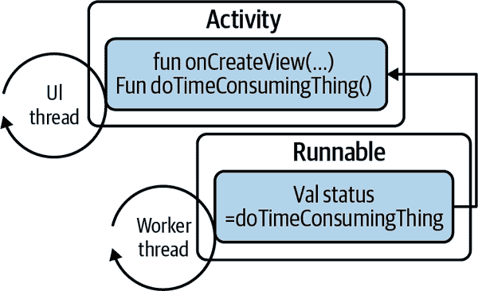
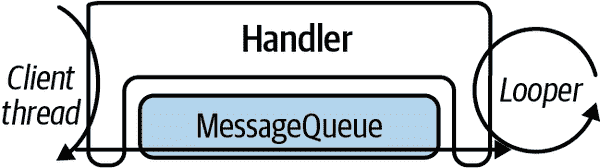

# 第四章：并发编程在 Android 中

本章不专门关注 Kotlin。相反，它将介绍围绕*并发编程*的一些问题，这些问题是本书其余部分讨论的内容。它还将介绍一些已经提供给 Android 开发者的用于管理并发任务的工具。

并发编程有点像黑魔法：是由自称为巫师的人做的事情，初学者可能会触碰到危险。当然，编写正确的并发程序可能非常具有挑战性。这尤其是因为并发程序中的错误并不总是立即显现出来。几乎不可能测试并发错误，即使已知其存在，要复现它们也可能极为困难。

关于担心并发编程风险的开发人员，有三件事是需要记住的：

+   几乎你每天做的一切，*除了* 编程，都是并发的。在并发环境中你可以很好地相处。奇怪的是编程，它是按顺序进行的。

+   如果你正试图理解并发编程带来的问题，你走在了正确的道路上。即使对并发性的理解不完整，也比复制示例代码并祈祷要好。

+   并发编程就是 Android 的工作方式。除了最简单的 Android 应用程序外，其他任何东西都需要并发执行。最好开始并弄清楚它到底是什么！

在具体进入细节之前，让我们先定义一些术语。

第一个术语是*进程*。进程是应用程序可以使用的内存，以及一个或多个执行线程。内存空间属于进程——没有其他进程可以影响它。^(1) 一个应用程序通常作为一个单独的进程运行。

当然，这引出了第二个术语：*线程*。线程是一系列指令，按顺序逐一执行。

这也引出了在某种程度上驱动本书其余部分的术语：*线程安全*。如果一组指令在多个线程执行时，线程执行指令的任何可能顺序都不能产生不能在每个线程完全执行代码时以某种顺序逐一执行的情况下获得的结果。这有点难以解析，但它只是说，无论多个线程同时执行代码还是按顺序逐一执行，代码都产生相同的结果。这意味着运行程序会产生可预测的结果。

如何使程序具备线程安全性？关于这个问题有很多不同的想法。我们想提出一个清晰、相对易于理解并且总是正确的方法。只需要遵循一个相对清晰、相对简单的规则。我们将在接下来的几页中阐述这个规则。不过首先，让我们更详细地讨论一下什么是线程安全性。

# 线程安全性

我们已经说过，线程安全的代码不能在同时由多个线程执行时产生不能通过一次性执行线程产生的结果。然而，这个定义在实践中并不十分有用：没有人会测试所有可能的执行顺序。

也许我们可以通过查看代码可能*线程不安全*的一些常见方法来解决问题。

线程安全失败可以分为几类。最重要的两类是 *原子性* 和 *可见性*。

## 原子性

几乎所有开发人员都了解原子性的问题。此代码不是线程安全的：

```
fun unsafe() { globalVar++ }
```

多个线程执行此代码可能会互相干扰。执行此代码的每个线程可能会读取相同的 `globalVar` 值，比如 3。每个线程可能会将该值递增为 4，然后每个线程可能会更新 `globalVar` 为值 4。即使有 724 个线程执行了此代码，当所有线程执行完毕时，`globalVar` 的值可能仍然为 4。

没有可能让这 724 个线程依次执行该代码，并使 `globalVar` 最终值为 4。因为并发执行的结果可能与串行执行生成的任何可能结果都不同，根据我们的定义，此代码不是线程安全的。

要使代码线程安全，我们需要使变量 `globalVar` 的读取、递增和写入操作*原子化*。原子操作是指不能被另一个线程中断的操作。如果读取、递增和写入操作是原子的，那么没有两个线程能看到相同的 `globalVar` 值，程序保证表现如预期。

原子性很容易理解。

## 可见性

我们的第二类线程安全错误，可见性，更难以理解。此代码也不是线程安全的：

```
var shouldStop = false

fun runner() {
    while (!shouldStop) { doSomething() }
}

fun stopper() { shouldStop = true }
```

运行函数 `runner` 的线程可能永远不会停止，即使另一个线程运行 `stopper`。运行 `runner` 的线程可能永远不会注意到 `shouldStop` 的值已更改为 `true`。

这背后的原因是优化。硬件（使用寄存器、多层缓存等）和编译器（使用提升、重排序等）都在尽最大努力使您的代码运行速度快。为此，硬件实际执行的指令可能与 Kotlin 源代码看起来完全不同。特别是，尽管您认为 `shouldStop` 是一个单一变量，但硬件可能对其至少有两种表示：一个在寄存器中，一个在主存储器中。

你绝对希望这样！你不希望你的代码中的循环依赖于对主存储器的访问，而不是使用缓存和寄存器。快速内存优化了您的代码，因为其访问时间比主存储器快几个数量级。

然而，为了使示例代码正常工作，你必须告诉编译器，它不能将`shouldStop`的值保留在本地内存（寄存器或缓存）中。如果按照建议，在不同种类的硬件内存中有`shouldStop`的多个表示，编译器必须确保快速本地表示的`shouldStop`值被推送到对所有线程可见的内存中。这称为*发布*该值。

`@Synchronized` 就是这么做的方式。同步告诉编译器，必须确保在同步块内执行的代码的任何副作用对所有其他线程可见，然后执行线程离开该块。

因此，同步不仅仅是关于硬件，或者关于必须保护和不需要保护的棘手和复杂的标准。同步是开发人员与编译器之间的一种契约。如果你不同步代码，编译器可以根据串行执行来进行任何安全证明的优化。如果某处有其他代码在不同的线程上运行，并使编译器的证明无效，你必须同步代码。

所以，这里有一个规则。如果你想编写线程安全的代码，你只需遵循这一简短而明确的规则。来自 Java 并行编程的圣经[*Java Concurrency in Practice*](https://oreil.ly/4zx8L)的释义：^(2) 每当多个线程访问给定状态变量，并且其中一个可能会写入它时，它们都必须使用同步来协调对它的访问。

顺便说一句，那个引用并没有区分同步的读访问和写访问。除非可以保证*没有人*会改变共享状态，否则所有的访问，无论是读还是写，都必须同步。

# Android 线程模型

如第三章所述，MVC 架构的一个含义是单线程 UI（视图和控制器）。尽管多线程 UI 看起来非常诱人（视图一个线程，控制器一个线程……），但在 20 世纪 70 年代就放弃了尝试构建它们，因为很明显，它们最终陷入了死锁的混乱中。

自从 MVC 的普遍采纳以来，标准 UI 设计是由单线程队列服务的（在 Android 中是*主线程*或*UI 线程*）。如图 4-1 所示，事件——无论是用户发起的（点击、轻触、输入等）还是模型发起的（动画、请求重新绘制/更新屏幕等）——都会被单一 UI 线程按顺序排队并最终处理。



###### 图 4-1\. UI 线程。

这正是安卓 UI 的工作方式。一个应用程序的主线程（应用程序进程的原始线程）成为其 UI 线程。作为初始化的一部分，该线程进入一个紧密的循环。在应用程序的其余生命周期中，它逐个从标准 UI 队列中移除任务并执行它们。因为 UI 方法始终在单线程上运行，UI 组件并不试图保持线程安全。

听起来很不错，对吧？单线程 UI 且无需担心线程安全问题。但有个问题。为了理解这个问题，我们需要摘下开发者的帽子，稍微讨论一下安卓设备终端用户的体验。特别是，我们需要深入了解视频显示的一些细节。

###### 注意

当每个线程都持有另一个需要的资源时，线程被称为*死锁*：它们都无法向前进展。例如，一个线程可能持有显示值的小部件并需要显示该值的容器。同时，另一个线程可能持有容器并需要该小部件。如果所有线程始终按相同的顺序获取资源，则可以避免死锁。

# 丢帧

通过长期的电影和电视观看经验，我们知道，即使实际上不是连续运动，人脑也可以被欺骗为感知到连续的运动。快速显示一系列静止图像，一个接一个地显示，观察者会感觉是平滑的、不间断的运动。图像显示的速率称为*帧率*。它以每秒帧数（fps）来衡量。

电影的标准帧率是 24 fps，在整个好莱坞黄金时代都很有效。老式电视使用的帧率为 30 fps。你可以想象，比较快的帧率比慢的帧率更能欺骗大脑。即使你不能确切感知到差异，但如果你在高帧率视频和低帧率视频之间进行比较，你很可能会注意到不同。快速的那个会感觉“更流畅”。

许多安卓设备使用 60 fps 的帧率。这意味着屏幕每 16 毫秒（ms）重绘一次。这意味着 UI 线程，即处理 UI 任务的单个线程，必须在每 16 毫秒准备好新图像，以便在屏幕重绘时绘制。如果生成图像所需时间超过这个时间，并且在屏幕重绘时新图像还没有准备好，我们称帧已丢失。

屏幕再次重绘并显示新帧之前会再等待 16 ms。如果帧率从 60 fps 降至 30 fps，那就接近人脑能感知的阈值了。只需少数几个丢失的帧就会让用户界面产生所谓的“卡顿”感觉。

考虑在图 4-2 中显示的任务队列，在安卓的标准渲染速率为 60 fps。



###### 图 4-2。排队等待 UI 线程的任务。

处理用户的字符输入是第一个任务，执行时间为 8 毫秒。接下来的任务是更新视图，是动画的一部分。为了看起来平滑，动画需要每秒至少更新 24 次。然而，处理用户点击的第三个任务需要 22 毫秒。图示中的最后一个任务是动画的下一帧。图 4-3 展示了 UI 线程的视角。



###### 图 4-3\. 一帧丢失的情况。

第一个任务在 8 毫秒内完成。动画在 4 毫秒内向显示缓冲区绘制了一帧。然后 UI 线程开始处理点击。点击处理几毫秒后，硬件进行了重绘，此时动画帧已经显示在屏幕上。

不幸的是，16 毫秒后，处理点击的任务仍未完成。排在其后的动画下一帧的任务也未被处理。当进行重绘时，显示缓冲区的内容与上一次重绘时完全相同。动画帧已经丢失。

###### 注意

计算机显示通常使用一个或多个显示缓冲区来管理。*显示缓冲区* 是内存中的一个区域，用户代码在其中“绘制”将显示在屏幕上的内容。偶尔在*刷新间隔*（大约 60 帧每秒时约为 16 毫秒）时，用户代码会短暂地被锁定在缓冲区之外。系统使用缓冲区的内容来渲染屏幕，然后将其释放回用户代码以进行进一步更新。

几毫秒后，当点击处理任务完成时，动画任务有机会更新显示缓冲区。尽管显示缓冲区现在包含动画的下一帧，屏幕将不会在几毫秒内进行重绘。动画的帧率已经降低到每秒 30 帧，接近可见的闪烁频率。

一些新设备，如谷歌的 Pixel 4，能够以更高的帧率刷新屏幕。例如，帧率提高到两倍（120 帧每秒），即使 UI 线程连续错过两帧，它仍然只需等待额外的 8 毫秒进行下一次重绘。在这种情况下，两次渲染之间的间隔仅约为 24 毫秒；远远优于在 60 帧每秒时掉帧造成的 32 毫秒成本。

虽然提高帧率可能有所帮助，但安卓开发者必须保持警惕，确保应用程序尽量减少掉帧现象。如果应用程序正在进行一项昂贵的计算，并且该计算花费的时间超过预期，它将错过重绘的时间段，导致掉帧，应用程序会感觉卡顿。

这种情况正是为什么在安卓应用程序中必须处理并发的原因。简而言之，UI 是单线程的，UI 线程绝不能被占用超过几毫秒。

对于非平凡应用程序，唯一可能的解决方案是将耗时工作（如数据库存储和检索、网络交互和长时间运算）传递给其他线程。

# 内存泄漏

我们已经处理了并发引入的一个复杂性：线程安全。Android 的组件化架构引入了第二个同样危险的复杂性：*内存泄漏*。

当对象不再有用时无法释放（垃圾回收），就会发生内存泄漏。在最坏的情况下，内存泄漏可能导致`OutOfMemoryError`和应用程序崩溃。即使情况没有变得那么糟，内存不足也可能强制更频繁地进行垃圾回收，进而导致“卡顿”。

如第三章所讨论的，Android 应用程序特别容易发生内存泄漏，因为一些最常用组件的生命周期（如`Activity`、`Fragment`、`Service`等）不受应用程序控制。这些组件的实例很容易变成无用的负担。

在多线程环境中尤为如此。考虑将任务卸载到工作线程，如下所示：

```
override fun onViewCreated(
    view: View,
    savedInstanceState: Bundle?
) {
    // DO NOT DO THIS!
    myButton.setOnClickListener {
        Thread {
            val status = doTimeConsumingThing()
            view.findViewById<TextView>(R.id.textview_second)
                .setText(status)
        }
            .start()
    }
}
```

将耗时工作从 UI 线程移开的想法是很崇高的。不幸的是，前述代码存在几个缺陷。你能发现它们吗？

首先，如本章前述，Android UI 组件不是线程安全的，不能在 UI 线程之外访问或修改。在此代码中，从非 UI 线程调用`setText`是不正确的。许多 Android UI 组件会检测到此类不安全的使用，并在发生时抛出异常。

解决此问题的一种方法是使用 Android 工具包中的安全线程分派方法将结果返回到 UI 线程，如下所示。请注意，此代码*仍然*存在缺陷！

```
override fun onViewCreated(
    view: View,
    savedInstanceState: Bundle?
) {
    // DO NOT DO THIS EITHER!
    myButton.setOnClickListener {
        Thread {
            val status = doTimeConsumingThing()
            view.post {
                view.findViewById<TextView>(R.id.textview_second)
                    .setText(status)
            }
        }
            .start()
    }
}
```

这解决了第一个问题（UI 方法`setText`现在从主线程调用），但代码仍然不正确。尽管语言的曲折性使问题难以看清楚，但问题是在`ClickListener`中新创建的线程隐含地引用了一个由 Android 管理的对象。由于`doTimeConsumingThing`是`Activity`（或`Fragment`）的方法，因此在点击监听器中新创建的线程隐式引用了该`Activity`，如图 4-4 所示。



###### 图 4-4\. 泄露的活动。

如果将调用 `doTimeConsumingThing` 写成 `this.doTimeConsumingThing`，可能会更加明显。但是仔细想想，显然无法在没有持有该对象引用的情况下（在这种情况下是 `Activity` 的实例），调用方法 `doTimeConsumingThing`。现在 `Activity` 实例在工作线程上运行的 `Runnable` 持有其引用时，该实例将无法进行垃圾回收。如果线程运行时间较长，`Activity` 的内存就会泄露。

解决这个问题比上一个问题困难得多。一种方法假定保证仅短时间（少于一秒）持有隐式引用的任务可能不会导致问题。Android 操作系统本身偶尔会创建这种短暂的任务。

`ViewModel` 和 `LiveData` 确保你的 UI 总是展示最新的数据，并且安全地进行更新。结合 Jetpack 的 `viewModelScope` 和协程（即将介绍的两个内容），这些工具使得更容易控制取消不再相关的后台任务，并确保内存完整性和线程安全。如果没有这些库，我们必须自行正确处理所有这些问题。

###### 注意

谨慎设计，使用 Jetpack 的生命周期感知、可观察的 `LiveData` 容器，如第三章所述，可以帮助消除内存泄漏，并消除使用已完成生命周期的 Android 组件的风险。

# 管理线程的工具

实际上，我们刚刚讨论的代码中存在第三个缺陷；一个深层次的设计缺陷。

线程是非常昂贵的对象。它们占用空间大，影响垃圾回收，并且在它们之间切换上下文远非免费。创建和销毁线程，如示例中的代码所做的那样，是非常浪费和不明智的，可能会影响应用程序的性能。

增加更多线程并不能使应用程序完成更多的工作：CPU 的处理能力是有限的。那些没有执行的线程只是代表尚未完成的工作，是一种昂贵的表示方式。

例如考虑一下，如果用户反复点击之前例子中的 `myButton`，会发生什么。即使每个生成的线程执行的操作都很快且线程安全，创建和销毁这些线程将使应用程序速度变得非常慢。

应用程序的最佳实践是线程策略：一种基于实际有用线程数量的应用程序全局策略，用于控制任何给定时间运行的线程数量。一个智能的应用程序维护一个或多个线程池，每个线程池都有特定目的，并且每个线程池都由一个队列控制。客户端代码有工作需要完成时，将任务加入到线程池中由池线程执行，并在必要时恢复任务结果。

接下来的两个部分介绍 Android 开发人员可用的两种线程原语，`Looper`/`Handler` 和 `Executor`。

## Looper/Handler

`Looper`/`Handler`是一组协作类的框架：一个`Looper`，一个`MessageQueue`及其上排队的`Message`，以及一个或多个`Handler`。

`Looper`其实就是一个 Java `Thread`，通过从其`run`方法调用`Looper.prepare()`和`Looper.start()`方法进行初始化，代码如下：

```
var looper = Thread {
    Looper.prepare()
    Looper.loop()
}
looper.start()
```

第二种方法`Looper.loop()`会使线程进入一个紧密循环，它会检查其`MessageQueue`中的任务，逐个移除并执行它们。如果没有要执行的任务，线程将休眠，直到有新任务入队为止。

###### 注意

如果你觉得这听起来有些眼熟，你是对的。Android 的 UI 线程就是从应用程序进程的主线程中创建的`Looper`。

`Handler`是在`Looper`队列上排队任务并进行处理的机制。你可以像这样创建一个`Handler`：

```
var handler = new Handler(someLooper);
```

主线程的`Looper`可以通过方法`Looper.getMainLooper`随时访问。因此，创建一个将任务发布到 UI 线程的`Handler`就变得如此简单：

```
var handler = new Handler(Looper.getMainLooper);
```

实际上，这正是前面示例中展示的`post()`方法的工作原理。

`Handler`非常有趣，因为它们处理`Looper`队列的两端。为了理解其工作原理，让我们跟随一个单一任务通过`Looper`/`Handler`框架的过程。

有几种用于将任务加入队列的`Handler`方法。以下是其中的两种：

+   `post(task: Runnable)`

+   `send(task: Message)`

这两种方法定义了两种稍微不同的任务入队方式：发送消息和发布`Runnable`。实际上，`Handler`总是将`Message`加入队列。但为了方便起见，`post...()`方法组会将`Runnable`附加到`Message`上，以进行特殊处理。

在本例中，我们使用`Handler.post(task: Runnable)`方法将任务加入队列。`Handler`从池中获取一个`Message`对象，将`Runnable`附加到其中，并将`Message`添加到`Looper`的`MessageQueue`的末尾。

我们的任务现在等待执行。当它达到队列的首部时，`Looper`会接收到它，并且有趣的是，它会将任务交回给正是将其入队的那个`Handler`。因此，入队任务和执行任务的`Handler`实例始终是同一个。

这可能看起来有点令人困惑，直到你意识到提交任务的`Handler`代码可以在任何应用程序线程上运行。然而，处理任务的`Handler`代码始终在`Looper`上运行，如图 4-5 所示。



###### 图 4-5\. `Looper`/`Handler`。

`Looper`通过调用`Handler`方法来处理任务，首先检查`Message`是否包含`Runnable`。如果是（因为我们使用了`post...()`方法之一，所以任务包含`Runnable`），`Handler`会执行`Runnable`。

如果我们使用了 `send...()` 方法之一，`Handler` 将会将 `Message` 传递给自己的可重写方法 `Handler.handleMessage(msg: Message)`。`Handler` 的子类将在该方法中使用 `Message` 属性 `what` 来决定它应执行的特定任务，以及属性 `arg1`、`arg2` 和 `obj` 作为任务参数。

`MessageQueue` 实际上是一个排序队列。每个 `Message` 包含其可能被执行的最早时间之一作为其属性之一。在前面两种方法中，`post` 和 `send` 简单地使用当前时间（消息将会“现在”立即被处理）。

另外两种方法允许任务在将来某个时间被排队运行：

+   `postDelayed(runnable, delayMillis)`

+   `sendMessageDelayed(message, delayMillis)`

使用这些方法创建的任务将被排序到 `MessageQueue` 中，在指定的时间执行。

###### 注意

正如注意到的，一个 `Looper` 只能尽力在请求的时间运行任务。虽然它不会在规定时间之前运行延迟的任务，但如果另一个任务占用了线程，该任务可能会运行晚一些。

`Looper`/`Handler` 是一种非常多才多艺和高效的工具。Android 系统广泛使用它们，尤其是 `send...()` 调用，这些调用不会进行任何内存分配。

注意，一个 `Looper` 可以向自身提交任务。执行任务并在给定间隔后重新安排自己（使用 `...Delayed()` 方法之一）是 Android 创建动画的一种方式。

还要注意，因为 `Looper` 是单线程的，只在特定 `Looper` 上运行的任务无需线程安全。当任务仅在单个线程上运行时，无论是异步运行的任务还是同步运行的任务，都不需要同步或排序。正如前面提到的，整个 Android UI 框架仅依赖于这一假设，它运行在 UI Looper 上。

## Executors 和 ExecutorServices

Java 5 引入了 `Executor` 和 `ExecutorService`，作为新并发框架的一部分。新框架提供了几个更高级的并发抽象，允许开发人员摆脱线程、锁和同步的许多细节。

正如其名，`Executor` 是一个执行提交给它的任务的实用工具。它的合同是单一方法 `execute(Runnable)`。

Java 提供了接口的多个实现，每个都具有不同的执行策略和目的。其中最简单的可以使用方法 `Executors.newSingleThreadExecutor` 获得。

单线程执行器与前面部分讨论的 `Looper`/`Handler` 非常相似：它是一个单线程前面的无界队列。新任务被排入队列，然后按顺序从服务队列的单个线程上执行和删除。

`Looper`/`Handler` 和单线程 `Executor` 各有各的优点。例如，`Looper`/`Handler` 经过了大量优化，避免了对象分配。另一方面，单线程 `Executor` 会在其线程因失败任务而中止时替换线程。

单线程 `Executor` 的一种泛化是 `FixedThreadPoolExecutor`：它不是单个线程，而是其无界队列由固定数量的线程服务。与单线程 `Executor` 类似，`FixedThreadPoolExecutor` 将替换线程当任务终止它们时。然而，`FixedThreadPoolExecutor` 不保证任务顺序，并且会同时执行任务，硬件允许的情况下。

单线程调度的 `Executor` 是 Java 中的 `Looper`/`Handler` 的等效物。它类似于单线程的 `Executor`，但像 `Looper`/`Handler` 一样，它的队列按执行时间排序。任务按时间顺序执行，而不是提交顺序。当然，与 `Looper`/`Handler` 类似，长时间运行的任务可能会阻止后续任务按时执行。

如果这些标准执行工具都不符合你的需求，你可以创建一个定制的 `ThreadPoolExecutor` 实例，指定诸如其队列的大小和顺序、线程池中的线程数及其创建方式，以及当池的队列满时会发生什么。

还有一种 `Executor` 类型值得特别关注——`ForkJoinPool`。Fork-join 池存在的原因是观察到有时单个问题可以分解为多个子问题，并可以并发执行。

这种问题的一个常见示例是将两个大小相同的数组相加。同步解决方案是迭代，`i = 0 .. n - 1`，在每个 `i` 处计算 `s[i] = a1[i] + a2[i]`。

有一个聪明的优化方法，但如果任务分成几部分的话就可能实现，这时任务可以细分为 `` n` `` 子任务，每个子任务计算 `s[i] = a1[i] + a2[i]`。

注意，一个执行服务创建的预计要自己处理的子任务可以将子任务排入线程本地队列。由于本地队列主要由单个线程使用，几乎不会争用队列锁。大部分时间队列属于线程本身，它独自放入和取出东西。这可以是一种相当的优化。

考虑一组这些线程，每个线程都有自己的快速本地队列。假设其中一个线程完成了所有工作，准备使自己空闲，同时另一个线程池线程有一个包含 200 个子任务的队列要执行。空闲线程偷走了这些工作。它获取了忙线程队列的锁，拿走了一半的子任务，把它们放入自己的队列，并开始处理它们。

当并发任务衍生出其自身的子任务时，工作窃取技巧最为有用。正如我们将看到的，Kotlin 协程恰好就是这样的任务。

# 作业管理工具

就像生产汽车时可能存在规模经济一样，有一些重要的优化需要系统的大规模视图。考虑手机上的无线电使用情况。

当应用程序需要与远程服务交互时，手机通常处于节电模式，必须启动其无线电，连接到附近的基站，协商连接，然后传输其消息。由于连接协商是开销，手机会保持连接一段时间。假设一旦进行了一次网络交互，很可能会有其他的网络交互随之而来。然而，如果有一分钟左右没有使用网络，手机就会返回其静态的、节电的状态。

鉴于这种行为，想象一下当多个应用程序在不同时间发送请求时会发生什么情况。当第一个应用程序发送其请求时，手机会启动其无线电，协商连接，传输应用程序的消息，等待一段时间，然后进入休眠状态。然而，就在手机进入休眠状态时，下一个应用程序尝试使用网络。手机必须重新启动，重新协商连接等。如果有多个应用程序这样做，手机的无线电几乎始终处于全功率状态。同时，它也花费大量时间重新协商刚刚断开的网络连接。

没有单个应用程序能够解决这类问题。需要系统级别的电池和网络使用视图来协调多个应用程序（每个应用程序有其自身的需求）并优化电池寿命。

Android 8.0（API 26+）引入了对应用程序资源消耗的限制。这些限制包括以下内容：

+   当应用程序具有可见活动或运行前台服务时，应用程序才处于前台状态。绑定和启动的`Service`不再阻止应用程序被杀死。

+   应用程序不能使用其清单来注册隐式广播。同时，发送广播也有限制。

这些限制可能会使应用程序难以执行“后台”任务：与远程同步、记录位置等。在大多数情况下，可以使用`JobScheduler`或 Jetpack 的`WorkManager`来减轻这些限制。

每当需要安排中等到大型任务超过几分钟时，最佳做法是使用这些工具之一。任务的大小很重要：每隔几毫秒刷新动画或者几秒钟安排另一个位置检查可能适合使用线程级别的调度器。但是，每隔 10 分钟从上游刷新数据库则明显应该使用`JobScheduler`来完成。

## JobScheduler

`JobScheduler`是 Android 用于安排未来任务（可能是重复任务）的工具。它非常灵活，并且除了优化电池寿命外，还提供了系统状态的详细信息，应用程序以前需要通过启发式推断。

事实上，`JobScheduler`作业实际上是一个绑定服务。应用程序在其清单中声明一个特殊服务，使其对 Android 系统可见。然后使用`JobInfo`为该服务安排任务。

当满足`JobInfo`的条件时，Android 会绑定任务服务，就像我们在“绑定服务”中描述的那样。任务一旦绑定，Android 就会指示服务运行并传递任何相关参数。

创建`JobScheduler`任务的第一步是在应用程序清单中注册它。如下所示：

```
<service
    android:name=".RecurringTask"
    android:permission="android.permission.BIND_JOB_SERVICE"/>
```

在这个声明中，重要的是权限。除非服务声明了*确切的*`android.permission.BIND_JOB_SERVICE`权限，否则`JobScheduler`将无法找到它。

请注意，任务服务对其他应用程序不可见。这不是问题。`JobScheduler`是 Android 系统的一部分，可以查看普通应用程序无法看到的内容。

设置`JobScheduler`任务的下一步是在方法`schedulePeriodically`中调度它，如下所示：

```
const val TASK_ID = 8954
const val SYNC_INTERVAL = 30L
const val PARAM_TASK_TYPE = "task"
const val SAMPLE_TASK = 22158

class RecurringTask() : JobService() {
    companion object {
        fun schedulePeriodically(context: Context) {
            val extras = PersistableBundle()
            extras.putInt(PARAM_TASK_TYPE, SAMPLE_TASK)

            (context.getSystemService(Context.JOB_SCHEDULER_SERVICE)
                as JobScheduler)
                .schedule(
                    JobInfo.Builder(
                        TASK_ID,
                        ComponentName(
                            context,
                            RecurringTask::class.java
                        )
                    )
                        .setPeriodic(SYNC_INTERVAL)
                        .setRequiresStorageNotLow(true)
                        .setRequiresCharging(true)
                        .setExtras(extras)
                        .build()
                )
        }
    }

    override fun onStartJob(params: JobParameters?): Boolean {
        // do stuff
        return true;
    }

    override fun onStopJob(params: JobParameters?): Boolean {
        // stop doing stuff
        return true;
    }
}
```

这个特定任务将每`SYNC_INTERVAL`秒运行一次，但仅在设备上有足够空间且当前连接到外部电源时才会运行。这些只是用于调度任务的众多属性中的两个。调度的粒度和灵活性可能是`JobScheduler`最吸引人的特性。

请注意，`JobInfo`类似于我们在第三章中为`Intent`确定目标的方式来识别要运行的任务类。

系统将根据`JobInfo`中设置的条件，在任务符合运行条件时调用任务的`onStartJob`方法。这也是`JobScheduler`存在的原因。由于它了解所有预定任务的调度和要求，因此可以全局优化调度，以最小化对电池的影响，特别是在电池寿命方面。

小心！`onStartJob`方法在主（UI）线程上运行。如果预定的任务很可能需要超过几毫秒，必须使用前面描述的某种技术在后台线程上安排它。

如果`onStartJob`返回`true`，系统将允许应用程序运行，直到它调用`jobFinished`或者`JobInfo`中描述的条件不再满足为止。例如，如果运行上一个示例中的`RecurringTask`的手机从其电源中断开连接，则系统将立即调用正在运行任务的`onStopJob()`方法通知它停止运行。

当 `JobScheduler` 任务接收到 `onStopJob()` 调用时，必须停止。文档建议任务有一点时间整理并干净地终止。不幸的是，它对“一点时间”的确切时间非常模糊。然而，它在警告上非常严厉，指出“在收到此消息后，您的应用程序行为由您完全负责；如果忽略此消息，您的应用程序可能开始运行不正常。”

如果 `onStopJob()` 返回 `false`，即使其 `JobInfo` 中的条件得到满足，任务也不会再次被调度：该作业已被取消。重复任务应始终返回 `true`。

## WorkManager

`WorkManager` 是一个 Android Jetpack 库，它包装了 `JobScheduler`。它允许单个代码库充分利用支持 `JobScheduler` 的现代 Android 版本，并在不支持的旧版 Android 上运行。

虽然 `WorkManager` 提供的服务及其 API 与包装它的 `JobScheduler` 提供的类似，但它们距离实现细节更远，抽象更为简洁。

在 `JobScheduler` 中，通过 `onStopJob` 方法的 `Boolean` 返回值编码了周期重复任务和一次性任务的区别，而 `WorkManager` 则显式地表明了这一点；有两种类型的任务：`OneTimeWorkRequest` 和 `PeriodicWorkRequest`。

排队工作请求始终返回一个标记，即 `WorkRequest`，可用于在不再需要时取消任务。

`WorkManager` 还支持构建复杂的任务链：“并行运行这个和那个，并在两者都完成后运行另一个”。这些任务链甚至可能让您想起我们在 第二章 中用于转换集合的链条。

`WorkManager` 是确保必要任务运行的最流畅、最简洁的方式（即使您的应用程序在设备屏幕上不可见），并以优化电池使用的方式执行这些任务。

# 总结

在本章中，我们介绍了 Android 的线程模型，以及一些概念和工具，帮助您有效地使用它。总结一下：

+   线程安全的程序是一种行为良好的程序，无论并发线程如何执行它，其行为都可以在串行执行时再现。

+   在 Android 线程模型中，UI 线程负责以下任务：

    +   绘制视图

    +   处理由用户与 UI 的交互产生的事件

+   Android 程序使用多个线程，以确保 UI 线程可以在不丢帧的情况下重新绘制屏幕。

+   Java 和 Android 提供了几种语言级别的线程原语：

    +   `Looper`/`Handler` 是由单一专用线程处理的任务队列。

    +   `Executor` 和 `ExecutionService` 是 Java 构造，用于实现应用程序范围的线程管理策略。

+   Android 提供了架构组件 `JobScheduler` 和 `WorkManager` 来高效地调度任务。

接下来的章节将涉及 Android 和并发中更复杂的主题。在这些章节中，我们将探讨 Kotlin 如何使管理并发进程更加清晰、更容易，减少错误的发生。

^(1) 进程可以共享一些内存（如使用 Binder），但它们以非常受控制的方式进行。

^(2) Goetz 等人，2006 年。*Java Concurrency in Practice.* 波士顿：Addison-Wesley.
