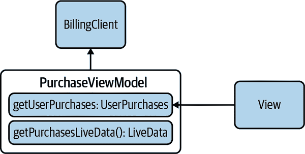
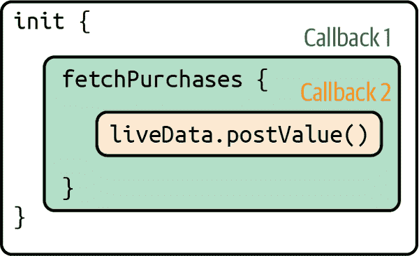
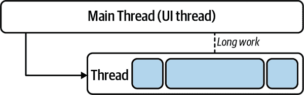
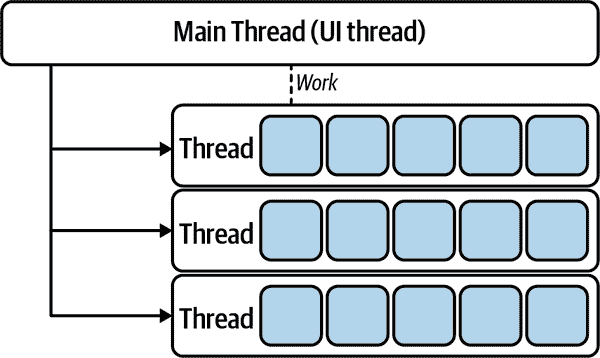

# 第六章：使用回调处理并发

在 Kotlin 中处理并发的惯用方式是使用*协程*。然而，Java 中一直以来都是使用线程和回调。那么，我们为什么需要协程呢？

为了回答这个问题，我们将重新审视 Android 上典型的 Kotlin 实现，并讨论使用线程的缺点。了解传统方法的弱点是理解协程设计动机的关键。

在 Android 应用中，不应该在 UI 线程上执行长时间运行的任务，正如你在前一章中所见。如果阻塞主线程——UI 线程——你的应用可能无法获得绘制屏幕或适当更新的资源。实际上，如果尝试在 UI 线程上执行明显的 IO 调用（例如建立 HTTP 连接），lint 会抱怨。

当主线程在大多数设备上的 16ms 帧时间内完成所有任务时，Android 应用程序可以平稳运行。这是相当短的时间，所有阻塞调用，如网络请求（阻塞 IO），都应该在后台线程上执行。^(1)

当你将任务委托给另一个线程时，通常会调用一个启动异步任务的函数。在某些情况下，这是“发射并忘记”，但通常你正在等待结果——并且需要对其进行操作。这是通过提供一个在作业完成时将被调用的函数来完成的。这个函数称为*回调*。回调通常接受参数，因此后台线程通常使用作业结果调用回调。在完成时调用任意或注入函数进行计算被称为*回调模式*。

使用回调是相当高效的，尽管它也有一些限制和缺点。为了说明这一点，我们将在 Kotlin 中实现一个简单而现实的例子。协程解决了所有与回调相关的问题，但在直接使用协程之前，理解它们旨在解决的问题非常重要。

# 付费功能示例

假设你正在开发一个 Android 应用的付费功能。用户注册后，你会检查该用户已经购买的商品列表，并据此进行操作。为了获取购买列表，让我们使用一个名为`BillingClient`的对象。请注意，我们讨论的不是 Android 框架提供的实际`BillingClient`，即`com.android.billingclient.api.BillingClient`。我们使用的是我们自己简化版本的基本概念，如下面的代码所示：

```
interface BillingClient {
    fun interface BillingCallback {
        fun onInitDone(provider: PurchasesProvider?)
    }

    /* Implementations should be nonblocking */
    fun init(callback: BillingCallback)
}
```

典型的任务流程如下：

1.  初始化连接到`BillingClient`。等待它准备就绪——你的回调会提供一个`PurchasesProvider`，或者在出错时提供 null。目前，我们不处理错误。

1.  使用返回的`PurchasesProvider`来异步获取用户的购买列表。您的程序将等待响应，其中包含购买列表和可能的其他元数据。

1.  对这些新信息做出反应；您可以显示一个购买列表的 UI，以提供更多细节，或请求状态、取消订单中的项目等等。

以后的参考，我们将称之为前面的流程为我们的*逻辑*。

如您所见，这只是一个接口，有一个方法，接受`BillingCallback`作为输入。`BillingCallback`在`BillingClient`接口内声明，因为此回调仅在`BillingClient`内部使用。当接口声明在类或接口内部时，它告诉您类和接口之间的关系：作者打算类不依赖于其他实体来提供接口。这避免了类和接口之间兼容性破坏的风险。这两者是耦合的，如果您发布一个`BillingClient`，您也会发布一个`BillingCallback`。请注意，我们正在使用 Kotlin 1.4 的新`fun interface`，而不是传统的`interface`。这将允许在提供实现时使用简洁的语法。还有，`init`方法的文档说明实现应该是非阻塞的。如果您没有阅读前一章节，这意味着无论哪个线程调用此方法，它都不会被阻塞等待方法返回。

同样，我们的`PurchasesProvider`如下代码所示：

```
interface PurchasesProvider {
    fun interface PurchaseFetchCallback {
        fun onPurchaseFetchDone(purchases: List<String>)
    }

    fun fetchPurchases(user: String, callback: PurchaseFetchCallback)
}
```

现在，让我们假设我们提供了这些抽象及其实现。尽管真实的应用程序会使用框架提供的类，但这个示例的重点是业务逻辑，而不是`BillingClient`和`PurchasesProvider`的实现。

作为 Android 开发者，希望您熟悉 Android Jetpack 的`ViewModel`的核心概念，但如果不是这样，也不用担心，因为`ViewModel`的操作细节不是本讨论的重点。即使没有`ViewModel`，您可能已经有了某个版本的 MVC、MVP 或 MVVM，它们基本上都遵循相同的模式。视图负责展示工作，模型负责逻辑工作，控制器或视图模型是连接它们的粘合剂，充当允许两者通信的网络。重要的是视图模型内部的逻辑实现。其他都是上下文或框架代码，但仍然非常重要。图 6-1 显示了目标架构。



###### 图 6-1\. MVVM 架构。

现在假设您已经按照*单活动*架构组织了应用程序。视图应该是一个显示当前用户购买的片段。在设计中应考虑片段的生命周期。任何时候，设备都可能旋转，并重新创建片段。用户可以返回，并且如果未被销毁，片段可以被放入后退堆栈中。

这就是`LiveData`，一个感知生命周期的组件，发挥作用的地方。每次创建片段时，它请求一个`PurchaseViewModel`的实例。稍后我们将详细解释它的工作原理。

# 创建应用程序

在本节中，我们将向您展示在 Android 应用程序内的典型实现。如果您已经熟悉此内容，可以直接跳转到下一节，其中我们讨论*逻辑*的实现。

## 视图模型

所以业务逻辑是在`ViewModel`内部实现的（参见示例 6-1）。视图模型需要通过某个其他组件进行构造注入，稍后您将看到。`BillingClient`是`ViewModel`的一个依赖项，而`PurchaseProvider`是`BillingClient`的一个依赖项。

与此`ViewModel`交互的视图触发`getUserPurchases`方法（我们尚未实现）以获取`purchasesLiveData`属性的 getter。您可能已经注意到，`purchasesLiveData`属性的类型是`LiveData`，而私有后备属性`_purchases`是`MutableLiveData`。这是因为`ViewModel`应该是唯一更改`LiveData`值的组件。因此，向此`ViewModel`的客户端公开的类型仅为`LiveData`，如示例 6-1 所示。

##### 示例 6-1\. `PurchasesViewModel`

```
class PurchasesViewModel internal constructor(
    private val billingClient: BillingClient,
    private val user: String
) : ViewModel() {
    private var _purchases = MutableLiveData<UserPurchases>()

    private fun getUserPurchases(user: String) {
        // TODO: implement
    }

    val purchasesLiveData: LiveData<UserPurchases>
        get() {
            getUserPurchases(user)
            return _purchases
        }

    interface BillingClient { /* removed for brevity*/ }

    interface PurchasesProvider { /* removed for brevity*/ }
}
```

我们差不多完成了，现在我们缺少的只是视图。

## 视图

在我们的架构中，视图是一个`Fragment`。如下面的代码所示，视图依赖于视图模型。这展示了我们如何从视图内部使用视图模型：

```
class PurchasesFragment : Fragment() {
    override fun onCreate(savedInstanceState: Bundle?) {
        super.onCreate(savedInstanceState)

        /* Create a ViewModel the first time this Fragment is created.
         * Re-created Fragment receives the same ViewModel instance after
         * device rotation. */
        val factory: ViewModelProvider.Factory = PurchaseViewModelFactory() 
        val model by viewModels<PurchasesViewModel> { factory }             
        model.purchasesLiveData.observe(this) { (_, purchases) ->           
            // update UI
            println(purchases)
        }
    }
}
```

每次创建片段时，它都订阅`UserPurchases`的更新，遵循以下三个步骤：


为 `ViewModel` 创建一个工厂（请记住，`ViewModel` 有依赖项，`Fragment` 并不负责提供它们）。严格来说，这个工厂不应该在片段内创建，因为工厂现在与你的片段紧密耦合——`PurchasesFragment` 总是使用 `PurchaseViewModelFactory`。在测试环境中，你应该独立测试视图，这可能会成为一个问题。因此，应该通过依赖注入框架或手动注入将该工厂注入到 `Fragment` 内。为了简单起见，我们决定在此片段内创建它。可以参考 示例 6-2 中的 `ViewModel` 工厂。


从 `viewModels` 函数获取 `PurchasesViewModel` 实例。这是获取 `ViewModel` 实例的推荐方式。


最后，从 `ViewModel` 中获取一个 `LiveData` 实例，并通过同名方法（“observe”）由一个 `Observable` 实例进行*观察*。在这个例子中，观察者只是一个打印购买列表到控制台的 lambda 函数。在生产应用程序中，通常会触发更新与片段中的所有相关视图。

`ViewModel` 还有自己的生命周期，这取决于 `ViewModel` 是绑定到片段还是活动。在这个例子中，它绑定到了一个片段。你可以通过使用 `by` `viewModels<..>` 来确认。如果我们使用了 `by` `activityViewModels<..>`，则该视图模型将绑定到活动上。

当绑定到片段时，`ViewModel` 在设备旋转时会保留，但在不再使用时会被销毁（例如，与其绑定的所有片段都被销毁时，除了设备旋转）。如果 `ViewModel` 绑定到活动上，它将在设备旋转时保留，但在销毁活动的其他情况下会被销毁。

###### 警告

由于 `ViewModel` 通过配置更改而保留，并在销毁并重新创建包含的活动时，它不应引用视图、`Lifecycle` 实例或任何可能持有活动上下文引用的类实例。但是，它可以引用 `Application` 上下文。

如果你查看`BillingClient`的实际代码，你会发现创建`BillingClient.Builder`需要提供一个上下文。它可以是活动上下文，因为在内部构建器调用`context.getApplicationContext()`时，这是`BillingClient`保留的唯一上下文引用。`ApplicationContext`在整个应用生命周期内保持不变。因此，在应用程序的某个地方引用`ApplicationContext`不会导致内存泄漏。这就是在`ViewModel`内部引用`BillingClient`是安全的原因。

如 示例 6-2 所示，`ViewModel`的依赖关系是在`PurchaseViewModelFactory`内创建的。

##### 示例 6-2\. `PurchaseViewModelFactory`

```
class PurchaseViewModelFactory : ViewModelProvider.Factory {
    private val provider: PurchasesProvider = PurchasesProviderImpl()
    private val billingClient: BillingClient = BillingClientImpl(provider)
    private val user = "user" // Get in from registration service

    override fun <T : ViewModel?> create(modelClass: Class<T>): T {
        if (modelClass.isAssignableFrom(PurchasesViewModel::class.java)) {
            return PurchasesViewModel(billingClient, user) as T
        }
        throw IllegalArgumentException("Unknown ViewModel class")
    }
}
```

`BillingClientImpl`是之前展示的`BillingClient`接口的实际实现（参见 示例 6-3 和 示例 6-4）。

##### 示例 6-3\. `BillingClientImpl`

```
class BillingClientImpl(private val purchasesProvider: PurchasesProvider) : BillingClient {
    private val executor =
        Executors.newSingleThreadExecutor()

    override fun init(callback: BillingCallback) {
        /* perform asynchronous work here */
        executor.submit {
            try {
                Thread.sleep(1000)
                callback.onInitDone(purchasesProvider)
            } catch (e: InterruptedException) {
                e.printStackTrace()
            }
        }
    }
}
```

##### 示例 6-4\. `PurchasesProviderImpl`

```
class PurchasesProviderImpl : PurchasesProvider {
    private val executor =
        Executors.newSingleThreadExecutor()

    override fun fetchPurchases(
        user: String,
        callback: PurchaseFetchCallback
    ) {
        /* perform asynchronous work */
        executor.submit {
            try {
                // Simulate blocking IO
                Thread.sleep(1000)
                callback.onPurchaseFetchDone(
                    listOf("Purchase1", "Purchase2")
                )
            } catch (e: InterruptedException) {
                e.printStackTrace()
            }
        }
    }
}
```

为了符合我们所建立的应用设计，`init`和`fetchPurchases`方法应该是非阻塞的。这可以通过后台线程实现。出于效率考虑（参见即将到来的部分），你可能不想每次连接到`BillingClient`时都创建一个新线程。而是可以使用线程池，可以通过`java.util.concurrent.Executors`的工厂方法直接创建，或者通过`ThreadPoolExecutor`实例创建许多常见的配置。使用`Executors.newSingleThreadExecutor()`，你可以拥有一个单独的专用线程，可以在每次异步调用时重复使用。你可能认为`PurchasesProviderImpl`和`BillingClientImpl`应该共享同一个线程池。这取决于你——尽管出于简洁起见，我们在这里没有这样做。对于生产应用程序，可能会有多个`ThreadPoolExecutor`来服务应用程序的不同部分。

如果你查看这些实现中如何使用回调函数，你会发现它们会在`Thread.sleep()`之后立即调用（这模拟了阻塞 IO 调用）。除非显式地发布到主线程（通常通过`Handler`类的实例或通过`LiveData`实例的`postValue`方法），否则回调函数将在后台线程的上下文中被调用。这一点至关重要，了解如何在线程上下文之间进行通信非常重要，这将在下一节中介绍。

###### 警告

注意提供的回调函数在哪个线程上运行，这取决于实现方式。有时回调函数在调用线程上异步执行，而有时会同步在后台线程执行。

## 实现逻辑

现在所有必要的组件都已经就位，可以实现*逻辑*。步骤如 示例 6-5 所示。

##### 示例 6-5\. 逻辑

```
private fun getUserPurchases(user: String) {
   billingClient.init { provider ->                   
       // this is called from a background thread
       provider?.fetchPurchases(user) { purchases ->  
           _purchases.postValue(UserPurchases(user, purchases))
       }
   }
}
```


调用`billingClient.init`并提供一个回调，该回调将在客户端初始化过程完成时调用。如果客户端提供了非空的`PurchasesProvider`实例，则继续下一步。


此时，您已经准备好使用`PurchasesProvider`实例。调用`fetchPurchases`，将当前用户作为第一个参数提供，并提供应该在提供程序完成其工作后执行的回调。仔细查看回调内容：

```
_purchases.postValue(UserPurchases(user, purchases))
```

在`MutableLiveData`实例上，您可以使用`setValue`或`postValue`方法。两者之间的区别在于，只有在从主线程调用时才允许使用`setValue`。当情况不是这样时，使用`postValue`将新值添加到`MutableLiveData`将在主线程的下一帧处理的队列中。这是工作队列模式的一种实现（见“工作队列”），也是将新值安全地分配给`MutableLiveData`的线程安全方式。

## 讨论

就是这样。它有效果——或者至少满足了规格要求。我们邀请您稍微退后一步，看看整体情况。`getUserPurchases` 的结构是什么？它由一个函数调用构成，该调用提供另一个函数，该函数本身又调用一个函数，而该函数提供另一个函数…… 就像俄罗斯套娃一样。这已经有点难以跟踪了，添加异常处理可能很快就会变成“嵌套地狱”（见图 6-2）。为了保持我们示例逻辑的简单和易于跟踪，我们省略了一些 API 调用失败的边界情况；例如，网络问题或授权错误使得某些后台 IO 工作变得脆弱且容易失败，生产代码应该能够处理这些情况。



###### 图 6-2\. 回调使用。

在第一个回调函数的代码中包含了对`BillingClient`的响应处理（回调 2）。如果您决定内联所有这些代码，就像我们在示例 6-5 中所做的那样，您会有几个级别的缩进，随着要解决的问题变得更加复杂，缩进水平会迅速增加。另一方面，如果您决定将第一个回调函数封装到自己的函数中，您确实会减少`getUserPurchases`的缩进级别及其表面复杂性。与此同时，您会增加完全理解业务逻辑所需的方向数量。

使用回调函数的第一个缺点是它迅速变得复杂，如果不小心和思维设计不周，可能难以维护。有些人认为即使采取了谨慎的预防措施，这条路也很危险。作为开发者，我们努力创建一个我们和同事能够处理的系统。

###### 注意

使用 `CompletableFuture` 或类似的库（如 RxJava），可以这样重写 `getUserPurchases`：

```
private void getUserPurchases(String user) {
    billingClient.initAsync()
    .thenCompose { provider ->
        fetchPurchasesAsync(provider, user)
    }
    .thenAccept { purchases ->
        this.purchases.postValue(...)
    }
}
```

这样做更清晰，没有嵌套缩进，甚至可以正确处理异常。然而，可以看到它依赖于`thenCompose`和`thenAccept`这两个组合器，它们操作`CompletableFuture<T>`。虽然我们的简单示例只使用了两个组合器，但存在许多组合器，每个组合器都有特定的目的。有些人可能认为另一种不熟悉的模式和 API 的学习曲线是这种模式的一个弱点。

### 结构化并发

现在想象一下，某些 API 调用在计算上是相当昂贵的。例如，您的应用程序用户导航到触发其中一些 API 调用的视图，但由于内容并非即时加载，他们失去耐心并点击返回，并在应用程序的另一部分开始新的操作系列。在这种情况下，您不希望昂贵的 API 调用继续运行，因为它们可能对后端服务器或应用程序本身造成不必要的负载。此外，当回调触发时应该更新的 UI 不存在会发生什么？`NullPointerException` 可能是最好的情况，内存泄漏则是最坏的情况。相反，让我们取消在视图模型内初始化的过程。您该如何做到这一点？您必须监听片段生命周期终止事件的特定生命周期事件：`onStop`、`onPause` 或 `onDestroy`。在这种特定情况下，您可能希望在 `onStop` 中执行此操作，这会在资源被回收之前触发。`onPause` 在应用程序转到后台以便接听电话或在应用程序之间切换时触发，而 `onDestroy` 比我们需要的稍晚一些。当 `onStop` 事件触发时，您应该通知视图模型应停止任何后台处理。这需要一种线程安全的方法来中断线程。在回调中检查一个易失性的 `isCancelled` 布尔值，以决定它们是否应该继续进行。所以这是可行的，但又繁琐又脆弱。

如果自动取消会怎样？想象一下，后台处理与视图模型的生命周期绑定。视图模型被销毁的瞬间，所有后台处理都会被取消。这并不是童话——它甚至有一个名字：*结构化并发*。

### 内存泄漏

自动取消悬空的后台线程还有另一个好处：减少内存泄漏的风险。回调可能会持有一个对具有生命周期或是另一个组件子组件的引用。如果这个组件有资格进行垃圾回收，而在某个运行中的线程中仍然存在对该组件的引用，则内存无法被回收，就会造成内存泄漏。像前面示例中使用 `LiveData` 一样即使不取消后台任务也是安全的。然而，总体而言，让任务无端运行永远都不是好事。

取消并不是唯一可能出错的事情。使用线程作为异步计算的基元（我们将其称为*线程模型*）还有其他一些陷阱，我们将在下一节中讨论它们。

# 线程模型的限制

在 Android 应用程序中，进程和任务总是在竞争内存。对于只有一个主线程或 UI 线程的情况，聪明的 Android 开发者必须找到有效操作和处理线程的方法。

当使用单个线程时，异步任务被转移到该线程时会串行执行——一个接着一个。如果其中一个任务执行时间过长，剩余的工作无法处理，如图 6-3 所示。



###### 图 6-3\. 任务在线程内串行执行。

在可能需要长时间执行的后台任务中，您需要超过一个后台线程。`ThreadPoolExecutor`原语允许您启动多个线程，并将工作块投入其中以执行，如图 6-4 所示。



###### 图 6-4\. 一个`ThreadPoolExecutor`负责处理所有繁重的工作，包括启动线程、在这些线程之间负载均衡工作，甚至结束这些线程。

然而，并不是一直拥有更多的线程就是好事。以下是一些注意事项：

+   CPU 只能同时执行一定数量的线程。

+   就内存而言，线程本身是昂贵的——每个线程至少消耗 64 Kb 的 RAM。

+   当 CPU 核心从一个线程切换到另一个线程时，会发生*线程上下文切换*。^(4) 这些切换不是免费的。当您有几个线程时不是问题，但是如果您不断添加更多线程，线程上下文切换的影响可能会显著。您可能会发现，实际上比使用较少线程时更慢。

# 总结

+   您可以使用回调函数实现异步逻辑。您还可能希望查看一些其他相关的框架 API，如`Handler`和`HandlerThread`。使用回调可能会导致复杂的嵌套函数调用，或者逻辑流在多个类中分割并且难以跟踪。如果这变得成问题，一种解决方法是依赖`CompletableFuture`或类似的 API；第三方框架 RxJava 具有这种功能，但需要学习另一组可能快速耦合到业务逻辑中并改变您编写应用程序代码方式的 API。

+   大多数情况下，异步逻辑涉及检索和操作数据，然后将其渲染为屏幕上的视图实例。出于这个目的，Android Jetpack 的`ViewModel`提供了生命周期感知组件，帮助您编写更有组织性和可维护性的代码。

+   当组件达到其生命周期的末端时，很可能应该取消一些相关的后台任务；否则，它们将消耗内存并增加内存泄漏或甚至应用崩溃的风险。*结构化并发*是解决这个问题的理想方案，我们将在下一章讨论它。

+   使用线程作为并发原语有其局限性。您需要确保不要创建过多的线程，因为它们会消耗大量内存，并且由于过多的线程上下文切换可能会影响性能。

协程的目的是解决*线程模型*的限制。接下来的四章——重点介绍协程、结构化并发、通道和流——是本书的“高峰”，突显了 Kotlin 为 Android 开发者在控制异步计算方面提供的真正优势。

^(1) 使用`java.nio.channels.SocketChannel`进行非阻塞 IO 可以在 UI 线程上执行而不会阻塞它。然而，大多数情况下在处理 IO 时，您将使用像`java.io.InputStream`这样的阻塞 API。

^(2) 单个活动和多个片段。

^(3) 开发到接口而不是实际实现，可以提高代码的可测试性和可移植性。在测试环境中，您可以用自定义模拟的依赖项替换实际的实现。所谓可移植性，假设您有一个名为`AnalyticsManager`的接口，提供一些方法，您将实现这些方法以通知您的分析服务。考虑到一个功能强大的具有仪表板和大量数据可视化与授权的分析 SaaS 本身就已经是一个重大挑战，大多数应用开发者会借助第三方库来处理他们的流程中的这一部分。例如，如果您从一个提供者切换到另一个提供者，只要您*组织*您的交互以匹配`AnalyticsManager`接口，您的客户端代码就不会受到影响、变更或潜在地引入新的错误；更新的只是`AnalyticsManager`实现的业务逻辑。

^(4) 线程切换涉及保存和加载 CPU 寄存器和内存映射。
