# 第七章：协程概念

在前一章中，您了解了线程模型的缺陷。作为线程模型的替代方案，Kotlin 语言引入了一个名为*kotlinx.coroutines*的库，旨在解决先前提到的限制。协程使开发人员能够以低成本编写顺序、异步的代码。协程的设计包括*挂起函数*、*结构化并发*以及其他特定考虑因素，如*协程上下文*和*协程作用域*。这些主题彼此紧密相关。我们将逐步和易于理解地介绍每一个考虑因素。

# 什么是协程？

官方的 Kotlin 文档将协程描述为“轻量级线程”，旨在利用现有且众所周知的范式。你可以将协程理解为*可以分派到非阻塞线程的代码块*。

协程确实是*轻量级*的，但重要的是要注意*协程本身并不是线程*。事实上，许多协程可以在单个线程上运行，尽管每个协程都有自己的生命周期。在本节中，您将看到它们实际上只是状态机，每个状态对应于某个线程最终执行的代码块。

###### 注意

你可能会惊讶地发现，协程的概念可以追溯到上世纪 60 年代早期的 Cobol 编译器创建时，它使用了在汇编语言中挂起和启动函数的想法。协程还可以在 Go、Perl 和 Python 等语言中找到。

协程库提供了一些管理这些线程的功能。但是，如果需要，您可以配置协程构建器来自行管理线程。

## 您的第一个协程

在本节中，我们将介绍来自`kotlinx.coroutines`包的许多新术语和概念。为了使学习顺畅，我们选择从简单的协程使用开始，并逐步解释其工作原理。

下面的示例以及本章中的其他示例，使用了`kotlinx.coroutines`包中声明的语义。

```
fun main() = runBlocking {
    val job: Job = launch {
        var i = 0
        while (true) {
            println("$i I'm working")
            i++
            delay(10)
        }
    }

    delay(30)
    job.cancel()
}
```

`runBlocking`方法运行一个新的协程，并阻塞当前线程，直到协程的工作完成。这个协程构建器通常用于主函数和测试中，因为它可以作为常规阻塞代码的桥梁。

在代码块内部，我们使用`launch`函数创建一个协程。由于它创建了一个协程，它是一个*协程构建器* ——稍后你会看到其他协程构建器的存在。`launch`方法返回一个`Job`的引用，代表了启动的协程的生命周期。

在协程内部，有一个无限执行的`while`循环。在`job`协程下方，您可能会注意到稍后会取消`job`。为了展示这意味着什么，我们可以运行我们的程序，输出如下：

```
0 I'm working
1 I'm working
2 I'm working
```

看起来协程像钟表一样运行。同时，代码继续在主线程中执行，在由 `delay` 调用给出的 30 毫秒窗口内打印了三行，如 图 7-1 所示。

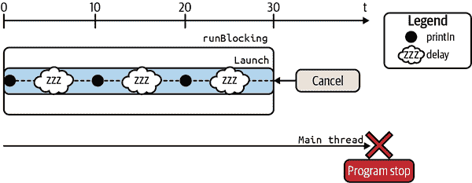

###### 图 7-1\. 第一个协程。

`delay` 函数在使用上看起来非常像 `Thread.sleep`。主要区别在于 `delay` 是 *非阻塞* 的，而 `Thread.sleep(...)` 是 *阻塞* 的。为了说明我们的意思，让我们再次检查我们的代码，但用 `Thread.sleep` 替换协程中的 `delay` 调用：

```
fun main() = runBlocking {
    val job: Job = launch {
        while (true) {
            println("I'm working")
            Thread.sleep(10L)
        }
    }

    delay(30)
    job.cancel()
}
```

观察当我们再次运行代码时会发生什么。我们得到以下输出：

```
I'm working
I'm working
I'm working
I'm working
I'm working
I'm working
I'm working
I'm working
I'm working
I'm working
I'm working
.....
```

现在输出看起来是无限的。当协程执行时，`Thread.sleep(10L)` 调用会阻塞主线程，直到由 `launch` 启动的协程完成。由于由 `launch` 启动的协程使主线程休眠或打印，协程永远不会完成，因此执行永远不会离开协程，如 图 7-2 所示。

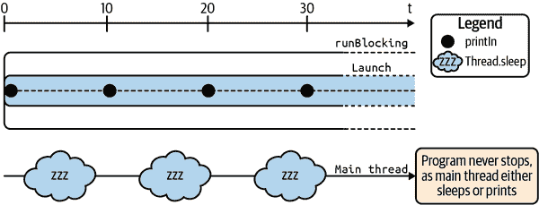

###### 图 7-2\. 永远运行的程序。

记住以下几点很重要：

+   `launch` 协程构建器是“发射并忘记”工作—换句话说，没有结果可返回。

+   一旦调用，它立即返回一个 `Job` 实例，并启动一个新的协程。`Job` 代表协程本身，就像其生命周期的句柄一样。可以通过在其 `Job` 实例上调用 `cancel` 方法来取消协程。

+   用 `launch` 启动的协程将不会返回结果，而是返回对后台作业的引用。

反之，如果需要从异步计算中获取结果，则应使用 `async` 协程构建器。

## `async` 协程构建器

`async` 协程构建器可以与 Java 的 `Future`/`Promise` 模型进行比较，以支持异步编程：

```
class WorkingClass() {
    public CompletableFuture<SomeOtherResult> doBothAsync() {
        somethingAsync().thenAcceptBoth(somethingElseAsync()) {
            one, two ->
            // combine results of both calls here
        };
    }
}
```

与进行阻塞调用以获取数据不同，异步函数立即返回一个结果的包装器。根据使用的库不同，这个包装器称为 `Future`、`CompletableFuture`、`Promise` 等。这个包装器就像一个句柄，您可以从中检查结果是否可用。如果需要，您可以使用 `Future.get()` 方法阻塞线程，直到结果可用。

就像 `Future` 一样，`async` 协程构建器 *返回一个围绕结果的包装器*；而这个包装器的类型是 `Deferred<T>`（泛型类型是结果的类型），如下面的代码所示：

```
fun main() = runBlocking {
    val slow: Deferred<Int> = async {
        var result = 0
        delay(1000)   // simulate some slow background work
        for (i in 1..10) {
            result += i
        }
        println("Call complete for slow: $result")
        result
    }

    val quick: Deferred<Int> = async {
        delay(100)   // simulate some quick background work
        println("Call complete for quick: 5")
        5
    }

    val result: Int = quick.await() + slow.await()
    println(result)
}
```

数据类型 `quick` 和 `slow` 是作为 `Deferred<Int>` 实现的未来结果，也称为带有结果的 `Job`。通过在每个 `Deferred<Int>` 实例上调用 `await` 方法，程序等待每个协程的结果。

这一次，我们使用 `async` 协程构建器启动了两个协程。代码本身可以让我们猜到可能会发生什么，但无论如何，让我们运行它看看以下输出：

```
Call complete for quick: 5
Call complete for slow: 55
60
```

前面的程序通过 1,000 毫秒延迟了慢的 `async` 作业，而快的 `async` 作业只延迟了 100 毫秒 — `result` 等待两者完成后才输出结果。

记住以下几点是很重要的：

+   `async` 协程构建器旨在*并行分解工作* — 也就是说，您*显式*指定了某些任务将同时运行。

+   一旦调用，`async` 立即返回一个 `Deferred` 实例。`Deferred` 是一个特殊的 `Job`，带有一些额外的方法如 `await`。它是一个带有返回值的 `Job`。

+   与 `Future` 和 `Promise` 非常类似，您需要在 `Deferred` 实例上调用 `await` 方法以获取返回值。^(2)

您可能已经注意到，与协程构建器 `launch` 和 `async` 一起提供的示例被 `runBlocking` 调用包装。我们之前提到 `runBlocking` 运行一个新的协程，并阻塞当前线程，直到协程工作完成。要更好地理解 `runBlocking` 的角色，我们必须首先提前预览结构化并发，这是一个将在下一章节详细探讨的概念。

# 有关结构化并发的快速介绍

协程不仅仅是另一种启动后台任务的花哨方式。协程库围绕结构化并发范式构建。在继续探索协程之前，您应该理解它是什么，以及协程库旨在解决的问题。

让开发变得更容易是一个值得追求的目标。在结构化并发的情况下，这几乎是对更普遍问题的一种愉快副作用的响应。考虑每个开发者都熟悉的最简单的构造：一个函数。

函数在执行上是可预测的，因为它们是从上到下执行的。如果我们忽略函数内部可能抛出异常的可能性，^(3) 我们知道在函数返回值之前，执行顺序是串行的：每个语句在下一个语句之前执行。如果在函数内部创建并启动了另一个线程呢？这是完全合法的，但现在您有两个执行流，如 图 7-3 所示。

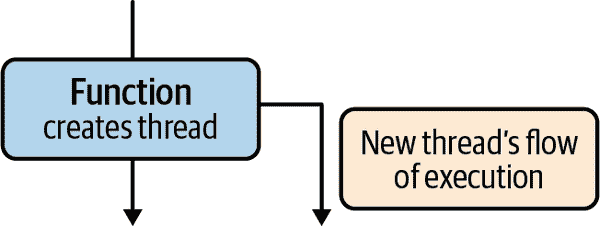

###### 图 7-3\. 两个流。

调用此函数不仅会产生一个结果；它还会产生一个并行执行的流。这可能会因以下原因而成为问题：

异常不会传播

如果线程内部抛出异常并且未处理，那么 JVM 将调用线程的 `UncaughtExceptionHandler`，这是一个简单的接口：

```
interface UncaughtExceptionHandler {
    fun uncaughtException(t: Thread, e: Throwable)
}
```

您可以使用`Thread.setUncaughtExceptionHandler`方法为您的线程实例提供处理程序。默认情况下，当您创建线程时，它没有特定的`UncaughtExceptionHandler`。当异常未被捕获时，并且您没有设置特定的异常处理程序时，将调用默认处理程序。

在 Android 框架中，需要注意，默认的`UncaughtExceptionHandler`将导致您的应用崩溃并终止应用的本机进程。Android 设计者之所以做出这样的选择，是因为对于 Android 应用来说，*快速失败*通常更好，因为系统不应代表开发者做出关于未处理异常的决定。堆栈跟踪对于真正的问题是相关的——虽然从中恢复可能会产生不一致的行为和问题，因为根本原因可能在调用堆栈中较早的位置。

在我们的示例中，没有东西可以通知我们的函数如果后台线程发生了错误。有时这很好，因为错误可以直接从后台线程处理，但您可能有更复杂的逻辑，需要调用代码监控问题以不同和特定的方式做出反应。

###### 提示

在默认处理程序被调用之前涉及一个机制。每个线程可以属于一个`ThreadGroup`，可以处理异常。每个线程组还可以有一个父线程组。在 Android 框架中，有两个静态创建的组：“system”和“main”的子组。“main”组总是将异常处理委托给“system”组的父组，如果不为空，则委托给`Thread.getDefaultUncaughtExceptionHandler()`。否则，“system”组将异常名称和堆栈跟踪打印到`System.err`。

执行流程难以控制

由于线程可以从任何地方创建和启动，想象一下，您的后台线程实例化并启动了三个新线程来委托一些工作，或者在父线程上下文中对计算的反应进行任务，如图 7-4 所示。

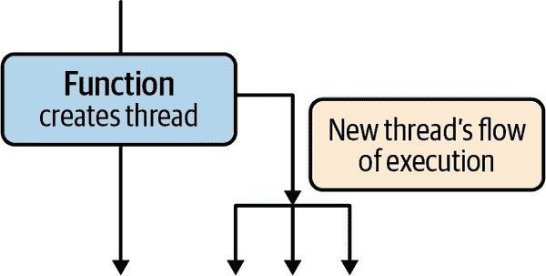

###### 图 7-4\. 多个流。

如何确保函数只有在所有后台处理完成后才返回？这可能出错：你需要确保等待所有子线程完成它们的工作。^(4) 当使用基于`Future`的实现（例如`CompletableFuture`）时，即使省略了`Future.get`的调用，也可能导致执行流程过早终止。

后来，当后台线程及其所有子线程仍在运行时，所有这些工作可能需要被取消（用户退出 UI，抛出错误等）。在这种情况下，没有自动机制来取消整个任务层次结构。

当处理线程时，很容易忘记一个后台任务。*结构化并发不过是一个旨在解决这个问题的概念*。

在接下来的部分中，我们将详细解释这一概念，并说明它与协程的关系。

# 结构化并发中的父子关系

到目前为止，我们已经讨论了线程，这些线程在之前的示例中用箭头表示。让我们想象一个更高层次的抽象，其中某个父实体可以创建多个子级，如图 7-5 所示。

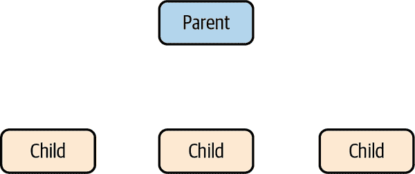

###### 图 7-5\. 父子关系。

这些子级可以与彼此以及父级并发运行。如果父级失败或被取消，则所有子级也将被取消。^(5) 这就是结构化并发的第一条规则：

+   取消始终向下传播。

###### Tip

一个子级的失败如何影响同级别的其他子级，这是父级的参数化。

就像父实体可能会失败或被取消一样，任何子级都可能会发生这种情况。在其中一个子级取消的情况下，参照第一条规则，我们知道父级不会被取消（取消向下传播，而不是向上）。在失败的情况下，接下来会发生什么取决于你试图解决的问题。一个子级的失败应该或不应该导致其他子级的取消，如图 7-6 所示。这两种可能性描述了父子失败关系，并且是父级的参数化。

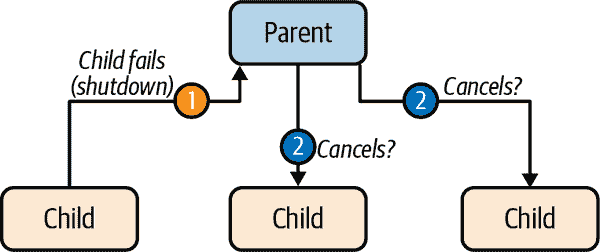

###### 图 7-6\. 取消策略。

###### Tip

父级始终等待所有子级完成。

可以添加其他关于异常传播的规则，但这些规则会依赖于具体的实现，现在是时候介绍一些具体的例子了。

结构化并发在 Kotlin 协程中使用`CoroutineScope`和`CoroutineContext`。在之前的示例中，`CoroutineScope`和`CoroutineContext`都扮演了父级的角色，而协程则扮演了子级的角色。

在接下来的部分中，我们将更详细地介绍`CoroutineScope`和`CoroutineContext`。

# CoroutineScope 和 CoroutineContext

我们即将深入讨论*kotlinx.coroutine*库的细节。在即将到来的部分中会有*a lot*的新概念。虽然这些概念对于掌握协程非常重要，但你现在并不需要完全理解所有内容，只要开始使用协程并提高生产力。接下来和下一章节会有许多示例，这些示例将帮助你更好地理解协程的工作方式。因此，你可能会发现，在练习一段时间后再回顾这部分会更容易理解。

现在你对结构化并发有了一个概念，让我们再次回顾整个`runBlocking`的事情。为什么不直接调用`launch`或`async`而不是在`runBlocking`调用之外呢？

下面的代码将无法编译：

```
fun main() {
   launch {
       println("I'm working")       // will not compile
   }
}
```

编译器报告：“未解析的引用：launch”。这是因为协程构建器是`CoroutineScope`的扩展函数。

`CoroutineScope`控制协程的生命周期，位于一个定义良好的作用域或生命周期内。它是一个在结构化并发中扮演父级角色的对象——它的目的是管理和监控你在其内创建的协程。也许你会惊讶地发现，在前面的示例中，使用`async`协程构建器时，已经提供了一个`CoroutineScope`来启动新的协程。那个`CoroutineScope`是由`runBlocking`块提供的。怎么做的？这是`runBlocking`的简化签名：

```
fun <T> runBlocking(
    // function arguments removed for brevity
    block: suspend CoroutineScope.() -> T): T { // impl
}
```

最后一个参数是一个带有类型为`CoroutineScope`的接收者的函数。因此，当你为块参数提供一个函数时，你可以使用`CoroutineScope`来调用`CoroutineScope`的扩展函数。正如你在图 7-7 中所看到的，Android Studio 能够捕捉到 Kotlin 中的隐式类型引用，因此如果你启用了“类型提示”，你可以看到类型参数。

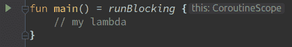

###### 图 7-7\. Android Studio 中的类型提示。

除了提供`CoroutineScope`外，`runBlocking`的目的是什么？`runBlocking`会阻塞当前线程直到其完成。它可以从常规阻塞代码中调用，作为到包含挂起函数的代码的桥梁（我们将在本章后面讨论挂起函数）。

要能够创建协程，我们必须将我们的代码桥接到我们代码中的“常规”函数`main`。但是，以下示例无法编译，因为我们试图从常规代码中启动协程：

```
fun main() = launch {
    println("I'm a coroutine")
}
```

这是因为`launch`协程构建器实际上是`CoroutineScope`的*扩展函数*：

```
fun CoroutineScope.launch(
    context: CoroutineContext = EmptyCoroutineContext,
    // other params removed for brevity,
    block: suspend CoroutineScope.() -> Unit
): Job { /* implementation */ }
```

由于常规代码不提供`CoroutineScope`实例，因此你不能直接从那里调用协程构建器。

那么什么是`CoroutineContext`？要回答这个问题，你需要了解`CoroutineScope`的细节。

如果你查看源代码，`CoroutineScope`是一个接口：

```
interface CoroutineScope {
    val coroutineContext: CoroutineContext
}
```

换句话说，`CoroutineScope`是`CoroutineContext`的容器。

`CoroutineScope`的目的是通过应用结构化并发来封装并发任务（协程和其他作用域）。作用域和协程形成了一个树状架构，其根部是一个作用域，如图 7-8 所示。

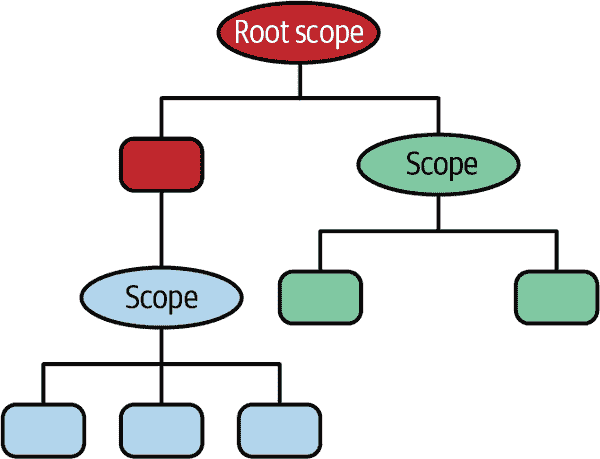

###### 图 7-8\. 树状关系（协程表示为矩形）。

`CoroutineContext`，我们将其称为*上下文*以供将来参考，是一个更广泛的概念。它是上下文元素的不可变联合集合。为了将来的参考，我们将使用术语“元素”来指代*上下文元素*。

这就是理论。在实践中，您将最常使用特殊的上下文元素来控制协程将在哪个线程或线程池上执行。例如，想象一下，您必须在`launch`内部运行 CPU 密集型计算，同时不阻塞主线程。这正是协程库非常方便的地方，因为大多数常见用途的线程池都可以直接使用。对于 CPU 密集型任务，您不必定义自己的线程池。您只需像这样使用特殊的`Dispatchers.Default`上下文元素：

```
fun main() = runBlocking<Unit> {
    launch(Dispatchers.Default) {
        println("I'm executing in ${Thread.currentThread().name}")
    }
}
```

输出现在是：

```
I'm executing in DefaultDispatcher-worker-2 @coroutine#2
```

`Dispatchers.Main`是一个上下文元素。稍后您将看到，可以使用操作符将不同的上下文元素组合在一起，以进一步调整协程的行为。

正如其名称所示，`Dispatcher`的目的是在特定线程或线程池上调度协程。默认情况下，有四个`Dispatcher`可供使用——`Main`、`Default`、`IO`和`Unconfined`：

`Dispatchers.Main`

这使用主线程或 UI 线程，具体取决于您使用的平台。

`Dispatchers.Default`

这是用于 CPU 密集型任务，并默认由包含四个线程的线程池支持。

`Dispatchers.IO`

这是用于 IO 密集型任务，并默认由包含 64 个线程的线程池支持。

`Dispatchers.Unconfined`

这不是您在学习协程时应该使用或甚至需要的东西。它主要用于协程库的内部。

通过仅更改调度器，您可以控制协程将在哪个线程或线程池上执行。上下文元素`Dispatcher.Default`是`CoroutineDispatcher`的一个子类，但还存在其他上下文元素。

通过提供调度器上下文，您可以轻松指定逻辑流的执行位置。因此，将上下文提供给协程构建器是开发者的责任。

在协程框架术语中，协程始终在一个上下文中运行。*这个*上下文由协程范围提供，与您提供的上下文不同。为了避免混淆，我们将称协程的上下文为*协程上下文*，将您提供给协程构建器的上下文称为*提供的上下文*。

差异微妙——还记得`Job`对象吗？`Job`实例是协程生命周期的一个句柄，它也是协程上下文的一部分。每个协程都有一个代表它的`Job`实例，而这个`Job`是协程上下文的一部分。

现在是时候揭示这些上下文是如何创建的了。看看示例 7-1，它与先前的示例略有不同。

##### 示例 7-1\. 调度器示例

```
fun main() = runBlocking<Unit>(Dispatchers.Main) {
    launch(Dispatchers.Default) {
        val threadName = Thread.currentThread().name
        println("I'm executing in $threadName")
    }
}
```

此代码块创建了两个具有各自 `Job` 实例的协程：`runBlocking` 启动第一个协程，另一个由 `launch` 启动。

由 `runBlocking` 创建的协程有其自己的上下文。由于这是在作用域内启动的根协程，我们将此上下文称为*作用域上下文*。作用域上下文包含协程上下文，如 图 7-9 所示。

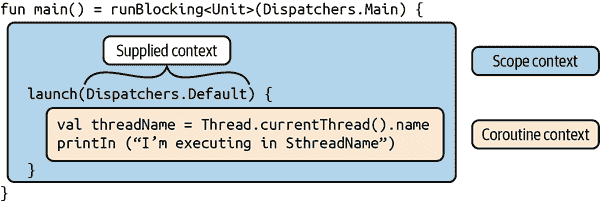

###### 图 7-9\. 上下文。

您已经看到 `launch` 是 `CoroutineScope` 的扩展函数（它保存一个上下文），并且它可以接收一个上下文作为其第一个参数。因此，在此函数中我们有两个上下文可供使用，如 示例 7-1 所示：一个来自接收类型（作用域上下文），另一个来自上下文参数（提供的上下文）。

在调用我们提供的函数之前，`launch` 在其实现中做了什么？它合并了两个上下文，使上下文参数中的元素优先于作用域中的其他元素。从此合并操作中我们获得了父上下文。此时，协程的 `Job` 尚未创建。

最后，作为父上下文中 `Job` 的子级创建了一个新的 `Job` 实例。然后将此新 `Job` 添加到父上下文中，以替换父上下文的 `Job` 实例，以获取协程上下文。

这些关系和交互在 图 7-10 中表示，其中一个上下文由包含其他上下文元素的矩形表示。

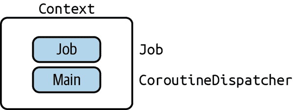

###### 图 7-10\. *上下文* 的表示。

图 7-10 表示包含 `Job` 实例和分发器 `Dispatchers.Main` 的上下文。考虑到这种表示，图 7-11 展示了如何表示 示例 7-1 的上下文。

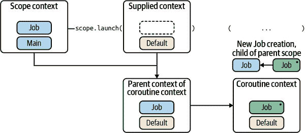

###### 图 7-11\. 上下文细节。

您在提供给 `launch` 方法的上下文中提供的所有内容优先于作用域上下文。这导致了一个*父上下文*，该上下文继承了作用域上下文中未在提供的上下文中提供的元素（在本例中为一个 `Job`）。然后，创建一个新的 `Job` 实例（位于右上角的点上），作为父 `Job` 的子 `Job`，该父 `Job` 也是作用域上下文中的 `Job`。生成的协程上下文由父上下文中的元素组成，除了 `Job`（它是父上下文中 `Job` 的子 `Job`）。

此*协程上下文*是我们提供给 `launch` 的 lambda 将在其中执行的上下文。

结构化并发性成为可能，因为协程上下文中的 `Job` 是父上下文中 `Job` 的子级。如果出于任何原因取消了作用域，则每个启动的子协程都将自动取消。^(6)

更重要的是，协程上下文继承作用域上下文中的上下文元素，并且这些元素不会被作为参数提供给`launch`时的上下文覆盖；在这方面，`async`方法的行为是完全一致的。

# 挂起函数

我们已经讨论了如何使用协程构建器`launch`和`async`启动协程，并简要介绍了阻塞和非阻塞的含义。在其核心，Kotlin 协程提供了一些不同的东西，这将真正展示协程的强大：*挂起函数*。

想象一下，你串行调用了两个任务。第一个任务在第二个任务可以继续执行之前完成了。


当任务 A 执行时，底层线程无法继续执行其他任务—此时任务 A 被称为*阻塞调用*。

然而，任务 A 在等待长时间运行的作业（例如 HTTP 请求）时花费了相当多的时间，最终阻塞了底层线程，使得等待的任务 B 变得无用。

因此，任务 B 等待任务 A 完成。节俭的开发者可能会认为这种情况浪费了线程资源，因为线程在任务 A 等待其网络调用结果时可以（而且应该）继续执行另一个任务。

使用挂起函数，我们可以将任务分解为可以*suspend*的块。在我们的例子中，当任务 A 执行其远程调用时，可以暂停它，从而使底层线程可以继续执行另一个任务（或者只执行其中的一部分）。当任务 A 获取其远程调用的结果时，可以在稍后恢复执行，如图 7-12 所示。


###### 图 7-12\. 所节省的时间表现在最后。

正如你所看到的，这两个任务的完成时间比之前的情况更早。这种任务的片段交错使得底层线程始终忙于执行任务。因此，挂起机制需要更少的线程来产生相同的总吞吐量，这在每个线程都有自己的堆栈并且每个堆栈至少占用 64 Kb 内存时尤为重要。通常，一个线程占用 1 MB 的 RAM。

使用挂起机制，我们可以更节省地使用相同的资源。

# 在幕后挂起函数

到目前为止，我们已经介绍了一个新概念：任务可以*suspend*。任务可以在不阻塞底层线程的情况下“暂停”其执行。虽然这听起来对你来说可能像是魔术，但重要的是要理解，这一切归结为底层结构，我们将在本节中解释。

一个任务，或者更准确地说，一个协程，如果使用了至少一个*挂起函数*，就可以暂停。挂起函数很容易识别，因为它声明时带有`suspend`修饰符。

当 Kotlin 编译器遇到挂起函数时，它会将其编译为带有额外类型为`Continuation<T>`的参数的常规函数，这只是一个接口，如示例 7-2 所示。

##### 示例 7-2\. 接口 `Continuation<T>`

```
public interface Continuation<in T> {
    /**
     * The context of the coroutine that corresponds to this continuation.
     */
    public val context: CoroutineContext

    /**
     * Resumes the execution of the corresponding coroutine passing a successful
     * or failed [result] as the return value of the last suspension point.
     */
    public fun resumeWith(result: Result<T>)
}
```

假设你定义这个挂起函数如下：

```
suspend fun backgroundWork(): Int {
    // some background work on another thread, which returns an Int
}
```

在编译时，这个函数会被转换成一个普通函数（没有 `suspend` 修饰符），并增加一个额外的 `Continuation` 参数：

```
fun backgroundWork(callback: Continuation<Int>): Int {
    // some background work on another thread, which returns an Int
}
```

###### 注意

挂起函数被编译成接受额外的 `Continuation` 对象参数的普通函数。这是*继续传递样式*（CPS）的实现，一种控制流通过 `Continuation` 对象传递的编程风格。

这个 `Continuation` 对象包含了在 `backgroundWork` 函数体中应该执行的所有代码。

Kotlin 编译器为这个 `Continuation` 对象实际上生成了什么？

出于效率考虑，Kotlin 编译器生成了一个状态机。^(7) 状态机的实现就是尽可能少地分配对象，因为协程非常轻量级，可能会同时运行成千上万个。

在这个状态机内部，每个状态对应于挂起函数主体中的一个*挂起点*。让我们看一个例子。想象在一个 Android 项目中，我们使用 presenter 层执行一些涉及 IO 和图形处理的长时间运行进程，在 `viewModelScope` 启动的自管理协程中，以下代码块有两个挂起点：^(8)

```
suspend fun renderImage() {
    val path: String = getPath()
    val image = fetchImage(path)    // first suspension point (fetchImage is a suspending function)
    val clipped = clipImage(image)  // second suspension point (clipImage is a suspending function)
    postProcess(clipped)
}

/** Here is an example of usage of the [renderImage] suspending function */
fun onStart() {
    viewModelScope.launch(Dispatchers.IO) {
        renderImage()
    }
}
```

编译器生成了一个实现 `Continuation` 接口的匿名类。为了让你了解实际生成的内容，我们提供了 `renderImage` 挂起函数生成的伪代码。该类有一个 `state` 字段，保存状态机的当前状态。它还有每个在状态之间共享的变量字段：

```
object : Continuation<Unit>  {
   // state
   private var state = 0

   // fields
   private var path: String? = null
   private var image: Image? = null

   fun resumeWith(result: Any) {
      when (state) {
         0 -> {
            path = getPath()
            state = 1
            // Pass this state machine as Continuation.
            val firstResult = fetchImage(path, this)
            if (firstResult == COROUTINE_SUSPENDED) return
            // If we didn't get COROUTINE_SUSPENDED, we received an
            // actual Image instance, execution shall proceed to
            // the next state.
            resumeWith(firstResult)
         }
         1 -> {
            image = result as Image
            state = 2
            val secondResult = clipImage(image, this)
            if (secondResult == COROUTINE_SUSPENDED) return
               resumeWith(secondResult)
            }
         2 -> {
            val clipped = result as Image
            postProcess(clipped)
         }
         else -> throw IllegalStateException()
      }
   }
}
```

此状态机被初始化为 `state = 0`。因此，当使用 `launch` 启动的协程调用 `renderImage` 挂起函数时，执行会“跳转”到第一个情况 `(0)`。我们获取一个路径，设置下一个状态为 `1`，然后调用 `fetchImage`，这是 `renderImage` 主体中的第一个挂起函数。

在这个阶段，有两种可能的情况：

1.  `fetchImage` 需要一些时间来返回一个 `Image` 实例，并立即返回 `COROUTINE_SUSPENDED` 值。通过返回这个特定的值，`fetchImage` 实际上在说：“我需要更多时间来返回一个实际的值，所以给我你的状态机对象，当我有结果时我会使用它。” 当 `fetchImage` 最终有了 `Image` 实例时，它调用 `stateMachine.resumeWith(image)`。此时 `state` 等于 `1`，执行会“跳转”到 `when` 语句的第二个情况。

1.  `fetchImage` 立即返回一个 `Image` 实例。在这种情况下，执行会继续下一个状态（通过 `resumeWith(image)`）。

其余的执行遵循相同的模式，直到最后一个状态的代码调用 `postProcess` 函数。

###### 注意

此解释并非生成的字节码中确切状态机的状态，而是其代表逻辑的伪代码，以传达主要思想。对于日常使用而言，了解 Kotlin 字节码中实际生成的有限状态机的实现细节不如理解其背后发生的事情重要。

在概念上，当您调用挂起函数时，将会创建一个回调（`Continuation`）以及生成的结构，以便挂起函数返回后仅调用挂起函数之后的其余代码。减少样板代码的时间，您可以专注于业务逻辑和高级概念。

到目前为止，我们分析了 Kotlin 编译器如何在幕后重新构造我们的代码，这样我们就不必自己编写回调函数。当然，你不必完全了解有限状态机代码生成的细节就能使用挂起函数。但是，理解这个概念很重要！为此，练习是最好的方式！

# 使用协程和挂起函数：实际示例

假设在 Android 应用程序中，您希望使用 `id` 加载用户的个人资料。在导航到个人资料时，根据 `id` 获取用户数据的方法命名为 `fetchAndLoadProfile` 是有意义的。

您可以使用协程来实现这一点，使用您在上一节中学到的内容。目前，假设在您的应用程序中的某个地方（通常是 MVC 架构中的控制器或 MVVM 中的 `ViewModel`），您有一个带有 `Dispatchers.Main` 调度程序的 `CoroutineScope`。在这种情况下，我们称此作用域在主线程上调度协程，这与默认行为相同。在接下来的章节中，我们将为您提供有关协程范围的详细解释和示例，以及如何在需要时访问和创建它们。

作用域默认为主线程的事实并不会有任何限制，因为您可以在此作用域内使用任何您想要的 `CoroutineDispatcher` 创建协程。`fetchAndLoadProfile` 的此实现说明了这一点：

```
fun fetchAndLoadProfile(id: String) {
    scope.launch {                                          
        val profileDeferred = async(Dispatchers.Default) {  
            fetchProfile(id)
        }
        val profile = profileDeferred.await()               
        loadProfile(profile)                                
    }
}
```

这是通过四个步骤完成的：


从 `launch` 开始。您希望 `fetchAndLoadProfile` 立即返回，以便可以在主线程上顺序进行。由于作用域默认为主线程，没有额外上下文的 `launch` 继承作用域的上下文，因此在主线程上运行。


使用`async`和`Dispatchers.Default`，你调用`fetchProfile`，这是一个阻塞调用。作为提醒，使用`Dispatchers.Default`会导致`fetchProfile`在线程池中执行。你立即得到一个`Deferred<Profile>`，命名为`profileDeferred`。此时，后台工作正在线程池的一个线程上进行。`fetchProfile`的签名如下：`fun fetchProfile(id: String): Profile { // impl }`。这是一个可能在远程服务器上执行数据库查询的阻塞调用。


你不能立即使用`profileDeferred`来加载配置文件，你需要等待后台查询的结果。你可以使用`profileDeferred.await()`来实现这一点，它将生成并返回一个`Profile`实例。


最后，你可以使用获取到的配置文件调用`loadProfile`。由于外部启动继承了其上下文从父范围，`loadProfile`在主线程上调用。我们假设这是期望的，因为大多数与 UI 相关的操作必须在主线程上完成。

每当你调用`fetchAndLoadProfile`时，后台处理会在 UI 线程之外完成以检索配置文件。一旦配置文件可用，UI 就会更新。你可以从任何线程调用`fetchAndLoadProfile`，但这不会改变最终在 UI 线程上调用`loadProfile`的事实。

还不错，但我们可以做得更好。

注意，这段代码从上到下阅读，没有间接性或回调。你可以认为“profileDeferred”命名和`await`调用感觉笨重。当你获取配置文件、等待它，然后加载它时，这一点可能会更加明显。这就是挂起函数发挥作用的地方。

挂起函数是协程框架的核心。

###### 提示

在概念上，挂起函数是一种可能不会立即返回的函数。如果它不会立即返回，它会挂起调用这个挂起函数的协程，同时进行内部计算。这个内部计算*不应该阻塞*调用线程。稍后，当内部计算完成时，协程将会恢复执行。

挂起函数只能从协程内部或另一个挂起函数中调用。

“挂起协程”意味着协程执行被暂停。这里有一个例子：

```
suspend fun backgroundWork(): Int {
    // some background work on another thread, which returns an Int
}
```

首先，挂起函数不是普通函数；它有自己的`suspend`关键字。它可以有返回类型，但请注意，在这种情况下，它不会返回`Deferred<Int>`，而只是裸露的`Int`。

其次，它只能从协程或另一个挂起函数中调用。

回到我们之前的例子：使用`async`块进行配置文件的获取和等待。从概念上讲，这正是挂起函数的目的。我们将借用与阻塞`fetchProfile`函数相同的名称，并像这样重新编写它：

```
suspend fun fetchProfile(id: String): Profile {
    // for now, we’re not showing the implementation
}
```

与原始 `async` 块的两个主要区别是 `suspend` 修饰符和返回类型。

这使你能够简化 `fetchAndLoadProfile`：

```
fun fetchAndLoadProfile(id: String) {
    scope.launch {
        val profile = fetchProfile(id)   // suspends
        loadProfile(profile)
    }
}
```

现在 `fetchProfile` 是一个悬挂函数，通过 `launch` 启动的协程在调用 `fetchProfile` 时会暂停。暂停意味着协程的执行被停止，下一行代码不会执行。它将保持暂停状态，直到检索到配置文件，此时通过 `launch` 启动的协程会恢复执行。然后执行下一行代码 (`loadProfile`)。

注意这段代码看起来像过程式代码。想象一下，你如何实现每个步骤都需要前一个步骤结果的复杂异步逻辑。你将像这样按顺序调用悬挂函数，采用经典的过程式风格。易于理解的代码更易于维护。这是悬挂函数最直接有用的方面之一。

作为奖励，IntelliJ IDEA 和 Android Studio 帮助你一目了然地识别悬挂调用。在图 7-13 中，你可以看到边缘处的符号表示悬挂调用。

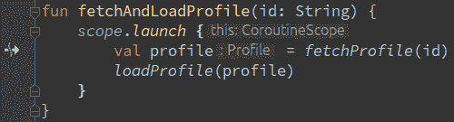

###### 图 7-13\. 悬挂调用。

当你在边缘处看到这个符号时，你知道协程可以在这一行暂停执行。

# 不要误解 `suspend` 修饰符

看起来很厉害，但是将 `suspend` 修饰符添加到普通函数并不会神奇地将其转变为非阻塞函数。还有更多细节。以下是一个使用悬挂函数 `fetchProfile` 的示例：

```
suspend fun fetchProfile(id: String) = withContext(Dispatchers.Default) {
   // same implementation as the original fetchProfile, which returns a Profile instance
}
```

`fetchProfile(...)` 使用协程框架中的 `withContext` 函数，接受 `CoroutineContext` 作为参数。在这种情况下，我们提供 `Dispatchers.Default` 作为上下文。几乎每次使用 `withContext`，你只需要提供一个 `Dispatcher`。

将执行 `withContext` 主体的线程由提供的 `Dispatcher` 决定。例如，使用 `Dispatchers.Default`，它将是专门用于 CPU 密集型任务的线程池中的一个线程。在使用 `Dispatchers.Main` 的情况下，它将是主线程。

`fetchProfile` 为何会挂起？这是 `withContext` 和协程框架的实现细节。

要记住的最重要的概念很简单：协程调用悬挂函数 *可能* 会暂停其执行。在协程术语中，我们说它达到了一个暂停点。

为什么我们说它 *可能* 会挂起？想象一下，在 `fetchProfile` 的实现中，你检查是否在缓存中有关联的配置文件数据。如果在缓存中有数据，你可以立即返回它。那么外部协程的执行就不需要暂停。^(9)

创建悬挂函数有几种方法。使用 `withContext` 只是其中之一，尽管可能是最常见的方法之一。

# 概要

+   协程总是从 `CoroutineScope` 启动。在结构化并发术语中，`CoroutineScope` 是父级，而协程本身是该作用域的子级。一个 `CoroutineScope` 可以是现有 `CoroutineScope` 的子级。请参阅下一章如何获取 `CoroutineScope` 或创建一个。

+   `CoroutineScope` 可以看作是根协程。事实上，任何具有 `Job` 的东西在技术上都可以被视为协程。唯一的区别在于预期的使用方式。作用域意味着其包含其子协程。正如本章开头所见，作用域的取消会导致所有子协程的取消。

+   `launch` 是一个协程构建器，返回一个 `Job` 实例。它用于“启动并忘记”。

+   `async` 是一个协程构建器，可以返回值，非常类似于 `Promise` 和 `Future`。它返回一个 `Deferred<T>` 实例，这是一个专门的 `Job`。

+   `Job` 是协程生命周期的句柄。

+   新创建的协程的上下文，通过 `launch` 或 `async` 开始的协程上下文，从作用域上下文和作为参数传递的上下文中继承（传递的上下文优先）。每个协程的作业 (`Job`) 都是新创建的一个上下文元素。例如：

    ```
    launch(Dispatchers.Main) {
       async {
          // inherits the context of the parent, so is dispatched on
          // the main thread
       }
    }
    ```

+   挂起函数指的是可能不会立即返回的函数。使用 `withContext` 和适当的 `Dispatcher`，任何阻塞函数都可以转换为非阻塞的挂起函数。

+   一个协程通常由多次调用挂起函数构成。每次调用挂起函数时，都会达到一个挂起点。协程的执行会在每个挂起点停止，直到恢复。^(10)

本章最后的一点补充：*作用域* 和 *上下文* 是新概念，只是协程机制的一部分。其他如 *异常处理* 和 *协作取消* 的主题将在下一章中讨论。

^(1) 在这种情况下，`job.cancel()` 对由 `launch` 启动的协程没有影响。我们将在下一章讨论这个问题（协程必须配合取消以便被取消）。

^(2) 这会挂起调用的协程，直到获取值，或者如果以 `async` 开始的协程被取消或因异常而失败，则抛出异常。本章后面将详细介绍。

^(3) 我们假设异常已经处理，不会干扰执行流程。

^(4) `join()` 方法会使调用线程进入等待状态，直到原始线程终止为止。

^(5) 实体的失败对应于实体无法从中恢复的任何异常事件。这通常使用未处理的或抛出的异常来实现。

^(6) 你可能注意到，没有什么阻止你将一个`Job`实例传递到“提供的上下文”中。那么会发生什么呢？按照解释的逻辑，这个`Job`实例将成为协程上下文中的`Job`的父级（例如，新创建的协程）。因此，作用域不再是协程的父级；父子关系被打破。这就是为什么强烈不建议这样做的原因，除非在下一章节将要解释的特定场景中。

^(7) 实际上，当一个暂停函数仅作为尾调用调用单个暂停函数时，不需要状态机。

^(8) `viewModelScope`来自`ViewModel`的 AndroidX 实现。`viewModelScope`的作用域限定为`ViewModel`的生命周期。关于这个将在下一章详细讲解。

^(9) 我们将在第八章中向你展示如何做到这一点。

^(10) 当暂停函数导致协程暂停的原因函数退出时，协程机制会恢复协程的执行。
