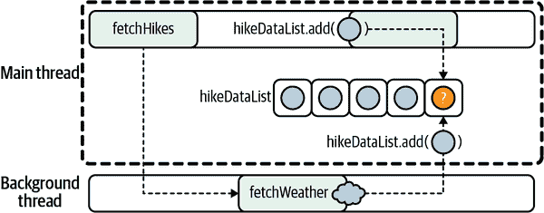
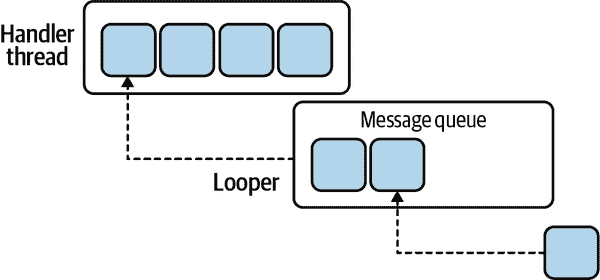
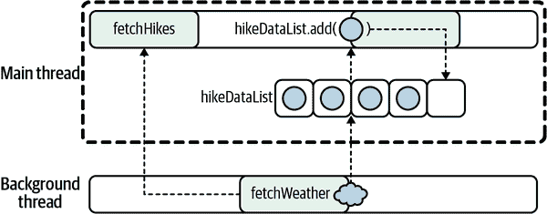
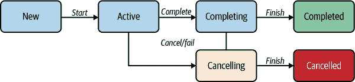
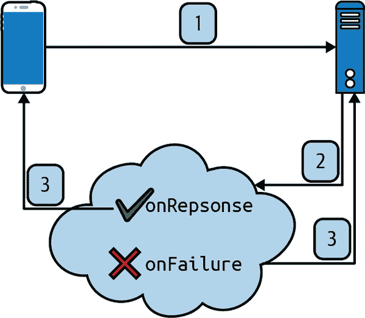

# 第八章：使用协程进行结构化并发

在前一章中，我们介绍了一种新的异步编程范式——协程。在使用协程时，了解如何适当使用挂起函数非常重要；我们将在本章介绍这个话题。由于大多数程序都需要处理异常处理和取消操作，我们还将涵盖这些主题——您会看到，在这方面，协程有自己的一套您应该了解的规则。

本章的第一部分涵盖了挂起函数的惯用用法。我们将以徒步旅行应用为例，比较基于线程和基于挂起函数和协程的两种实现方式。您将看到这种比较如何突显出协程在某些情况下的强大。

对于大多数移动应用程序而言，徒步旅行示例需要一个*取消机制*。我们将详细介绍关于使用协程进行取消的所有知识。为了准备应对各种情况，我们将介绍*并行分解*和*监督*。使用这些概念，您将能够在需要时实现复杂的并发逻辑。

最后，本章结束时将解释协程的异常处理。

# 挂起函数

想象一下，您正在开发一个帮助用户规划、计划、跟踪、绘制和分享关于徒步旅行的信息的应用程序。用户应能够导航到他们已经完成或正在进行的任何徒步旅行。在开始某次徒步旅行之前，一些基本的统计信息是有用的，比如：

+   总距离

+   上次徒步旅行的时间和距离长度

+   他们选择的路径上的当前天气

+   最喜爱的徒步旅行

这样的应用程序需要客户端与服务器之间各种关于气象数据和用户信息的交互。我们可能会选择如何存储这样一个应用程序的数据？

我们可以选择在本地存储这些数据以供以后使用，或者在远程服务器上存储（这称为*持久化策略*）。长时间运行的任务，特别是网络或 IO 任务，可以通过后台作业来实现，比如从数据库中读取、从本地文件中读取或从远程服务器查询。从主机设备读取数据的速度始终快于从网络读取相同数据。

因此，检索到的数据可能以不同的速率返回，这取决于查询的性质。我们的工作逻辑必须具有弹性和足够的灵活性，以支持并应对这种情况，而且要足够强大，能够处理我们无法控制甚至意识到的情况。

## 设定场景

您需要开发一个功能，允许用户检索他们最喜欢的徒步旅行及每次徒步旅行的当前天气。

我们已经提供了本章开头描述的应用程序的一些库代码。以下是已为您提供的一组类和函数：

```
data class Hike(
   val name: String,
   val miles: Float,
   val ascentInFeet: Int)

class Weather // Implementation removed for brevity

data class HikeData(val hike: Hike, val weather: Weather?)
```

`Weather` 不是 Kotlin 数据类，因为我们需要为 `HikeData` 的天气属性提供一个类型名称（如果我们将 `Weather` 声明为没有提供属性的数据类，代码将无法编译）。

在此示例中，`Hike` 仅仅是：

1.  一个名称

1.  总英里数

1.  海拔总上升（英尺）

`HikeData` 将 `Hike` 对象与一个可为空的 `Weather` 实例配对（如果由于某些原因无法获取天气数据）。

我们还提供了获取给定用户 ID 的远足列表以及远足的天气数据的方法：

```
fun fetchHikesForUser(userId: String): List<Hike> {
    // implementation removed for brevity
}

fun fetchWeather(hike: Hike): Weather {
    // implementation removed for brevity
}
```

这两个函数可能是长时间运行的操作，比如查询数据库或 API。为了在获取远足列表或当前天气时避免阻塞 UI 线程，我们将利用挂起函数。

我们认为了解如何使用挂起函数的最佳方式是比较以下内容：

+   使用线程和 `Handler` 的“传统”方法

+   使用协程的挂起函数实现

首先，我们将向您展示传统方法在某些情况下存在限制，并且不容易克服这些限制。然后，我们将向您展示如何使用挂起函数和协程改变我们实现异步逻辑的方式，并且如何解决我们在传统方法中遇到的所有问题。

让我们从基于线程的实现开始。

## 使用 `java.util.concurrent.ExecutorService` 的传统方法

`fetchHikesForUser` 和 `fetchWeather` 函数应该从后台线程调用。在 Android 中，可以通过多种方式来实现。当然，Java 有传统的 `Thread` 库和 `Executors` 框架。Android 标准库有（现在已经过时的）`AsyncTask`，`HandlerThread`，以及 `ThreadPoolExecutor` 类。

在所有可能性中，我们希望选择表现力、可读性和控制性最好的实现方式。因此，我们决定利用 `Executors` 框架。

在 `ViewModel` 中，假设您使用 `Executors` 类的工厂方法之一来获取返回用于使用传统基于线程的模型执行异步工作的 `ThreadPoolExecutor`。

在接下来的内容中，我们选择了 *工作窃取* 池。与带有阻塞队列的简单线程池相比，工作窃取池可以减少争用，同时保持目标数量的活动线程。其背后的想法是维护足够多的工作队列，以便超负荷的工作线程可能会将其任务“窃取”给负载较轻的另一个工作线程：

```
class HikesViewModel : ViewModel() {
    private val ioThreadPool: ExecutorService =
        Executors.newWorkStealingPool(10)

    fun fetchHikesAsync(userId: String) {
        ioThreadPool.submit {
            val hikes = fetchHikesForUser(userId)
            onHikesFetched(hikes)
        }
    }

    private fun onHikesFetched(hikes: List<Hike>) {
        // Continue with the rest of the view-model logic
        // Beware, this code is executed from a background thread
    }
}
```

在执行 IO 操作时，即使在 Android 设备上，拥有 10 个线程也是合理的。在使用 `Executors.newWorkStealingPool` 的情况下，实际线程数量会根据负载动态增长和收缩。但需要注意的是，工作窃取池不保证提交的任务执行顺序。

###### 注意

我们也可以利用 Android 原生的 `ThreadPoolExecutor` 类。具体来说，我们可以这样创建我们的线程池：

```
private val ioThreadPool: ExecutorService =
    ThreadPoolExecutor(
        4,   // Initial pool size
        10,  // Maximum pool size
        1L,
        TimeUnit.SECONDS,
        LinkedBlockingQueue()
    )
```

然后使用方式完全相同。即使最初创建的工作窃取池存在微妙差异，重要的是注意如何向线程池提交任务。

仅仅为 `fetchHikesForUser` 使用线程池可能会有些过头 —— 特别是如果你不会并发地为不同用户调用 `fetchHikesForUser`。考虑使用 `ExecutorService` 的其余实现来处理更复杂的并发工作，如下面的代码所示：

```
class HikesViewModel : ViewModel() {
    // other attributes
    private val hikeDataList = mutableListOf<HikeData>()
    private val hikeLiveData = MutableLiveData<List<HikeData>>()

    fun fetchHikesAsync(userId: String) { // content hidden } 
    private fun onHikesFetched(hikes: List<Hike>) {
        hikes.forEach { hike  ->
            ioThreadPool.submit {
                val weather = fetchWeather(hike)         
                val hikeData = HikeData(hike, weather)   
                hikeDataList.add(hikeData)               
                hikeLiveData.postValue(hikeDataList)     
            }
        }
    }
}
```

对于每个 `Hike`，都会提交一个新任务。这个新任务：


获取天气信息


将 `Hike` 和 `Weather` 对象存储在 `HikeData` 容器内。


将 `HikeData` 实例添加到内部列表


通知视图 `HikeData` 列表已更改，将传递该列表数据的新更新状态。

我们故意在前述代码中留下了一个常见的错误。你能发现它吗？尽管目前的运行正常，但想象一下，如果我们添加一个公共方法来添加新的徒步旅行：

```
fun addHike(hike: Hike) {
    hikeDataList.add(HikeData(hike, null))
    // then fetch Weather and notify view using hikeLiveData
}
```

在 `onHikesFetched` 方法的第 3 步中，我们从 `ioThreadPool` 的一个后台线程向 `hikeDataList` 添加了一个新元素。这样一个无害的方法可能会出什么问题？

当后台线程修改 `hikeDataList` 时，你可能尝试从主线程调用 `addHike`。

没有强制规定从哪个线程调用公共的 `addHike`。在 Kotlin 的 JVM 中，可变列表由 `ArrayList` 支持。然而，`ArrayList` 不是 *线程安全* 的。事实上，这并不是我们唯一的错误。`hikeDataList` 没有正确发布 —— 在第 4 步中，后台线程可能看不到 `hikeDataList` 的更新值。在 Java 内存模型中，这里没有 *happens before*^(2) 强制执行 —— 即使主线程之前将一个新元素放入列表中。

因此，在 `onHikesFetched` 链中的迭代器在意识到集合已被“神奇地”修改时会抛出 `ConcurrentModificationException`。在这种情况下，从后台线程填充 `hikeDataList` 是不安全的（参见 Figure 8-1）。



###### 图 8-1\. `addHike` 方法会向已在后台线程中修改的 `hikeDataList` 添加新内容。

落入这种模式，即使在安全时，也增加了习惯占优势的可能性，并且在同一天或同一周或同一月内，此错误在不安全的情况下重复发生。考虑到其他具有对同一代码库编辑访问权限的团队成员，你会发现我们很快失去了控制。

在多个线程同时尝试访问相同资源时，线程安全性很重要，而且很难做到正确。这就是为什么*默认使用主线程*^(3)被认为是一个良好的实践。

那么你该如何做呢？能否让后台线程告诉主线程“无论何时都要将此元素添加到此列表，然后用更新后的`HikeData`列表通知视图”？为此，可以使用方便的`HandlerThread`和`Handler`类。

## 关于 HandlerThread 的提醒

一个`HandlerThread`是一个带有“消息循环”的线程。它是生产者-消费者设计模式的一种实现，其中`HandlerThread`是消费者。一个`Handler`位于实际消息队列和可以发送新消息的其他线程之间。在内部，消费消息队列的循环是使用`Looper`类（也称为“looper”）创建的。当调用其`quit`或`quickSafely`方法时，`HandlerThread`会完成。根据 Android 的文档，`quit`方法会导致处理程序线程的 looper 终止，而不处理消息队列中的任何其他消息。`quitSafely`方法会导致处理程序线程的 looper 在处理完所有已准备好交付的剩余消息后立即终止。

非常注意记得停止`HandlerThread`。例如，想象一下，你在活动的生命周期内启动了一个`HandlerThread`（比如在片段的`onCreate`方法中）。如果你旋转设备，活动会被销毁然后重新创建。然后会创建并启动一个新的`HandlerThread`实例，而旧的仍在运行，导致严重的内存泄漏（见图 8-2）！



###### 图 8-2\. 一个`HandlerThread`消费来自`MessageQueue`的任务。

在 Android 上，主线程是一个`HandlerThread`。因为创建一个`Handler`来向主线程发送消息是非常常见的，所以`Looper`类上存在一个静态方法来获取与`Handler`关联的主线程的`Looper`实例的引用。使用`Handler`，你可以将一个`Runnable`发布到与`Handler`关联的`Looper`实例所附加的线程上执行。Java 签名是：

```
public final boolean post(@NonNull Runnable r) { ... }
```

由于`Runnable`只有一个抽象方法`run`，在 Kotlin 中可以使用 lambda 语法来美化代码，如下所示：

```
// Direct translation in Kotlin (though not idiomatic)
handler.post(object: Runnable {
      override fun run() {
         // content of run
      }
   }
)

// ..which can be nicely simplified into:
handler.post {
    // content of `run` method
}
```

在实际应用中，你可以像这样创建它：

```
val handler: Handler = Handler(Looper.getMainLooper())
```

然后，你可以在前面示例中利用循环处理程序，如下代码所示：

```
class HikesViewModel : ViewModel() {
    private val ioThreadPool: ExecutorService = Executors.newWorkStealingPool(10)
    private val hikeDataList = mutableListOf<HikeData>()
    private val hikeLiveData = MutableLiveData<List<HikeData>>()
    private val handler: Handler = Handler(Looper.getMainLooper())

    private fun onHikesFetched(hikes: List<Hike>) {
        hikes.forEach { hike  ->
            ioThreadPool.submit {
                val weather = fetchWeather(hike)
                val hikeData = HikeData(hike, weather)

                // Here we post a Runnable
                handler.post {
                    hikeDataList.add(hikeData)           
                    hikeLiveData.value = hikeDataList    
                }
            }
        }
    }

    // other methods removed for brevity }
```

这一次，我们将一个`Runnable`发布到主线程中，其中：


新的`HideData`实例添加到`hikeDataList`。


将`hikeDataList`作为更新后的值赋予`hikeLiveData`。请注意，我们可以在此处使用高度可读且直观的赋值运算符：`hikeLiveData.value` `=` `..`，这比`hikeLiveData.postValue(..)`更好。这是因为`Runnable`将从主线程执行——`postValue`仅在从后台线程更新`LiveData`的值时有用。

这样做，所有`hikeDataList`的访问器*线程限定*为主线程（见图 8-3），消除所有可能的并发危害。



###### 图 8-3\. 主线程只能访问`hikeDataList`。

这就是“传统”方法的全部内容。其他库如*RxJava/RxKotlin*和*Arrow*也可以用于执行基本相同的操作。逻辑由几个步骤组成。您开始第一个步骤，给它一个回调，其中包含在后台作业完成时运行的指令集。每个步骤都通过回调内部的代码连接到下一个步骤。我们在第六章中讨论过它，并希望我们已经阐明了一些潜在的问题，并为您提供了避免这些问题的工具。

有趣的是，回调复杂性在这个示例中似乎不是问题——一切都是用两个方法完成的，一个`Handler`和一个`ExecutorService`。然而，在以下情况下出现了一个隐匿的情况：

用户导航到一系列远足，然后在`ViewModel`上调用`fetchHikesAsync`。用户刚刚在新设备上安装了应用程序，因此历史记录不在缓存中，因此应用程序必须访问远程 API 从某个远程服务获取新鲜数据。

假设无线网络速度较慢，但不会导致 IO 超时错误。视图不断显示列表正在更新，用户可能会误以为实际上存在被抑制的错误，并重试获取（可能可以使用某些刷新 UI，如`SwipeRefreshLayout`、显式刷新按钮，甚至只是使用导航重新进入 UI 并假设将隐式调用获取操作）。

不幸的是，我们的实现没有预料到这一点。当调用`fetchHikesAsync`时，启动了一个工作流程，无法停止。想象最坏的情况，每当用户返回并重新进入远足列表视图时，都会启动一个新的工作流程。这显然是设计不良。

取消机制可能是一种可能的解决方案。我们可以通过确保每次新调用`fetchHikesAsync`时取消任何先前的正在进行或挂起的调用来实现取消机制。或者，当先前的调用仍在运行时，您可以丢弃新的`fetchHikesAsync`调用。在这种情况下实施这一点需要深思熟虑和审慎。

取消机制并不像我们在其他流程中发现的那样随手可得，因为你必须确保*每一个*后台线程都有效地停止它们的执行。

正如你从前一章节中所知，协程和挂起函数在这里以及类似的情况下非常合适。我们选择这个徒步应用的例子是因为我们有一个很好的机会使用挂起函数。

## 使用挂起函数和协程

作为提醒，我们现在将实现完全相同的逻辑；但这一次我们将使用挂起函数和协程。

当函数可能不会立即返回时，你声明一个挂起函数。因此，任何阻塞函数都有资格被重写为挂起函数。

`fetchHikesForUser`函数是一个很好的例子，因为它会阻塞调用线程，直到返回一个`Hike`实例列表。因此，它可以表示为一个挂起函数，如下所示：

```
suspend fun hikesForUser(userId: String): List<Hike> {
    return withContext(Dispatchers.IO) {
        fetchHikesForUser(userId)
    }
}
```

我们不得不为挂起函数选择另一个名称。在这个例子中，按照约定，阻塞调用都以“fetch”作为前缀。

类似地，如示例 8-1 所示，你可以声明相当于`fetchWeather`的内容。

##### 示例 8-1\. `fetchWeather`作为挂起函数

```
suspend fun weatherForHike(hike: Hike): Weather {
    return withContext(Dispatchers.IO) {
        fetchWeather(hike)
    }
}
```

这些挂起函数是它们阻塞对应函数的包装器。当从协程内部调用时，由`withContext`函数提供的`Dispatcher`确定阻塞调用在哪个线程池上执行。在这里，`Dispatchers.IO`非常适合，并且与之前看到的工作窃取池非常相似。

###### 注意

一旦你将阻塞调用包装在类似挂起`weatherForHike`函数中的挂起块中，你现在可以在协程内使用这些挂起函数了——正如你马上将看到的那样。

实际上，有一个关于挂起函数的约定，可以让每个人的生活更简单：*挂起函数永远不会阻塞调用线程*。对于`weatherForHike`来说，这确实如此，因为无论哪个线程从协程内部调用`weatherForHike`，`withContext(Dispatchers.IO)`语句都会导致执行跳转到另一个线程。^(4)

我们通过回调模式所做的一切现在可以放在一个单独的公共`update`方法中，这样看起来就像是过程化的代码。这得益于挂起函数，正如在示例 8-2 中所示。

##### 示例 8-2\. 在视图模型中使用挂起函数

```
class HikesViewModel : ViewModel() {
    private val hikeDataList = mutableListOf<HikeData>()
    private val hikeLiveData = MutableLiveData<List<HikeData>>()

    fun update() {
        viewModelScope.launch {                                 
            /* Step 1: get the list of hikes */
            val hikes = hikesForUser("userId")                  

            /* Step 2: for each hike, get the weather, wrap into a
             * container, update hikeDataList, then notify view
             * listeners by updating the corresponding LiveData */
            hikes.forEach { hike ->                             
                launch {
                    val weather = weatherForHike(hike)          
                    val hikeData = HikeData(hike, weather)
                    hikeDataList.add(hikeData)
                    hikeLiveData.value = hikeDataList
                }
            }
        }
    }
}
```

我们将逐步提供示例 8-2 的细节：


当调用`update`时，它会立即启动一个协程，使用`launch`协程构建器。正如你所知，协程不会突然间启动。正如我们在第七章中所见，协程必须始终在`CoroutineScope`内启动。这里我们使用的是`viewModelScope`。

这个范围是从哪里来的？Google 的 Android Jetpack 团队知道使用 Kotlin 和协程需要一个`CoroutineScope`。为了简化您的生活，他们维护了[Android KTX](https://oreil.ly/e3sqR)，这是在 Android 平台和其他 API 上的一组 Kotlin 扩展。其目标是使用 Kotlin 惯用语法，同时与 Android 框架良好集成。他们利用了扩展函数、lambda、参数默认值和协程。Android KTX 由多个库组成。在这个示例中，我们使用了*lifecycle-viewmodel-ktx*。要在您的应用程序中使用它，请将以下内容添加到`build.gradle`中的依赖项列表中（如果有更新的版本，请使用更新版本）：`implementation "androidx.lifecycle:lifecycle-viewmodel-ktx:2.2.0"`。


行`val hikes = hikesForUser("userId")` 是第一个暂停点。由`launch`启动的协程将停止，直到`hikesForUser`返回。


您已经获取了您的`Hike`实例列表。现在您可以*并发地*为每个实例获取天气数据。我们可以使用循环，并使用`launch`为每次徒步旅行启动一个新协程。


`val weather = weatherForHike(hike)` 是另一个暂停点。`for`循环中启动的每个协程将达到这个暂停点。

让我们仔细看看以下代码中为每个`Hike`实例启动的协程：

```
launch {
    val weather = weatherForHike(hike)
    val hikeData = HikeData(hike, weather)
    hikeDataList.add(hikeData)
    hikeLiveData.value = hikeDataList
}
```

由于父作用域（`viewModelScope`）默认为主线程，`launch`块内的每一行都在主线程上执行，除了挂起函数`weatherForHike`的内容，它使用`Dispatchers.IO`（见 Example 8-1）。`weather`的赋值是在主线程上完成的。因此，`hikeDataList`的使用局限于主线程——没有线程安全问题。至于`hikeLiveData`，您可以使用其`value`的 setter（因为我们知道我们是从主线程调用此方法），而不是`postValue`。

###### 警告

使用协程范围时，您应始终意识到它如何管理您的协程，特别是要知道范围使用的`Dispatcher`。下面的代码展示了它在库源代码中的声明方式：

```
val ViewModel.viewModelScope: CoroutineScope
  get() {
    val scope: CoroutineScope? = this.getTag(JOB_KEY)
    if (scope != null) {
       return scope
    }
    return setTagIfAbsent(
       JOB_KEY,
       CloseableCoroutineScope(
          SupervisorJob() +  Dispatchers.Main.immediate))
  }

```

正如你在这个例子中看到的那样，`viewModelScope` 被声明为 `ViewModel` 类的扩展属性。即使 `ViewModel` 类根本没有 `CoroutineScope` 的概念，以这种方式声明它也能使我们示例中的语法生效。然后，会查询内部存储来检查是否已经创建了范围。如果没有，将使用 `CloseableCoroutineScope(..)` 创建一个新的范围。^(5) 例如，不要关注 `SupervisorJob` ——我们稍后在讨论取消时会解释它的作用。这里特别相关的是 `Dispatchers.Main.immediate`，这是 `Dispatcher.Main` 的一种变体，它在从主线程启动协程时会立即执行。因此，此范围默认为主线程。这是您从这里继续前进需要了解的关键信息。

## 挂起函数与传统线程的总结

多亏了挂起函数，异步逻辑可以像过程式代码一样编写。由于 Kotlin 编译器在幕后生成了所有必要的回调和样板代码，因此使用取消机制编写的代码可以更加简洁。^(6) 例如，使用 `Dispatchers.Main` 的协程范围不需要 `Handler` 或其他通信原语来在后台线程与主线程之间传递数据，这在纯多线程环境（无协程）中仍然是必需的。实际上，通过协程我们成功解决了线程模型中遇到的所有问题，包括取消机制。

使用协程和挂起函数的代码也可以更易读，因为可以减少隐式或间接指令（例如嵌套调用或 SAM 实例，如 第六章 中所述）。此外，IntelliJ 和 Android Studio 使用特殊图标使这些挂起调用在边栏中突出显示。

在本节中，我们仅仅触及了取消操作的表面。接下来的部分将全面介绍使用协程进行取消操作所需的所有知识。

# 取消操作

处理任务取消是 Android 应用的关键部分。当用户首次导航到显示徒步旅行列表及其统计和天气的视图时，从视图模型启动了大量协程。如果用户因某些原因决定离开视图，则视图模型启动的任务可能无用。当然，除非用户稍后重新导航到视图，但假设这一点是危险的。为了避免浪费资源，在此情况下的一个良好做法是取消所有与不再需要的视图相关的进行中的任务。这是您可能会自行实施的取消的一个很好的例子，作为应用程序设计的一部分。还有另一种类型的取消：在发生不良情况时发生的取消。因此，在这里我们将区分这两种类型：

设计的取消

例如，用户在自定义或任意 UI 中点击“取消”按钮后取消的任务。

失败取消

例如，由异常引起的取消，无论是有意（抛出）还是意外（未处理）。

记住这两种类型的取消，因为您会发现协程框架对它们有不同的处理方式。

## 协程生命周期

要理解取消工作的方式，您需要了解协程的生命周期，如 图 8-4 所示。



###### 图 8-4\. 协程生命周期。

当协程例如使用 `launch {..}` 函数创建时，没有额外的上下文或参数，它会在 `Active` 状态下创建。这意味着当调用 `launch` 时，它会立即开始。这也称为 *eagerly* 启动。在某些情况下，您可能希望 *lazily* 启动协程，这意味着它在手动启动之前不会执行任何操作。要做到这一点，`launch` 和 `async` 都可以接受名为“start”的命名参数，类型为 `CoroutineStart`。默认值是 `CoroutineStart.DEFAULT`（eager start），但您可以使用 `CoroutineStart.LAZY`，如以下代码所示：

```
val job = scope.launch(start = CoroutineStart.LAZY) { ... }
// some work
job.start()
```

不要忘记调用 `job.start()`！因为当协程懒惰启动时，需要显式启动它。^(7) 默认情况下，您不必这样做，因为协程是在 `Active` 状态下创建的。

当协程完成其工作后，它会保持在 `Completing` 状态，直到其所有子协程都达到 `Completed` 状态（参见 第七章）。然后它才会达到 `Completed` 状态。像往常一样，让我们打开源代码并查看以下内容：

```
viewModelScope.launch {
    launch {
        fetchData()   // might take some time
    }
    launch {
        fetchOtherData()
    }
}
```

这个 `viewModelScope.launch` 几乎立即完成其工作：它只启动了两个子协程，并且自身没有其他操作。它很快进入 `Completing` 状态，并且只有在子协程完成时才进入 `Completed` 状态。

### 协程取消

当处于`Active`或`Completing`状态时，如果抛出异常或逻辑调用`cancel()`，协程将转换为`Cancelling`状态。如果需要，这时可以执行必要的清理工作。协程将保持在`Cancelling`状态，直到清理工作完成。然后协程才会转换到`Cancelled`状态。

### 作业保持状态

所有这些生命周期状态都由协程的`Job`持有。`Job`没有名为“state”的属性（其值范围从“NEW”到“COMPLETED”）。相反，状态由三个布尔标志（`isActive`、`isCancelled`和`isCompleted`）表示。每个状态由这些标志的组合表示，如你在 Table 8-1 中所见。

表 8-1\. `Job` 状态

| State | `isActive` | `isCompleted` | `isCancelled` |
| --- | --- | --- | --- |
| New (optional initial state) | false | false | false |
| Active (default initial state) | true | false | false |
| Completing (transient state) | true | false | false |
| Cancelling (transient state) | false | false | true |
| Cancelled (final state) | false | true | true |
| Completed (final state) | false | true | false |

正如你所见，仅凭这些布尔值无法区分`Completing`状态和`Active`状态。不过，在大多数情况下，你真正关心的是特定标志的值，而不是状态本身。例如，如果你检查`isActive`，实际上是同时检查`Active`和`Completing`状态。在下一节中会详细讨论这个问题。

## 取消协程

让我们看看下面的例子，其中有一个协程简单地每秒在控制台上打印`"job: I'm working.."`两次。父协程在取消此协程之前稍等一下：

```
val startTime = System.currentTimeMillis()
val job = launch(Dispatchers.Default) {
    var nextPrintTime = startTime
    while (true) {
        if (System.currentTimeMillis() >= nextPrintTime) {
            println("job: I'm working..")
            nextPrintTime += 500
        }
    }
}
delay(1200)
println("main: I'm going to cancel this job")
job.cancel()
println("main: Done")
```

你可以看到由`launch`返回的`Job`实例有一个`cancel()`方法。顾名思义，它取消正在运行的协程。顺便说一句，由`async`协程构建器返回的`Deferred`实例也有这个`cancel()`方法，因为`Deferred`实例是一个特殊的`Job`。

回到我们的例子：你可能期望这段小代码打印“job: I'm working..”三次。实际上输出结果是：

```
job: I'm working..
job: I'm working..
job: I'm working..
main: I'm going to cancel this job
main: Done
job: I'm working..
job: I'm working..
```

因此，尽管父协程取消了，子协程仍在运行。这是因为子协程不配合取消。有几种方法可以改变这种情况。第一种方法是定期检查协程的取消状态，使用`isActive`，如下面的代码所示：

```
val job = launch(Dispatchers.Default) {
    var nextPrintTime = startTime
    while (isActive) {
        if (System.currentTimeMillis() >= nextPrintTime) {
            println("job: I'm working..")
            nextPrintTime += 500
        }
    }
}
```

你可以这样调用`isActive`，因为它是`CoroutineScope`的扩展属性，如下面的代码所示：

```
/**
 * Returns true when the current Job is still active (has not
 * completed and was not cancelled yet).
 */
val CoroutineScope.isActive: Boolean (source)
```

现在代码与取消是协作的，结果如下：

```
job: I'm working..
job: I'm working..
job: I'm working..
main: I'm going to cancel this job
main: Done
```

使用`isActive`只是简单地读取一个布尔值。确定是否应该停止作业，以及该逻辑的设置和执行，是你的责任。

可以使用 `ensureActive` 代替 `isActive`。`isActive` 和 `ensureActive` 的区别在于，后者如果作业不再活动，立即抛出 `CancellationException`。

因此，`ensureActive` 可以替换以下代码：

```
if (!isActive) {
    throw CancellationException()
}
```

类似于 `Thread.yield()`，还有第三种可能性：`yield()`，它是一个挂起函数。除了检查作业的取消状态外，底层线程被释放并可以用于其他协程。当使用 `Dispatchers.Default`（或类似的）在协程中执行 CPU 密集型计算时，这是非常有用的。通过在战略位置放置 `yield()`，您可以避免耗尽线程池。换句话说，如果这些资源可以更好地为另一个进程提供服务，您可能不希望协程过于自私，保持一个核心忙碌，负责特定的上下文责任一段时间。

当取消发生在您的代码内部时，中断协程的这些方式是完美的。如果您将某些工作委托给第三方库，例如 HTTP 客户端，该怎么办呢？

## 取消委托给第三方库的任务

`OkHttp` 是 Android 上广泛部署的 HTTP 客户端。如果您对这个库不熟悉，以下是从官方文档摘录的片段，用于执行同步 GET 请求：

```
fun run() {
    val request = Request.Builder()
        .url("https://publicobject.com/helloworld.txt")
        .build()

    client.newCall(request).execute().use { response ->
      if (!response.isSuccessful)
          throw IOException("Unexpected code $response")

      for ((name, value) in response.headers) {
        println("$name: $value")
      }

      println(response.body?.string())
    }
}
```

这个例子非常简单。`client.newCall(request)` 返回一个 `Call` 的实例。您可以在代码继续进行的同时排队一个 `Callback` 的实例。这是可取消的吗？是的。可以使用 `call.cancel()` 手动取消 `Call`。

在使用协程时，前面的例子是您可能在协程内部编写的代码。如果在进行 HTTP 请求的协程取消时自动完成取消将是理想的。否则，以下展示了您必须编写的代码：

```
if (!isActive) {
    call.cancel()
    return
}
```

显而易见的警告是，它会污染您的代码，更不用说您可能会忘记添加此检查或者将其放置在错误的位置。必须有更好的解决方案。

幸运的是，协程框架提供了专门设计的函数，可以将期望回调的函数转换为挂起函数。它们有多种变体，包括 `suspendCancellableCoroutine`。后者旨在创建一个与取消协作的挂起函数。

下面的代码展示了如何创建一个挂起函数作为`Call`的扩展函数，它是可取消的，并且挂起直到您获得您的 HTTP 请求的响应或发生异常：

```
suspend fun Call.await() = suspendCancellableCoroutine<ResponseBody?> {
    continuation ->

    continuation.invokeOnCancellation {
        cancel()
    }

    enqueue(object : Callback {
        override fun onResponse(call: Call, response: Response) {
            continuation.resume(response.body)
        }

        override fun onFailure(call: Call, e: IOException) {
            continuation.resumeWithException(e)
        }
    })
}
```

如果您从未见过这样的代码，对其复杂性感到畏惧是很自然的。但是好消息是，这个函数是完全通用的 - 您只需要编写一次即可。如果您愿意，可以将它放在项目的“util”包中，或者在您的并行包中；或者只需记住基本知识，在执行类似的转换时使用其某个版本即可。

在展示这种实用方法的好处之前，我们需要给您一个详细的解释。

在第七章中，我们解释了 Kotlin 编译器为每个挂起函数生成一个`Continuation`实例。`suspendCancellableCoroutine`函数允许您使用这个`Continuation`实例。它接受一个带有`CancellableContinuation`作为接收器的 lambda 表达式，如下所示：

```
public suspend inline fun <T> suspendCancellableCoroutine(
    crossinline block: (CancellableContinuation<T>) -> Unit
): T
```

`CancellableContinuation`是一个可取消的`Continuation`。我们可以注册一个回调函数，在取消时调用它，使用`invokeOnCancellation { .. }`。在这种情况下，我们只需取消`Call`。由于我们在`Call`的扩展函数内部，我们添加以下代码：

```
continuation.invokeOnCancellation {
    cancel()   // Call.cancel()
}
```

在指定了挂起函数取消时应发生的事情之后，我们通过调用`Call.enqueue()`执行实际的 HTTP 请求，提供一个`Callback`实例。当对应的`Continuation`使用`resume`或`resumeWithException`恢复时，挂起函数就会“恢复”或“停止挂起”。

当您获取到 HTTP 请求的结果时，`Callback`实例上的`onResponse`或`onFailure`将被调用。如果调用了`onResponse`，这是“快乐路径”。您收到了响应，现在可以使用您选择的结果恢复继续。如图 8-5 图所示，我们选择了 HTTP 响应的主体。与此同时，在“悲伤路径”上，将调用`onFailure`，并且`OkHttp API`会给您一个`IOException`的实例。



###### 图 8-5\. (1)首先，设备将向服务器发送一个 HTTP 请求。(2)返回的响应类型将决定接下来会发生什么。(3)如果请求成功，则调用`onResponse`。否则，将执行`onFailure`。

使用`resumeWithException`恢复该异常的继续是非常重要的，这是一个例外情况。这样，协程框架就能够知道这个挂起函数的失败，并将此事件传播到协程层次结构的所有位置。

现在到了最精彩的部分：展示如何在协程中使用它，如下所示：

```
fun main() = runBlocking {
    val job = launch {                                        
        val response = performHttpRequest()                   
        println("Got response ${response?.string()}")
    }
    delay(200)                                                
    job.cancelAndJoin()                                       
    println("Done")
}

val okHttpClient = OkHttpClient()
val request = Request.Builder().url(
    "http://publicobject.com/helloworld.txt"
).build()

suspend fun performHttpRequest(): ResponseBody? {
     return withContext(Dispatchers.IO) {
         val call = okHttpClient.newCall(request)
         call.await()
     }
}
```


我们首先使用`launch`启动一个协程。


在由`launch`返回的协程内部，我们调用一个挂起函数`performHttpRequest`，它使用`Dispatchers.IO`。这个挂起函数创建一个新的`Call`实例，然后在其上调用我们的挂起`await()`。在这一点上，执行了一个 HTTP 请求。


与此同时，当`Dispatchers.IO`的某个线程完成步骤 2 时，我们的主线程继续执行主方法，并立即遇到`delay(200)`。主线程上运行的协程会挂起 200 毫秒。


过了 200 毫秒后，我们调用`job.cancelAndJoin()`，这是一个方便的方法，相当于`job.cancel()`，然后`job.join()`。因此，如果 HTTP 请求花费的时间超过 200 毫秒，由`launch`启动的协程仍处于`Active`状态。挂起的`performHttpRequest`还没有返回。调用`job.cancel()`取消了协程。由于结构化并发，协程知道它所有的子协程。取消操作会向下传播到整个层次结构。`performHttpRequest`的`Continuation`被取消，HTTP 请求也被取消。如果 HTTP 请求花费时间少于 200 毫秒，`job.cancelAndJoin()`没有效果。

无论 HTTP 请求在协程层次结构的多深处执行，如果使用我们预定义的`Call.await()`，则取消`Call`时会触发。

## 与取消协作的协程

您刚刚看到了使协程可取消的各种技术。实际上，协程框架有一个约定：行为良好的可取消协程在取消时会抛出`CancellationException`。为什么呢？让我们看看下面的代码中的这个挂起函数：

```
suspend fun wasteCpu() = withContext(Dispatchers.Default) {
    var nextPrintTime = System.currentTimeMillis()
    while (isActive) {
        if (System.currentTimeMillis() >= nextPrintTime) {
            println("job: I'm working..")
            nextPrintTime += 500
        }
    }
}
```

多亏了`isActive`检查，它确实是可取消的。想象一下，当函数被取消时，您需要进行一些清理工作。当`isActive == false`时，您知道函数被取消了，因此您可以在最后添加一个清理块，如下所示：

```
suspend fun wasteCpu() = withContext(Dispatchers.Default) {
    var nextPrintTime = System.currentTimeMillis()
    while (isActive) {
        if (System.currentTimeMillis() >= nextPrintTime) {
            println("job: I'm working..")
            nextPrintTime += 500
        }
    }

    // cleanup
    if (!isActive) { .. }
}
```

有时，您需要在取消的函数之外进行清理逻辑；例如，当此函数来自外部依赖时。因此，您需要找到一种方法来通知调用堆栈该函数已取消。异常非常适合此目的。这就是为什么协程框架遵循抛出`CancellationException`的约定。实际上，*kotlinx.coroutines*包中的所有挂起函数都是可取消的，并且在取消时抛出`CancellationException`。`withContext`就是其中之一，因此您可以在调用堆栈中更高层次地响应`wasteCpu`的取消，如下面的代码所示：

```
fun main() = runBlocking {
    val job = launch {
        try {
            wasteCpu()
        } catch (e: CancellationException) {
            // handle cancellation
        }
    }
    delay(200)
    job.cancelAndJoin()
    println("Done")
}
```

如果运行此代码，您会发现捕获到了`CancellationException`。即使我们从`wasteCpu()`内部从未显式地抛出过`CancellationException`，`withContext`也为我们抛出了它。

###### 注意

仅在取消情况下引发`CancellationException`时，协程框架才能区分简单的取消和协程失败。在后一种情况下，将引发一个不是`CancellationException`子类型的异常。

如果您希望调查协程取消，您可以**命名**您的协程，并通过添加 VM 选项`-Dkotlinx.coroutines.debug`在 IDE 中启用协程调试。要命名协程，只需添加`CoroutineName`上下文元素，如下所示：`val job = launch(CoroutineName("wasteCpu")) {..}`。这样，当捕获`CancellationException`时，堆栈跟踪会更加明确，并以以下行开始：

```
kotlinx.coroutines.JobCancellationException: StandaloneCoroutine was cancelled; job="wasteCpu#2":StandaloneCoroutine{Cancelling}@53bd815b
```

在上一个例子中，如果您将`wasteCpu()`替换为我们之前用`suspendCancellableCoroutine`创建的挂起函数`performHttpRequest()`，您还会发现捕获到`CancellationException`。因此，使用`suspendCancellableCoroutine`创建的挂起函数在取消时也会抛出`CancellationException`。

## delay 可取消

还记得`delay()`吗？其签名如下所示：

```
public suspend fun delay(timeMillis: Long) {
    if (timeMillis <= 0) return // don't delay
    return suspendCancellableCoroutine sc@ { .. }
}
```

再次是`suspendCancellableCoroutine`！这意味着无论您在哪里使用`delay`，您都为协程或挂起函数提供了取消的机会。基于此，我们可以按照以下方式重新编写`wasteCpu()`：

```
private suspend fun wasteCpu() = withContext(Dispatchers.Default) {
    var nextPrintTime = System.currentTimeMillis()
    while (true) {       
        delay(10)        
        if (System.currentTimeMillis() >= nextPrintTime) {
            println("job: I'm working..")
            nextPrintTime += 500
        }
    }
}
```

请注意：


我们去掉了`isActive`检查。


然后我们增加了一个简单的`delay`，睡眠时间足够短（使行为类似于以前的实现）。

这个新版本的`wasCpu`结果与原版一样可取消，并在取消时抛出`CancellationException`。这是因为这个挂起函数大部分时间都在`delay`函数中度过。

###### 提示

总结本节，您应该努力使您的挂起函数可取消。一个挂起函数可能由多个挂起函数组成。它们都应该是可取消的。例如，如果您需要执行大量计算密集型计算，那么您应该在合适的位置使用`yield()`或`ensureActive()`。例如：

```
suspend fun compute() = withContext(Dispatchers.Default) {
     blockingCall()  // a regular blocking call, hopefully not blocking too long
     yield()  // give the opportunity to cancel
     anotherBlockingCall()   // because why not
}
```

## 处理取消

在前一节中，您已经学会了通过 try/catch 语句对取消作出反应。但是，想象一下，在处理取消的代码内部，您需要调用其他挂起函数。您可能会想要实现以下代码中显示的策略：

```
launch {
    try {
        suspendCall()
    } catch (e: CancellationException) {
       // handle cancellation
       anotherSuspendCall()
   }
}
```

遗憾的是，前面的代码无法编译。为什么？因为*取消的协程不允许挂起*。这是协程框架的另一个规则。解决方案是使用`withContext(NonCancellable)`，如下所示：

```
launch {
    try {
        suspendCall()
    } catch (e: CancellationException) {
       // handle cancellation
       withContext(NonCancellable) {
            anotherSuspendCall()
       }
   }
}
```

`NonCancellable`是专门为`withContext`设计，以确保提供的代码块不会被取消。^(8)

## 取消的原因

正如我们之前看到的，有两种取消方式：*按设计* 和 *按失败*。最初，我们说当抛出异常时遇到失败。这有点言过其实。你刚刚看到，当自愿取消一个协程时，会抛出 `CancellationException`。这实际上是区分这两种取消方式的标志。

当取消一个协程 `Job.cancel`（按设计），该协程终止而不影响其父协程。如果父协程还有其他子协程，它们也不受此取消影响。以下代码说明了这一点：

```
fun main() = runBlocking {
    val job = launch {
        val child1 = launch {
            delay(Long.MAX_VALUE)
        }
        val child2 = launch {
            child1.join()
            println("Child 1 is cancelled")

            delay(100)
            println("Child 2 is still alive!")
        }

        println("Cancelling child 1..")
        child1.cancel()
        child2.join()
        println("Parent is not cancelled")
    }
    job.join()
}
```

此程序的输出为：

```
Cancelling child 1..
Child 1 is cancelled
Child 2 is still alive!
Parent is not cancelled
```

`child1` 永久延迟，而 `child2` 等待 `child1` 继续。父协程迅速取消 `child1`，我们可以看到 `child1` 确实被取消了，因为 `child2` 继续执行。最后，“Parent is not cancelled” 的输出证明父协程未受此取消影响（顺便说一句，`child2` 也没有受影响）。

另一方面，在失败的情况下（如果抛出了与 `CancellationException` 不同的异常），默认行为是父协程用该异常取消。如果父协程还有其他子协程，它们也会被取消。让我们试着说明这一点。剧透警告——不要照着以下内容做：

```
fun main() = runBlocking {
    val scope = CoroutineScope(coroutineContext + Job())    

    val job = scope.launch {                                
        launch {
            try {
                delay(Long.MAX_VALUE)                       
            } finally {
                println("Child 1 was cancelled")
            }
        }

        launch {
            delay(1000)                                     
            throw IOException()
        }
    }
    job.join()                                              
}
```

我们尝试创建这样一种情况：一个子协程在一段时间后失败，我们希望检查它是否导致父协程失败。然后，我们需要确认，假设这是我们传递的取消策略，该父协程的所有其他子协程也应该被取消。

乍一看，这段代码看起来没问题：


我们正在创建父作用域。


我们在这个作用域内部启动一个新的协程。


第一个子协程无限等待。如果取消此子协程，它应该打印“Child 1 was cancelled”，因为从 `delay(Long.MAX_VALUE)` 中会抛出 `CancellationException`。


另一个子协程在延迟 1 秒后抛出 `IOException`。


等待在步骤 2 中启动的协程。如果不这样做，`runBlocking` 的执行将终止，程序停止。

运行此程序，你确实会看到“Child 1 was cancelled”，尽管程序立即因未捕获的 `IOException` 而崩溃。即使你用 `try`/`catch` 块包围 `job.join()`，仍会导致崩溃。

我们在这里缺少的是异常的发生地点。它是从`launch`内部抛出的，该异常通过协程层次结构向上传播，直到达到父作用域。这种行为无法被覆盖。一旦`scope`捕获到异常，它将取消自身和所有子作用域，然后将异常传播到其父作用域，即`runBlocking`的作用域。

重要的是要意识到，试图捕获异常并不会改变`runBlocking`的根协程因该异常而被取消的事实。

在某些情况下，您可能认为这是可以接受的场景：任何未处理的异常都会导致程序崩溃。但在其他情况下，您可能希望防止作用域的失败传播到主协程。为此，您需要注册一个`CoroutineExceptionHandler`（CEH）：

```
fun main() = runBlocking {
    val ceh = CoroutineExceptionHandler { _, exception ->
        println("Caught original $exception")
    }
    val scope = CoroutineScope(coroutineContext + ceh + Job())

    val job = scope.launch {
         // same as in the previous code sample
    }
}
```

`CoroutineExceptionHandler`在概念上与`Thread.UncaughtExceptionHandler`非常相似——只是它用于协程。它是一个`Context`元素，应添加到作用域或协程的上下文中。作用域应该创建自己的`Job`实例，因为 CEH 仅在安装在协程层次结构的顶部时才会生效。在前面的示例中，我们将 CEH 添加到了作用域的上下文中。我们也可以将其添加到第一个`launch`的上下文中，如下所示：

```
fun main() = runBlocking {
    val ceh = CoroutineExceptionHandler { _, exception ->
        println("Caught original $exception")
    }

    // The CEH can also be part of the scope
    val scope = CoroutineScope(coroutineContext + Job())

    val job = scope.launch(ceh) {
        // same as in the previous code sample
    }
}
```

运行此示例时使用异常处理程序，程序的输出如下：

```
Child 1 was cancelled
Caught original java.io.IOException
```

程序不再崩溃。在 CEH 实现内部，您可以重试先前失败的操作。

此示例演示了*默认情况下*，协程的失败会导致其父作用域及其所有其他子作用域被取消。如果此行为不符合您的应用程序设计，该怎么办？有时，协程的失败是可以接受的，并且不需要取消同一作用域内启动的所有其他协程。在协程框架中，这称为*监督*。

# 监督

考虑加载片段布局的真实示例。每个子`View`可能需要一些后台处理才能完全构建。假设您使用的作用域默认为主线程，并且使用子协程进行后台任务处理，其中一个任务的失败不应导致父作用域的失败。否则，整个片段对用户将变得无响应。

要实现这种取消策略，您可以使用`SupervisorJob`，它是一个`Job`，其子作业的失败或取消不会影响其他子作业，也不会影响作用域本身。当构建`CoroutineScope`时，通常将`SupervisorJob`用作`Job`的替代品。然后称该作用域为“监督作用域”。这样的作用域仅向下传播取消，如以下代码所示：

```
fun main() = runBlocking {
    val ceh = CoroutineExceptionHandler { _, e -> println("Handled $e") }
    val supervisor = SupervisorJob()
    val scope = CoroutineScope(coroutineContext + ceh + supervisor)
    with(scope) {
        val firstChild = launch {
            println("First child is failing")
            throw AssertionError("First child is cancelled")
        }

        val secondChild = launch {
            firstChild.join()

            delay(10) // playing nice with hypothetical cancellation
            println("First child is cancelled: ${firstChild.isCancelled}, but second one is still active")
        }

        // wait until the second child completes
        secondChild.join()
    }
}
```

此示例的输出是：

```
First child is failing
Handled java.lang.AssertionError: First child is cancelled
First child is cancelled: true, but second one is still active
```

注意，在范围的上下文中我们已经安装了一个 CEH。为什么呢？第一个子任务抛出了一个未被捕获的异常。即使监督范围不受子任务失败的影响，它仍会传播未处理的异常——正如你所知，这可能导致程序崩溃。这正是 CEH 的目的：处理未捕获的异常。有趣的是，CEH 也可以安装在第一个`launch`的上下文中，结果相同，如下所示：

```
fun main() = runBlocking {
    val ceh = CoroutineExceptionHandler { _, e -> println("Handled $e") }
    val supervisor = SupervisorJob()
    val scope = CoroutineScope(coroutineContext + supervisor)
    with(scope) {
        val firstChild = launch(ceh) {
            println("First child is failing")
            throw AssertionError("First child is cancelled")
        }

        val secondChild = launch {
            firstChild.join()

            delay(10)
            println("First child is cancelled: ${firstChild.isCancelled}, but second one is still active")
        }

        // wait until the second child completes
        secondChild.join()
    }
}
```

CEH 应安装在协程层次结构的顶部，这是处理未捕获异常的理想位置。

在这个例子中，CEH 安装在协程范围的直接子任务上。你可以在嵌套协程上安装它，就像下面这样：

```
val firstChild = launch {
    println("First child is failing")
    launch(ceh) {
       throw AssertionError("First child is cancelled")
    }
}
```

在这种情况下，CEH 没有被考虑在内，程序可能会崩溃。

# `supervisorScope` 构建器

与`coroutineScope`构建器类似，它继承当前上下文并创建一个新的`Job`，`supervisorScope`创建一个`SupervisorJob`。与`coroutineScope`一样，它等待所有子任务完成。与`coroutineScope`的一个关键区别是它只向下传播取消，并且仅当它自己失败时才取消所有子任务。与`coroutineScope`的另一个区别是异常的处理方式。我们将在下一节深入探讨这一点。

# 并行分解

想象一下，一个挂起函数在返回其结果之前必须并行运行多个任务。例如，在本章开头的我们的徒步应用中的挂起函数`weatherForHike`。获取天气可能涉及多个 API，具体取决于数据的性质。风力数据和温度可能分别从不同的数据源获取。

假设你有挂起函数`fetchWind`和`fetchTemperatures`，你可以实现`weatherForHike`如下：

```
private suspend fun weatherForHike(hike: Hike): Weather =
        withContext(Dispatchers.IO) {
   val deferredWind = async { fetchWind(hike) }
   val deferredTemp = async { fetchTemperatures(hike) }
   val wind = deferredWind.await()
   val temperatures = deferredTemp.await()
   Weather(wind, temperatures) // assuming Weather can be built that way
}
```

在这个例子中也可以使用`async`，因为`withContext`提供了一个`CoroutineScope`——它的最后一个参数是一个挂起 lambda，以`CoroutineScope`作为接收者。如果没有`withContext`，这个示例就无法编译，因为没有提供任何作用域给`async`使用。

`withContext`在需要在挂起函数内部更改调度器时特别有用。如果不需要更改调度器呢？那么，挂起`weatherForHike`很可能已经从已经调度到 IO 调度器的协程中调用。那么，使用`withContext(Dispatchers.IO)`将是多余的。在这种情况下，你可以使用`coroutineScope`替代或与`withContext`结合使用。它是一个`CoroutineScope`构建器，你可以像下面这样使用：

```
private suspend fun weatherForHike(hike: Hike): Weather = coroutineScope {
    // Wind and temperature fetch are performed concurrently
    val deferredWind = async(Dispatchers.IO) {
        fetchWind(hike)
    }
    val deferredTemp = async(Dispatchers.IO) {
        fetchTemperatures(hike)
    }
   val wind = deferredWind.await()
   val temperatures = deferredTemp.await()
   Weather(wind, temperatures) // assuming Weather can be built that way
}
```

在这里，`coroutineScope`替换了`withContext`。那么，`coroutineScope`做什么呢？首先，看一下它的签名：

```
public suspend fun <R> coroutineScope(block: suspend CoroutineScope.() -> R): R
```

根据官方文档，此函数创建一个`CoroutineScope`并使用此范围调用指定的`suspend`块。提供的范围从外部范围继承其`coroutineContext`，但覆盖了上下文的`Job`。

这个函数被设计用于*并行分解*工作。当此作用域内的任何子协程失败时，此作用域失败，并且所有其余的子协程都会被取消（如果需要不同的行为，请使用`supervisorScope`）。此函数在给定的代码块及其所有子协程完成后返回。

# 自动取消

应用于我们的示例，如果`fetchWind`失败，则由`coroutineScope`提供的作用域失败，并且随后取消`fetchTemperatures`。如果`fetchTemperatures`涉及分配大型对象，您可以看到取消的好处。

`coroutineScope` 在需要*同时执行多个任务*时表现出色。

# 异常处理

异常处理是应用程序设计的重要部分。有时，您会在异常被引发后立即捕获它们，而其他时候则会让它们向上层级冒泡，直到专用组件处理它。在这种程度上，语言结构`try`/`catch`可能是您到目前为止使用的内容。然而，在协程框架中，有一个小陷阱（有点双关语）。我们本章可以从中开始，但我们首先需要向您介绍*监督*和`CoroutineExceptionHandler`。

## 未处理与暴露的异常

当涉及异常传播时，未捕获的异常可以被协程机制处理为以下之一：

未处理给客户端代码

*未处理*的异常只能由`CoroutineExceptionHandler`处理。

暴露给客户端代码

*暴露*的异常是客户端代码可以使用`try`/`catch`处理的异常。

在此事项中，我们可以根据协程构建器如何处理未捕获的异常将协程构建器区分为两类：

+   未处理的（`launch` 是其中之一）

+   暴露的（`async` 是其中之一）

首先，请注意我们谈论的是未捕获的异常。如果在协程构建器处理之前*捕获*异常，一切都正常——您捕获了它，因此协程机制并不知晓它。以下是使用`launch`和`try`/`catch`的示例：

```
scope.launch {
    try {
        regularFunctionWhichCanThrowException()
    } catch (e: Exception) {
        // handle exception
    }
}
```

如果`regularFunctionWhichCanThrowException`正如其名称所示，是一个不直接或间接涉及其他协程构建器的常规函数，则此示例会按预期工作（在这种情况下，可能会应用特殊规则，我们稍后将在本章中详细介绍）。

相同的思路适用于`async`构建器，如下所示：

```
fun main() = runBlocking {

    val itemCntDeferred = async {
        try {
            getItemCount()
        } catch (e: Exception) {
            // Something went wrong. Suppose you don't care and consider it should return 0.
            0
        }
    }

    val count = itemCntDeferred.await()
    println("Item count: $count")
}

fun getItemCount(): Int {
    throw Exception()
    1
}
```

此程序的输出，正如您可以轻易猜到的那样：

```
Item count: 0
```

或者，您可以使用`runCatching`而不是`try`/`catch`。如果考虑到快乐路径是在没有抛出异常时：

```
scope.launch {
     val result = runCatching {
           regularFunctionWhichCanThrowException()
     }

     if (result.isSuccess) {
         // no exception was thrown
     } else {
         // exception was thrown
     }
}
```

在底层，`runCatching`其实就是一个`try`/`catch`，返回一个`Result`对象，提供一些便捷方法如`getOrNull()`和`exceptionOrNull()`，如下所示：

```
/**
 * Calls the specified function [block] with `this` value as its receiver
 * and returns its encapsulated result if invocation was successful,
 * catching and encapsulating any thrown exception as a failure.
 */
public inline fun <T, R> T.runCatching(block: T.() -> R): Result<R> {
    return try {
        Result.success(block())
    } catch (e: Throwable) {
        Result.failure(e)
    }
}
```

一些扩展函数被定义在`Result`上，并且可以直接使用，比如`getOrDefault`，如果`Result.isSuccess`为`true`，则返回`Result`实例的封装值，否则返回提供的默认值。

## 暴露的异常

正如我们之前所述，你可以使用内置语言支持来捕获*暴露*的异常：`try`/`catch`。以下代码展示了我们在自己的作用域内创建了两个并发任务`task1`和`task2`的示例，在`supervisorScope`中启动。`task2`立即失败：

```
fun main() = runBlocking {

    val scope = CoroutineScope(Job())

    val job = scope.launch {
        supervisorScope {
            val task1 = launch {
                // simulate a background task
                delay(1000)
                println("Done background task")
            }

            val task2 = async {
                // try to fetch some count, but it fails
                throw Exception()
                1
            }

            try {
                task2.await()
            } catch (e: Exception) {
                println("Caught exception $e")
            }
            task1.join()
        }
    }

    job.join()
    println("Program ends")
}
```

该程序的输出是：

```
Caught exception java.lang.Exception
Done background task
Program ends
```

此示例演示了在`supervisorScope`内部，`async` *在* `await` 调用中*暴露*了未捕获的异常。如果你不用`try`/`catch`块包围`await`调用，那么`supervisorScope`的作用域会失败并取消`task1`，然后*向*其父级*暴露*导致其失败的异常。因此，即使在使用`supervisorScope`时，作用域内的未处理异常也会导致整个协程层次结构的取消，并且异常会向上传播。通过在此示例中处理异常的方式，任务 2 失败而任务 1 不受影响。

有趣的是，如果你不调用`task2.await()`，程序会执行，就好像从未抛出异常一样——`task2`会静默失败。

现在我们将使用完全相同的示例，但是使用`coroutineScope`而不是`supervisorScope`：

```
fun main() = runBlocking {

    val scope = CoroutineScope(Job())

    val job = scope.launch {
        coroutineScope {
            val task1 = launch {
                delay(1000)
                println("Done background task")
            }

            val task2 = async {
                throw Exception()
                1
            }

            try {
                task2.await()
            } catch (e: Exception) {
                println("Caught exception $e")
            }
            task1.join()
        }
    }

    job.join()
    println("Program ends")
}
```

该程序的输出是：

```
Caught exception java.lang.Exception
```

然后程序在安卓上由于`java.lang.Exception`而崩溃——我们很快会解释这个问题。

从中你可以学到，在`coroutineScope`内部，`async` *暴露*了未捕获的异常，但同时也通知其父级。如果你不调用`task2.await()`，程序仍会崩溃，因为`coroutineScope`失败并*暴露*了导致其失败的异常。然后，`scope.launch`将这个异常视为*未处理*的异常。

## 未处理的异常

协程框架以特定方式处理作用域内的未处理异常：尝试使用 CEH（CoroutineExceptionHandler），如果协程上下文有的话。如果没有，就委托给*全局处理程序*。此处理程序调用一组可自定义的 CEH，*并*调用未处理异常的标准机制：`Thread.uncaughtExceptionHandler`。在安卓上，默认情况下，先前提到的处理程序集仅由一个单独的 CEH 组成，它打印未处理异常的堆栈跟踪。但是，可以注册自定义处理程序，它将在打印堆栈跟踪的处理程序之外调用。因此，请记住，如果不处理异常，将调用`Thread.uncaughtExceptionHandler`。

在 Android 上，默认的`UncaughtExceptionHandler`会使您的应用程序崩溃，而在 JVM 上^(9)，默认的处理程序会将堆栈跟踪打印到控制台。因此，如果您不是在 Android 上执行此程序，而是在 JVM 上执行，则输出为：^(10)

```
Caught exception java.lang.Exception
(stacktrace of java.lang.Exception)
Program ends
```

回到 Android。你怎么处理这个异常？由于`coroutineScope`*暴露*异常，你可以将`coroutineScope`包装在`try`/`catch`语句中。另外，如果你没有正确处理它，前面的`coroutineScope`，`scope.launch`，会将这个异常视为未处理的。那么你最后处理这个异常的机会就是注册一个 CEH。至少有两个原因会这样做：第一，停止异常的传播并避免程序崩溃；第二，通知您的崩溃分析并重新抛出异常——可能导致应用程序崩溃。无论如何，我们都不主张悄悄地捕获异常。如果您确实想要使用 CEH，有几件事情您应该知道。只有在以下情况下注册的 CEH 才会起作用：

+   当`launch`是根协程构建器时（而不是`async`）^(11)

+   一个范围

+   `supervisorScope`的直接子项

在我们的示例中，CEH 应该注册在 `scope.launch` 上，或者直接在范围上。下面的代码显示了这个在根协程上的示例：

```
fun main() = runBlocking {

    val ceh = CoroutineExceptionHandler { _, t ->
        println("CEH handle $t")
    }

    val scope = CoroutineScope(Job())

    val job = scope.launch(ceh) {
        coroutineScope {
            val task1 = launch {
                delay(1000)
                println("Done background task")
            }

            val task2 = async {
                throw Exception()
                1
            }

            task1.join()
        }
    }

    job.join()
    println("Program ends")
}
```

此程序的输出是：

```
Caught exception java.lang.Exception
CEH handle java.lang.Exception
Program ends
```

这里是同样的例子，这次在范围上注册了 CEH：

```
fun main() = runBlocking {

    val ceh = CoroutineExceptionHandler { _, t ->
        println("CEH handle $t")
    }

    val scope = CoroutineScope(Job() + ceh)

    val job = scope.launch {
       // same as previous example
    }
}
```

最后，我们演示了在`supervisorScope`的直接子项上使用 CEH 的方法：

```
fun main() = runBlocking {

    val ceh = CoroutineExceptionHandler { _, t ->
        println("CEH handle $t")
    }

    val scope = CoroutineScope(Job())

    val job = scope.launch {
        supervisorScope {
            val task1 = launch {
                // simulate a background task
                delay(1000)
                println("Done background task")
            }

            val task2 = launch(ceh) {
                // try to fetch some count, but it fails
                throw Exception()
            }

            task1.join()
            task2.join()
        }
    }

    job.join()
    println("Program ends")
}
```

注意 CEH 注册的协程构建器是`launch`。如果是`async`，它不会被考虑，因为它*暴露*未捕获的异常，可以使用`try`/`catch`处理。

# 摘要

+   当函数可能不会立即返回时，将其实现为挂起函数是一个很好的选择。但是，`suspend`修饰符并不会自动将阻塞调用转换为非阻塞调用。使用`withContext`以及适当的`Dispatcher`，和/或调用其他挂起函数。

+   一个协程可以通过`Job.cancel()`来被主动取消，用于`launch`，或者通过`Deferred.cancel()`用于`async`。如果你需要在清理代码中调用一些挂起函数，请确保将清理逻辑包装在`withContext(NonCancellable) { .. }`块中。被取消的协程会保持取消状态直到清理完成。清理完成后，上述协程进入取消状态。

+   一个协程总是在其子协程完成之前等待自身完成。所以取消一个协程也会取消其所有子协程。

+   您的协程应与取消协作。来自*kotlinx.coroutines*包的所有挂起函数都是可取消的。这特别包括`withContext`。如果您正在实现自己的挂起函数，请确保它是可取消的，方法是在适当的步骤中检查`isActive`或调用`ensureActive()`或`yield()`。

+   协程作用域有两种类别：使用`Job`的作用域和使用`SupervisorJob`（也称为监督作用域）的作用域。它们在取消操作和异常处理方式上有所不同。如果子协程的失败也应该取消其他子协程，请使用普通作用域。否则，请使用监督作用域。

+   `launch`和`async`在处理未捕获的异常时有所不同。`async` *公开* 异常，可以通过在`await`调用周围包装`try`/`catch`来捕获。另一方面，`launch`将未捕获的异常视为未处理的，可以使用 CEH 来处理它们。

+   CEH（未处理异常处理器）是可选的。只有在真正需要处理未处理异常时才应使用它。未处理的异常通常应导致应用程序崩溃。或者，从某些异常中恢复可能会使应用程序处于不确定状态。然而，如果决定使用 CEH，则应将其安装在协程层次结构的顶部——通常是在最顶层的作用域中。它也可以安装在`supervisorScope`的直接子级上。

+   如果协程因未捕获的异常而失败，则它将与其所有子协程一起取消，并且异常将向上传播。

# 总结思考

您学会了如何编写自己的挂起函数，以及如何在协程中使用它们。您的协程存在于作用域内。为了实现所需的取消策略，您知道如何在`coroutineScope`和`supervisorScope`之间进行选择。您创建的作用域是更高层次作用域的子作用域。在 Android 中，这些“根”作用域由库提供——您不需要自己创建。一个很好的例子是任何`ViewModel`实例中都可以使用的`viewModelScope`。

协程非常适合一次性或重复性任务。然而，我们经常需要处理异步数据流。`Channel`和`Flow`就是为此设计的，并将在接下来的两章中进行讲解。

^(1) 在执行 CPU 绑定任务时，工作者绑定到 CPU 核心。

^(2) 参见*Java 并发实战*（Addison-Wesley），Brian Goetz 等人，16.2.2。

^(3) 我们在第五章中提到过这一点。在这种情况下，这意味着我们从主线程向`hikeDataList`添加了一个新元素。

^(4) 除非`Dispatchers.IO`遭遇线程饥饿，这种情况非常罕见。

^(5) 它只是常规`CoroutineScope`的一个子类，其在`close()`方法中调用`coroutineContext.cancel()`。

^(6) 注意，挂起函数方法的材料相对较短（三页半，相比传统方法的七页）——可能是因为挂起函数是一种更简单（也更易于解释）的解决方案。

^(7) 当懒启动时，协程处于 `New` 状态。只有在调用 `job.start()` 后，协程才会进入 `Active` 状态。调用 `job.join()` 也会启动协程。

^(8) `NonCancellable` 实际上是 `Job` 的特殊实现，始终处于 `Active` 状态。因此，在此上下文中使用 `ensureActive()` 的挂起函数永远不会被取消。

^(9) JVM 指的是桌面应用程序或服务器端。

^(10) 因为未处理的异常使得 `scope` 失败，而不是 `runBlocking` 中的作用域，所以打印了“程序结束”。

^(11) 根协程构建器是作用域的直接子级。在前面的例子中，在`val job = scope.launch {..}`这一行，`launch` 是一个根协程构建器。
