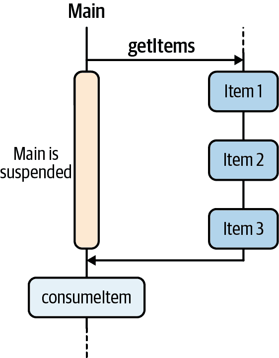
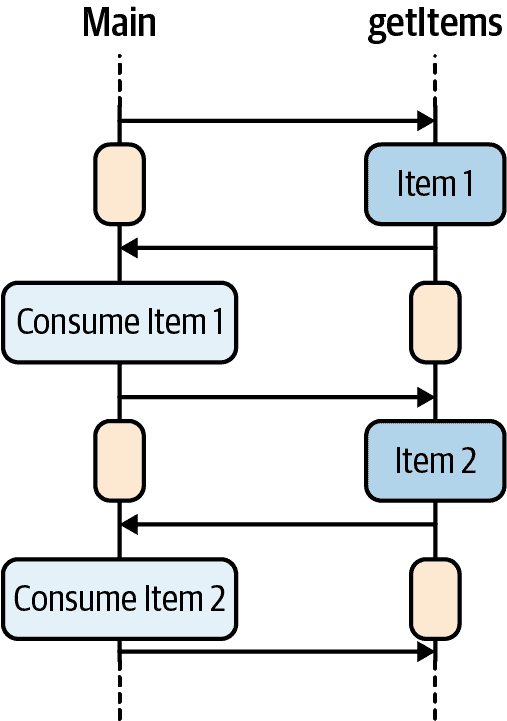
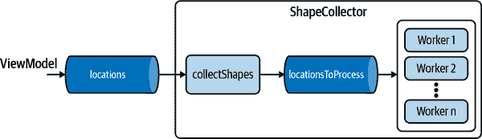
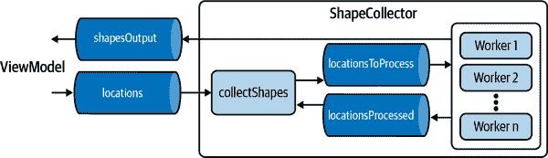
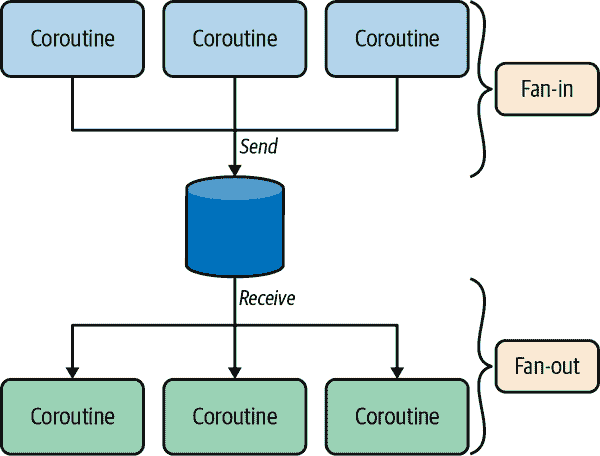
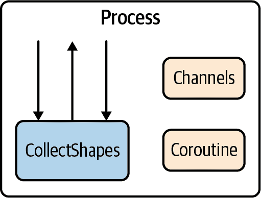
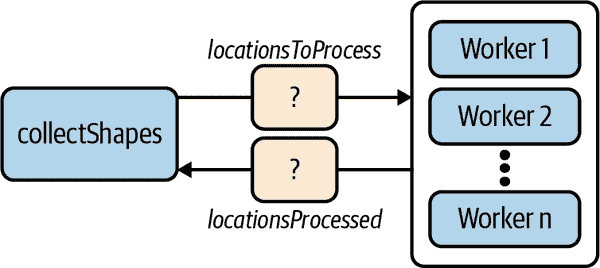
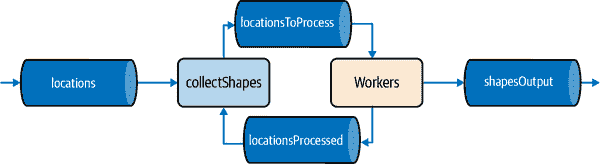

# 第九章：通道

在前一章中，您学习了如何创建协程、取消它们并处理异常。因此，您知道如果任务 B 需要任务 A 的结果，可以将它们实现为两个依次调用的挂起函数。但如果任务 A 产生一系列的值怎么办？`async`和挂起函数并不适用于这种情况。这就是`Channel`s^(1)的用途——让协程进行通信。在本章中，您将详细了解什么是通道以及如何使用它们。

仅使用通道和协程，我们可以使用*通信顺序进程*（CSP）设计复杂的异步逻辑。什么是 CSP？Kotlin 受到几种现有编程语言的启发，如 Java、C#、JavaScript、Scala 和 Groovy。值得注意的是，Go（语言）通过其“goroutines”与协程共同启发了它们。

在计算机科学中，CSP 是一种并发编程语言，由 Tony Hoare 于 1978 年首次描述。自那以后，它已经不断发展，现在 CSP 这个术语主要用来描述一种编程风格。如果您熟悉 Actor 模型，CSP 与之非常相似——尽管存在一些差异。如果您从未听说过 CSP，不要担心——我们将通过实际例子简要解释它的*理念*。目前，您可以将 CSP 视为一种编程风格。

与往常一样，我们将从一点理论开始，然后实施一个真实的问题。最后，我们将讨论使用协程的 CSP 的好处和权衡。

# 通道概述

回到我们的介绍性示例，想象一下一个任务异步地生成了三个`Item`实例的列表（生产者），而另一个任务则对每个项目进行操作（消费者）。由于生产者不会立即返回，您可以像以下这样实现`getItems`挂起函数：

```
suspend fun getItems(): List<Item> {
     val items = mutableListOf<Item>()
     items.add(makeItem())
     items.add(makeItem())
     items.add(makeItem())
     return items
}

suspend fun makeItem(): Item {
    delay(10) // simulate some asynchronism
    return Item()
}
```

至于消费者，它消费每一个项目，您可以简单地像这样实现：

```
fun consumeItems(items: List<Item>) {
     for (item in items) println("Do something with $item")
}
```

综合起来：

```
fun main() = runBlocking {
     val items = getItems()
     consumeItems(items)
}
```

如您所预期，“对..做一些事情”会打印三次。然而，在这种情况下，我们最感兴趣的是执行顺序。让我们更仔细地看一看实际发生了什么，如图 9-1 所示。

在图 9-1 中，只有在所有项目都被生产后，才会开始消费项目。生产项目可能需要一些时间，并且在某些情况下等待它们全部生产完毕是不可接受的。相反，我们可以异步地对每个生成的项目进行操作，如图 9-2 所示。



###### 图 9-1\. 全部一起处理。



###### 图 9-2\. 依次处理。

为了实现这一点，我们不能像之前那样将`getItems`实现为挂起函数。协程应该充当`Item`实例的生产者，并将它们发送到主协程。这是一个典型的生产者-消费者问题。

在 第五章 中，我们解释了如何使用 `BlockingQueue` 来实现 *工作队列* —— 或者，在这种情况下，是一个数据队列。提醒一下，`BlockingQueue` 有阻塞方法 `put` 和 `take`，分别用于向队列中插入和从队列中取出对象。当队列被用作两个线程之间唯一的通信方式（一个生产者和一个消费者）时，它提供了一个巨大的好处，即避免了共享的可变状态。此外，如果队列是有界的（有大小限制），如果消费者太慢，一个过快的生产者最终将在 `put` 调用中被阻塞。这被称为背压：被阻塞的生产者给了消费者追赶的机会，从而释放了生产者。

如果使用 `BlockingQueue` 作为协程之间的通信原语并不是一个好主意，因为协程不应该涉及阻塞调用。相反，协程可以暂停。`Channel` 可以被看作是这样的：一个带有暂停函数 `send` 和 `receive` 的队列，就像 图 9-3 所示。`Channel` 还有非暂停的对应方法：`trySend` 和 `tryReceive`。这两种方法也是非阻塞的。`trySend` 尝试立即将元素添加到通道，并返回结果的包装类 `ChannelResult<T>`。该包装类也指示操作的成功或失败。`tryReceive` 尝试立即从通道中检索元素，并返回一个 `ChannelResult<T>` 实例。


###### 图 9-3\. 通道。

像队列一样，`Channel` 有多种不同的类型。我们将用基本示例来介绍每种 `Channel` 变体。

## 会合通道

“Rendezvous” 是法语词汇，意思是“约会”或“一次约会” —— 这取决于上下文（我们这里不是指 `CoroutineContext`）。会合通道完全没有缓冲区。只有当 `send` 和 `receive` 调用在时间上会合（rendezvous）时，元素才从发送方传输到接收方，因此 `send` 会暂停，直到另一个协程调用 `receive`，而 `receive` 会暂停，直到另一个协程调用 `send`。

另一种说法是，会合通道涉及生产者（调用 `send` 的协程）和消费者（调用 `receive` 的协程）之间的来回通信。在没有中间的 `receive` 的情况下，不能连续进行两次 `send`。

默认情况下，当使用 `Channel<T>()` 创建通道时，会得到一个会合通道。

我们可以使用会合通道来正确实现我们之前的示例：

```
fun main() = runBlocking {
    val channel = Channel<Item>()
    launch {                        
        channel.send(Item(1))       
        channel.send(Item(2))       
        println("Done sending")
    }

    println(channel.receive())      
    println(channel.receive())      

    println("Done!")
}

data class Item(val number: Int)
```

该程序的输出是：

```
Item(number=1)
Item(number=2)
Done!
Done sending
```

在这个例子中，主协程使用`launch`启动了一个子协程，在处到达，然后到达并暂停，直到某个协程在通道中发送了一个`Item`实例。稍后，子协程在处发送第一个项目，然后在处到达并暂停，直到某个协程准备好接收项目。随后，主协程（在处暂停）被恢复，并从通道接收第一个项目并打印出来。然后主协程到达，并立即接收第二个项目，因为子协程已经在`send`调用中暂停。紧接着，子协程继续执行（打印“Done sending”）。

### 遍历通道

可以使用常规的`for`循环迭代`Channel`。请注意，由于通道不是常规集合^(2)，因此无法使用 Kotlin 标准库中的`forEach`或类似的其他函数。在这里，通道迭代是一种特定的语言级特性，只能使用`for`循环语法完成：

```
for (x in channel) {
   // do something with x every time some coroutine sends an element in
   // the channel
}
```

隐式地，每次迭代中`x`等于`channel.receive()`。因此，协程在通道上迭代可能会无限进行，除非它包含条件逻辑以中断循环。幸运的是，有一个标准机制来中断循环：关闭通道。这里是一个例子：

```
fun main() = runBlocking {
    val channel = Channel<Item>()
    launch {
        channel.send(Item(1))
        channel.send(Item(2))
        println("Done sending")
        channel.close()
    }

    for (x in channel) {
        println(x)
    }
    println("Done!")
}
```

这个程序有类似的输出，但有一个小的区别：

```
Item(number=1)
Item(number=2)
Done sending
Done!
```

这一次，“Done sending”出现在“Done!”之前，这是因为主协程只在`channel`关闭时离开通道迭代。而这发生在子协程完成发送所有元素时。

内部地，关闭一个通道会向通道发送一个特殊的令牌，表示不会再发送任何其他元素。由于通道中的项目是*串行*消耗的（一个接一个地），在关闭特殊令牌之前发送到会合通道的所有项目都保证会被发送到接收方。

###### 警告

注意—尝试从已关闭的通道调用`receive`会抛出`ClosedReceiveChannelException`异常。然而，尝试在这样的通道上进行迭代不会抛出任何异常：

```
fun main() = runBlocking {
    val channel = Channel<Int>()
    channel.close()

    for (x in channel) {
        println(x)
    }
    println("Done!")
}
```

输出是：`Done!`

### 其他类型的通道

在前面的例子中，`Channel`似乎是使用类构造函数创建的。如果查看源代码，可以看到实际上是使用以大写字母开头的公共函数命名，以给出使用类构造函数的假象：

```
public fun <E> Channel(capacity: Int = RENDEZVOUS): Channel<E> =
    when (capacity) {
        RENDEZVOUS -> RendezvousChannel()
        UNLIMITED -> LinkedListChannel()
        CONFLATED -> ConflatedChannel()
        BUFFERED -> ArrayChannel(CHANNEL_DEFAULT_CAPACITY)
        else -> ArrayChannel(capacity)
    }
```

您可以看到此`Channel`函数具有一个`capacity`参数，默认为`RENDEZVOUS`。记录中，如果您进入`RENDEZVOUS`声明，您会看到它等于 0。每个`capacity`值都对应一个相应的通道实现。有四种不同的通道类型：会合、*无限*、*合并*和*缓冲*。不要过多关注具体实现（如`RendezvousChannel()`），因为这些类是内部的，未来可能会更改。另一方面，值`RENDEZVOUS`、`UNLIMITED`、`CONFLATED`和`BUFFERED`是公共 API 的一部分。

我们将在接下来的章节中介绍每一种通道类型。

## 无限通道

*无限*通道有一个仅受可用内存限制的缓冲区。向此通道发送数据的发送者永不挂起，而接收者仅在通道为空时挂起。通过*无限*通道交换数据的协程无需在时间上满足。

此时，您可能会认为当发送者和接收者在不同线程上执行时，这样的通道应该存在并发修改问题。毕竟，协程是在线程上分发的，因此通道很可能会被不同线程使用。让我们自己检查`Channel`的健壮性！在以下示例中，我们从在`Dispatchers.Default`上分派的协程中发送`Int`到同一个通道，同时另一个协程从主线程读取同一通道，如果`Channel`不是线程安全的，我们会注意到：

```
fun main() = runBlocking {
    val channel = Channel<Int>(UNLIMITED)
    val childJob = launch(Dispatchers.Default) {
        println("Child executing from ${Thread.currentThread().name}")
        var i = 0
        while (isActive) {
            channel.send(i++)
        }
        println("Child is done sending")
    }

    println("Parent executing from ${Thread.currentThread().name}")
    for (x in channel) {
        println(x)

        if (x == 1000_000) {
            childJob.cancel()
            break
        }
    }

    println("Done!")
}
```

此程序的输出是：

```
Parent executing from main
Child executing from DefaultDispatcher-worker-2
0
1
..
1000000
Done!
Child is done sending
```

您可以随意运行此示例，并始终无并发问题。这是因为`Channel`内部使用无锁算法。^(3)

###### 注意

`Channel`是线程安全的。多个线程可以以线程安全的方式同时调用`send`和`receive`方法。

## 合并通道

此通道具有大小为 1 的缓冲区，并且仅保留最后发送的元素。要创建*合并*通道，您可以调用`Channel<T>(Channel.CONFLATED)`。例如：

```
fun main() = runBlocking {
    val channel = Channel<String>(Channel.CONFLATED)

    val job = launch {
        channel.send("one")
        channel.send("two")
    }

    job.join()
    val elem = channel.receive()
    println("Last value was: $elem")
}
```

此程序的输出是：

```
Last value was: two
```

第一个发送的元素是“one”。当发送`two`时，它替换了通道中的“one”。我们使用`job.join()`等待协程发送元素完成，然后从通道中读取值`two`。

## 缓冲通道

*缓冲*通道是具有固定容量的`Channel`，容量为大于 0 的整数。向此通道发送数据的发送者仅在缓冲区满时挂起，而从此通道接收数据的接收者仅在缓冲区空时挂起。要创建一个具有大小为 2 的`Int`缓冲区的缓冲通道，您可以调用`Channel<Int>(2)`。以下是一个使用示例：

```
fun main() = runBlocking<Unit> {
    val channel = Channel<Int>(2)

    launch {
        for (i in 0..4) {
            println("Send $i")
            channel.send(i)
        }
    }

    launch {
        for (i in channel) {
            println("Received $i")
        }
    }
}
```

此程序的输出是：

```
Send 0
Send 1
Send 2
Received 0
Received 1
Received 2
Send 3
Send 4
Received 3
Received 4
```

在这个例子中，我们定义了一个容量为 2 的`Channel`。一个协程尝试发送五个整数，而另一个协程从通道中消费元素。发送者协程成功一次性发送 0 和 1，然后尝试发送 3。对于值 3，`println("Send $i")`被执行，但发送者协程在`send`调用中被挂起。消费者协程也是同样的道理：连续接收两个元素，并在挂起之前额外打印。

## 通道生产者

到目前为止，你已经看到`Channel`既可以用于发送*也可以*用于接收元素。有时候，你可能希望更明确地指定通道应该用于发送还是接收。当你正在实现一个只能被其他协程读取的`Channel`时，你可以使用`produce`构建器：

```
fun CoroutineScope.produceValues(): ReceiveChannel<String> = produce {
    send("one")
    send("two")
}
```

正如你所看到的，`produce`返回一个`ReceiveChannel`—它只有与接收操作相关的方法（`receive`是其中之一）。`ReceiveChannel`的实例不能用于发送元素。

###### 提示

另外，我们已将`produceValues()`定义为`CoroutineScope`的扩展函数。调用`produceValues`将启动一个将元素发送到通道的新协程。在 Kotlin 中有一个约定：每个启动协程的函数都应该被定义为`CoroutineScope`的扩展函数。如果遵循这个约定，你可以很容易地区分出哪些函数在你的代码中启动了新的协程而不是挂起函数。

使用`produceValues`的主要代码可能是：

```
fun main() = runBlocking {
    val receiveChannel = produceValues()

    for (e in receiveChannel) {
        println(e)
    }
}
```

相反，`SendChannel`只有与发送操作相关的方法。实际上，从源代码来看，`Channel`是一个接口，继承自`ReceiveChannel`和`SendChannel`：

```
public interface Channel<E> : SendChannel<E>, ReceiveChannel<E> {
    // code removed for brevity
}
```

这是如何使用`SendChannel`的：

```
fun CoroutineScope.collectImages(imagesOutput: SendChannel<Image>) {
    launch(Dispatchers.IO) {
        val image = readImage()
        imagesOutput.send(image)
    }
}
```

# 通信顺序进程

理论够了，让我们开始看看通道如何用于实现一个真实问题。想象一下，你的 Android 应用程序必须在画布上显示“形状”。根据用户的输入，你的应用程序必须显示任意数量的形状。我们故意使用通用术语—一个形状可以是地图上的兴趣点，游戏中的物品，任何可能需要一些后台工作的东西，比如 API 调用、文件读取、数据库查询等。在我们的例子中，主线程，已经处理用户输入，将模拟请求渲染新形状。你已经可以预见到这是一个生产者-消费者问题：主线程发出请求，而一些后台任务处理这些请求并将结果返回给主线程。

我们的实现应该：

+   线程安全

+   降低设备内存超负荷风险

+   没有线程争用（我们不会使用锁）

## 模型和架构

一个`Shape`由一个`Location`和一些有用的`ShapeData`组成：

```
data class Shape(val location: Location, val data: ShapeData)
data class Location(val x: Int, val y: Int)
class ShapeData
```

给定一个 `Location`，我们需要获取相应的 `ShapeData` 来构建一个 `Shape`。因此，在这个例子中，`Location` 是输入，而 `Shape` 是输出。为简洁起见，我们将使用 “位置” 表示 `Location`， “形状” 表示 `Shape`。

在我们的实现中，我们将区分两个主要组件：

视图模型

这段代码包含大部分与形状相关的应用逻辑。当用户与 UI 交互时，视图会将位置列表传递给视图模型。

`shapeCollector`

这负责根据位置列表获取形状。

图 9-4 描述了视图模型和形状收集器之间的双向关系。


###### 图 9-4\. 高级架构。

`ShapeCollector` 遵循一个简单的流程：

```
               fetchData
Location ---------------------> ShapeData
```

作为额外的先决条件，我们的 `ShapeCollector` 应该维护一个内部的“注册表”，用于正在处理的位置。在接收到要处理的位置时，`ShapeCollector` 不应尝试下载已经正在处理的位置。

## 第一个实现

我们可以从这个第一个天真的 `ShapeCollector` 实现开始，虽然它远非完整，但你会有个概念：

```
class ShapeCollector {
    private val locationsBeingProcessed = mutableListOf<Location>()

    fun processLocation(location: Location) {
        if (locationsBeingProcessed.add(location)) {
             // fetch data, then send back a Shape instance to
             // the view-model
        }
    }
}
```

如果我们使用线程编程，会有多个线程共享一个 `ShapeCollector` 实例，并并发执行 `processLocation`。然而，这种方法会导致共享可变状态。在前面的代码片段中，`locationsBeingProcessed` 就是一个例子。

正如你在 第五章 中学到的，使用锁容易出错。使用协程，我们无需共享可变状态。如何做到的呢？通过协程和通道，我们可以通过*通信来共享*而不是*共享来通信*。

关键思想是将可变状态封装在协程内部。对于正在处理的 `Location` 列表，可以通过以下方式实现：

```
launch {
    val locationsBeingProcessed = mutableListOf<Location>()     

    for (location in locations) {                               
        // same code from previous figure
    }
}
```


在前面的例子中，只有使用 `launch` 启动的协程可以访问可变状态，即 `locationsBeingProcessed`。


不过，我们现在遇到了一个问题。我们如何提供 `location` 呢？我们必须以某种方式将这个可迭代对象传递给协程。所以我们会使用一个 `Channel`，并将其作为我们即将声明的函数的输入。由于我们在函数内启动一个协程，我们将此函数声明为 `CoroutineScope` 的扩展函数：

```
private fun CoroutineScope.collectShapes(
     locations: ReceiveChannel<Location>
) = launch {
     // code removed for brevity
}
```

由于这个协程将从视图模型接收 `Location`，我们将 `Channel` 声明为 `ReceiveChannel`。顺便说一句，在前面的部分中，你已经看到 `Channel` 可以像列表一样迭代。所以现在，我们可以为从通道接收到的每个 `Location` 实例获取相应的 `ShapeData`。由于你希望并行进行此操作，你可能会写出类似于以下的代码：

```
private fun CoroutineScope.collectShapes(
     locations: ReceiveChannel<Location>
) = launch {
     val locationsBeingProcessed = mutableListOf<Location>()

     for (loc in locations) {
         if (!locationsBeingProcessed.contains(loc) {
              launch(Dispatchers.IO) {
                   // fetch the corresponding `ShapeData`
              }
         }
    }
}
```

注意，在这段代码中有一个陷阱。你看，对于每个接收到的位置，我们都会启动一个新的协程。如果 `locations` 通道提供了大量的项目，这段代码可能会启动大量的协程。因此，这种情况也称为 *无限并发*。当我们介绍协程时，我们说它们很轻量级。这是真的，但它们所做的工作可能会消耗大量资源。在这种情况下，`launch(Dispatchers.IO)` 本身的开销微不足道，而获取 `ShapeData` 可能需要对带有有限带宽的服务器进行 REST API 调用。

因此，我们必须找到一种方法来限制并发 —— 我们不希望启动无限数量的协程。面对这种线程的情况，一个常见的做法是使用与工作队列耦合的线程池（见第五章）。我们将创建一个 *协程池*，命名为 *工作者池*，而不是线程池。来自这个工作者池的每个协程将为给定位置执行实际的 `ShapeData` 获取。为了与这个工作者池通信，`collectShapes` 应该使用一个额外的通道，通过它可以将位置发送到工作者池，如图 9-5 所示。



###### 图 9-5\. 并发限制。

###### 警告

当你使用 `Channel` 时，*要小心不要有无限并发*。想象一下，你必须实例化很多 `Bitmap` 实例。存储像素数据的底层内存缓冲区在内存中占用了非常可观的空间。在处理大量图像时，每次需要创建图像时分配一个新的 `Bitmap` 实例会给系统带来显著的压力（需要在 RAM 中分配内存，同时垃圾收集器清理所有不再引用的先前创建的实例）。这个问题的一个经典解决方案是 `Bitmap` 池化，这只是 *对象池* 更一般模式的一个特例。你可以从池中选择一个 `Bitmap` 实例（并在可能时重用底层缓冲区）而不是创建一个新的 `Bitmap` 实例。

这就是修改 `collectShapes` 以接受额外通道参数的方法：

```
private fun CoroutineScope.collectShapes(
     locations: ReceiveChannel<Location>,
     locationsToProcess: SendChannel<Location>,
) = launch {
     val locationsBeingProcessed = mutableListOf<Location>()

     for (loc in locations) {
         if (!locationsBeingProcessed.contains(loc) {
              launch(Dispatchers.IO) {
                   locationsToProcess.send(loc)
              }
         }
    }
}
```

注意现在 `collectShapes` 如何将位置发送到 `locationsToProcess` 通道，只有当该位置不在当前正在处理的位置列表中时。

至于工作实现，它只是从我们刚刚创建的通道中读取 —— 除了从工作者的角度来看，它是一个`ReceiveChannel`。使用相同的模式：

```
private fun CoroutineScope.worker(
        locationsToProcess: ReceiveChannel<Location>,
) = launch(Dispatchers.IO) {
        for (loc in locationsToProcess) {
             // fetch the ShapeData, see later
        }
}
```

现在，我们不关注如何获取`ShapeData`。这里最重要的概念是`for`循环。由于在`locationsToProcess`通道上进行迭代，每个单独的`worker`协程将收到自己的位置，而不会干扰其他协程。无论我们启动多少个 worker，从`collectShapes`发送到`locationsToProcess`通道的位置只会被一个 worker 接收。当我们连接所有这些东西时，每个 worker 将使用相同的通道实例创建。在面向消息的软件中，这种模式，即将消息传递到多个目的地，称为*fan-out*。

回顾一下`for`循环内缺失的实现，我们将要做的事情是：

1.  获取`ShapeData`（从现在开始我们简称为“数据”）。

1.  从位置和数据创建一个`Shape`。

1.  将形状发送到某个通道，我们应用程序中的其他组件将使用这个通道从`ShapeCollector`获取形状。显然，我们还没有创建这样的通道。

1.  通知`collectShapes`协程，给定位置已经处理完毕，通过将其发送回发送者。同样，这样的通道必须先创建。

注意，这并不是唯一可能的实现方式。你可以想象其他方法，并根据自己的需求进行调整。毕竟，本章的目的就是为你提供示例和灵感，以便你进行下一步的开发。

回到我们的主题，示例 9-1 展示了`worker`协程的最终实现。

##### 示例 9-1\. 工作协程

```
private fun CoroutineScope.worker(
    locationsToProcess: ReceiveChannel<Location>,
    locationsProcessed: SendChannel<Location>,
    shapesOutput: SendChannel<Shape>
) = launch(Dispatchers.IO) {
    for (loc in locationsToProcess) {
        try {
            val data = getShapeData(loc)
            val shape = Shape(loc, data)
            shapesOutput.send(shape)
        } finally {
            locationsProcessed.send(loc)
        }
    }
}
```

就像之前调整`collectShapes`以接受一个通道作为参数一样，这次我们要添加两个通道：`locationsProcessed`和`shapesOutput`。

在`for`循环内，我们首先获取一个位置的`ShapeData`实例。为了这个简单示例的目的，示例 9-2 展示了我们的实现。

##### 示例 9-2\. 获取形状数据

```
private suspend fun getShapeData(
    location: Location
): ShapeData = withContext(Dispatchers.IO) {
        /* Simulate some remote API delay */
        delay(10)
        ShapeData()
}
```

由于`getShapeData`方法可能不会立即返回，我们将其实现为`suspend`函数。假设下游代码涉及远程 API，我们使用`Dispatchers.IO`。

`collectShapes`协程必须再次适应，因为它必须接受另一个通道——工作者完成处理后返回的位置。你已经开始适应它了——从`collectShapes`的角度来看，这将是一个`ReceiveChannel`。现在，`collectShapes`接受两个`ReceiveChannel`和一个`SendChannel`。

让我们试试看：

```
private fun CoroutineScope.collectShapes(
     locations: ReceiveChannel<Location>,
     locationsToProcess: SendChannel<Location>,
     locationsProcessed: ReceiveChannel<Location>
): Job = launch {
     ...
     for (loc in locations) {
          // same implementation, hidden for brevity
     }
     // but.. how do we iterate over locationsProcessed?
}
```

现在我们有了问题。如何同时从多个`ReceiveChannel`接收元素？如果我们在`locations`通道迭代的下方添加另一个`for`循环，它将无法按预期工作，因为第一个迭代仅在`locations`通道关闭时结束。

为此，可以使用`select`表达式。

## Select 表达式

`select` 表达式等待多个暂停函数的结果同时返回，这些函数在此 select 调用的主体中使用 *子句* 指定。调用者在一个子句被 *选中* 或 *失败* 后才会被暂停。 

在我们的情况下，它的工作方式如下：

```
select<Unit> {
    locations.onReceive { loc ->
        // do action 1
    }
    locationsProcessed.onReceive { loc ->
        // do action 2
    }
}
```

如果 `select` 表达式能说话，它会说：“每当 `locations` 通道接收到一个元素时，我将执行动作 1\. 或者，如果 `locationsProcessed` 通道接收到某个东西，我将执行动作 2\. 我无法同时执行这两个操作。顺便说一句，我会返回 `Unit`。”

“我无法同时执行这两个操作”是很重要的。你可能会想知道如果操作 1 需要半个小时，或者更糟的是，永远无法完成，会发生什么。我们将在 “CSP 中的死锁” 中描述类似的情况。然而，随后的实现保证在每个操作中 *永远* 不会长时间阻塞。

因为 `select` 是一个表达式，它会返回一个结果。结果类型由我们为 `select` 的每个 case 提供的 lambda 的返回类型推断出来，这与 `when` 表达式非常相似。在这个特定的示例中，我们不需要任何结果，所以返回类型是 `Unit`。由于 `select` 在 `locations` 或 `locationsProcessed` 通道接收到元素后返回，它不像之前的 `for` 循环那样遍历通道。因此，我们必须将其包装在 `while(true)` 内。完整的 `collectShapes` 实现在 示例 9-3 中显示。

##### 示例 9-3\. 收集形状

```
private fun CoroutineScope.collectShapes(
    locations: ReceiveChannel<Location>,
    locationsToProcess: SendChannel<Location>,
    locationsProcessed: ReceiveChannel<Location>
) = launch(Dispatchers.Default) {

    val locationsBeingProcessed = mutableListOf<Location>()

    while (true) {
        select<Unit> {
            locationsProcessed.onReceive {                     
                locationsBeingProcessed.remove(it)
            }
            locations.onReceive {                              
                if (!locationsBeingProcessed.any { loc ->
                    loc == it }) {
                    /* Add it to the list of locations being processed */
                    locationsBeingProcessed.add(it)

                    /* Now download the shape at location */
                    locationsToProcess.send(it)
                }
            }
        }
    }
}
```


当 `locationsProcessed` 通道接收到一个位置时，我们知道这个位置已经被一个 worker 处理过了。现在应该将其从正在处理的位置列表中移除。


当 `locations` 通道接收到一个位置时，我们必须首先检查我们是否已经在处理相同的位置。如果没有，我们将该位置添加到 `locationsBeingProcessed` 列表中，然后将其发送到 `locationsToProcess` 通道。

## 将所有内容整合在一起

`ShapeCollector` 的最终架构已经成形，如 图 9-6 所示。



###### 图 9-6\. 最终架构。

请记住，我们用来实现 `collectShapes` 和 `worker` 方法的所有通道都必须在某个地方创建。为了尊重封装性，一个好的地方是在 `start` 方法中，如 示例 9-4 中所示。

##### 示例 9-4\. 形状收集器

```
class ShapeCollector(private val workerCount: Int) {
    fun CoroutineScope.start(
        locations: ReceiveChannel<Location>,
        shapesOutput: SendChannel<Shape>
    ) {
        val locationsToProcess = Channel<Location>()
        val locationsProcessed = Channel<Location>(capacity = 1)

        repeat(workerCount) {
             worker(locationsToProcess, locationsProcessed, shapesOutput)
        }
        collectShapes(locations, locationsToProcess, locationsProcessed)
    }

    private fun CoroutineScope.collectShapes // already implemented

    private fun CoroutineScope.worker        // already implemented

    private suspend fun getShapeData         // already implemented
}
```

这个`start`方法负责启动整个形状收集机制。在`ShapeCollector`内部专门使用的两个通道被创建：`locationsToProcess`和`locationsProcessed`。我们在这里没有显式地创建`ReceiveChannel`或`SendChannel`实例。我们创建它们作为`Channel`实例，因为它们将进一步被用作`ReceiveChannel`或`SendChannel`。然后通过调用`worker`方法`workerCount`次来创建并启动工作者池。这是通过使用标准库中的`repeat`函数实现的。

最后，我们调用`collectShapes`一次。总的来说，在这个`start`方法中我们启动了`workerCount + 1`个协程。

你可能已经注意到`locationsProcessed`被创建时容量为 1。这是有意为之，并且是一个重要的细节。我们将在下一节解释原因。

## Fan-Out 和 Fan-In

你刚刚看到了多个协程从同一个通道接收数据的例子。事实上，所有`worker`协程都从同一个`locationsToProcess`通道接收数据。发送到`locationsToProcess`通道的`Location`实例将被一个工作者处理，没有任何并发问题的风险。这种协程之间的特定交互被称为*fan-out*，如图 9-7 所示。从`collectShapes`函数启动的协程的角度来看，位置被分发到工作者池中。



###### 图 9-7。Fan-out 和 fan-in。

通过启动几个协程来实现 Fan-out，它们都迭代同一个`ReceiveChannel`实例（参见示例 9-1 中的`worker`实现）。如果其中一个工作者失败，其他工作者将继续从通道接收数据，使系统在一定程度上具有弹性。

相反地，当几个协程向同一个`SendChannel`实例发送元素时，我们称之为*fan-in*。再次，你有一个很好的例子，因为所有工作者都向`shapesOutput`发送`Shape`实例。

## 性能测试

好了！是时候测试我们的`ShapeCollector`的性能了。以下代码片段有一个`main`函数，调用了`consumeShapes`和`sendLocations`函数。这些函数分别启动一个协程，从`ShapeCollector`中消费`Shape`实例并发送`Location`实例。总的来说，这段代码接近于你在真实的视图模型中编写的代码，如示例 9-5 所示。

##### 示例 9-5。形状收集器

```
fun main() = runBlocking<Unit> {
    val shapes = Channel<Shape>()                
    val locations = Channel<Location>()

    with(ShapeCollector(4)) {                    
        start(locations, shapes)
        consumeShapes(shapes)
    }

    sendLocations(locations)
}

var count = 0

fun CoroutineScope.consumeShapes(
    shapesInput: ReceiveChannel<Shape>
) = launch {
    for (shape in shapesInput) {
        // increment a counter of shapes
        count++                                  
    }
}

fun CoroutineScope.sendLocations(
    locationsOutput: SendChannel<Location>
) = launch {
    withTimeoutOrNull(3000) {                    
        while (true) {
            /* Simulate fetching some shape location */
            val location = Location(Random.nextInt(), Random.nextInt())
            locationsOutput.send(location)
        }
    }
    println("Received $count shapes")
}
```


我们根据`ShapeCollector`的需求设置了通道——参见图 9-4。


我们使用四个工作者创建了一个`ShapeCollector`。


`consumeShapes`函数只是增加一个计数器。这个计数器是全局声明的，这是可以的，因为由`consumeShapes`启动的协程是唯一修改`count`的。


在 `sendLocations` 函数中，我们设置了三秒的超时时间。`withTimeoutOrNull` 是一个挂起函数，它会挂起直到提供的时间结束。因此，以 `sendLocations` 开始的协程仅在三秒后打印接收到的计数。

如果你回想一下在 Example 9-2 中的 `getShapeData` 实现，我们增加了 `delay(10)` 来模拟一个 10 毫秒长的挂起调用。在三秒内运行四个工作者，理论上我们应该接收到 3,000 / 10 × 4 = 1,200 个形状，如果我们的实现没有额外开销的话。在我们的测试机器上，我们得到了 1,170 个形状—这是 98% 的效率。

在更多工作者（64）和每个工作者中使用 `delay(5)` 的情况下，我们在 10 秒内得到了 122,518 个形状（理想数目为 128,000）—这是 96% 的效率。

总体而言，`ShapeCollector` 的吞吐量相当不错，即使有一个 `sendLocations` 函数不间断地发送 `Location` 实例而没有任何暂停。

## 回压

如果我们的工作者速度太慢会发生什么？如果远程 HTTP 调用花费了时间来响应，或者后端服务器不堪重负——我们无法确定。为了模拟这种情况，我们可以大幅增加 `getShapeData` 内部的延迟（见 Example 9-2）。使用 `delay(500)`，我们在三秒内只获得了 20 个形状，使用了四个工作者。吞吐量减少了，但这并不是最有趣的部分。和生产者-消费者问题一样，当消费者变慢时问题可能会出现——因为生产者可能会积累数据，系统最终可能会耗尽内存。你可以在生产者协程内添加 `println()` 日志并重新运行程序。

```
fun CoroutineScope.sendLocations(locationsOutput: SendChannel<Location>) = launch {
    withTimeoutOrNull(3000) {
        while (true) {
            /* Simulate fetching some shape location */
            val location = Location(Random.nextInt(), Random.nextInt())
            println("Sending a new location")
            locationsOutput.send(location)      // suspending call
        }
    }
    println("Received $count shapes")
}
```

现在，“发送一个新位置”仅在控制台中打印了大约 25 次。

因此，生产者正在被减速。如何减速？

因为 `locationsOutput.send(location)` 是一个挂起调用。当工作器速度较慢时，`ShapeCollector` 类的 `collectShapes` 函数（见 Example 9-3）在 `locationsToProcess.send(it)` 这一行很快就会挂起。确实，`locationsToProcess` 是一个会合通道。因此，当以 `collectShapes` 开始的协程达到该行时，它会被挂起，直到工作者准备好从 `locationsToProcess` 接收位置信息。当前述的协程被挂起时，它无法再从 `locations` 通道接收信息—这对应于前面例子中的 `locationsOutput`。这就是以 `sendLocation` 开始的协程被挂起的原因。当工作者最终完成他们的工作时，`collectShapes` 可以恢复执行，生产者协程也会随之恢复。

## 与 Actor 模型的相似之处

在 CSP 中，您创建协程来封装可变状态。它们不通过共享状态来通信，而是通过通信（使用`Channel`）来共享。使用`collectShapes`函数启动的协程（参见示例 9-3）使用三个通道与其他协程进行通信——一个`SendChannel`和两个`ReceiveChannel`，如图 9-8 所示。

在 CSP 术语中，`collectShapes`及其三个通道被称为*进程*。进程是一个计算实体，通过异步消息传递（通道）与其他角色进行通信。它一次只能做一件事情——读取、写入通道或处理。

在 Actor 模型中，*actor*非常相似。一个显著的区别是，一个 actor 只有一个通道——称为邮箱。如果一个 actor 需要响应迅速且不阻塞，它必须将长时间运行的处理委托给子 actor。这种相似性是 CSP 有时被称为 Actor 模型实现的原因。



###### 图 9-8\. CSP 中的进程。

## 进程内执行是顺序的。

我们刚刚看到*进程*由单个协程和通道组成。协程的本质是在某个线程上执行。因此，除非此协程启动其他子协程（并发或并行运行），否则该协程的所有行都会顺序执行。这包括从通道接收、发送对象到其他通道和突变某些私有状态。因此，本章实现的 actor 可以从一个通道接收或向另一个通道发送，但不能同时进行。在负载下，这种类型的 actor 可以高效，因为它不涉及阻塞调用，只涉及挂起函数。当一个协程被挂起时，整体效率不一定受影响，因为执行挂起协程的线程可以执行其他有事情要做的协程。这样，线程可以充分利用，永远不会争夺某个锁。

## 总结

使用 CSP 风格的这种机制几乎没有内部开销。由于使用了`Channel`和协程，我们的实现是无锁的。因此，不存在线程竞争——`ShapeCollector`不太可能影响应用程序的其他线程。类似地，我们在`ShapeCollector`中使用的`Dispatchers`也有可能在应用程序的其他功能中使用。通过利用无锁实现，协程在从通道接收时被挂起不会阻止底层线程执行其他协程。换句话说，我们可以在相同的资源上做更多事情。

此外，这种架构提供了内置的反压功能。如果某些`ShapeData`实例突然获取需要更多时间，那么`ShapeLocation`实例的生产者将放慢速度，以防止位置积累，从而降低内存耗尽的风险。这种反压功能是免费提供的——您并没有显式编写此功能的代码。

本章节中提供的示例足够通用，可以直接采用并根据您的需求进行调整。如果您需要显著偏离我们的示例，那么我们有责任给您更深入的解释。例如，为什么在示例 9-4 中我们将`locationsProcessed`通道的容量设置为 1？答案确实并不简单。如果我们创建了一个常规的会合通道，我们的`ShapeCollector`将会遭受*死锁*，这将引导我们到下一节。

# CSP 中的死锁

当涉及线程时，死锁最常见。当线程 A 持有锁 1 并试图获取锁 2 时，而线程 B 持有锁 2 并试图获取锁 1 时，就会发生死锁。这两个线程互相无限等待，都无法继续执行。当死锁发生在应用程序的关键组件中时，可能会产生灾难性后果。避免这种情况的有效方法是确保在任何情况下都不会发生死锁。即使条件极不可能被满足，你也要相信墨菲定律总会发生作用。

然而，在 CSP 架构中也可能发生死锁。我们可以做一个小实验来说明这一点。在示例 9-4 中，不要将`locationsProcessed`通道的容量设置为 1，而是使用一个没有缓冲区的通道（即会合通道），并在示例 9-5 中运行性能测试样本。控制台打印的结果是：

```
Received 4 shapes
```

记录中，我们本应该收到 20 个形状。那么，究竟发生了什么？

###### 注意

警告：以下解释详细说明每一个必要的细节，篇幅相当长。我们鼓励您仔细阅读直至最后。这是测试您对通道理解的终极挑战。

您也可以完全跳过它，直接转到“TL;DR”。

让我们更仔细地查看我们的`ShapeCollector`类的内部，并像一个实时调试器一样跟随每一步。想象一下，你刚刚启动了示例 9-5 中的性能测试样本，并且第一个`Location`实例被发送到`locations`通道。该位置通过其`select`表达式经过`collectShapes`方法。在那一刻，`locationsProcessed`没有提供任何内容，因此`select`表达式通过第二种情况：`locations.onReceive{..}`。如果你看一下这第二种情况内部的操作，你会发现一个位置被发送到`locationsToProcess`通道——这是每个工作者的接收通道。因此，由`collectShapes`方法启动的协程（我们称之为`collectShapes`协程）在`locationsToProcess.send(it)`调用时被暂停，直到一个工作者与`locationsToProcess`交汇通道握手。这发生得相当快，因为此时所有工作者都处于空闲状态。

当一个工作者收到第一个`Location`实例时，`collectShapes`协程被恢复，并且能够接收其他位置。在我们的工作者实现中，我们添加了一些延迟来模拟后台处理，你可以考虑工作者相对于其他协程来说速度较慢——这些协程包括`collectShapes`协程和在测试样本中通过`sendLocations`方法启动的生产者协程（我们将其称为`sendLocations`协程）。因此，在处理第一个位置的工作者仍在忙于处理时，`collectShapes`协程接收到另一个位置。类似地，第二个工作者快速处理第二个位置，而第三个位置被`collectShapes`协程接收，依此类推。

执行继续直到所有四个工作者都忙碌，与此同时第五个位置被`collectShapes`协程接收。按照之前的逻辑，`collectShapes`协程被暂停，直到一个工作者准备接收`Location`实例。不幸的是，所有工作者都在忙碌中。因此，`collectShapes`协程无法再接收新的位置。由于`collectShapes`和`sendLocations`协程通过一个交汇通道进行通信，`sendLocations`协程也被暂停，直到`collectShapes`准备接收更多位置。

直到一个工作线程可以接收第五个位置时，时间已经过去了。最终，一个工作线程（可能是第一个工作线程）完成了它的`Location`实例的处理。然后它将结果发送到`shapesOutput`通道，并尝试将处理后的位置发送回`collectShapes`协程，使用`locationsProcessed`通道。请记住，这是我们通知`collectShapes`协程位置已处理的机制。然而，`collectShapes`协程在`locationsToProcess.send(it)`调用处被挂起。所以`collectShapes`无法从`locationsProcessed`通道接收。这种情况没有问题：这是一个*死锁*，^(4) 如图 9-9 所示。

最终，工作线程处理的前四个位置都被处理了，并且四个`Shape`实例被发送到`shapesOutput`通道。每个工作线程的延迟仅为 10 毫秒，因此在三秒的超时之前，所有工作线程都有时间完成。因此结果是：

```
Received 4 shapes
```



###### 图 9-9\. CSP 中的死锁。

如果`locationsProcessed`通道至少有 1 的容量，第一个可用的工作线程将能够发送其`Location`实例，然后从`locationsToProcess`通道接收，释放`collectShapes`协程。随后，在`collectShapes`协程的`select`表达式中，总是先检查`locationsToProcess`通道，然后再检查`locations`通道。这确保了当`collectShapes`协程最终在`locationsToProcess.send(it)`调用处挂起时，`locationsProcessed`通道的缓冲区保证为空，因此工作线程可以发送位置而不被挂起。如果你感兴趣，尝试反转`locationsProcessed.onReceive {..}`和`locations.onReceive {..}`这两种情况，并且`locationsProcessed`通道的容量为 1。结果将是：“收到 5 个形状。”

# TL;DR

`locationsProcessed`通道的容量为 1 不仅非常重要，在`collectShapes`协程的`select`表达式中通道的读取顺序也很重要。^(5) 从中应该记住什么呢？CSP 中可能会出现死锁。更重要的是，了解死锁的原因是一个很好的练习，可以测试你对通道工作原理的理解。

如果我们回顾一下`ShapeCollector`的结构，我们可以将其表示为一个循环图，如图 9-10 所示。



###### 图 9-10\. 循环图。

这种新的表示法强调了结构的一个重要属性：它是*cyclic*的。`Location`实例在`collectShapes`协程和工作线程之间来回传送。

CSP 中的循环实际上是死锁的原因。没有循环，就不可能发生死锁。然而，有时候，你别无选择，只能使用这些循环。在这种情况下，我们给出了关键的思路来推理 CSP，所以你可以自行找到解决方案。

# 通道的限制

到目前为止，我们一直没有讨论通道的限制，现在我们将描述其中一些限制。使用本章的概念，通常会像在 Example 9-6 中展示的那样创建一个`Int`值的流。

##### 示例 9-6\. 生成数字

```
fun CoroutineScope.numbers(): ReceiveChannel<Int> = produce {
    send(1)
    send(2)
    // send other numbers
}
```

在接收端，你可以像这样消费这些数字：

```
fun main() = runBlocking {
    val channel = numbers()
    for (x in channel) {
        println(x)
    }
}
```

相当直接。现在，如果你需要为这些数字应用转换怎么办？想象一下，你的转换函数是：

```
suspend fun transform(n: Int) = withContext(Dispatchers.Default) {
    delay(10) // simulate some heavy CPU computations
    n + 1
}
```

你可以像这样修改`numbers`函数：

```
fun CoroutineScope.numbers(): ReceiveChannel<Int> = produce {
    send(transform(1))
    send(transform(2))
}
```

它可以工作，但不够优雅。一个更好的解决方案应该是这样的：

```
fun main() = runBlocking {
    /* Warning - this doesn't compile */
    val channel = numbers().map {
        transform(it)
    }
    for (x in channel) {
        println(x)
    }
}
```

实际上，截至 Kotlin 1.4 版本，此代码不能编译。在通道的早期，我们有“通道操作符”如 `map`。然而，这些操作符在 Kotlin 1.3 中已被弃用，并在 Kotlin 1.4 中移除了。

为什么？通道是协程之间的通信原语。它们专门设计用于分发值，以便每个值只被一个接收器接收。不能使用通道向多个接收器广播值。协程的设计者专门为异步数据流创建了`Flow`，我们可以在其上使用转换操作符；我们将在下一章看到如何使用。

因此，通道并不是实现数据转换流水线的便捷解决方案。

# 通道是热的

让我们来看看`produce`通道构建器的源代码。有两行代码很有趣，如下所示：

```
public fun <E> CoroutineScope.produce(                           
    context: CoroutineContext = EmptyCoroutineContext,
    capacity: Int = 0,
    @BuilderInference block: suspend ProducerScope<E>.() -> Unit
): ReceiveChannel<E> {
    val channel = Channel<E>(capacity)
    val newContext = newCoroutineContext(context)
    val coroutine = ProducerCoroutine(newContext, channel)
    coroutine.start(CoroutineStart.DEFAULT, coroutine, block)    
    return coroutine
}
```


`produce` 是 `CoroutineScope` 上的扩展函数。还记得惯例吗？它表示此函数启动了一个新的协程。


我们可以通过`coroutine.start()`调用来确认。不要过多关注协程是如何启动的——这是一个内部实现。

因此，当你调用`produce`通道构建器时，会启动一个新的协程，立即开始生成元素并将它们发送到返回的通道，即使没有协程在消耗这些元素。

这就是为什么通道被称为 *热的*：一个协程正在积极运行以生成或消耗数据。如果你了解 RxJava，这与热可观察对象的概念相同：它们独立于各个订阅而发出值。考虑这个简单的流：

```
fun CoroutineScope.numbers(): ReceiveChannel<Int> = produce {
    use(openConnectionToDatabase()) {
        send(1)
        send(2)
    }
}
```

此外，请想象没有其他协程正在消费此流。由于此函数返回的是一种会合通道，启动的协程将在第一次`send`时挂起。因此，您可能会说：“好吧，我们没问题——在我们向此流提供消费者之前，没有后台处理。”这是正确的，但如果您忘记消费流，则数据库连接将保持打开——请注意，我们使用了标准库中的`use`函数，这相当于 Java 中的`try`-`resources`语句。尽管它可能现在不会有害，但如果此逻辑是重试循环的一部分，那么将会导致大量资源泄漏。

总之，通道是协程间通信的原语。它们在类似 CSP 的架构中非常有效。然而，我们没有像`map`或`filter`这样的便捷操作符来转换它们。我们也不能将值广播到多个接收者。此外，它们的热特性在某些情况下可能会导致内存泄漏。

为了解决这些通道的限制，已经创建了流。我们将在下一章中介绍流。

# 总结

+   通道是提供协程之间传输值流的通信原语。

+   虽然通道在概念上接近于 Java 的`BlockingQueue`，但根本区别在于通道的`send`和`receive`方法是挂起函数，而不是阻塞调用。

+   使用通道和协程，您可以通过*通信共享*来共享数据，而不是传统的*共享数据通信*。其目标是避免共享可变状态和线程安全问题。

+   可以使用 CSP 风格实现复杂逻辑，利用背压。这样做可能会带来出色的性能，因为挂起函数的非阻塞特性将线程竞争降到最低。

+   请注意，CSP 中可能会发生死锁，如果您的架构存在循环（一个协程将对象发送到另一个协程，同时也从同一个协程接收对象）。您可以通过调整`select`表达式处理每个情况的顺序，或者调整某些通道的容量来解决这些死锁问题。

+   应该将通道视为低级原语。CSP 中的死锁就是对通道误用的一个例子。下一章将介绍*流*——在协程之间交换数据流的更高级原语。这并不意味着您不应该使用通道——仍然有一些情况下通道是必需的（本章中的`ShapeCollector`就是一个例子）。然而，您会发现在许多情况下，流是更好的选择。无论如何，了解通道是非常重要的，因为（您将看到）在某些情况下，流在幕后也使用通道。

^(1) 在本章的其余部分中，我们有时将`Channel`简称为通道。

^(2) 具体而言，`Channel`不实现`Iterable`。

^(3) 如果你想学习这种算法的工作原理，我们建议你阅读《Java 并发实战》中的第 15.4 节，“非阻塞算法”，作者是 Brian Goetz 等人。还有一个有趣的 YouTube 视频，[Kotlin 协程的无锁算法（第一部分）](https://oreil.ly/WDE1F)，由 Kotlin 协程的首席设计师 Roman Elizarov 发布。

^(4) 虽然这里没有涉及锁或互斥体，但情况与涉及线程的死锁非常相似。这就是为什么我们使用相同的术语的原因。

^(5) 实际上，我们的实现中，对于`locationsProcessed`的容量为 1，并非唯一可以避免死锁的实现。至少有一种解决方案可以使用`locationsProcessed`作为会合通道。我们将其留给读者作为练习。
