# 第十章：流

到目前为止，我们已经涵盖了协程、挂起函数以及如何使用 `Channel` 处理流。我们从前一章节中了解到，使用 `Channel` 意味着启动协程来发送和/或接收来自这些 `Channel` 的数据。上述的协程就是 *热* 实体，有时很难调试，或者如果它们没有在应该取消时被取消，可能会泄漏资源。

`Flow` 和 `Channel` 一样，都用于处理异步数据流，但在更高层次的抽象和更好的库工具化。在概念上，`Flow` 类似于 `Sequence`，但是 `Flow` 的每一步都可以是异步的。将流集成到结构化并发中也很容易，以避免资源泄漏。

然而，`Flow`s^(1) 并不意味着要取代 `Channel`s。 `Channel`s 是流的构建块。在某些架构中，比如 CSP（参见 第九章），`Channel`s 仍然是合适的。尽管如此，你会看到在异步数据处理中，`Flow`s 更适合大多数需求。

在本章中，我们将介绍冷流和热流。你将看到 *冷* 流在你希望确保不泄漏任何资源时可能是一个更好的选择。另一方面，*热* 流提供了不同的用途，比如在应用程序中需要“发布-订阅”关系时。例如，你可以使用热流实现事件总线。

理解流的最佳方式是看看它们在现实生活应用中的使用方式。因此，本章还将通过一系列典型用例来讲解。

# 流介绍

让我们使用 `Flow` 重新实现 示例 9-6：

```
fun numbers(): Flow<Int> = flow {
    emit(1)
    emit(2)
    // emit other values
}
```

有几个重要方面需要注意：

1.  不是返回 `Channel` 实例，而是返回 `Flow` 实例。

1.  在流中，我们使用 `emit` 挂起函数而不是 `send`。

1.  `numbers` 函数返回一个 `Flow` 实例，并不是一个挂起函数。调用 `numbers` 函数本身并不会启动任何东西 — 它只是立即返回一个 `Flow` 实例。

总结一下，在 `flow` 块中定义了值的发射。当调用时，`numbers` 函数会快速返回一个 `Flow` 实例，而不会在后台运行任何东西。

在消费端：

```
fun main() = runBlocking {
    val flow = numbers()      
    flow.collect {            
        println(it)
    }
}
```


我们通过 `numbers` 函数获得了一个 `Flow` 实例。


一旦我们获得了一个流，不像循环遍历它（就像我们使用通道那样），我们使用 `collect` 函数，这在流的术语中被称为 *终端操作符*。我们将会在 “Operators” 中详细讨论 *flows operators* 和终端操作符。现在，我们可以总结 `collect` 终端操作符的目的：它消费了流；例如，迭代流并在流的每个元素上执行给定的 lambda 函数。

就这样——你已经看到了流的基本用法。正如我们之前提到的，现在我们将看一个更为现实的例子，这样你就能看到`Flow`的真正用途。

## 更为现实的例子

想象一下，你需要从远程数据库获取令牌，^(2)然后为每个令牌查询附加数据。你只需要偶尔这样做，所以决定不保持与数据库的活动连接（这可能很昂贵）。因此，只有在获取数据时才创建连接，并在完成后关闭连接。

你的实现应该首先建立到数据库的连接。然后使用挂起函数`getToken`获取一个令牌。这个`getToken`函数向数据库发出请求并返回一个令牌。然后异步获取与该令牌相关联的可选数据。在我们的例子中，通过调用挂起函数`getData`来完成这一点，该函数以令牌作为参数。一旦获取到`getData`的结果，你就将令牌和结果包装在一个`TokenData`类实例中，定义如下：

```
data class TokenData(val token: String, val opt: String? = null)
```

总之，你需要生成一系列的`TokenData`对象。这个流程首先需要建立数据库连接，然后执行异步查询以检索令牌并获取相关数据。你可以自行决定需要多少个令牌。在处理完所有令牌后，断开连接并释放底层数据库连接资源。图 10-1 展示了如何实现这样的流程。

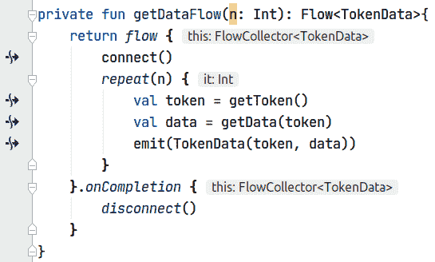

###### 图 10-1\. 数据流。

你可以在[Github 上找到相应的[源代码](https://oreil.ly/dU4uZ)]。

###### 注意

在本章中，有时我们使用图像而不是代码块，因为我们的 IDE 截图显示了悬停点（在边缘）和类型提示，这对于理解非常有帮助。

这个实现的几个方面特别重要需要注意：

+   创建到数据库的连接并在完成时关闭对于使用该流的客户端代码完全透明。客户端代码只看到`TokenData`的流。

+   流内的所有操作都是顺序执行的。例如，一旦我们获取了第一个令牌（比如说，“token1”），流就会调用`getData("token1")`并暂停，直到获取结果（比如说，“data1”）。然后流会发布第一个`TokenData("token1," "data1")`。只有在此之后才会继续执行“token2”等。

+   调用`getDataFlow`函数本身不会做任何事情。它只是返回一个流。流内的代码只有在协程收集流时才会执行，就像在例子 10-1 中所示。

    ##### 例子 10-1\. 收集一个流

    ```
    fun main() = runBlocking<Unit> {
        val flow = getDataFlow(3) // Nothing runs at initialization

        // A coroutine collects the flow
        launch {
            flow.collect { data ->
                println(data)
            }
        }
    }
    ```

+   如果收集流的协程被取消或到达流的末尾，`onCompletion`块内的代码将执行。这保证了我们正确释放对数据库的连接。

正如我们之前提到的，`collect` 是一个终端操作符，消耗流的所有元素。在这个例子中，`collect` 在流的每个收集元素上调用一个函数（例如，`println(data)` 被调用三次）。我们将在“冷流用法示例”中覆盖其他终端操作符。

###### 注意

到目前为止，您已经看到了不运行任何代码直到协程收集它们的流示例。在流术语中，它们是冷流。

## 操作符

如果您需要在流上执行类似于集合的转换操作，协程库提供了诸如 `map`、`filter`、`debounce`、`buffer`、`onCompletion` 等函数。这些函数被称为*流操作符*或*中间操作符*，因为它们在流上操作并返回另一个流。不要将常规操作符与终端操作符混淆，稍后您会看到它们的区别。

以下是 `map` 操作符的一个示例用法：

```
fun main() = runBlocking<Unit> {
    val numbers: Flow<Int> = // implementation hidden for brevity

    val newFlow: Flow<String> = numbers().map {
        transform(it)
    }
}

suspend fun transform(i :Int): String = withContext(Dispatchers.Default) {
    delay(10) // simulate real work
    "${i + 1}"
}
```

这里有趣的地方在于 `map` 将 `Flow<Int>` 转换为 `Flow<String>`。结果流的类型由传递给操作符的 lambda 的返回类型确定。

###### 注意

`map` 流操作符在概念上与集合的 `map` 扩展函数非常接近。不过，有一个显著的区别：传递给 `map` 流操作符的 lambda 可以是一个挂起函数。

在下一节中，我们将覆盖大多数常见操作符的一系列使用案例。

## 终端操作符

终端操作符可以很容易地与其他常规操作符区分开，因为它是一个启动流收集的挂起函数。您之前已经看到了 `collect`。

其他终端操作符可用，如 `toList`、`collectLatest`、`first` 等。以下是这些终端操作符的简要描述：

+   `toList` 收集给定的流，并返回一个包含所有收集元素的 `List`。

+   `collectLatest` 使用提供的操作收集给定的流。与 `collect` 的区别在于，当原始流发出新值时，前一个值的操作块将被取消。

+   `first` 返回流发出的第一个元素，然后取消流的收集。如果流为空，则抛出 `NoSuchElementException`。还有一个变体，`firstOrNull`，如果流为空则返回 `null`。

# 冷流用法示例

事实证明，选择一个例子来展示所有可能操作符的使用并不是最佳方式。相反，我们将提供不同的用例，以说明几个流操作符的使用。

## 使用案例＃1：与基于回调的 API 进行接口交互

假设您正在开发一个聊天应用程序。您的用户可以互发消息。消息包含日期、消息作者的引用和纯文本内容。

这里是一条 `Message`：

```
data class Message(
    val user: String,
    val date: LocalDateTime,
    val content: String
)
```

毫不奇怪，我们将消息流表示为`Message`实例的流。每当用户将消息发布到应用程序时，流将传输该消息。暂时假设你可以调用`getMessageFlow`函数，该函数返回`Flow<Message>`的实例。使用 Kotlin Flows 库，你可以创建自己的自定义流。然而，首先探索流 API 如何在常见用例中使用是最有意义的：

```
fun getMessageFlow(): Flow<Message> {
    // we'll implement it later
}
```

现在假设你想要在后台线程上执行翻译所有来自特定用户的消息。此外，你希望能够实时翻译这些消息到不同的语言。

要实现这一点，你首先通过调用`getMessageFlow()`来获取消息流。然后你对原始流应用操作符，如下所示：

```
fun getMessagesFromUser(user: String, language: String): Flow<Message> {
    return getMessageFlow()
        .filter { it.user == user }           
        .map { it.translate(language) }       
        .flowOn(Dispatchers.Default)          
}
```


第一个操作符`filter`在原始流上操作，并返回由传递的`user`参数产生的另一个消息流。


第二个操作符`map`操作`filter`返回的流，并返回翻译后的消息流。从`filter`操作符的角度来看，原始流（由`getMessageFlow()`返回）是*上游流*，而*下游流*由`filter`之后的所有操作符表示。中间操作符都有它们自己的相对上游和下游流，如图 10-2 所示。


最后，`flowOn`操作符会改变它所操作的流的上下文。它会改变上游流的协程上下文，但不会影响下游流。因此，步骤 1 和步骤 2 都将使用调度器`Dispatchers.Default`执行。

换句话说，上游流的操作符（即`filter`和`map`）现在被封装起来：它们的执行上下文始终为`Dispatchers.Default`。不管结果流将在哪个上下文中被收集，前述的操作符都将使用`Dispatchers.Default`执行。

这是流非常重要的一个特性，称为*上下文保留*。想象一下，你在应用程序的 UI 线程上收集流，通常你会使用`ViewModel`的`viewModelScope`来做到这一点。如果流的操作符的执行上下文泄漏到下游，并影响最终收集流的线程，这将是令人尴尬的。幸运的是，这种情况永远不会发生。例如，如果你在 UI 线程上收集流，所有值都是由一个使用`Dispatchers.Main`的协程发出的。所有必要的上下文切换都会自动为你管理。

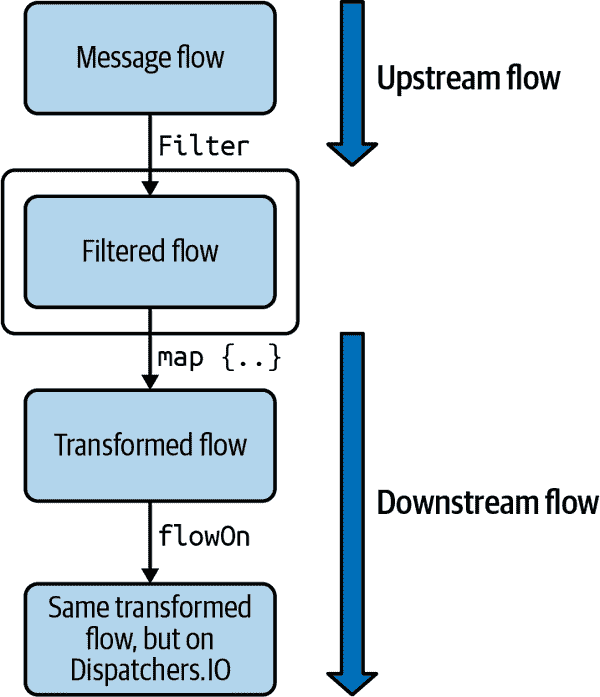

###### 图 10-2\. 上游和下游流。

在内部，`flowOn`在检测到上下文即将改变时启动一个新的协程。这个新的协程通过一个内部管理的通道与流的其余部分交互。

###### 注意

在流术语中，像`map`这样的中间操作符作用于上游流，并返回另一个流。从`map`操作符的角度来看，返回的流就是下游流。

`map`操作符接受一个挂起函数作为转换块。因此，如果你只想使用`Dispatchers.Default`执行消息翻译（而不是消息过滤），你可以移除`flowOn`操作符，并像这样声明`translate`函数：

```
private suspend fun Message.translate(
    language: String
): Message  = withContext(Dispatchers.Default) {
    // this is a dummy implementation
    copy(content = "translated content")
}
```

看看将数据转换的部分轻松转移到其他线程，同时仍然对数据流的整体有一个大图景是多么容易？

正如你所见，Flow API 允许以声明方式表达数据转换。当你调用`getMessagesFromUser("Amanda," "en-us")`时，并不会实际运行任何内容。所有这些转换涉及中间操作符，当流被收集时将被触发。

在消费方面，如果你需要对每个接收到的消息采取操作，你可以像这样使用`collect`函数：

```
fun main() = runBlocking {
    getMessagesFromUser("Amanda", "en-us").collect {
        println("Received message from ${it.user}: ${it.content}")
    }
}
```

现在我们已经展示了如何转换流并消耗它，我们可以为流本身提供一个实现：`getMessageFlow`函数。这个函数的签名是返回`Message`的流。在这种特定情况下，我们可以合理地假设消息机制实际上是在其自己的线程中运行的服务。我们将这个服务命名为`MessageFactory`。

与大多数类似的服务一样，消息工厂具有*发布/订阅*机制——我们可以注册或注销观察者以接收新消息，如下所示：

```
abstract class MessageFactory : Thread() {
    /* The internal list of observers must be thread-safe */
    private val observers = Collections.synchronizedList(
        mutableListOf<MessageObserver>())
    private var isActive = true

    override fun run() = runBlocking {
        while(isActive) {
            val message = fetchMessage()
            for (observer in observers) {
                observer.onMessage(message)
            }
            delay(1000)
        }
    }

    abstract fun fetchMessage(): Message

    fun registerObserver(observer: MessageObserver) {
        observers.add(observer)
    }

    fun unregisterObserver(observer: MessageObserver) {
        observers.removeAll { it == observer }
    }

    fun cancel() {
        isActive = false
        observers.forEach {
            it.onCancelled()
        }
        observers.clear()
    }

    interface MessageObserver {
        fun onMessage(msg: Message)
        fun onCancelled()
        fun onError(cause: Throwable)
    }
}
```

此实现每秒轮询新消息并通知观察者。现在的问题是：如何将诸如`MessageFactory`这样的热实体转换为流？`MessageFactory`也被称为*基于回调*的，因为它保存对`MessageObserver`实例的引用，并在检索到新消息时调用这些实例的方法。要将流世界与“回调”世界连接起来，你可以使用`callbackFlow`流构建器。示例 10-2 展示了如何使用它。

##### 示例 10-2\. 从基于回调的 API 创建流

```
fun getMessageFlow(factory: MessageFactory) = callbackFlow<Message> {
    val observer = object : MessageFactory.MessageObserver {
        override fun onMessage(msg: Message) {
            trySend(msg)
        }

        override fun onCancelled() {
            channel.close()
        }

        override fun onError(cause: Throwable) {
            cancel(CancellationException("Message factory error", cause))
        }
    }

    factory.registerObserver(observer)
    awaitClose {
        factory.unregisterObserver(observer)
    }
}
```

`callbackFlow`构建器创建了一个冷流，直到你调用终端操作符之前都不会执行任何操作。让我们来详细分析一下。首先，它是一个带有给定类型的流的参数化函数。它总是分为三个步骤完成：

```
callbackFlow {
    /*
 1\. Instantiate the "callback." In this case, it's an observer.
 2\. Register that callback using the available api.
 3\. Listen for close event using `awaitClose`, and provide a
 relevant action to take in this case. Most probably,
 you'll have to unregister the callback.
 */
}
```

值得一看的是`callbackFlow`的签名：

```
public inline fun <T> callbackFlow(
    @BuilderInference noinline block: suspend ProducerScope<T>.() -> Unit
): Flow<T>
```

不要被这些印象深刻。一个关键的信息是，`callbackFlow`接受一个带有`ProducerScope`接收者的挂起函数作为参数。这意味着在`callbackFlow`后面的大括号块内部，你有一个`ProducerScope`实例作为隐式的`this`。

这是`ProducerScope`的签名：

```
public interface ProducerScope<in E> : CoroutineScope, SendChannel<E>
```

因此，`ProducerScope`是一个`SendChannel`。这就是你应该记住的：`callbackFlow`为你提供了一个`SendChannel`实例，你可以在你的实现中使用它。你将从回调中获取的对象实例发送到这个通道。这就是我们在 Example 10-2 的第一步中所做的。

## 使用案例#2：并发转换值流

有时你必须在集合或对象流上应用转换，以获取一个新的转换对象集合。当这些转换应该异步进行时，情况就开始变得有些复杂了。但使用流，一切变得简单！

假设你有一个`Location`实例的列表。每个位置可以使用`transform`函数解析为一个`Content`实例：

```
suspend fun transform(loc: Location): Content = withContext(Dispatchers.IO) {
    // Actual implementation doesn't matter
}
```

因此，你会接收到`Location`实例，并且必须使用`transform`函数即时转换它们。然而，处理一个`Location`实例可能需要相当长的时间。因此，你不希望一个位置的处理延迟到下一个位置的转换。换句话说，转换应该*并行*进行，如 Figure 10-3 所示。

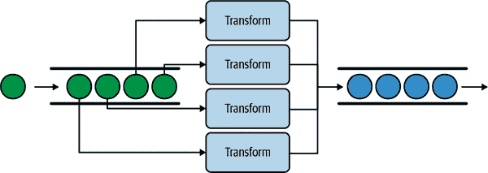

###### 图 10-3\. 合并流。

在前面的示意图中，我们限制了并发数为四；换句话说，在任何给定时间点最多可以同时转换四个位置。

Figure 10-4 展示了如何使用流来实现此行为。

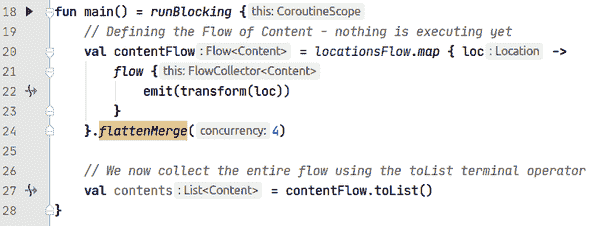

###### 图 10-4\. 实现合并流。

你可以在 GitHub 上找到对应的[源代码](https://oreil.ly/LhW77)。

要理解这里的情况，你应该意识到`locations.map{..}`返回了一个流的流（例如，类型为`Flow<Flow<Content>>`）。实际上，在`map{..}`操作符内部，当上游流（即`locationsFlow`）发射一个位置时，就会创建一个新的流。每个创建的流都是`Flow<Content>`类型，并且单独执行位置转换。

最后一句，`flattenMerge`，将所有这些创建的流合并到一个新的结果流`Flow<Content>`中（我们将其分配给`contentFlow`）。此外，`flattenMerge`具有“并发”参数。确实，在每次接收位置时并发创建和收集流可能是不合适的。通过并发级别为 4，我们确保在给定时间点最多只有四个流将被收集。这在 CPU 密集型任务中非常方便，当你知道你的 CPU 不能并行转换超过四个位置时（假设 CPU 有四个核心）。换句话说，`flattenMerge`的并发级别指的是在给定时间点最多可以并行进行多少操作/转换。

多亏了流的挂起性质，你可以免费获得*回压*。只有在机器可用于处理时，才会从`locationsFlow`中收集新的位置。可以使用线程池和阻塞队列实现类似的机制，而不使用流或协程。然而，这将需要更多的代码行。

###### 注意

战至撰写本文时，`flattenMerge`操作符在源代码中标记为`@FlowPreview`，这意味着此声明处于预览状态，并且可以通过尽力迁移以不向后不兼容的方式进行更改。

我们希望在完成写作时，流合并 API 将得到稳定。否则，类似的操作符可能会取代`flattenMerge`。

## 发生错误时会发生什么？

如果其中一个`transform`函数抛出异常，整个流将被取消，并且异常将向下游传播。虽然这是一个很好的默认行为，但你可能希望在流内部处理一些异常。

我们将展示如何在“错误处理”中做到这一点。

## 最后的思考

+   你是否意识到，我们仅用五行代码就创建了一个工作池，同时转换传入的对象流？

+   您可以确保流机制是线程安全的。不再为了找到适当的同步策略而头疼，以便将对象引用从线程池传递到收集线程。

+   您可以轻松调整并发级别，这在本例中意味着最大并行转换数。

## 使用情况＃3：创建自定义操作符

即使有很多流操作符可以直接使用，有时候你必须自己制作。幸运的是，流是可组合的，实现自定义的响应式逻辑并不那么困难。

例如，到我们撰写这些文字的时候，还没有 Flows 操作符等同于[Project Reactor 的 bufferTimeout](https://oreil.ly/udGs0)。

那么，`bufferTimeout`应该做什么？想象一下，你有一个元素的上游流，但你希望通过批处理以及在固定的最大速率下处理这些元素。`bufferTimeout`返回的流应该缓冲元素，并在以下情况之一时发出一个元素列表（批处理）：

+   缓冲区已满。

+   预定义的最大时间已过（超时）。

在进行实现之前，让我们先讨论关键思想。`bufferTimeout`返回的流应内部消耗上游流并缓冲元素。当缓冲区满或超时已过时，流应发出缓冲区的内容（一个列表）。你可以想象内部我们会启动一个协程来接收两种类型的事件：

+   “刚刚从上游流接收到一个元素。我们是应该将其添加到缓冲区还是发送整个缓冲区？”

+   “超时！立即发送缓冲区内容。”

在第九章（CSP 部分）中，我们已经讨论过类似的情况。`select`表达式非常适合处理来自多个通道的多个事件。

现在我们将实现我们的`bufferTimeout`流操作符：

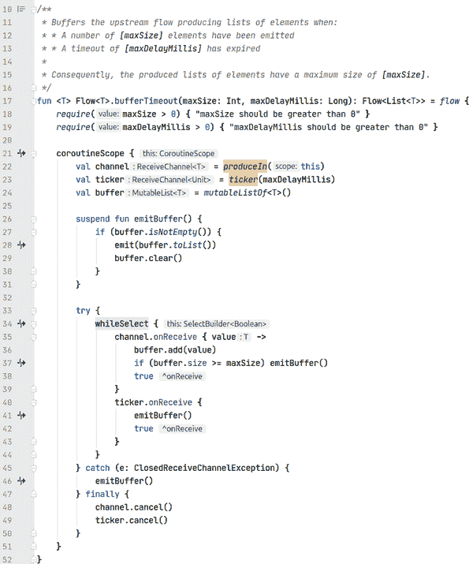

您可以在 GitHub 中找到相应的[源代码](https://oreil.ly/JxkZj)。

这里是解释：

+   首先，操作符的签名告诉了我们很多信息。它声明为`Flow<T>`的扩展函数，因此您可以像这样使用它：`upstreamFlow.bufferTimeout(10, 100)`。至于返回类型，它是`Flow<List<T>>`。请记住，您希望按批处理处理元素，因此`bufferTimeout`返回的流应将元素作为`List<T>`返回。

+   第 17 行：我们正在使用一个`flow{}`构建器。作为提醒，这个构建器为您提供了一个`FlowCollector`的实例，并且代码块是一个以`FlowCollector`作为接收器类型的扩展函数。换句话说，您可以在代码块内部调用`emit`。

+   第 21 行：我们正在使用`coroutineScope{}`，因为我们将启动新的协程，这只能在`CoroutineScope`内部完成。

+   第 22 行：从我们的协程视角来看，接收到的元素应该来自于一个`ReceiveChannel`。因此，我们需要启动另一个内部协程来消费上游的流，并通过一个通道发送它们。这正是`produceIn`流操作符的目的。

+   第 23 行：我们需要生成“超时”事件。已经有一个专门用于此目的的库函数：`ticker`。它创建一个通道，在给定的初始延迟后产生第一个项目，并且在它们之间以给定的延迟产生后续项目。正如文档中指定的那样，`ticker`会急切地启动一个新的协程，我们需要完全负责取消它。

+   第 34 行：我们正在使用`whileSelect`，它实际上只是在`select`表达式中循环的语法糖，当子句返回`true`时。在`whileSelect{}`块内部，您可以看到仅在缓冲区不满时才向其添加元素，并在缓冲区已满时发出整个缓冲区。

+   第 46 行：当上游流收集完成时，使用`produceIn`启动的协程仍然会尝试从该流中读取，并且会引发`ClosedReceiveChannelException`。因此，我们捕获该异常，然后知道我们应该发出缓冲区的内容。

+   第 48 和 49 行：通道是活跃实体，当它们不再需要使用时应该被取消。对于`ticker`也应该取消。

## 使用情况：

图 10-5 显示了如何使用`bufferTimeout`的示例。


###### 图 10-5\. `bufferTimeout`使用示例。

您可以在 GitHub 中找到相应的[源代码](https://oreil.ly/Y2xVe)。

输出结果：

```
139 ms: [1, 2, 3, 4]
172 ms: [5, 6, 7, 8]
223 ms: [9, 10, 11, 12, 13]
272 ms: [14, 15, 16, 17]
322 ms: [18, 19, 20, 21, 22]
...
1022 ms: [86, 87, 88, 89, 90]
1072 ms: [91, 92, 93, 94, 95]
1117 ms: [96, 97, 98, 99, 100]
```

正如您所见，上游流正在发出从 1 到 100 的数字，每次发射之间延迟 10 毫秒。我们设置了 50 毫秒的超时，并且每个发射的列表最多可以包含五个数字。

# 错误处理

错误处理在响应式编程中至关重要。如果您熟悉 RxJava，您可能使用`subscribe`方法的`onError`回调来处理异常：

```
// RxJava sample
someObservable().subscribe(
    { value -> /* Do something useful */ },
    { error -> println("Error: $error") }
)
```

使用流，您可以使用一系列技术处理错误，涉及：

+   经典的`try`/`catch`块。

+   `catch`操作符——我们将在讨论`try`/`catch`块后立即介绍这个新操作符。

## try/catch 块

如果我们定义一个仅由三个`Int`组成的虚拟上游流，并且在`collect{}`块内部故意抛出异常，我们可以通过将整个链条包装在`try`/`catch`块中来捕获异常：

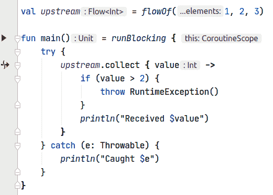

您可以在 GitHub 上找到相应的[source code in GitHub](https://oreil.ly/qcOKV)。

输出是：

```
Received 1
Received 2
Caught java.lang.RuntimeException
```

需要注意的是，`try`/`catch`也适用于从上游流内部引发异常的情况。例如，如果我们将上游流的定义更改为以下内容，我们将得到完全相同的结果：

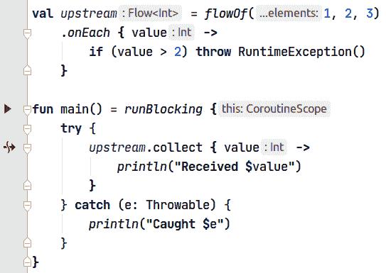

您可以在 GitHub 上找到相应的[source code in GitHub](https://oreil.ly/lrrGt)。

然而，如果您尝试在流本身内部拦截异常，则可能会得到意外的结果。这里是一个例子：

```
// Warning: DON'T DO THIS, this flow swallows downstream exceptions
val upstream: Flow<Int> = flow {
    for (i in 1..3) {
        try {
            emit(i)
        } catch (e: Throwable) {
            println("Intercept downstream exception $e")
        }
    }
}

fun main() = runBlocking {
    try {
        upstream.collect { value ->
            println("Received $value")
            check(value <= 2) {
                "Collected $value while we expect values below 2"
            }
        }
    } catch (e: Throwable) {
        println("Caught $e")
    }
}
```

在这个例子中，我们使用`flow`构建器来定义`upstream`，并且我们在`emit`调用周围包裹了一个`try`/`catch`语句。即使看起来没有用，因为`emit`不会抛出异常，但在非平凡的发射逻辑中这也是有意义的。在消费站点，在`main`函数中，我们收集该流，并检查我们是否获得了严格大于 2 的值。否则，`catch`块应打印`Caught java.lang.IllegalStateException Collected x while we expect values below 2`。

我们期望以下输出：

```
Received 1
Received 2
Caught java.lang.IllegalStateException: Collected 3 while we expect values below 2
```

然而，实际上我们得到的是：

```
Received 1
Received 2
Received 3
Intercept downstream exception java.lang.IllegalStateException: Collected 3 while we expect values below 2
```

尽管`main`函数的`try`/`catch`语句没有捕获`check(value <= 2) {..}`引发的异常，但`flow`的`try`/`catch`语句却捕获了它。

###### 警告

流构建器内部的`try`/`catch`语句可能会捕获*下游*异常——包括在收集流期间引发的异常。

## 关注分离非常重要

流的实现不应对收集该流的代码产生副作用。同样，收集流的代码不应了解上游流的实现细节。流应始终对异常*透明*：它应传播来自收集器的异常。换句话说，流永远不应吞噬下游的异常。

在整本书中，我们将使用*异常透明*来指代一种对异常*透明*的流。

## 异常透明性违规

前一个示例是例外透明性违规的示例。试图从`try`/`catch`块内部发出值是另一种违规。以下是一个示例（再次强调，不要这样做！）：

```
val violatesExceptionTransparency: Flow<Int> = flow {
    for (i in 1..3) {
        try {
            emit(i)
        } catch (e: Throwable) {
            emit(-1)
        }
    }
}

fun main() = runBlocking {
    try {
        violatesExceptionTransparency.collect { value ->
            check(value <= 2) { "Collected $value" }
        }
    } catch (e: Throwable) {
        println("Caught $e")
    }
}
```

输出如下：

```
Caught java.lang.IllegalStateException: Flow exception transparency is
violated:
Previous 'emit' call has thrown exception java.lang.IllegalStateException: Collected 3, but then emission attempt of value '-1' has been detected.
Emissions from 'catch' blocks are prohibited in order to avoid unspecified behaviour, 'Flow.catch' operator can be used instead.
For a more detailed explanation, please refer to Flow documentation.
```

`try`/`catch`块应该*只*用于包围收集器，以处理收集器本身引发的异常，或者（虽然不是理想的）处理流引发的异常。

要处理流内的异常，应使用`catch`运算符。

## catch 运算符

`catch`运算符允许以声明式风格捕获异常，如图 10-6 所示。它捕获所有上游异常。这里的所有异常包括`Throwable`。由于它只捕获上游异常，`catch`运算符不具有`try`/`catch`块的异常问题。

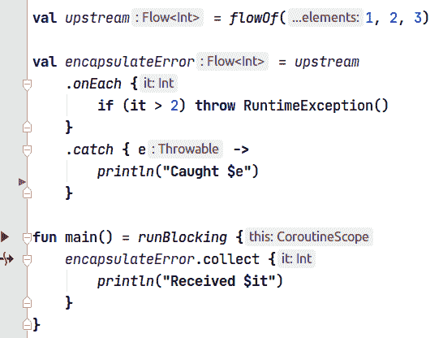

###### 图 10-6\. 声明式风格。

您可以在 GitHub 上找到相应的[源代码](https://oreil.ly/QcUeq)。

输出如下：

```
Received 1
Received 2
Caught java.lang.RuntimeException
```

如果流传递大于 2 的值，则流会引发`RuntimeException`。紧接着，在`catch`运算符中，我们在控制台打印。然而，收集器永远不会收到值 3。因此，`catch`运算符会自动取消流。

### 异常透明性

在这个运算符内部，你只能捕获*上游异常*。所谓的上游是相对于`catch`运算符而言。为了说明我们的意思，我们将选择一个示例，在该示例中，收集器在流内部抛出异常之前抛出异常。收集器应该能够捕获引发的异常（异常不应该被流捕获）：

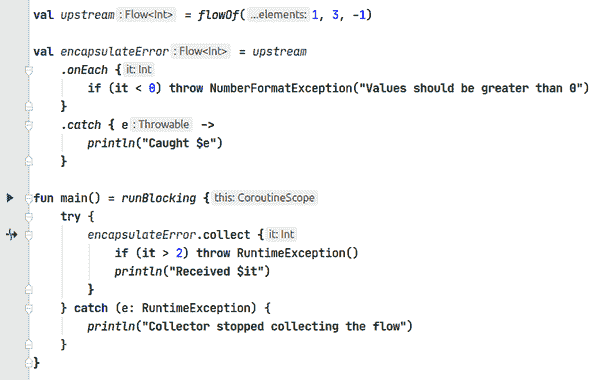

您可以在 GitHub 上找到相应的[源代码](https://oreil.ly/0U5h1)。

在此示例中，如果收集器收集到大于 2 的值，它会抛出`RuntimeException`。收集逻辑包装在`try`/`catch`语句中，因为我们不希望程序崩溃并记录异常。如果值为负，流内部会引发`NumberformatException`。`catch`运算符充当保护措施（记录异常并取消流）。

输出如下：

```
Received 0
Collector stopped collecting the flow
```

注意，流没有拦截收集器内部引发的异常，因为异常已在`try`/`catch`子句中捕获。流从未引发`NumberformatException`，因为收集器过早取消了收集。

### 另一个示例

在“用例 #2: 同时转换值流”中，我们暂时不讨论错误处理。假设`transform`函数可能引发异常，其中包括`NumberFormatException`。您可以使用`catch`运算符有选择地处理`NumberFormatException`：

```
fun main() = runBlocking {
    // Defining the Flow of Content - nothing is executing yet
    val contentFlow = locationsFlow.map { loc ->
        flow {
            emit(transform(loc))
        }.catch { cause: Throwable ->
            if (cause is NumberFormatException) {   
                println("Handling $cause")
            } else {
                throw cause                         
            }
        }
    }.flattenMerge(4)

    // We now collect the entire flow using the toList terminal operator
    val contents = contentFlow.toList()
}
```


当`catch`操作符捕获`Throwable`时，我们需要检查错误的类型。如果错误是`NumberFormatException`，那么我们在`if`语句内处理它。您可以在那里添加其他检查来处理不同类型的错误。


否则，您无法知道错误的类型。在大多数情况下，最好不要吞噬错误并重新抛出。

### 您可以在`catch`内部使用`emit`。

有时，在捕获流内部的异常时发出特定值是有意义的：

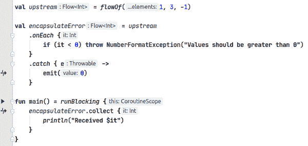

您可以在 GitHub 上找到相应的[源代码](https://oreil.ly/vknEm)。

输出是：

```
Received 1
Received 3
Received 0
```

从`catch`内部发出值对于*具体化异常*尤其有用。

## 具体化您的异常

*异常的具体化*^(5)是捕获异常并发出代表这些异常的特殊值或对象的过程。其目标是避免从流的内部抛出异常，因为代码执行会转向收集该流的任何地方。无论收集代码是否处理流抛出的异常，都不重要。如果流抛出异常，收集代码需要意识到这些异常并捕获它们，以避免未定义的行为。因此，流对收集代码有*副作用*，这违反了异常透明原则。

###### 注意

收集代码不应该了解流的实现细节。例如，如果流是`Flow<Number>`，您应该只期望获得`Number`值（或其子类型），而不是异常。

让我们举另一个例子。假设您正在获取图像，给定它们的 URL。您有一系列传入的 URL：

```
// We don't use realistic URLs, for brevity
val urlFlow = flowOf("url-1", "url-2", "url-retry")
```

您已经可以使用此功能：

```
suspend fun fetchImage(url: String): Image {
    // Simulate some remote call
    delay(10)

    // Simulate an exception thrown by the server or API
    if (url.contains("retry")) {
        throw IOException("Server returned HTTP response code 503")
    }

    return Image(url)
}

data class Image(val url: String)
```

这个`fetchImage`函数可能会抛出`IOException`。为了使用`urlFlow`和`fetchImage`函数来构建“图像流”，您应该具体化`IOException`。关于`fetchImage`函数，它要么成功返回一个`Image`实例，要么抛出异常。您可以通过`Result`类型来表示这些结果，其中包括`Success`和`Error`子类:^(6)

```
sealed class Result
data class Success(val image: Image) : Result()
data class Error(val url: String) : Result()
```

在成功的情况下，我们包装实际的结果——`Image`实例。在失败的情况下，我们认为将失败的图像检索的 URL 包装起来是合适的。但是，您可以自由地包装所有可能对收集代码有用的数据，例如异常本身。

现在，您可以通过创建一个返回`Result`实例的`fetchResult`函数来封装`fetchImage`的使用：

```
suspend fun fetchResult(url: String): Result {
    println("Fetching $url..")
    return try {
        val image = fetchImage(url)
        Success(image)
    } catch (e: IOException) {
        Error(url)
    }
}
```

最后，您可以实现一个`resultFlow`并安全地收集它：

```
fun main() = runBlocking {
    val urlFlow = flowOf("url-1", "url-2", "url-retry")

    val resultFlow = urlFlow
        .map { url -> fetchResult(url) }

    val results = resultFlow.toList()
    println("Results: $results")
}
```

输出是：

```
Fetching url-1..
Fetching url-2..
Fetching url-retry..
Results: [Success(image=Image(url=url-1)), Success(image=Image(url=url-2)), Error(url=url-retry)]
```

### 一个额外的奖励

假设您希望在发生错误时自动重试获取图像。您可以实现一个自定义流操作符，该操作符在`predicate`返回`true`时重试`action`：

```
fun <T, R : Any> Flow<T>.mapWithRetry(
    action: suspend (T) -> R,
    predicate: suspend (R, attempt: Int) -> Boolean
) = map { data ->
    var attempt = 0L
    var shallRetry: Boolean
    var lastValue: R? = null
    do {
        val tr = action(data)
        shallRetry = predicate(tr, ++attempt)
        if (!shallRetry) lastValue = tr
    } while (shallRetry)
    return@map lastValue
}
```

如果您想重试，在返回错误之前最多可以尝试三次，您可以像这样使用此操作符：

```
fun main() = runBlocking {
    val urlFlow = flowOf("url-1", "url-2", "url-retry")

    val resultFlowWithRetry = urlFlow
        .mapWithRetry(
            { url -> fetchResult(url) },
            { value, attempt -> value is Error && attempt < 3L }
        )

    val results = resultFlowWithRetry.toList()
    println("Results: $results")
}
```

输出是：

```
Fetching url-1..
Fetching url-2..
Fetching url-retry..
Fetching url-retry..
Fetching url-retry..
Results: [Success(image=Image(url=url-1)), Success(image=Image(url=url-2)), Error(url=url-retry)]
```

# 使用 SharedFlow 的热流

以前的流实现是*cold*的：直到开始收集流为止，什么都不会运行。这是可能的，因为对于每个发出的值，只有一个收集器会获取该值。因此，在收集器准备好收集值之前，无需运行任何内容。

但是，如果您需要在多个收集器之间*共享*发出的值怎么办？例如，假设您的应用中完成了文件下载等事件。您可能希望直接通知各种组件，例如一些视图模型、存储库或甚至一些视图。您的文件下载器可能不需要知道应用程序的其他部分的存在。良好的关注点分离从类的松耦合开始，并且*事件总线*是在这种情况下有助于的一种架构模式。

原理很简单：下载器通过将事件（一个类的实例，可选地保存一些状态）传递给事件总线来发出事件，随后所有订阅者都会接收到该事件。`SharedFlow` 可以像这样运行，如 图 10-7 所示。

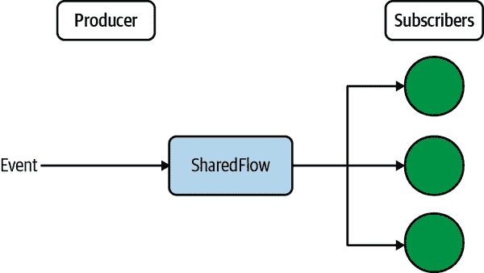

###### 图 10-7\. `SharedFlow`。

`SharedFlow` 将事件广播给所有订阅者。实际上，`SharedFlow` 确实是一个可以在许多情况下使用的工具箱，而不仅仅是实现事件总线。在提供使用示例之前，我们将展示如何创建一个 `SharedFlow` 以及如何调整它。

## 创建一个 SharedFlow

在最简单的用法中，您可以无参数调用 `MutableSharedFlow()`。正如其名称所示，您可以通过向其发送值来*改变*其状态。创建 `SharedFlow` 的常见模式是创建一个私有的可变版本和一个使用 `asSharedFlow()` 创建的公共不可变版本，如下所示：

```
private val _sharedFlow = MutableSharedFlow<Data>()
val sharedFlow: SharedFlow<Data> = _sharedFlow.asSharedFlow()
```

当确保订阅者只能*读取*流时，这种模式非常有用（例如，不能发送值）。您可能会感到惊讶，`MutableSharedFlow` 不是一个类。它实际上是一个接受参数的函数，我们稍后将在本章中详细介绍。现在，我们只展示了 `MutableSharedFlow` 的默认无参数版本。

## 注册一个订阅者

当订阅者开始收集 `SharedFlow` 时，最好使用公共不可变版本注册：

```
scope.launch {
   sharedFlow.collect { data ->
      println(data)
   }
}
```

订阅者只能存在于一个作用域中，因为 `collect` 终端操作符是一个挂起函数。这对于结构化并发非常有利：如果取消了作用域，订阅者也会被取消。

## 向 SharedFlow 发送值

`MutableSharedFlow` 公开两种方法来发射值——`emit` 和 `tryEmit`：

`emit`

在某些条件下会暂停（稍后讨论）。

`tryEmit`

这永远不会暂停。它会立即尝试发射该值。

为什么有两种发射值的方法？这是因为，默认情况下，当 `MutableSharedFlow` 使用 `emit` 发射值时，它会暂停，直到 *所有* 订阅者开始处理该值。我们将在下一节中举例说明 `emit` 的使用。

然而，有时这并不是您想要的。您会发现某些情况下需要从非挂起代码发射值（见 “使用 SharedFlow 作为事件总线”）。因此，这里有 `tryEmit`，它尝试立即发射一个值，并在成功时返回 `true`，否则返回 `false`。我们将在接下来的部分详细介绍 `emit` 和 `tryEmit` 的微妙之处。

## 使用 SharedFlow 流式传输数据

假设您正在开发一款新闻应用。您的应用的一个特性是从 API 或本地数据库获取新闻并显示这些新闻（或新闻源）。理想情况下，您应该依赖于本地数据库，以尽可能避免使用 API。在此示例中，我们将 API 作为唯一的新闻来源，尽管您可以轻松扩展我们的示例以添加本地持久化。

### 架构

在我们的架构中，视图模型依赖于存储库获取新闻源。当视图模型接收到新闻时，它会通知视图。存储库负责定期查询远程 API，并为视图模型提供获取新闻源的方式（见 图 10-8）。

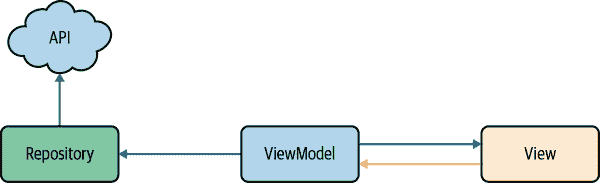

###### 图 10-8\. 应用架构。

### 实施

为了简化，以下 `News` 数据类代表新闻：

```
data class News(val content: String)
```

存储库通过 `NewsDao` 访问 API。在我们的示例中，数据访问对象（DAO）是手动构造注入的。在实际应用中，建议使用依赖注入（DI）框架，如 Hilt 或 Dagger：

```
interface NewsDao {
    suspend fun fetchNewsFromApi(): List<News>
}
```

现在我们已经有足够的材料来实现存储库了：

```
class NewsRepository(private val dao: NewsDao) {
    private val _newsFeed = MutableSharedFlow<News>()    
    val newsFeed = _newsFeed.asSharedFlow()              

    private val scope = CoroutineScope(Job() + Dispatchers.IO)

    init {
        scope.launch {                                   
            while (true) {
                val news = dao.fetchNewsFromApi()
                news.forEach { _newsFeed.emit(it) }      

                delay(3000)
            }
        }
    }

    fun stop() = scope.cancel()
}
```


我们创建了私有的可变共享流。它仅在存储库内部使用。


我们创建了共享流的公共不可变版本。


一旦创建存储库实例，我们就开始从 API 获取新闻。


每次我们获取 `News` 实例列表时，我们都会使用我们的 `MutableSharedFlow` 发射这些值。

唯一剩下的就是实现一个视图模型，它将订阅存储库的共享流：

```
class NewsViewsModel(private val repository: NewsRepository) : ViewModel() {
    private val newsList = mutableListOf<News>()

    private val _newsLiveData = MutableLiveData<List<News>>(newsList)
    val newsLiveData: LiveData<List<News>> = _newsLiveData

    init {
        viewModelScope.launch {
            repository.newsFeed.collect {
                println("NewsViewsModel receives $it")
                newsList.add(it)
                _newsLiveData.value = newsList
            }
        }
    }
}
```

通过调用 `repository.newsFeed.collect { .. }`，视图模型订阅了共享流。每当存储库向共享流发射一个 `News` 实例时，视图模型将接收到新闻并将其添加到其 `LiveData` 以更新视图。

注意流集合发生在使用 `viewModelScope.launch` 启动的协程内部。这意味着如果视图模型达到生命周期的末尾，流集合将自动取消，这是一件好事。

###### 提示

在我们的示例中，我们手动构造注入一个对象（在本例中是仓库）。依赖注入框架肯定会帮助避免样板代码。由于本章节的重点不是演示依赖注入框架，我们选择手动将仓库注入到视图模型中。

### 我们实现的测试

为了测试前面的代码，我们需要模拟`NewsDao`。我们的 DAO 将只发送两个虚拟的`News`实例并增加一个计数器：

```
val dao = object : NewsDao {
    private var index = 0

    override suspend fun fetchNewsFromApi(): List<News> {
        delay(100)  // simulate network delay
        return listOf(
            News("news content ${++index}"),
            News("news content ${++index}")
        )
    }
}
```

当我们使用上述 DAO 运行我们的代码时，在控制台中可以看到以下内容：

```
NewsViewsModel receives News(content=news content 1)
NewsViewsModel receives News(content=news content 2)
NewsViewsModel receives News(content=news content 3)
...
```

这里没有什么令人惊讶的：我们的视图模型简单地接收存储库发送的新闻。当不只有一个而是多个视图模型订阅共享流时，情况变得有趣。我们已经创建了另一个视图模型，它也在控制台中记录。我们在程序启动后的 250 毫秒*后*创建了另一个视图模型。这是我们得到的输出：

```
NewsViewsModel receives News(content=news content 1)
NewsViewsModel receives News(content=news content 2)
NewsViewsModel receives News(content=news content 3)
AnotherViewModel receives News(content=news content 3)
NewsViewsModel receives News(content=news content 4)
AnotherViewModel receives News(content=news content 4)
NewsViewsModel receives News(content=news content 5)
AnotherViewModel receives News(content=news content 5)
NewsViewsModel receives News(content=news content 6)
AnotherViewModel receives News(content=news content 6)
...
```

您可以看到另一个视图模型*错过了*前两个新闻条目。这是因为在共享流发出前两个新闻条目时，第一个视图模型是唯一的订阅者。第二个视图模型稍后加入，只接收后续新闻。

### 重放值

如果您需要第二个视图模型获取先前的新闻，会发生什么？共享流可以*选择性*缓存值，以便新订阅者接收最后*n*个缓存的值。在我们的情况下，如果我们希望共享流重放最后两条新闻条目，我们只需更新存储库中的一行：

```
private val _newsFeed = MutableSharedFlow<News>(replay = 2)
```

改变后，两个视图模型都会收到*所有*新闻。在其他常见情况下，回放数据实际上是有用的。想象一下用户离开显示新闻列表的片段。如果与片段绑定的生命周期相关联的视图模型也可能被销毁（如果您选择将视图模型绑定到活动上，则不会发生这种情况）。稍后，用户返回到新闻片段。那么会发生什么？视图模型会重新创建，并立即获取最后两条新闻条目，同时等待新的新闻。因此，仅重放两条新闻条目可能是不够的。因此，您可能希望将重放次数增加到，比如，15。

让我们回顾一下。一个`SharedFlow`可以选择性地为新订阅者重放值。通过`MutableSharedFlow`函数的`replay`参数，可以配置重放的值数量。

### 暂停还是不暂停？

还有关于这个重放特性的最后一点需要注意。一个`replay` > `0`的共享流内部使用类似于`Channel`的缓存。例如，如果您创建一个带有`replay` = `3`的共享流，则前三个`emit`调用不会暂停。在这种情况下，`emit`和`tryEmit`的作用完全相同：它们向缓存中添加一个新值，如图 10-9 所示。

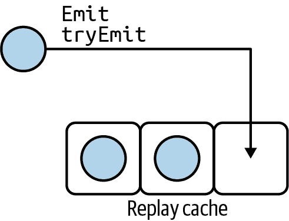

###### 图 10-9\. 重放缓存未满。

当你向共享流提交第四个值时，取决于你使用的是`emit`还是`tryEmit`，如图 10-10 所示。默认情况下，当重放缓存满时，`emit`会暂停，直到所有订阅者开始处理缓存中的最旧值。至于`tryEmit`，由于无法将值添加到缓存中，它返回`false`。如果你没有自己跟踪第四个值，这个值将会丢失。

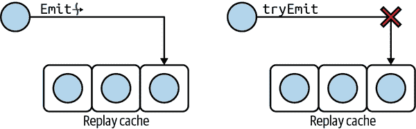

###### 图 10-10\. 重放缓存已满。

当重放缓存满时，可以更改该行为。你还可以选择丢弃缓存中最旧的值或正在添加到缓存中的值。在这两种情况下，`emit`不会暂停，并且`tryEmit`返回 true。因此，在缓冲区溢出时有三种可能的行为：暂停、丢弃最旧的和丢弃最新的。

在创建共享流时，可以使用`onBufferOverflow`参数应用所需的行为，如下所示：

```
MutableSharedFlow(replay = 3, onBufferOverflow = BufferOverflow.DROP_OLDEST)
```

`BufferOverflow`是一个包含三个可能值的*枚举*：`SUSPEND`、`DROP_OLDEST`和`DROP_LATEST`。如果未为`onBufferOverflow`指定值，则`SUSPEND`是默认策略。

### 缓冲值

除了能够重放值外，共享流还可以*缓冲*值而不重放它们，允许慢速订阅者落后于其他更快的订阅者。缓冲区的大小是可自定义的，如下所示：

```
MutableSharedFlow(extraBufferCapacity = 2)
```

默认情况下，`extraBufferCapacity`等于零。当你设置一个严格正值时，只要缓冲区中还有空间，`emit`就不会暂停，除非你明确更改缓冲区溢出策略。

你可能会想知道`extraBufferCapacity`在哪些情况下会有用。例如，创建一个带有`extraBufferCapacity = 1`和`onBufferOverflow = BufferOverflow.DROP_OLDEST`的共享流，可以确保`tryEmit`始终成功地将值插入到共享流中。有时候，从非挂起代码中向共享流插入值确实非常方便。一个很好的示例是在使用共享流作为事件总线时。

## 将 SharedFlow 用作事件总线

当所有以下条件满足时，你需要一个事件总线：

+   你需要向一个或多个订阅者广播事件。

+   事件应*仅处理一次*。

+   如果在发出事件时某个组件未注册为订阅者，则该组件将丢失事件。

请注意与`LiveData`的区别，它会在内存中保留上次发出的值，并在每次片段重新创建时重放它。对于事件总线，片段只会*收到一次*事件。例如，如果重新创建片段（用户旋转设备），事件不会再次被处理。

当你想要像 `Toast` 或 `Snackbar` 一样显示消息时，事件总线特别有用。只显示一次消息是有意义的。为了实现这一点，存储库可以将共享流公开如下代码所示。为了使公开的流对视图模型或者片段可访问，你可以使用诸如 Hilt 或 Dagger 的 DI 框架：

```
class MessageRepository {
    private val _messageFlow = MutableSharedFlow<String>(
        extraBufferCapacity = 1,
        onBufferOverflow = BufferOverflow.DROP_OLDEST
    )
    val messageEventBus = _messageFlow.asSharedFlow()

    private fun someTask() {
        // Notify subscribers to display a message
        _messageFlow.tryEmit("This is important")
    }
}
```

我们将 `extraBufferCapacity` 设置为 1，将 `onBufferOverflow` 设置为 `DROP_OLDEST`，以确保 `_messageFlow.tryEmit` 总是能够成功发出。为什么我们关心 `tryEmit`？在我们的示例中，我们从一个非挂起函数使用 `_messageFlow`。因此，我们无法在 `someTask` 中使用 `emit`。

如果你在协程内部使用 `_messageFlow`，你可以使用 `emit`。行为会完全相同，因为由于缓冲区的存在以及缓冲区溢出策略，`emit` 不会挂起。

事件总线适合分派一次性事件，一些组件可能会错过这些事件，如果它们尚未准备好接收这些事件。例如，假设当用户尚未导航到显示录音的片段时，你会触发“录制停止”事件。结果是事件丢失。但是，你的应用程序可以设计为在任何时候片段恢复时更新片段的状态。因此，仅当片段处于恢复状态时才接收“录制停止”，这应该触发状态更新。这只是一个示例，说明在某些情况下丢失事件是完全可以接受的，并且是应用程序设计的一部分。

然而，有时这并不是你想要实现的。例如，一个可以执行下载的服务。如果服务触发了“下载完成”事件，你不希望你的 UI 错过这个事件。当用户导航到显示下载状态的视图时，视图应该呈现下载的更新*状态*。

你会面临需要共享*状态*的情况。这种情况非常常见，因此专门为此创建了一种类型的共享流：`StateFlow`。

## StateFlow：一种特殊的 SharedFlow

当共享状态时，状态流：

+   仅共享一个值：当前*状态*。

+   重播状态。确实，即使订阅者在后来订阅，他们也应该获得最后一个状态。

+   发出初始值——就像 `LiveData` 有初始值一样。

+   仅在状态更改时发出新值。

正如你之前学到的，可以使用共享流来实现这种行为：

```
val shared = MutableSharedFlow(
    replay = 1,
    onBufferOverflow = BufferOverflow.DROP_OLDEST
)
shared.tryEmit(initialValue) // emit the initial value
val state = shared.distinctUntilChanged() // get StateFlow-like behavior
```

`StateFlow`^(7) 是前述代码的缩写。实际上，你只需要写：

```
val state = MutableStateFlow(initialValue)
```

## StateFlow 使用示例

假设你有一个下载服务，它可以发出三种可能的下载状态：下载已开始、正在下载和下载完成，如 图 10-11 所示。

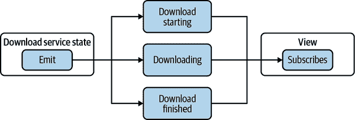

###### 图 10-11\. 下载状态。

从 Android 服务公开流可以通过几种方式完成。如果需要高解耦，例如用于可测试性目的，可以通过 DI 注入的“repository”对象公开流。然后将存储库注入所有需要订阅的组件中。或者服务可以在伴生对象中静态地公开流。这将在所有使用流的组件之间引入紧密耦合。然而，在小型应用程序或演示目的中，这可能是可以接受的，例如以下示例：

```
class DownloadService : Service() {
    companion object {
        private val _downloadState =
            MutableStateFlow<ServiceStatus>(Stopped)
        val downloadState = _downloadState.asStateFlow()
    }
    // Rest of the code hidden for brevity
}

sealed class ServiceStatus
object Started : ServiceStatus()
data class Downloading(val progress: Int) : ServiceStatus()
object Stopped : ServiceStatus()
```

在内部，服务可以使用例如`_downloadState.tryEmit(Stopped)`来更新其状态。当声明在伴生对象内部时，状态流可以轻松地从视图模型访问，并使用`asLiveData()`作为`LiveData`公开：

```
class DownloadViewModel : ViewModel() {
    val downloadServiceStatus = DownloadService.downloadState.asLiveData()
}
```

随后，视图可以订阅`LiveData`：

```
class DownloadFragment : Fragment() {
    private val viewModel: DownloadViewModel by viewModels()

    override fun onCreate(savedInstanceState: Bundle?) {
        super.onCreate(savedInstanceState)

        viewModel.downloadServiceStatus.observe(this) {   
            it?.also {
                onDownloadServiceStatus(it)
            }
        }
    }

    private fun onDownloadServiceStatus(
        status: ServiceStatus
    ): Nothing = when (status) {                          
        Started -> TODO("Show download is about to start")
        Stopped -> TODO("Show download stopped")
        is Downloading -> TODO("Show progress")
    }
}
```


我们订阅`LiveData`。如果收到非空值，则调用`onDownloadServiceStatus`方法。


我们特意使用`when`作为表达式，以便 Kotlin 编译器确保考虑了所有可能的`ServiceStatus`类型。

您可能想知道为什么我们使用状态流，并且为什么我们首先没有使用`LiveData`——这消除了在视图模型中使用`asLiveData()`的需要。

原因很简单。`LiveData`是特定于 Android 的。它是一个生命周期感知的组件，仅在 Android 视图中使用时才有意义。您可能设计您的应用程序考虑到 Kotlin 多平台代码。当针对 Android 和 iOS 时，只有多平台代码可以作为公共代码共享。协程库是多平台的。`LiveData`不是。

然而，即使不考虑 Kotlin 多平台，流 API 也更有意义，因为它提供了所有流操作符的更大灵活性。

# 概述

+   流 API 允许*异步数据流转换*。许多操作符已经内置并覆盖了大多数用例。

+   由于流操作符的*可组合*特性，如果需要的话，你可以相当容易地设计自己的流操作。

+   流的某些部分可以转移到后台线程或线程池，并保持对数据转换的高级别视图。

+   共享流向所有订阅者广播值。您可以启用缓冲和/或回放值。共享流真的是一个工具箱。您可以将它们用作一次性事件的事件总线，或者用于组件之间更复杂的交互。

+   当组件共享其状态时，适合使用一种特殊类型的共享流：状态流。它会为新订阅者重播最后的状态，并且仅在状态更改时通知订阅者。

^(1) 我们将在本章的其余部分将`Flow`称为*flows*。

^(2) 令牌通常是客户端应用程序存储在内存中的加密注册数据，以便进一步的数据库访问不需要显式身份验证。

^(3) 与冷实体相对应，热实体会自行运行，直到显式停止。

^(4) 使用 `coroutineScope{}` 开始的协程。

^(5) *Materialize* 来自同名的 Rx 操作符。查看 [Rx 文档](https://oreil.ly/SEiRP) 获取更多见解。

^(6) 这些子类是一种代数数据类型。

^(7) 实际上，`StateFlow` 在内部 *就是* `SharedFlow`。
