# 第十一章：Android 性能分析工具的性能考虑

在 Android 中使用熟练的并发技术可以提升应用程序的性能。这也是为什么我们把 Kotlin 并发技术作为本书的主要关注点。为了解决性能瓶颈问题，首先你必须能够发现它们。不用担心：本章将介绍常用的 Android 工具，用于检测性能潜在问题。

在野外，Android 面临现实挑战，这些挑战影响性能和电池寿命。例如，并非所有人都有无限的移动数据计划或可靠的连接。现实情况是，Android 应用必须争夺有限的资源。性能应该是任何 Android 应用的重要考虑因素。Android 开发不仅仅是创建一个应用程序。有效的开发还确保平滑和无缝的用户体验。即使你对 Android 开发有深入的理解，你的应用程序可能会出现一些问题，比如：

+   性能下降

+   启动缓慢/对用户交互的响应缓慢

+   电池耗尽

+   资源浪费，内存拥堵

+   不会强制崩溃或生成异常的 UI 错误，但仍然会影响用户体验

应用程序中这些突然、奇怪的行为列表远非详尽无遗。就像前面的章节展示的那样，当有多个交互的 Android 组件需要跟踪时，管理多线程可能变得复杂。即使你对多线程有很好的理解，直到使用性能分析工具分析应用程序性能时，才能真正了解应用程序的运行情况。为了回答这类模糊的问题，有几种有用的工具可以用来分析 Android 的各个方面。其中四个可以直接在 Android Studio 中获取并使用，如图 11-1 所示。

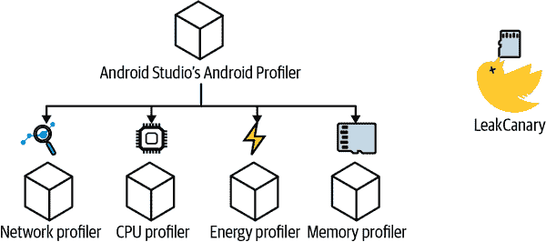

###### 图 11-1\. Android Studio 分析器和 LeakCanary 对于识别性能瓶颈非常有用。

本章中，我们将研究 Android Studio 的性能分析工具 *Android Profiler* 和一个流行的开源库 *LeakCanary*。我们通过对真实应用程序进行性能分析，以找出潜在的性能瓶颈。还记得前几章讨论过的徒步应用程序吗？惊喜！它的灵感来自 *TrekMe*。TrekMe 是一个 Android 山地徒步应用，用户可以下载互动式地形徒步路线以备离线使用。TrekMe 最初是一个 Java 项目，但其代码现在 80%以上是 Kotlin。以下是用户可以享受到的 TrekMe 的一些重要功能：

+   下载地形地图以供离线使用。

+   即使在没有网络的情况下，也能获取设备的实时位置，同时尽量节省电池寿命。

+   在最需要时，详细跟踪徒步旅行而不耗尽设备的电池。

+   可以在无需互联网连接的情况下访问其他有用的信息（仅用于创建地图）。

我们鼓励您探索 TrekMe，这样您就可以跟随本章的内容。您可以从 GitHub [获取源代码](https://oreil.ly/j7KbY)。克隆项目后，使用 Android Studio 打开它。最后，在您打算在上运行 TrekMe 的 *Android Virtual Device (AVD) Manager* 中运行一个模拟器实例。

性能考虑至关重要。在任何应用程序中发现性能滞后并不罕见，但必须谨慎对待这样的“钓鱼远征”。决定最相关的工具和优化方式，以及这些优化相对于其创建成本的利益的权衡，由开发者决定。对应用程序进行性能分析，使您能够客观地调查应用程序的性能。为了举例说明您可能会遇到的惊喜，我们将使用 Android Profiler 来查看 TrekMe。

# Android Profiler

*Android Profiler* 分析应用程序的会话，生成 CPU 使用率、内存使用率以及网络和能耗分析的实时反馈。图 11-2 显示了 Android Studio 中 TrekMe 应用程序运行时显示在控制台底部的情况。

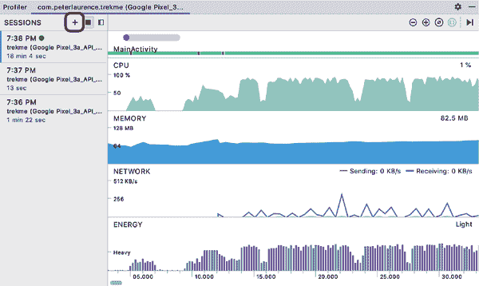

###### 图 11-2\. 一个性能分析会话记录了性能分析数据。活动会话连接到模拟器中运行的应用程序（未显示）。

Android 分析可以通过三种方式实例化：

1.  如果您的应用程序没有运行，请点击右上角的 Profile app 图标一次实例化应用程序和分析器。此操作会构建和编译应用程序的新运行实例。然后，Android Studio 将打开一个新会话，实时显示您的数据流。

1.  如果您的应用程序已经在运行，请单击 + 图标并选择正在运行的模拟器。

1.  您还可以通过点击 `+` 图标导入先前保存的性能分析会话。从那里，您可以加载先前保存的 *.hprof* 文件。

您可以在每个会话中记录和存储数据。在 图 11-3 中，我们展示了使用 Android Profiler 可以记录的不同类型数据的保存性能分析会话的屏幕截图。

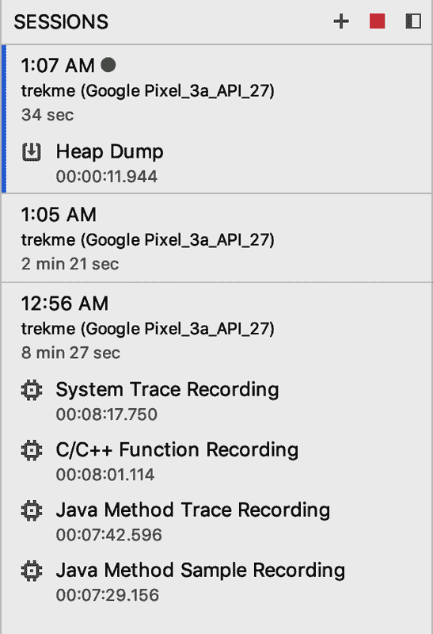

###### 图 11-3\. 保存堆转储或不同类型的 CPU 跟踪。

*方法跟踪* 和 *堆转储* 都可以作为运行会话中的单独条目进行保存。方法跟踪显示可以在 CPU 分析中记录的方法和函数的堆栈跟踪。同时，堆转储指的是从 *垃圾收集* 中收集的数据，允许我们分析哪些对象占用了不必要的内存空间。

Android Profiler 每次记录一个应用程序会话。但是，您可以保存多个录音并在它们之间进行比较数据。明亮的点表示活动会话的录制。在 图 11-3 中，有三个记录的会话。最后一个记录的会话保存了一个堆转储，这是指在快照时 JVM 中存储内存的日志。我们将在 “内存分析器” 中详细讨论这一点。第一个记录的会话保存了不同类型的 CPU 记录。这将在 “CPU 分析器” 中讨论。

###### 注意

Android Studio 仅在其实例的生命周期内缓存会话。如果重新启动 Android Studio，则不会保存记录的会话。

下面的章节详细展示了 Android Profiler 如何在运行时评估设备资源。我们将使用四个分析器：*网络分析器*、*CPU 分析器*、*能量分析器* 和 *内存分析器*。所有这些分析器在应用运行时记录数据流，可以在它们各自的特殊视图中进行更详细的访问。

设计上，TrekMe 鼓励用户在家轻松地下载详细的地形地图到他们的设备上。在 TrekMe 中，创建新的地形地图是这个过程中消耗最多资源的功能。即使在移动覆盖不可靠的情况下，这些地图也可以在用户徒步旅行时进行渲染。TrekMe 的地图创建功能允许您选择像 *Instituto Geografico Nacional*（IGN）或 *U.S. Geological Survey*（USGS）等官方地图生成器，如 图 11-4 所示。然后，TrekMe 将逐个加载所选服务的地图瓦片。


###### 图 11-4\. TrekMe 允许您从不同的服务创建和下载地图。

在本章的其余部分中，我们将使用 Android Profiler 分析 TrekMe 在通过 IGN 创建地图时的加载时间，并确保其性能最佳。

+   我们的网络调用速度快吗？

+   我们获取的数据是否以最高效的格式返回？

+   应用程序的哪些部分最耗 CPU？

+   哪些 Android 操作消耗了最多的电池？

+   在堆中，哪些对象占用了最多的内存？

+   什么消耗最多的内存？

在接下来的部分中，我们将使用网络分析器回答前两个问题。我们将在后续部分探讨其余问题。

## 网络分析器

当进行网络调用时，Android 设备中的无线电会打开，以便进行网络通信。然后，这个无线电会保持开启一段时间，以确保没有额外的请求需要监听。在某些手机上，每两分钟使用一次网络会使设备始终保持全电状态。对于 Android 资源来说，过多的网络调用可能代价高昂，因此分析和优化应用中的网络使用非常重要。

*网络分析器* 生成由 *HttpURLConnection* 或 *OkHttp* 库使用的连接详细信息。它可以提供诸如网络请求/响应时间、头部、cookie、数据格式、调用堆栈等信息。当您记录会话时，网络分析器会生成交互式视觉数据，同时您可以继续与应用程序进行交互。

当我们使用 IGN 创建地图时，TrekMe 会逐个在屏幕上渲染地图的方块瓦片。但有时，瓦片渲染似乎需要很长时间。图 11-5 显示了分析器捕获的传入/传出网络请求，并显示了在 TrekMe 上通过 IGN 创建地图时可用的连接：

您可以突出显示时间线上的选定范围，以进一步深入了解这些连接，这将扩展网络分析器工作区的新视图，允许您访问*连接视图*和*线程视图*标签以进一步分析这些网络调用。

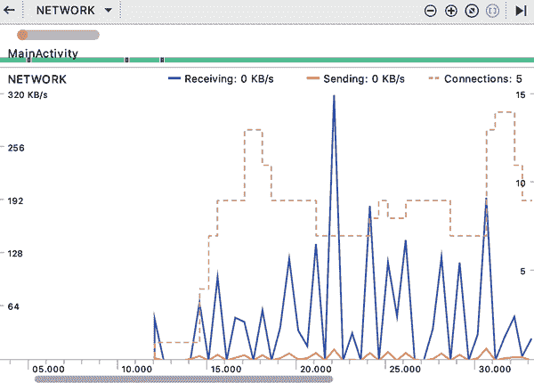

###### 图 11-5\. 网络分析器时间线记录了 IGN 西班牙地图在 TrekMe 上的创建过程。在聊天窗口的左上角，标签 `MainActivity` 下的长线代表活动的 `Activity` 会话，而在标签 `MainActivity` 上方的短而厚的线，左侧带有一个点，代表用户触摸事件。

### 使用连接视图和线程视图查看网络调用

连接视图显示了发送/接收的数据。您可以在时间线的高亮部分看到这一点，详见图 11-6。也许最显著的是连接视图可以按大小、状态和时间对资源文件进行排序。点击每个部分的标题将会组织所需过滤器的排序。时间线部分将请求/响应条分成两种颜色。较浅的部分表示请求的持续时间，而较暗的部分表示响应的持续时间。

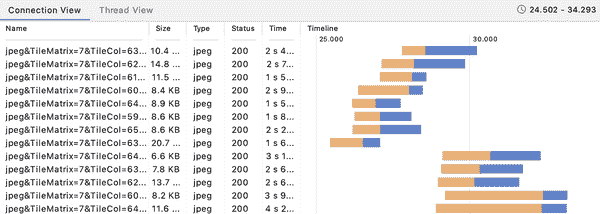

###### 图 11-6\. 连接视图显示了单个网络调用的列表。

连接视图看起来与线程视图中的时间线类似，但它们并不完全相同。线程视图显示了在指定启动线程内进行的网络调用，可以显示并行时间内运行的多个网络调用。在图 11-7 中显示的屏幕截图是前一图像的补充，使用相同的数据集。

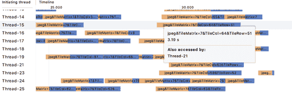

###### 图 11-7\. 线程视图显示了每个线程内进行的网络调用列表。

实时查看工作线程如何分工可以帮助揭示改进的空间。TrekMe 的池化线程负责根据需要自动分解下载所有这些图片的工作。

两个图像显示大约 23 秒的网络调用时间，响应时间显示出相似的趋势。与请求相比，响应似乎占用了完成整个网络调用所需时间的不成比例部分。这可能有几个原因：例如，如果设备试图从一个遥远的国家获取数据，则服务器连接可能较弱。也许后端的查询调用存在效率低下的情况。不管原因是什么，我们可以说我们的网络调用可能不是最快的。然而，快速的请求时间与缓慢的响应时间的存在表明了设备无法控制的外部因素。

现在我们转向第二个问题：我们是否在使用最有效的数据格式？让我们在连接视图选项卡中查看连接类型，如图 11-6 中所示。如果您的图像不需要透明度，请避免使用 PNG 文件，因为该文件格式不如 JPEG 或 WebP 文件压缩得好。在我们的情况下，网络调用返回的是 JPEG 格式的有效负载。我们希望文件能够提供一致且良好的图像质量，以使用户能够根据需要放大这些图像的细节。使用 JPEG 文件还比使用 PNG 文件占用更少的内存。

通过选择任何项，我们可以获得关于每个网络调用及其有效负载的更详细信息：这将在网络分析工具的右侧打开一个新视图，显示概述、响应、请求和调用堆栈选项卡。在下一节中，我们将能够深入了解单个网络调用的具体情况，并找出代码中进行网络调用的位置。

### 网络调用，扩展：概述 | 响应 | 请求 | 调用堆栈

Android 开发人员习惯于与其他平台合作，以实现功能的平等性及更多功能。假设一个网络调用开始返回错误类型的信息以进行网络请求。API 团队需要您在客户端获取的网络请求和响应的具体信息。您如何将他们所需的请求参数和内容头部发送过去以便他们进行调查？

网络分析工具使我们能够在连接视图或线程视图的右侧面板上检查网络响应和请求，如图 11-8 所示。

*概述*标签详细说明了请求和响应中捕获的显著亮点：

请求

路径和可能的查询参数

状态

返回的响应中的 HTTP 状态码

方法

使用的方法类型

内容类型

资源的媒体类型

大小

返回响应中返回的资源大小

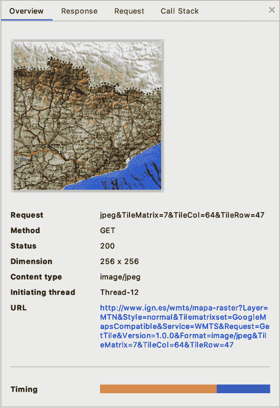

###### 图 11-8\. 网络分析工具允许您检查响应和请求信息。

*请求* 和 *响应* 选项卡显示了头部、参数、正文数据等的详细信息。在 图 11-9 中，我们展示了与前一图像相同的网络调用，但选择了响应选项卡。

正如您在网络响应中看到的，TrekMe 使用基本的 HTTP API。其他类型的 API 数据格式返回 HTML、JSON 和其他资源。在适用的情况下，请求和响应选项卡提供了正文数据的格式化或原始表示。在我们的情况下，资源媒体返回 JPEG 图像。

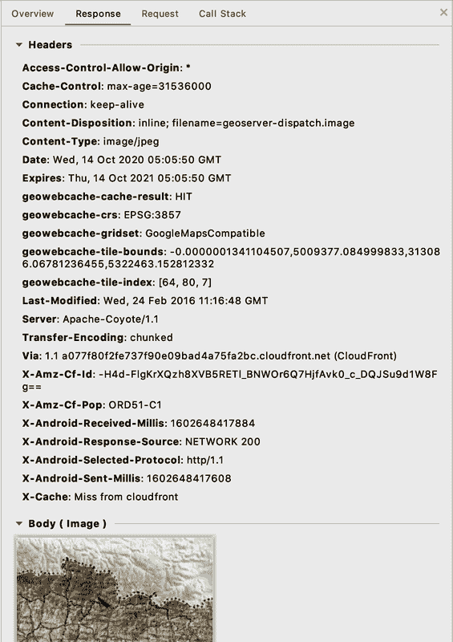

###### 图 11-9\. 网络分析器捕捉网络调用以渲染地图。

最后，*调用堆栈* 选项卡显示了执行网络连接所做的相关调用的堆栈跟踪，如 图 11-10 所示。未淡化的调用代表来自您自己代码的方法调用。您可以右键点击所示的调用以轻松跳转到源代码。

网络分析器不仅对分析有用。正如您所见，您能够快速处理大量信息。从缓存重复调用到确认 API 合同，网络分析器是值得放在工具箱中的工具。

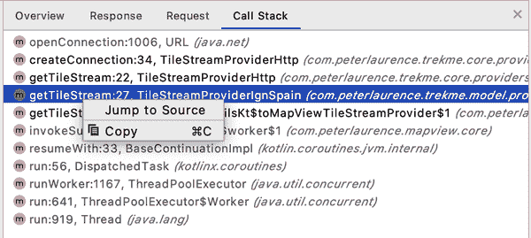

###### 图 11-10\. 调用堆栈选项卡。

当涉及到渲染时间缓慢时，网络性能不是唯一的罪魁祸首。创建全新的地形图任务本身就非常繁重，但从网络角度来看，无需进一步采取措施来改善加载时间或数据格式。然而，仅凭慢响应时间本身是不足以解释慢加载时间的。在 TrekMe 接收网络数据后，必须处理数据以渲染用户界面。因此，我们应该检查在网络调用后绘制地图时潜在的效率低下。*CPU 分析器* 能够提供这方面的洞察力。在接下来的章节中，我们将使用 CPU 分析器来检查渲染 IGN 西班牙地图时的处理消耗情况。

## CPU 分析器

虽然网络分析器能够提供有关网络调用的信息，但无法全面了解时间消耗的情况。对于网络调用，我们有一个调用堆栈，但不知道某些方法实际运行了多长时间。这就是 CPU 分析器发挥作用的地方。CPU 分析器通过分析函数执行消耗的时间和跟踪调用所在的线程，帮助识别资源消耗过度的问题。这为什么重要？如果 TrekMe 消耗过多处理资源，应用程序将变慢，影响用户体验。使用的 CPU 越多，电池消耗就越快。

CPU 分析器允许您通过线程检查 CPU 记录和实时数据，如 图 11-11 所示。

在接下来的章节中，我们将详细介绍 CPU 时间线、线程活动时间线和分析面板。因为 TrekMe 似乎花了很多时间将工作转移到后台线程，我们将选择一个线程来进行更详细的分析。

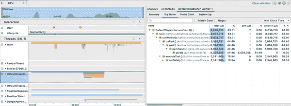

###### 图 11-11\. CPU Profiler 显示了执行方法的调用堆栈和记录的时间。

### CPU 时间线

CPU 时间线将区域性的调用堆栈组织到线程面板中的记录线程中。图中的 图 11-12 显示了 CPU 使用率的波峰，其中的数字是可用 CPU 的百分比。如果您已经进行了跟踪记录，您应该能够突出显示 CPU 时间线以查看更多信息。

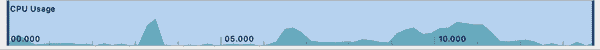

###### 图 11-12\. CPU 时间线。

Android Studio 允许您在 CPU 时间线的记录样本上拖动和点击，以显示调用图。点击记录将带您到一个单独的跟踪 CPU 记录屏幕（详细内容请参阅 *记录跟踪*）。为了创建我们在下一节中探索的更细粒度的调用图，突出显示记录的 CPU 跟踪的较小部分非常有帮助。

### 线程活动时间线

线程活动时间线伴随 CPU 时间线显示应用程序中的每个运行线程。如果某个部分已被跟踪记录，您应该能够选择一个线程以查看在所选时间范围内捕获的调用堆栈。在 图 11-13 中，已创建并在应用程序中使用了 31 个线程。这些线程是由您的代码、Android 操作系统或第三方库创建的。

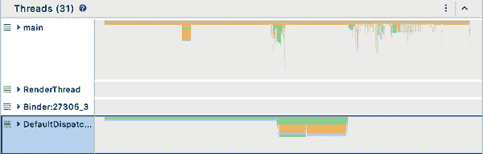

###### 图 11-13\. 线程活动时间线。

最浅色的块表示正在运行或活动的线程。在主线程上没有太多可见的内容，但请记住，这张图捕捉了下载地图图像的网络请求的 CPU 跟踪。在这种情况下，我们期望后台线程执行必要的工作来下载网络数据。似乎我们的主线程等待其中一个 DefaultDispatcher 线程的时间达到了一半。双击一个单独的线程会展开调用堆栈。

在线程活动时间线下方是调用图（参见 图 11-14）。

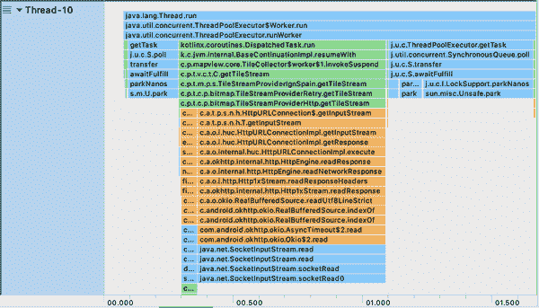

###### 图 11-14\. 调用图显示了捕获方法的自顶向下表示。

调用图显示了 CPU 使用时间段的调用堆栈。顶部方框表示封装的父方法，而下面的方法是被调用的子方法。父方法等待子方法执行完成，因此这是查看 TrekMe 方法中可能长时间执行的地方，比如 `TileStreamProviderHttp` 方法的良好位置。

如果您正在阅读印刷书籍，请注意条形图是按颜色编码的。Android OS 方法为橙色，您编写的方法为绿色，第三方库为蓝色。在这个协程中，执行时间最长的是`TileStreamProviderHttp.getTileStream(...)`。这是预期的，因为每个瓦片都会进行单独的网络请求。

### 分析面板

*分析面板*呈现了一个分层选项卡视图。面板顶部突出显示了活动线程的集合。在选项卡菜单下方是一个搜索栏，位于堆栈跟踪信息的上方。您可以使用搜索栏来过滤与特定调用相关的跟踪数据。在其下方是一组选项卡，用于在三个视图中渲染来自方法跟踪的视觉数据：*自顶向下*，*自底向上*和*火焰图*。

自顶向下呈现了从图表顶部到底部的方法跟踪图形表示。任何在方法内部进行的调用都会呈现为原始方法下面的子方法。在 图 11-15 中显示的方法`getTileStream`在 TrekMe 中等待一系列的网络连接调用和从数据流中读取。

自顶向下视图显示了 CPU 时间如何分解成三种方式：

自身

方法执行时间本身

子方法

执行被调用方法所需的时间

总计

自身和子项的组合时间

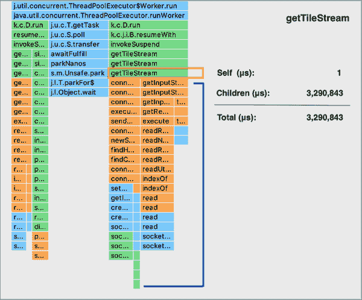

###### 图 11-15\. 自顶向下视图。

在`getTileStream`的情况下，大部分时间都花在网络调用上：特别是连接请求和从网络接收数据的`getInputStream`。对于 IGN 西班牙服务器，在其他国家和一天中不同时间访问时，这些时间可能会有所不同。由于客户端正在消耗服务器数据，TrekMe 无法控制服务器的性能。

与自顶向下相反，自底向上（在 图 11-16 中显示）显示了调用堆栈的*叶子元素*的反向表示。这种视图显示了大量方法，有助于识别消耗最多 CPU 时间的方法。

最后一个选项卡提供了火焰图视图。火焰图提供了一个从底部向上聚合的操作视觉图。它提供了一个反转的调用图，以更好地查看哪些函数/方法消耗了更多的 CPU 时间。

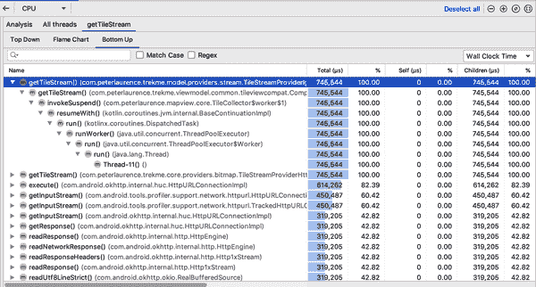

###### 图 11-16\. 自底向上视图。

总结一下，CPU 分析可以呈现三种不同的视图，取决于您希望进行的深度分析类型：

+   自顶向下图形表示显示了每个方法调用的 CPU 时间以及其被调用方法的时间。

+   自底向上反转了自顶向下的表示，并且最有用于对消耗最多或最少时间的方法进行排序。

+   火焰图水平反转并聚合调用堆栈，以显示首先消耗最多 CPU 时间的同级其他被调方法。

不仅有三种不同的数据呈现方式，还有不同种类的调用堆栈可以记录。在接下来的章节中，我们将介绍 CPU Profiler 中不同种类的方法追踪。当您开始理解 CPU Profiler 试图捕获的信息类型时，我们将转向 CPU Profiler 中的*方法追踪*并记录 TrekMe 创建新地图的片段。

### 方法追踪

CPU Profiler 允许您*记录跟踪*以分析并呈现其状态、持续时间、类型等。跟踪涉及在短时间内记录设备活动。方法跟踪直到两次单击录制按钮才会发生：第一次开始录制，第二次结束录制。如图 11-17 所示，有四种样本和跟踪配置。

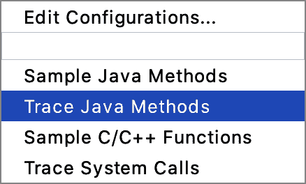

###### 图 11-17\. Android 开发者可以为样本和跟踪配置配置。

*样本 Java 方法*捕获应用程序调用堆栈，或称为调用图表（也见前几节）。调用图表在线程活动时间线下呈现，显示特定时间哪些线程处于活动状态。这些跟踪将个人会话存储到右侧窗格中，以便与其他保存的会话进行比较。

通过选择样本 Java 方法配置，你可以通过将鼠标悬停在特定方法上来检查 TrekMe 的调用堆栈，如图 11-18 所示。

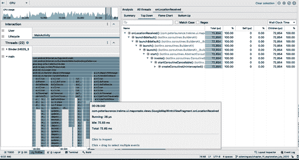

###### 图 11-18\. 样本 Java 方法。

###### 警告

不要让你的录音时间过长。一旦录音达到其大小限制，即使当前会话继续录制，跟踪也会停止收集数据。

与样本 Java 方法不同，*跟踪 Java 方法*串联了一系列记录的方法调用的时间戳。如果您愿意，可以监视*样本 C/C+函数*以获得应用程序与 Android 操作系统交互的洞察。为 Android API 26 及更高版本提供了本机线程的样本跟踪录制。

在日常谈话中，“方法”和“函数”通常在谈论方法追踪分析时可以互换使用。此时，您可能想知道为什么 Java 方法和 C/C++函数在 CPU 分析中区别足以重要。

在 CPU 录制配置中，Android Profiler 使用“方法”来指代基于 Java 的代码，而“函数”则引用线程。两者之间的区别在于方法执行顺序通过调用堆栈保留，而线程则由 Android 操作系统自身创建和调度。

最后，在图 11-17 中显示的配置中有系统调用跟踪。系统跟踪是一种为 Android 开发者提供的强大 CPU 录制配置。它返回有关帧渲染数据的图形信息。

跟踪系统调用记录了关于*CPU 核心*的分析，以查看如何在整个系统中进行调度。对于检测跨 CPU 核心的 CPU 瓶颈，此配置变得更加有意义。这些瓶颈可能在 RenderThread 噎住的地方显得特别突出，尤其是在红色帧的情况下。与其他配置不同，跟踪系统调用显示了线程状态及其当前运行的 CPU 核心，如 图 11-19 所示。

系统跟踪的一个关键功能是访问*RenderThread*。在渲染 UI 时，RenderThread 可显示性能瓶颈可能发生的位置。在 图 11-19 的情况下，我们可以看到大部分空闲时间发生在实际绘制图块本身周围。

Android 系统尝试根据屏幕的刷新率（在 8 ms 和 16 ms 之间）重新绘制屏幕。工作包耗时超过帧率可能会导致*丢帧*，在 Frames 下的红色插槽中指示。当某些任务在屏幕自我重新绘制之前未返回时，帧会丢失。在此系统跟踪记录中，看起来确实有一些丢帧，这些丢帧由 Frame 部分内标记方框中的数字指示。

TrekMe 将每帧保存为 JPEG 文件，并将图像加载到位图中进行解码。然而，在 图 11-19 中，我们看到在 RenderThread 中，DrawFrame 的长度与绘制速率间隔不完全匹配。在稍后的一些空闲时间内，某些长时间运行的 `decodeBitmap` 方法与池化线程有关。

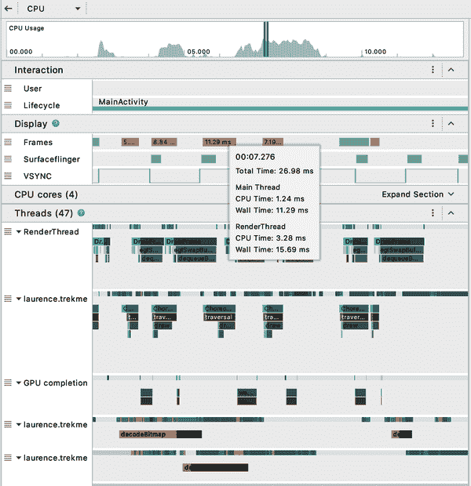

###### 图 11-19\. 系统跟踪显示了标记为 Frames 内的时间标签，显示了丢帧。

从这里开始，有一些可能被考虑用于更快绘制的选项；即，缓存图像的网络响应，甚至*预取*。对于需要几兆字节数据的用户来说，预取是一个很好的选择，尤其是在设备至少有 3G 网络访问的情况下。这样做的问题在于，在*知道*必须渲染之前，可能不是渲染这些位图的最佳选择。另一个选择可能是将数据编码成更压缩的格式，以便更容易解码。无论做出什么决定，都是开发者来评估实施某些优化的权衡和努力。

###### 注意

预取的概念是指预测未来请求可能带来的数据类型，并在有活动无线电连接时预先抓取该数据。每个无线电请求在唤醒无线电并保持无线电唤醒状态期间都有额外开销，因此 Android 开发人员可以利用这一点，在无线电已经唤醒时进行额外的调用。

### 记录样本方法跟踪

现在您对录制配置的提供更加熟悉，我们转向 TrekMe 上的*样本方法跟踪*。CPU 记录与 CPU 分析器时间轴分离。首先，在屏幕顶部单击“录制”按钮，以分析与 TrekMe 交互时的 CPU 活动。

结束录制后，会生成一个带有样本或跟踪调用执行时间的选项卡式右侧窗格。您还可以一次性高亮显示多个线程进行分析。普通的 Android 开发者可能不会一直使用所有这些选项卡，但了解您可以使用哪些工具是非常重要的。

在 TrekMe 中，有一组预定义的可迭代瓷砖需要下载。多个协程同时读取可迭代对象，并在每个瓷砖的网络请求成功后解码位图。这些协程被发送到诸如 `Dispatchers.IO` 这样的调度器，并且在结果发送回 UI 线程后进行渲染。UI 线程永远不会被阻塞，等待位图解码或网络请求。

在 图 11-20 中，缩小的 CPU 时间轴乍一看似乎只是对前一屏幕视图的引用。然而，您可以通过范围选择器与这些数据进行交互，通过高亮显示时间段进一步深入分析，如 图 11-21 所示。

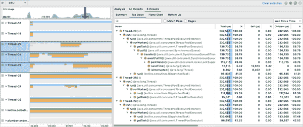

###### 图 11-20\. CPU 分析器可将记录的跟踪结果分离。

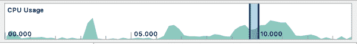

###### 图 11-21\. 范围选择器有助于管理高亮显示范围的部分。

在 图 11-22 中，我们看到一个运行时间较长的方法 `getTileStream`。在时间轴下方，左侧面板允许您通过拖放功能组织*线程*和*交互*。能够将线程分组也意味着您可以高亮显示一组堆栈跟踪。通过双击两次线程，您可以展开记录跟踪的线程，显示一个下拉式可视化的调用堆栈。

选择某个项目还会打开右侧的附加面板。这就是*分析面板*，它允许您更详细地检查堆栈跟踪和执行时间。跟踪 CPU 使用情况非常重要，但也许您希望能够分析应用程序与 Android 硬件组件的交互方式。在接下来的部分中，我们将探讨 Android Studio 的*能量分析器*。

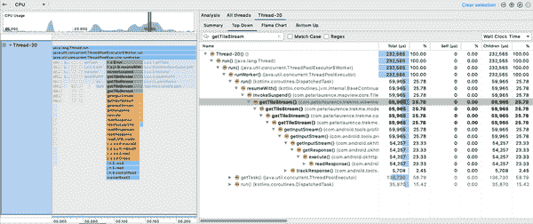

###### 图 11-22\. 您可以通过搜索功能查找特定方法。

在 Android 设备上过多的网络调用也会*耗电*。设备无线电通信保持唤醒状态的时间越长，CPU 消耗和电池消耗就越多。根据这一逻辑，可以合理推测网络占用了大部分能量消耗。通过使用能量分析器，我们可以确认这一点。

## 能量分析器

能量分析器最适用于确定高能耗情况。当应用程序发起网络请求时，应用程序会启动移动无线电硬件组件。随着安卓设备与网络通信，CPU 消耗加快，导致电池更快地耗尽。

TrekMe 对位图进行预缩放，以确保用户缩放时内存和能量使用保持一致。当用户创建和下载地图时，默认情况下以最高分辨率的细节下载地图的详细信息。事件面板在下载大块数据时显示更高水平的消耗。

拖动和点击可以选择时间轴的一段范围，以显示 Android OS 事件的详细信息。在 图 11-23 中，我们可以看到能源图的弹出渲染，显示了能源图的分解。弹出图例的前半部分包含 CPU、网络和位置等类别，这些类别与堆叠图中提供的每个类别相关联。尽管在执行网络调用请求大数据块并将其绘制到屏幕上这一相对重要的任务中，CPU 和网络使用量轻微增加仍然是一个良好的迹象。

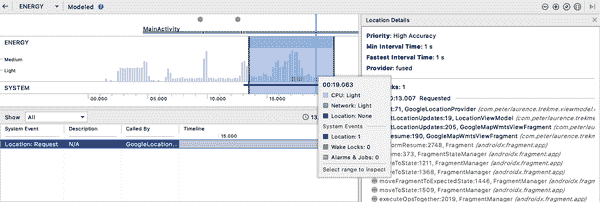

###### 图 11-23\. 系统事件面板。

弹出图例的后半部分描述了从设备捕获的系统事件类型。能量分析器用于捕获设备上某些类型的系统事件及其能耗：

+   *闹钟* 和 *任务* 是设计用于在指定时间唤醒设备的系统事件。作为最佳实践，Android 现在建议尽可能使用 *WorkManager* 或 *JobScheduler*，特别是用于后台任务。

+   *位置* 请求使用 Android GPS 传感器，可能会消耗大量电池。确保正确评估准确性和频率是一个良好的实践。

虽然 图 11-23 仅显示一个位置请求，但还有其他类型的系统事件，它们具有各自独特的状态。例如，请求事件可能具有 *Active* 状态，如 图 11-23 所示，*Requested* 或 *Request Removed*。同样，如果能量分析器捕获到 *Wake Lock* 类型的系统事件，则时间轴将显示唤醒锁事件期间的状态，例如 *Acquired*、*Held*、*Released* 等。

选择特定的系统事件将在能源分析器的右窗格中打开，以查看更多详细信息。从这里，您可以直接跳转到该位置请求的源代码。在 TrekMe 中，`GoogleLocationProvider`是一个每秒轮询用户位置的类。这并不一定是一个问题 - 轮询旨在使设备能够持续更新您的位置。这证明了这种性能分析工具的效力：您可以获得精确的信息，而无需查看源代码。请求是逐个进行的，当新的图像块已下载时，会删除现有请求以进行新的请求。

与位置轮询相比，我们可以预期当用户放大渲染地图时，能源消耗会减少。不会发出请求来下载大块数据。我们确实期望在跟踪用户位置时会消耗一些能量，这也使用了`GoogleLocationProvider`。

在 Figure 11-24 中，我们可以看到在堆叠覆盖图上方的圆点所示的过多和快速触摸事件。由于 TrekMe 已经下载了所需的所有信息，此时不会进行网络调用。然而，我们确实注意到 CPU 使用率再次急剧上升。为了避免过载系统，限制触摸事件以避免产生重复的缩放绘图函数是一个良好的实践。

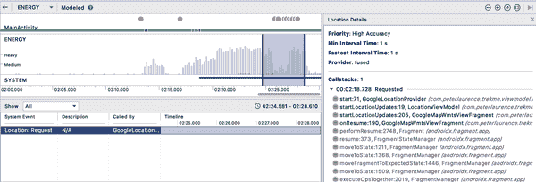

###### 图 11-24\. TrekMe 打开并放大现有地图。

到目前为止，我们通过查看处理能力来评估性能。但是检查电池/CPU 使用情况并不总是能够诊断出性能问题。有时，慢速行为可能归因于内存阻塞。在接下来的部分中，我们探讨 CPU 和内存之间的关系，并在 TrekMe 的 GPX 录制功能上使用内存分析器。

## 内存分析器

在 TrekMe 中，您可以在拉出抽屉中导航到*GPX Record*。GPX 代表*GPS 交换格式*，是一组用于 GPS 格式化的数据，用于软件应用中的 XML 模式。徒步者可以在控制下点击播放图标。然后应用程序会跟踪并记录徒步者及其设备的移动，这些可以保存为 GPX 文件，稍后可以作为线绘制显示以指示所走路径。Figure 11-25 展示了 TrekMe 的 GPX 录制功能。

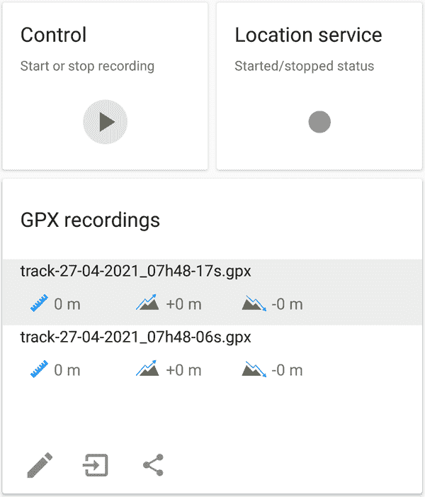

###### 图 11-25\. TrekMe 的 GPX 录制功能使用`GpxRecordingService`来跟踪用户在徒步旅行中的 GPS 坐标。

我们知道，在系统中使用位置可能会对 CPU 处理造成负担。但有时，减速可能归因于内存问题。 CPU 处理使用 RAM 作为工作空间的容量，因此当 RAM 装满时，Android 系统必须执行堆转储。当内存使用受到严重限制时，同时执行许多任务的能力变得有限。执行较少的应用程序操作所需的时间越长，Android 的速度就越慢。 RAM 在所有应用程序之间共享：如果太多应用程序消耗太多内存，可能会减慢设备的性能，甚至导致`OutOfMemoryException`崩溃。

内存分析器允许您查看应用程序运行所分配的内存中消耗了多少内存。使用内存分析器，您可以在运行会话中手动触发堆转储，以生成分析结果，以确定堆中保存了哪些对象以及有多少个对象。

如图 11-26 所示，内存分析器提供了强大的功能：

+   触发垃圾回收

+   捕获 Java 堆转储

+   分配跟踪

+   Android 应用程序中可用的片段和活动的交互式时间轴

+   用户输入事件

+   将内存计数划分为不同类别

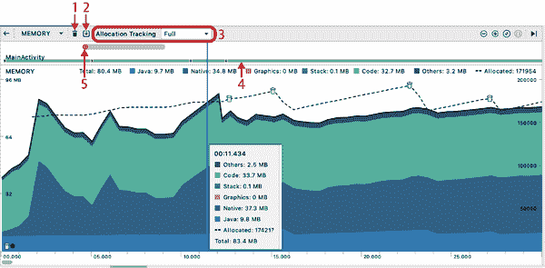

###### 图 11-26\. 分配跟踪提供了一个*完整*的斜体文本配置，可以捕获内存中的所有对象分配，而*采样*配置则定期记录对象。

###### 注意

像在 CPU 分析器中记录样本和跟踪一样，捕获 Java 堆转储结果会保存在 Android Profiler 的会话面板中，以便在 Android Studio 实例的生命周期内进行比较。

过多地触发垃圾回收（GC）可能会影响性能：例如，执行大量的 GC 可能会减慢设备的速度，这取决于内存中分代对象分配的频率和大小。至少，Android 开发人员应该尝试对每个应用程序运行内存分析，以确保没有任何东西被保留在堆中超出其用途，也就是所谓的“内存泄漏”。检测内存泄漏可能是救命的，尤其是对于依赖更长电池寿命的 Android 用户。您即将看到的是开发人员在处理服务时经常犯的一种常见内存管理错误的变体：意外保持服务运行。

TrekMe 使用前台服务来获取用户徒步旅行的统计数据，这是跟踪用户位置的自然选择。服务与其他 Android 组件一样，在应用程序的 UI 线程中运行。然而，持久服务往往会耗尽电池和系统资源。因此，限制前台服务的使用以不影响整体设备性能，并在必要时尽快终止它们是很重要的。

我们可以对 Memory Profiler 运行几次 GPX 录制并触发堆转储，以查看在堆中保留的对象消耗最多的内存，如图 11-27 所示。

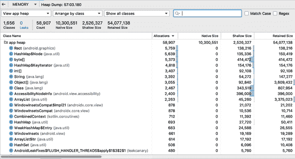

###### 图 11-27。您可以使用 CTRL + F 功能搜索“GpxRecordingService”以缩小结果范围。

堆转储显示了一个类列表，可以按堆*分配*、*本机大小*、*浅大小*或*保留大小*组织。浅大小是指使用的总 Java 内存。本机大小是指在本机内存中使用的总内存。保留大小由浅大小和保留大小（以字节为单位）组成。

在记录的堆转储中，您可以按*app heap*、*image heap*或*zygote heap*组织您的分配记录。Zygote heap 指的是为 zygote 进程分配的内存，其中可能包括常用的框架代码和资源。Image heap 存储来自操作系统本身的内存分配，并包含对包含我们应用程序的映像中使用的类的引用，用于系统引导。对于我们的用例，我们更关注 app heap，这是应用程序分配内存的主要堆。

在内存分析器中，触发堆转储将显示在 GC 后仍保留在内存中的对象列表。这个列表可以为您提供：

+   在*Instance View*窗格中显示的所选对象的每个对象实例，可以选择在代码中“跳转到源代码”

+   通过右键单击*References*中的对象并选择*Go to Instance*，可以检查实例数据的能力

请记住，当缓存保留对不再需要的对象的引用时，会发生内存泄漏。在图 11-28 中，我们搜索“Location”以在相同的堆转储中定位我们的服务并查看总内存分配。`LocationService`似乎有多个分配，而实际上应该一次只有一个运行。

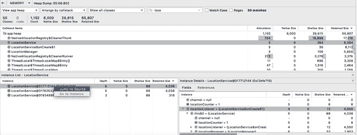

###### 图 11-28。似乎有可疑数量的`LocationService`实例仍保留在内存中。

看起来每次我们按下 Record 按钮时，在 TrekMe 中都会实例化一个新的`LocationService`，然后即使服务已经结束，该实例仍保留在内存中。您可以启动和停止服务，但如果您在后台线程中保留对该服务的引用，即使它已经结束，实例在 GC 后仍会保留在堆中。

让我们在 TrekMe 中运行几次录制以确认我们怀疑的行为。我们可以右键单击其中一个实例以“跳转到源代码”查看。在*RecordingViewModel.kt*中，我们看到以下代码：

```
fun startRecording() {
    val intent = Intent(app, LocationServices::class.java)
    app.startService(intent)
}
```

我们希望检查这些服务是否确实在启动新服务之前停止。已启动的服务会尽可能长时间保持活动状态：直到服务外部进行 `stopService` 调用或服务内部进行 `stopSelf` 调用。这使得持久服务的使用变得昂贵，因为 Android 认为运行中的服务始终处于使用中状态，这意味着服务在 RAM 中使用的内存将永远不会释放。

当 GPX 记录停止时，`LocationService` 会传播一系列事件，ping GPS 位置，然后将其记录并保存为一组数据。当刚写入 GPX 文件时，该服务订阅主线程以发送状态。由于 `LocationService` 扩展了 Android 的 `Service`，我们可以调用 `Service::stopSelf` 来停止该服务：

```
@Subscribe(threadMode = ThreadMode.MAIN)
fun onGpxFileWriteEvent(
   event: GpxFileWriteEvent
) {
    mStarted = false
    sendStatus()
    stopSelf()    // <--- fix will stop the service and release the reference at GC
}
```

我们可以使用内存分析器并检查堆转储，以确保我们只保留对一个服务的引用在内存中。事实上，由于 GPX 记录是通过 `LocationService` 进行的，因此在用户停止录制时停止服务是有意义的。这样，服务可以在 GC 时从内存中释放：否则，堆将继续保持 `LocationService` 实例直到其生命周期结束。

内存分析器可以帮助您通过筛查堆转储来检测可能的内存泄漏。您还可以通过在内存分析器中的堆转储配置中勾选 *Activities/Fragments Leaks* 复选框来过滤堆转储。寻找内存泄漏可能是一个手动的过程，即便如此，自己寻找内存泄漏仍然是捕捉它们的一种方式。幸运的是，我们有 LeakCanary，这是一个流行的内存泄漏检测库，可以在调试模式下附加到您的应用程序中，并悄悄地监视内存泄漏的发生。

# 使用 LeakCanary 检测内存泄漏

LeakCanary 可以在运行时自动检测可能难以手动检测到的显式和隐式内存泄漏。这是一个巨大的好处，因为内存分析器需要手动触发堆转储并检查保留的内存。当崩溃分析无法检测到来自 `OutOfMemoryException` 的崩溃时，LeakCanary 作为一种可行的替代方案，在运行时检测到的问题，并在发现内存泄漏方面提供更好的覆盖率。

内存泄漏通常来自于与对象生命周期相关的错误。LeakCanary 能够检测到各种错误，例如：

+   在不销毁现有版本的情况下创建新的 `Fragment` 实例

+   将 Android 的 `Activity` 或 `Context` 引用 *隐式* 或 *显式* 注入非 Android 组件

+   注册监听器、广播接收器或 RxJava 订阅者后忘记在父生命周期结束时释放监听器/订阅者

对于此示例，我们已在 TrekMe 中安装了 LeakCanary。在开发过程中，LeakCanary 可以自然地使用，直到保留了潜在泄漏的堆转储。您可以通过将以下依赖项添加到 Gradle 来安装 LeakCanary：

```
debugImplementation 'com.squareup.leakcanary:leakcanary-android:2.*'
```

一旦安装到您的应用程序中，LeakCanary 会在`Activity`或`Fragment`被销毁时自动检测泄漏，清除`ViewModel`等。它通过检测通过某些`ObjectWatcher`传递的保留对象来执行此操作。然后，LeakCanary 转储堆，分析堆，并对这些泄漏进行分类，以便轻松消费。安装 LeakCanary 后，您可以像平常一样使用应用程序。如果 LeakCanary 检测到堆转储中保留的实例，则会向系统托盘发送通知。

对于 TrekMe 而言，在图 11-29 中，LeakCanary 似乎检测到了`MapImportFragment`的 RecyclerView 实例中的内存泄漏。

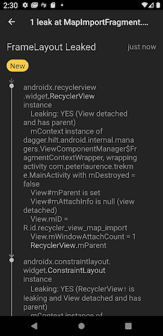

###### 图 11-29\. LeakCanary 显示了 RecyclerView 在其堆栈跟踪中的泄漏。

错误消息告诉我们，一个 RecyclerView 实例“泄漏”了。LeakCanary 指出此视图实例保持对包装活动的`Context`实例的引用。某些东西阻止了`RecyclerView`实例被垃圾回收——可能是一个对`RecyclerView`实例的隐式或显式引用超出了活动的组件。

我们还不确定我们在处理什么，因此我们首先查看*MapImportFragment.kt*类，其中提到了图 11-29 中的 RecyclerView。追溯到从布局文件引用的 UI 元素`recyclerViewMapImport`，我们注意到了一些奇怪的地方：

```
class MapImportFragment: Fragment() {

    private val viewModel: MapImportViewModel by viewModels()

    /* removed for brevity */

    override fun onViewCreated(view: View, savedInstanceState: Bundle?) {
        /* removed for brevity */
        recyclerViewMapImport.addOnItemTouchListener(
            RecyclerItemClickListener(
                this.context,                            
                recyclerViewMapImport,
                object: RecyclerItemClickListener.onItemClickListener {
                    override fun onItemClick(view: View, position: Int) {
                        binding.fab.activate()
                        single.fab(position)
                    }
            })
        )
    }

    /* removed for brevity */

    private fun FloatingActionButton.activate() {
        /* removed for brevity */
        fab.setOnClickListener {
            itemSelected?.let { item ->
                val inputStream = context.contentResolver.
                    openInputStream(item.url)
                inputStream?.let {
                    viewModel.unarchiveAsync(it, item)   
                }
            }
        }
    }
}
```


在`MapImportFragment`中，我们为`RecyclerView`中的每个`ViewHolder`附加了自定义的点击监听器。


然后使用`Context`获取`ContentResolver`并创建`InputStream`以作为`MapImportViewModel::unarchiveAsync`的参数。

当用户点击 RecyclerView 中的特定项时，将调用 Kotlin 扩展函数`FloatingActionButton::activate`。请记住，内存泄漏的常见原因是我们意外地将`Activity`或`Context`注入非 Android 组件中。

如果仔细观察`FloatingActionButton::activate`的实现，可以看到我们创建了对封闭类的隐式引用，即`MapImportFragment`实例。

隐式引用是如何创建的？我们向按钮添加了点击监听器。监听器持有对父`Context`的引用（通过片段的`getContext()`方法返回）。为了能够从监听器内部访问`Context`，Kotlin 编译器创建了对封闭类的隐式引用。

在跟随到`MapImportViewModel`方法的代码时，我们看到`InputStream`被传递下来以调用`ViewModel`中的另一个私有方法：

```
class MapImportViewModel @ViewModelInject constructor(
    private val settings: Settings
) : ViewModel() {
    /* removed for brevity */

    fun unarchiveAsync(inputStream: InputStream, item: ItemData) {
        viewModelScope.launch {
            val rootFolder = settings.getAppDir() ?: return@launch
            val outputFolder = File(rootFolder, "imported")
            /* removed for brevity */
        }
    }
}
```

一个`ViewModel`对象有自己的生命周期，并且旨在超过其所绑定的视图的生命周期，直到`Fragment`被分离。与使用`InputStream`作为参数不同，最好使用应用程序`context`，它在整个应用程序的生命周期内都可用，并且可以通过`MapImportViewModel`的构造函数参数注入来注入。然后我们可以在`MapImportViewModel::unarchiveAsync`中创建`InputStream`：

```
class MapImportViewModel @ViewModelInject constructor(
    private val settings: Settings,
    private val app: Application
): ViewModel() {
    /* removed for brevity */

    fun unarchiveAsync(item: ItemData) {
        viewModelScope.launch {
            val inputStream = app.contentResolve.
                openInputStream(item.uri) ?: return@launch
            val rootFolder = settings.getAppDir() ?: return@launch
            val outputFolder = File(rootFolder, "imported")
            /* removed for brevity */
        }
    }
}
```

当然，如果现有应用程序存在许多内存泄漏，打开 LeakCanary 可能会对开发造成干扰。在这种情况下，诱惑可能是关闭 LeakCanary 以防止当前工作的干扰。如果选择在应用程序上使用 LeakCanary，最好只在您和您的团队有能力“面对现实”时才这样做。

# 摘要

毫无疑问，Android 基准测试和性能分析工具非常强大。为了确保您的应用程序充分利用分析功能，最好选择一两个适当的工具。很容易迷失在优化的世界中，但重要的是要记住，最大的收益来自于付出最少努力和产生最大影响的优化。同样，重要的是要考虑当前的优先事项和团队工作量。

将 Android 优化视为营养师，鼓励逐步、习惯性的变化，而不是“暴饮暴食”。Android 性能分析旨在向您展示幕后发生的情况，但重要的是要记住，在一个时间和人力资源可能有限的世界中，普通的 Android 开发人员必须优先考虑哪些问题必须解决。

希望您感到更有能力处理可能出现的任何潜在错误，并且本章节给您信心开始探索一些这些工具在您自己的应用程序中的运行情况，看看事情在幕后是如何运作的：

+   Android 性能分析器是分析应用程序性能的强大方式，从网络和 CPU 到内存和能量分析。Android Studio 会缓存记录的会话以及堆转储和方法跟踪，以便您可以将它们与其他保存的会话进行比较。

+   网络分析器可以帮助解决特定于 API 调试的 Android 问题。它可以提供对客户端设备和数据来源服务器都有用的信息，并且可以帮助我们确保网络调用中的数据格式化最佳。

+   CPU 分析器可以揭示大部分时间用于执行方法的地方，并且特别适用于找出性能瓶颈。您可以记录不同类型的 CPU 跟踪，以便能够深入研究特定线程和调用堆栈。

+   能量分析器查看应用程序中的 CPU 进程、网络调用或 GPS 位置是否可能耗尽设备的电池。

+   Memory Profiler 查看分配在堆上的内存量。这可以帮助深入了解代码中可能需要在内存方面改进的地方。

+   LeakCanary 是由 Square 创建的流行开源库。使用 LeakCanary 可以帮助检测在运行时难以发现的内存泄漏问题。

^(1) `@ViewModelInject` 注解是 Hilt 框架特有的，这是一个依赖注入框架。然而，构造函数参数注入也可以通过手动 DI 或者像 Dagger 和 Koin 这样的 DI 框架实现。
