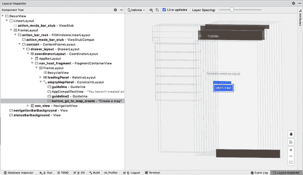
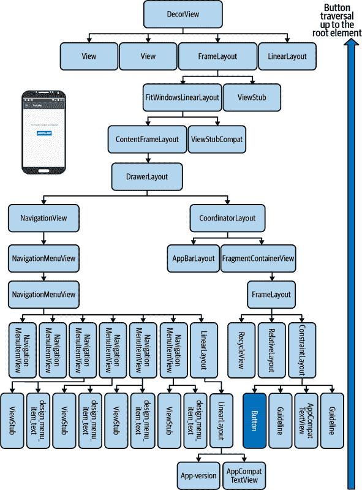
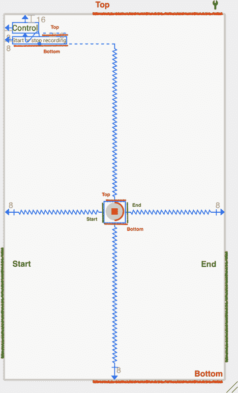
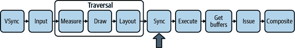
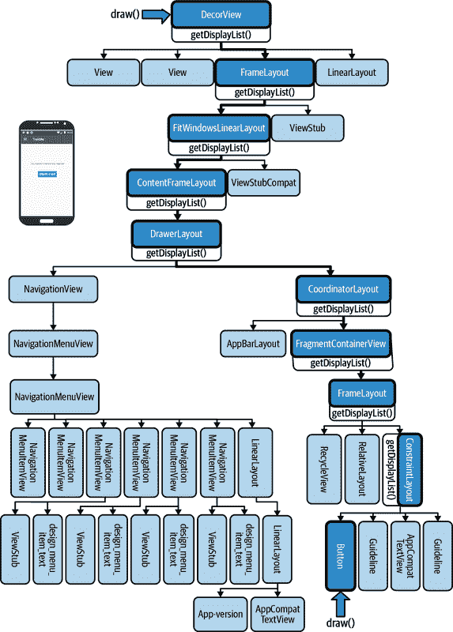

# 第十二章：通过性能优化减少资源消耗

在前一章中，您已经熟悉了使用流行的 Android 分析工具来检查“引擎盖下”发生的情况的方法。这一最后一章突出了一系列性能优化考虑因素。没有适用于所有情况的通用方法，因此了解潜在的性能陷阱（及其解决方案）是有帮助的。然而，性能问题有时可能是多个复合问题的结果，单独看起来可能并不重要。

性能考虑因素允许您检查可能影响应用程序扩展能力的问题。如果可以在代码库中使用这些策略中的任何一个作为“低成本成果”，那么追求最大收益是非常值得的。本章的每个部分并不适合您工作的每个项目，但在编写任何 Android 应用程序时，它们仍然是有用的考虑因素。这些主题涵盖从视图系统性能优化到网络数据格式、缓存等内容。

我们知道 View 系统将被 Jetpack Compose 取代：但是，即使有了 Jetpack，View 系统在未来几年也不会消失。本章的前半部分专注于每个项目都能从中受益的视图主题：Android View 系统的潜在优化。如果不小心设置视图层次结构，它可能会对性能产生重大影响。因此，我们看看两种简单的优化视图性能的方法：使用`ConstraintLayout`减少视图层次结构的复杂性，并为动画/自定义背景创建可绘制资源。

# 使用 ConstraintLayout 实现更平坦的视图层次结构

作为一般规则，您希望在 Android 中保持视图层次结构尽可能平坦。深度嵌套的层次结构会影响性能，无论是在视图首次膨胀时还是用户与屏幕进行交互时都是如此。当视图层次结构深度嵌套时，发送指令到包含所有元素的根`ViewGroup`并遍历以对特定视图进行更改可能需要更长时间。

除了在 第十一章 中提到的分析工具外，Android Studio 还提供了*布局检查器*，它可以在运行时分析您的应用程序并在屏幕上创建视图元素的 3D 渲染。您可以通过单击 Android Studio 底部角标打开布局检查器，如 图 12-1 所示。



###### 图 12-1\. 布局检查器允许您旋转运行 API 29+ 的设备的 3D 渲染。

当子组件被绘制时，它们会叠加在父`View`上。布局检查器提供了一个*组件树*窗格，位于左侧，以便您可以深入了解元素并检查它们的属性。为了更好地理解用户与 Android UI 小部件交互时发生的情况，图 12-2 展示了与组件树中提供的完全相同的布局层次结构的鸟瞰图。

即使对于相对简单的布局，视图层次结构也可以迅速变得复杂起来。管理许多嵌套布局可能会带来额外的成本，例如更难管理触摸事件、更慢的 GPU 渲染以及难以保证在不同尺寸屏幕上视图的相同间距/大小。



###### 图 12-2. 运行活动的元素完全展开。

除了您的应用程序可能需要的视觉更改之外，Android 操作系统还可能会独立影响视图属性。由您或操作系统调用的视图属性更改可能会触发视图层次结构的重新布局。是否发生这种情况取决于视图如何实现（由您自己或外部依赖实现），布局组件触发尺寸调整的频率以及它们在视图层次结构中的位置。

我们不仅必须担心层次结构的复杂性，还必须注意避免某些类型的视图，这些视图可能会使应用程序付出两倍于发送指令给 Android 操作系统所需遍历次数的代价。在 Android 中，一些较旧的布局类型在启用相对定位时容易出现“双重征税”：

`RelativeLayout`

这总是至少两次遍历其子元素：一次用于每个位置和大小的布局计算，一次用于最终定位。

`LinearLayout`

在水平方向设置其方向或在垂直方向上设置`android:setMeasureWithLargestChildEnabled="true"`，这两种情况都会为每个子元素进行两次遍历。

`GridLayout`

如果布局使用权重分配或将`android:layout_gravity`设置为任何有效值，可能会导致双重遍历。

当这些情况之一位于树的更接近根部时，双重征税的成本可能会变得更加严重，甚至可能导致指数遍历。视图层次结构越深，处理输入事件和相应地更新视图所需的时间就越长。

作为一个良好的实践，最好降低视图重新布局对应用程序响应性的负面影响。为了保持更平坦和更健壮的层次结构，Android 倡导使用`ConstraintLayout`。`ConstraintLayout`帮助为复杂布局创建响应式 UI。

使用`ConstraintLayout`时需要记住几个规则：

+   每个视图必须至少有一个水平和一个垂直约束。

+   视图的起始/结束只能链接到其他视图的起始/结束。

+   视图的顶部/底部只能链接到其他视图的顶部/底部。

Android Studio 的设计预览显示父视图如何将视图绑定到屏幕的指定端点，如图 12-3 所示。



###### 图 12-3。在这个特定的`ConstraintLayout`中，微调按钮将所有父边约束到屏幕中心。左上角的文本元素只约束到父视图的顶部和左侧。

当突出显示时，锯齿状的线条出现在视图上，指示约束一侧到视图的位置，而波浪线则表示两个视图互相约束。

本书不涵盖`ConstraintLayout`的其他有用功能，如屏障、指南线、组和创建约束等。了解`ConstraintLayout`的最佳方法是在设计面板中的*分割视图*中自行尝试这些元素，如图 12-4 所示。


###### 图 12-4。设计面板的分割视图显示了布局文件的半代码和半设计。

使用`ConstraintLayout`，特别是当`ViewGroup`元素可能被深度嵌套或效率低下时，是解决任何 Android 应用程序运行时潜在性能瓶颈的简单方法。在下一节中，我们将把重点从视图本身的性能优化转移到视图动画。

# 使用可绘制对象减少程序绘制

任何 Android 项目的另一个潜在性能问题是运行时的程序绘制。偶尔，Android 开发人员会遇到布局文件中某些视图元素无法访问特定属性的情况。假设您想要在视图上渲染仅在顶部两个角具有圆角的视图。一种方法是通过 Kotlin 扩展函数以编程方式绘制：

```
fun View.roundCorners(resources: Resources, outline: OutLine?) {
    val adjusted = TypedValue.applyDimension(
        TypedValue.COMPLEX_UNIT_SP,
        25,
        resources?.displayMetrics
    )
    val newHeight =
        view.height.plus(cornerRadiusAdjusted).toInt()
    this.run { outline?.setRoundRect(0, 0, width, newHeight, adjusted)}
}
```

这是正常且有效的；然而，如果程序绘制过多，可能会导致渲染线程卡住，随后阻塞 UI 线程无法在运行时完成后续事件处理。此外，如果特定视图需要调整大小以满足约束，则以编程方式更改视图的成本会更高。在运行时调整视图元素的大小意味着您无法使用`LayoutInflater`来调整元素如何适应原始更改后视图的新尺寸。

您可以通过使用存储在资源资产的*/drawables*文件夹中的可绘制对象来避免可能发生的开销。以下代码显示了一个`Drawable` XML 文件如何实现在视图元素的顶部两个角实现相同目标的圆角化：

```
<?xml version="1.0" encoding="utf-8"?>
<shape xmlns:android="http://schemas.android.com/apk/res/android"
    android:shape = "rectangle">
    <corners android:topLeftRadius="25dp" android:topRightRadius="25dp"/>
    <stroke android:width="1dp" android:color="#FFF"/>
    <solid android:color="#FFF"/>
</shape>
```

然后，您可以将文件名作为`Drawable`类型添加到视图布局文件中的背景属性中`Drawable`文件的名称：

```
android:background="@drawable/rounded_top_corners_background"
```

在前一节中，我们简要介绍了用户交互如何向 Android 操作系统发送指令的初始阶段。为了理解动画是如何发生的，我们现在将更深入地了解 Android 渲染 UI 的完整过程。让我们考虑 TrekMe 中的用户按下“创建地图”按钮的情况。

在本节剩余部分中，我们将介绍操作系统如何处理屏幕上的用户事件以及如何能够从软件到硬件执行绘制指令的全部过程。我们解释了 Android 操作系统在绘制中执行的所有阶段，直到动画发生在 *Sync* 阶段为止，如 图 12-5 所示。



###### 图 12-5\. 动画发生在遍历执行后的 Sync 阶段。

*VSync* 代表屏幕上帧绘制之间给定的时间。在应用程序中，当用户触摸屏幕上的视图元素时，*输入处理* 就会发生。在 *输入* 阶段，Android 操作系统通过复制一组指令来跟踪脏状态，调用 *invalidate* 来使树上所有父视图元素节点无效。无效并不会重新绘制视图本身，而是在稍后指示系统哪些标记的视图必须稍后重新绘制。这是通过将复制的信息向上传播到视图层次结构中，以便在稍后的阶段在返回时执行的。图 12-6 显示了当用户输入后发生无效时的情况，当有人触摸按钮时：遍历节点，然后将一组 `DisplayList` 指令复制到每个父视图上。尽管箭头指向下方的元素，表示子元素，但遍历和复制 `getDisplayList()` 实际上是向上到根部再返回向下。



###### 图 12-6\. `DisplayList` 对象是一组紧凑的指令，用于指示在画布上需要重新绘制哪些视图。这些指令在无效期间被复制到根层次结构的每个父视图元素中，然后在遍历期间执行。

然后，Android UI 系统安排下一个阶段，称为 *遍历*，其中包含自己的一组渲染阶段：

测量

这计算 `MeasureSpecs` 并将其传递给子元素进行测量。它递归地执行此操作，一直到叶节点。

布局

这设置了子布局的视图位置和大小。

绘制

这使用一组 `DisplayList` 指令渲染视图。

在接下来的阶段，“Sync”中，Android 操作系统在 CPU 和 GPU 之间同步`DisplayList`信息。当 CPU 在 Android 中与 GPU 交流时，JNI 在 UI 线程内的 Java 本地层接受其一套指令，并从 RenderThread 向 GPU 发送一个合成副本，以及其他一些信息。RenderThread 负责动画并从 UI 线程卸载工作（而不是必须将工作发送到 GPU）。从那里，CPU 和 GPU 彼此通信以确定应执行的指令，并在屏幕上合并视觉上渲染。最后，我们到达“Execute”阶段，在此阶段，操作系统以优化的方式执行`DisplayList`操作（例如一次性绘制相似的操作）。[“Drawn Out: How Android Renders”](https://oreil.ly/P5WbO)是一个关于 Android 渲染系统层面更详细信息的优秀讨论。^(1)

截至 Android Oreo，如圆形揭示、涟漪和矢量可绘制动画等动画仅存在于`RenderThread`中，这意味着这些类型的动画对 UI 线程是非阻塞的。您可以使用自定义可绘制对象创建这些动画。考虑这样一种情况，我们希望在用户按下某种`ViewGroup`时，在视图背景中动画显示阴影涟漪。您可以组合一组可绘制对象来实现这一点，从`RippleDrawable`类型的`Drawable`开始创建涟漪动画本身：

```
<?xml version="1.0" encoding="utf-8"?>
<ripple xmlns:android="http://schemas.android.com/apk/res/android"
        android:color="@color/primary">
    <item android:id="@android:id/mask">
        <shape android:shape="rectangle">
            <solid android:color="@color/ripple_mask" />
        </shape>
    </item>
</ripple>
```

`RippleDrawable`，其在 XML 中的等效物是`ripple`，需要一个颜色属性用于涟漪效果。要将此动画应用于背景，我们可以使用另一个可绘制文件：

```
<?xml version="1.0" encoding="utf-8"?>
<shape xmlns:android="http://schemas.android.com/apk/res/android"
        android:shape="rectangle">
    <solid android:color="@color/background_pressed" />
</shape>
```

我们可以使用 DrawableStates，这是一组可以在`Drawable`上指定的框架提供的状态。在这种情况下，我们在选择器上使用 DrawableStates 来确定动画以及动画是否在按下时发生。最后，我们创建一个用于渲染不同状态的`Drawable`。每个状态由一个子可绘制对象表示。在这种情况下，我们仅在视图被按下时应用涟漪可绘制动画：

```
<?xml version="1.0" encoding="utf-8"?>
<selector xmlns:android="http://schemas.android.com/apk/res/android"
    android:enterFadeDuration="@android:integer/config_shortAnimTime"
    android:exitFadeDuration="@android:integer/config_shortAnimTime">
    <item
        android:state_pressed="true" android:state_enabled="true"
        android:drawable="@drawable/background_pressed_ripple"/>
    <item
        android:state_pressed="false"
        android:drawable="@android:color/transparent"/>
</selector>
```

###### 注意

正如本章开头提到的，围绕 Jetpack Compose 构建的视图系统与 Android 中的视图系统完全不同，具有其自己的 UI 管理、图形、运行时/编译时行为等一套。如果 Jetpack Compose 是通过编程方式进行绘制，那是否意味着使用 Jetpack Compose 来绘制不高效？尽管 XML 当前比 Compose 本身的渲染速度更快，但正在进行优化以缩小渲染时间差距。然而，您应牢记 Compose 所具有的主要优势是能够快速更新或重新组合可组合视图，比当前的 Android 视图框架效率更高。

我们已经讨论完视图性能优化，接下来我们将继续讨论围绕 Android 应用程序各个部分的更多性能优化提示。

# 在网络调用中最小化资产负载

在 Android 中，使用最小的负载是很重要的，以避免加载变慢、耗电、以及使用过多的数据。在前一章中，我们开始研究网络负载数据格式。图像和序列化数据格式通常是导致最多膨胀的罪魁祸首，因此检查负载的数据格式是很重要的。

如果在 Android 项目中处理的图像不需要透明度，最好使用 JPG/JPEG 格式，因为这种格式本质上不支持透明度，并且比 PNG 格式压缩更好。当需要为缩略图放大位图时，可能更合理地以更低分辨率呈现图像。

在工业界，JSON 通常被用作网络传输中的数据负载。不幸的是，JSON 和 XML 数据负载对于压缩来说很糟糕，因为数据格式包括空格、引号、换行符、顶点等等。像*协议缓冲区*这样的二进制序列化格式，是 Android 中的一种可访问的数据格式，可能是一种更便宜的替代方案。您可以定义数据结构，Protobuf 能够将数据压缩得比 XML 和 JSON 数据小得多。查看[Google Developers](https://oreil.ly/6dUL0)了解更多关于协议缓冲区的信息。

# 位图池和缓存

TrekMe 使用位图池来避免分配过多的`Bitmap`对象。位图池在可能的情况下重用现有实例。这个“现有实例”是从哪里来的呢？当一个`Bitmap`不再可见时，不要让它可供垃圾回收（只是不保留对它的引用），您可以将不再使用的`Bitmap`放入“位图池”中。这样的池只是一个容器，用于存放以后使用的可用位图。例如，TrekMe 使用一个简单的内存双端队列作为位图池。要将图像加载到现有位图中，您必须指定要使用的位图实例。您可以使用`BitMapFactory.Options`的`inBitmap`参数^(2)来实现这一点：

```
// we get an instance of bitmap from the pool
 BitmapFactory.Options().inBitmap = pool.get()
```

值得注意的是，像 Glide 这样的图片加载库可以帮助你避免处理位图的复杂性。使用这些库可以在应用程序中免费实现位图缓存。在网络调用较慢的情况下，获取新的 `Bitmap` 实例可能会很昂贵。这时，从位图缓存中获取可以节省大量时间和资源。如果用户重新访问一个屏幕，则该屏幕几乎可以立即加载，而无需再次进行网络请求。我们可以区分两种缓存：*内存* 和 *文件系统* 缓存。内存缓存提供最快的对象检索速度，但会消耗更多内存。文件系统缓存通常较慢，但内存占用较低。一些应用程序依赖于内存中的 LRU 缓存，^(3) 而其他应用则使用基于文件系统的缓存或两种方法的混合。

例如，如果你的应用程序执行 HTTP 请求，可以使用 *OkHttp* 提供一个漂亮的 API 来使用文件系统缓存。*OkHttp*（也是流行库 *Retrofit* 的传递依赖项）是 Android 网络中广泛使用的流行客户端库。添加缓存相对较容易：

```
val cacheSize = 10 * 1024 * 1024
val cache = Cache(rootDir, cacheSize)

val client = OkHttpClient.Builder()
                .cache(cache)
                .build()
```

使用 *OkHttp* 客户端构建时，可以轻松创建具有自定义拦截器的配置，以更好地适应应用程序的使用场景。例如，拦截器可以强制缓存在指定间隔内刷新。在设备资源有限的环境中，缓存是一个很好的工具。因此，Android 开发者应该利用缓存来跟踪计算的结果。

###### 提示

一个不错的支持 *内存* 和 *文件系统* 缓存的开源库是 [Dropbox Store](https://oreil.ly/urfwv)。

# 减少不必要的工作

为了节约应用程序的资源消耗，应避免编写不必要的代码。即使是资深开发人员通常也会犯这类错误，导致不必要的工作和内存分配。例如，在 Android 中，自定义视图需要特别注意。让我们考虑一个带有圆形形状的自定义视图。对于自定义视图的实现，你可以子类化任何类型的 `View` 并重写 `onDraw` 方法。这里是 `CircleView` 的一个可能实现：

```
// Warning: this is an example of what NOT to do!
class CircleView @JvmOverloads constructor(
    context: Context,
) : View(context) {

    override fun onDraw(canvas: Canvas) {
       super.onDraw(canvas)
       canvas.save()
       // Never initialize object allocation here!
       val paint: Paint = Paint().apply {
           color = Color.parseColor("#55448AFF")
           isAntiAlias = true
       }
       canvas.drawCircle(100f, 100f, 50f, paint)
       canvas.restore()
   }
}
```

每次需要重新绘制视图时都会调用 `onDraw` 方法。这可能会频繁发生，特别是如果视图被动画化或移动。因此，你绝不应在 `onDraw` 中实例化新对象。这样的错误会导致不必要地分配大量对象，增加垃圾收集器的压力。在前面的例子中，每次渲染层绘制 `CircleView` 时都会创建一个新的 `Paint` 实例。你绝对不能这样做。

另外，最好将 `Paint` 对象实例化为类属性一次：

```
class CircleView @JvmOverloads constructor(
    context: Context,
) : View(context) {

    private var paint: Paint = Paint().apply {
        color = Color.parseColor("#55448AFF")
        isAntiAlias = true
    }
        set(value) {
            field = value
            invalidate()
        }

    override fun onDraw(canvas: Canvas) {
       super.onDraw(canvas)
       canvas.save()
       canvas.drawCircle(100f, 100f, 50f, paint)
       canvas.restore()
   }
}
```

现在 `paint` 对象仅分配一次。对于这个现有类的目的，有时会将 `paint` 值设置为不同的颜色。但是，如果赋值不是动态的，您可以通过惰性评估 `paint` 值来进一步处理。

在可能的情况下，您希望保持注入的平衡和依赖关系的轻量化。对于仓库、服务和其他单例依赖项（内存中的单一对象，如 `object`），使用 `lazy` 委托是有意义的，这样就有一个单例实例，而不是在堆中存在多个相同对象的副本。

考虑我们之前在 “使用 LeakCanary 检测内存泄漏” 中检查过的代码：

```
class MapImportViewModel @ViewModelInject constructor(
    private val settings: Settings,
    private val app: Application
): ViewModel() {
    /* removed for brevity */

    fun unarchiveAsync(item: ItemData) {
        viewModelScope.launch {
            val inputStream = app.contentResolve.
                openInputStream(item.uri) ?: return@launch
            val rootFolder = settings.getAppDir() ?: return@launch
            val outputFolder = File(rootFolder, "imported")
            /* removed for brevity */
        }
    }
}
```

在这个类中，使用 Hilt 注入了 `settings` 依赖项—您可以通过 `@ViewModelInject` 看出来。在编写此示例时，我们使用的是 Hilt 2.30.1-alpha，并且只能将活动范围内可用的依赖项注入到 `ViewModel` 中。换句话说，只要活动没有重新创建，新创建的 `MapImportViewModel` 就始终注入到同一个 `Settings` 实例中。因此，总体而言：像 Hilt 这样的依赖注入框架可以帮助您管理依赖项的生命周期。在 TrekMe 中，`Settings` 被作用域在应用程序中。因此，`Settings` 在技术上是一个单例。

###### 注意

Hilt 是一个依赖注入（DI）框架，为你的应用程序提供了一种标准的 DI 使用方式。该框架还具有自动管理生命周期的好处，并且有适用于 Jetpack 组件（如 ViewModels 和 WorkManager）的扩展。

避免不必要的工作扩展到 Android 开发的每个范围。在绘制要渲染到 UI 上的对象时，重复利用已经绘制的像素是有意义的。同样，由于我们知道在 Android 中进行网络调用会耗费电池，因此检查调用次数和频率是很好的。也许您的应用程序中有一个购物车。为了让用户跨平台访问其购物车，更新远程服务器可能是一个不错的商业决策。另一方面，也值得探索在本地存储中更新用户的购物车（定期进行网络更新）。当然，这些商业决策超出了本书的范围，但技术上的考虑总是有助于制定更加 thoughtful 的功能。

# 使用静态函数

当方法或属性不与任何类实例绑定时（例如不改变对象状态），有时使用 *静态函数*/*属性* 是有意义的。我们将展示使用静态函数比使用继承更合适的不同场景。

Kotlin 极大地简化了静态函数的使用。在类声明中的 `companion object` 包含了静态常量、属性和函数，可以在项目的任何地方引用。例如，Android 服务可以暴露一个静态属性 `isStarted`，该属性只能由服务本身修改，如示例 12-1 所示。

##### 示例 12-1\. `GpxRecordingService.isStarted`

```
class GpxRecordingService {

    /* Removed for brevity */

    companion object {
        var isStarted: Boolean = false
            private set(value) {
                EventBus.getDefault().post(GpxRecordServiceStatus(value))
                field = value
            }
    }
}
```

在示例 12-1 中，`GpxRecordingService` 可以在内部更改 `isStarted` 的值。在此过程中，通过事件总线发送事件，通知所有注册的组件。此外，`GpxRecordingService` 的状态可以从应用的任何地方以只读的 `GpxRecordingService.isStarted` 属性访问。但请记住避免意外地将 `Activity`、`Fragment`、`View` 或 `Context` 保存到静态成员中，否则可能导致严重的内存泄漏！

# 使用 R8 和 ProGuard 进行缩小和混淆

常见做法是对生产中的发布构建进行 *缩小*，以便删除未使用的代码和资源。通过缩小代码，您可以更安全地向 Google PlayStore 提交更小的 APK。*缩小* 通过删除未使用的方法来减小您的代码。缩小代码还为您提供了 *混淆* 的功能作为额外的安全功能。混淆会乱化类/字段/方法的名称，并删除调试属性，以防止反向工程。

对于 Android 用户，R8 现在是 Android Gradle 插件 5.4.1+ 提供的默认缩小工具。ProGuard 是 R8 的严格和更强大的前身，主要专注于优化 Gson 等中重度反射的内容。相比之下，更新的缩小工具 R8 不支持此功能。然而，R8 在实现更小的压缩和优化方面取得了成功。

可以通过 `proguardFile` 进行配置（您将在本节末尾看到一个示例）。R8 读取提供给 `proguardFile` 的规则，并相应地执行缩小和混淆。然后可以将 *proguardFile* 分配给特定的风格和构建类型在 *build.gradle* 中：

```
buildTypes {
    release {
        minifyEnabled true
        shrinkResources true
        proguardFile getDefaultProguardFile('proguard-android-optimize.txt'), 'proguard-rules.pro'
    }
}
```

缩小 APK 以上传到 PlayStore 是一种常见做法。然而，重要的是要警惕，避免无意中缩小/混淆可能在运行时需要由第三方库使用的代码。Kotlin 使用 Java 类中的元数据来支持 Kotlin 构造。然而，当 R8 缩小 Kotlin 类时，它无法保持与 Kotlin 元数据的状态同步。在最好的情况下，缩小/混淆这样的类可能会导致异常行为；在最坏的情况下，可能会导致难以解释的崩溃。

为了展示 ProGuard 在意外混淆太多应用程序代码的场景，我们观察到流行的开源库 Retrofit 出现了一些奇怪的行为。也许你的应用在调试模式下运行正常，但在发布模式下，一个网络调用莫名其妙地返回了`NullPointerException`。不幸的是，即使在 Retrofit 的`@SerializedName`注解属性/字段的情况下，Kotlin Gson 模型也会变空，这要归功于 Kotlin 反射。因此，你必须在你的 ProGuard 文件中添加一条规则，以防止 Kotlin 模型类被混淆。通常情况下，你可能会不得不通过直接将它们添加到你的`proguardFile`中来包含你的模型类。以下是向`proguardFile`添加模型域类的示例，以确保发布版本不会意外地混淆上述类：

```
# Retrofit 2.X
-dontwarn retrofit2.**
-keep class retrofit2.** { *; }
# Kotlin source code whitelisted here
-keep class com.some.kotlin.network.model.** { *; }
-keepattributes Signature
-keepattributes Exceptions
-keepclasseswithmembers class * {
    @retrofit2.http.* <methods>;
}
```

一个很好的建议是：始终测试发布版本！

# 摘要

本章覆盖了以下重要的性能优化技巧：

+   在 Android 视图框架中，深度嵌套的视图层次结构比较扁平的层次结构绘制和遍历时间更长。考虑使用`ConstraintLayout`，在这里你可以扁平化嵌套视图。

+   在 Android 视图框架中，最好将程序绘制和动画移至可绘制资源，以便在运行时将工作卸载到 RenderThread 上。

+   对于网络数据负载，使用 JSON 和 XML 格式进行压缩效果很差。使用协议缓冲区可以实现更小的数据压缩。

+   尽可能避免不必要的工作：确保你不会为了常量更新而进行不必要的网络调用，并尝试回收绘制对象。

+   通过诚实地查看你编写的代码，可以实现性能和内存的优化。你是否无意中在循环中创建对象，而这些对象可以在循环外创建一次？哪些昂贵的操作可以减少为较不密集的操作？

+   你可以使用 ProGuard 文件尽可能地减小应用程序的大小，并添加自定义规则来收缩、混淆和优化你的应用程序。

面对现实吧：Android 可能是一个难以跟进的挑战。逐步接受信息是可以的，这种策略保证了能够长期记住的学习机会。无论你的旅程处于什么阶段，除了这本书以外，Kotlin 和 Android 的最佳资源之一是开源社区。无论是 Android 还是 Kotlin，它们都是不断发展的社区，你可以从中获取最新和最相关的信息。为了保持自己的知识更新，你可以寻找像 Twitter、[Slack](https://oreil.ly/m853Y) 和 [KEEP](https://oreil.ly/KZPlx) 这样的额外资源。你可能会发现，随着时间的推移，在 Android 中经常出现的流行和经典问题，你也可以回到这本书中查阅。希望你喜欢这本书。

^(1) Chet Haase 和 Romain Guy。“绘制过程：Android 的渲染方式。” Google I/O ’18，2017 年。

^(2) 提供的`Bitmap`实例必须是可变位图。

^(3) LRU 代表最近最少使用。由于无法无限缓存对象，缓存始终与一种逐出策略相关联，以维护缓存的目标或可接受的大小。在 LRU 缓存中，“最旧”的对象首先被逐出。
